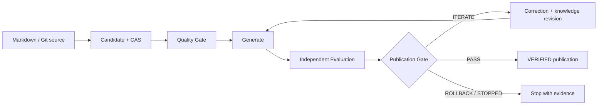

# wpKnowledge

> 一个 Spec 驱动、证据优先的 Knowledge Flywheel：把研究资料和项目经验转化为可追踪、可评测、可发布的工程知识。

[](https://github.com/linlisWorkTeam/wpKnowledge/actions/workflows/ci.yml)

wpKnowledge 不把“文档写得像答案”当成知识已经正确。候选知识必须经过质量检查、独立行为评测和确定性发布门禁；只有证据完整且 Gate 返回 `PASS` 的版本，才能成为可查询的 `VERIFIED` 知识。

当前主实现是 [`endlessWpKnowledgeRunner/`](endlessWpKnowledgeRunner/README.md) 下的 TypeScript Knowledge Flywheel。仓库同时保留研究知识库和历史 Python MVP，二者都不是当前运行时的第二套事实源。

## 先看结论

| 你关心的问题 | 当前答案 |
| --- | --- |
| 它解决什么问题？ | 让 Agent/工程师从失败中形成可复用知识，并用真实执行证据阻止“未经验证的经验”进入正式知识库。 |
| 输入是什么？ | Markdown 知识候选、固定 commit 的受信项目源码、Agent 生成物和独立评测报告。 |
| 输出是什么？ | CAS 中的不可变工件、SQLite 中可追踪的 Run/Event、Correction、GateDecision 与幂等发布回执。 |
| 用户怎么使用？ | 通过 CLI 初始化/摄取/查询，通过 Web Console 查看运行、知识、治理和证据。 |
| Agent 会自动学习吗？ | 工作流支持失败归因、结构化 Correction、增量修订和重新生成；当前通用自动 Run 入口仍由受信 Orchestrator 驱动，不允许浏览器或普通 Agent 绕过 Gate 自行发布。 |
| 当前安全边界？ | 固定源码验收只面向受信代码；它限制命令、环境、时间和输出，但不是敌对代码的 OS 沙箱。 |

## 工作方式



这里的核心约束是：Agent 可以提出知识、生成代码、分析失败并修订候选，但不能把自己的判断直接升级为发布权限。状态变更、评测证据和发布都由共享 Application Service、Registry 与确定性 Gate 管理。

## 五分钟开始

### 环境要求

- Git
- Node.js 24 或更高版本
- npm

### 安装与验证

```bash
git clone https://github.com/linlisWorkTeam/wpKnowledge.git
cd wpKnowledge
npm ci
npm run typecheck
npm run validate:specs
npm test
```

### 初始化和浏览知识

```bash
# 默认在 .workpanel/ 创建本地 SQLite 与 CAS
npm run knowledge -- init

# 将旧 OKF 卡片迁为 CANDIDATE；不会继承旧 verified 权限
npm run knowledge -- migrate-legacy --root knowledge

npm run knowledge -- status
npm run knowledge -- list --status CANDIDATE
npm run knowledge -- query --q "workpanel"
```

新环境尚未发布 `VERIFIED` 版本时，默认查询没有命中是正常结果。完整的摄取、评测与发布流程见[快速上手](endlessWpKnowledgeRunner/docs/GETTING_STARTED.md)和[运维手册](endlessWpKnowledgeRunner/docs/OPERATIONS.md)。

### 启动产品控制台

```bash
npm run knowledge:serve
```

打开 <http://127.0.0.1:4174>。默认是只读模式；如需提交 feedback，可在受信本机设置 `WP_KNOWLEDGE_WRITE_TOKEN` 后启动。公网部署、TLS 和监听地址要求见[运维手册](endlessWpKnowledgeRunner/docs/OPERATIONS.md#dashboard-and-api)。

## 按角色阅读

| 我想…… | 从这里开始 |
| --- | --- |
| 快速运行项目 | [快速上手](endlessWpKnowledgeRunner/docs/GETTING_STARTED.md) |
| 了解用户在前台如何完成任务 | [用户用例与交互时序](endlessWpKnowledgeRunner/specs/05-workflows/user-use-cases.md) |
| 理解产品界面和权限边界 | [前台产品设计](endlessWpKnowledgeRunner/specs/04-product/frontend-product-design.md) |
| 理解架构和知识生命周期 | [架构说明](endlessWpKnowledgeRunner/docs/ARCHITECTURE.md) |
| 修改代码或 Spec | [贡献指南](CONTRIBUTING.md)与[开发指南](endlessWpKnowledgeRunner/docs/DEVELOPMENT.md) |
| 知道文件应该放在哪里 | [仓库目录规则](endlessWpKnowledgeRunner/docs/REPOSITORY-GUIDE.md) |
| 运行分层测试 | [测试策略](endlessWpKnowledgeRunner/docs/TESTING.md) |
| 部署、验收或排障 | [运维手册](endlessWpKnowledgeRunner/docs/OPERATIONS.md) |
| 报告安全问题 | [安全策略](SECURITY.md) |
| 查阅全部规范 | [Spec 总入口](endlessWpKnowledgeRunner/specs/README.md) |
| 浏览研究资料 | [知识库目录](knowledge/知识库目录.md) |

全部工程文档入口见 [`endlessWpKnowledgeRunner/docs/README.md`](endlessWpKnowledgeRunner/docs/README.md)。

## 仓库地图

```text
wpKnowledge/
├── endlessWpKnowledgeRunner/ # 当前 Knowledge Flywheel：代码、Spec、测试、Web、验收、文档
├── knowledge/                # Git 可评审的研究资料与旧 OKF 输入
├── mvp-flywheel/             # 历史 Python MVP，仅作演进对照
├── .github/                  # CI 与协作模板
├── CONTRIBUTING.md           # 仓库级贡献流程
└── SECURITY.md               # 漏洞报告和运行安全边界
```

目录是架构的一部分。新的 Runner 代码、测试、Spec、验收 fixture 或运行文档必须放在 `endlessWpKnowledgeRunner/` 内；根目录不再新增平行的 `apps/`、`packages/`、`specs/`、`tests/` 或 `docs/`。

## Spec 驱动约定

行为变更不是只改代码：先找到或补充 `KF-SYS-*` 需求与用例，再同步领域/工作流规范、追踪矩阵、实现、测试和用户文档。若 Spec 与实现不一致，应把它当作缺陷显式修复，而不是选择其中一个静默忽略。

规范性事实源、关键词和阶段门定义在 [Spec 总入口](endlessWpKnowledgeRunner/specs/README.md)。提交 PR 前请执行：

```bash
npm run typecheck
npm run validate:specs
npm test
```

## 当前成熟度与限制

- 已实现：TypeScript 六边形核心、SQLite Registry、Artifact CAS、幂等 checkpoint、确定性 Gate、原子发布、旧 OKF 迁移、只读优先的产品控制台、无 shell 的 DSH HTTP 适配器，以及固定 commit 的 ohMyWorkPanel 两轮真实源码验收。
- 尚未宣称完成：敌对代码 OS 级隔离、通用浏览器自动 Run、完整 RBAC、多节点高可用，以及 live GLM/DeepSeek 模型质量证明。
- `mvp-flywheel/` 只用于历史对照；旧 `score`、`eval`、`harvest` 语义已明确拒绝，避免形成第二套发布权威。

欢迎从小而可验证的改动开始。仓库目前没有声明开源许可证；在许可证明确前，请不要假设获得了复制、分发或商用授权。
