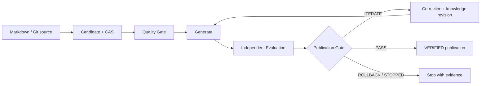

# wpKnowledge

> 让工程经验先经过真实执行，再进入可复用的知识库。

<details lang="en">
<summary>English summary</summary>

wpKnowledge is an evidence-driven Knowledge Flywheel. Candidate knowledge is bound to provenance, exercised through generated implementations, evaluated independently and published only when the deterministic Gate returns `PASS`. The embedded LangGraph layer controls Agent execution; wpKnowledge remains authoritative for business state, evidence, knowledge versions and publication.

Quick start: install Node.js 24+, run `npm ci`, `npm run typecheck`, `npm run validate:specs`, `npm test`, then `npm run knowledge:serve`.

</details>

[](https://github.com/linlisWorkTeam/wpKnowledge/actions/workflows/ci.yml)

[项目网站](https://linlisworkteam.github.io/wpKnowledge/?v=6c3aa01) · [快速上手](endlessWpKnowledgeRunner/docs/GETTING_STARTED.md) · [真实运行 Demo](knowledge/3.workpanel/证据/2026-09-02-DeepSeek-Harness真实Agent治理演示.md) · [方案 PPT](knowledge/2.wiki/设计/当前wpKnowledge知识飞轮方案.pptx) · [Spec](endlessWpKnowledgeRunner/specs/README.md) · [参与贡献](CONTRIBUTING.md)

很多知识库收下文档就算完成。wpKnowledge 会多问一句：这条经验真的跑通过吗？候选知识要经过质量检查、独立行为评测和确定性发布门禁。证据完整、Gate 返回 `PASS` 后，它才会成为可查询的 `VERIFIED` 知识。

当前主实现是 [`endlessWpKnowledgeRunner/`](endlessWpKnowledgeRunner/README.md) 下的 TypeScript Knowledge Flywheel。仓库同时保留研究知识库和历史 Python MVP，二者都不是当前运行时的第二套事实源。

## 先看结论

| 你关心的问题 | 当前答案 |
| --- | --- |
| 它解决什么问题？ | 让 Agent/工程师从失败中形成可复用知识，并用真实执行证据阻止“未经验证的经验”进入正式知识库。 |
| 输入是什么？ | Markdown 知识候选、固定 commit 的受信项目源码、Agent 生成物和独立评测报告。 |
| 输出是什么？ | CAS 中的不可变工件、SQLite 中可追踪的 Run/Event、Correction、GateDecision 与幂等发布回执。 |
| 用户怎么使用？ | 通过 CLI 初始化/摄取/查询，通过 Web Console 查看运行、知识、治理和证据。 |
| Agent 会自动学习吗？ | 内嵌 LangGraph 会驱动质量反馈、失败归因、Correction、知识修订和重新生成；固定 ohMyWorkPanel 路径既有 deterministic fixture，也可调用真实 DeepSeek Harness。Agent 不能绕过 Gate 自行发布。 |
| 当前安全边界？ | Linux live Agent 使用角色文件白名单和 Bubblewrap 隔离参考源码；后续生成代码评测仍只面向受信项目，不是敌对代码执行沙箱。 |

## 工作方式



这里的核心约束是：Agent 可以提出知识、生成代码、分析失败并修订候选，但不能把自己的判断直接升级为发布权限。`endlessWpKnowledgeRunner/infrastructure/domain-knowledge` 以内嵌 LangGraph 负责节点、并行、循环和恢复；状态变更、评测证据和发布仍由 wpKnowledge 的共享 Application Service、Registry 与确定性 Gate 管理。

## 五分钟开始

### 环境要求

- Git
- Node.js 24 或更高版本
- npm

### 安装与验证

```bash
git clone https://github.com/linlisWorkTeam/wpKnowledge.git
cd wpKnowledge
npm ci
npm run typecheck
npm run validate:specs
npm test
```

### 初始化和浏览知识

```bash
# 默认在 .workpanel/ 创建本地 SQLite 与 CAS
npm run knowledge -- init

# 将旧 OKF 卡片迁为 CANDIDATE；不会继承旧 verified 权限
npm run knowledge -- migrate-legacy --root knowledge

npm run knowledge -- status
npm run knowledge -- list --status CANDIDATE
npm run knowledge -- query --q "workpanel"
```

新环境尚未发布 `VERIFIED` 版本时，默认查询没有命中是正常结果。完整的摄取、评测与发布流程见[快速上手](endlessWpKnowledgeRunner/docs/GETTING_STARTED.md)和[运维手册](endlessWpKnowledgeRunner/docs/OPERATIONS.md)。

### 启动产品控制台

```bash
npm run knowledge:serve
```

打开 <http://127.0.0.1:4174>。默认是只读模式；Console 可以查看全部固定 Agent 和 LangGraph 节点投影。设置 `WP_KNOWLEDGE_WRITE_TOKEN` 后，受信操作者可启动固定 ohMyWorkPanel 自动 Run、提交 feedback，或只修改 Agent 的追加提示词；职责、输入输出、拓扑和工具权限不可配置。公网部署、TLS 和监听地址要求见[运维手册](endlessWpKnowledgeRunner/docs/OPERATIONS.md#dashboard-and-api)。

## 按角色阅读

| 我想…… | 从这里开始 |
| --- | --- |
| 自己快速运行项目 | [使用者快速入门](endlessWpKnowledgeRunner/docs/GETTING_STARTED.md#路径-a使用者自己配置) |
| 让 Agent 从零配置并启动 | [Agent Prompt](endlessWpKnowledgeRunner/docs/GETTING_STARTED.md#路径-b交给-agent-配置和启动) |
| 了解用户在前台如何完成任务 | [用户用例与交互时序](endlessWpKnowledgeRunner/specs/05-workflows/user-use-cases.md) |
| 理解产品界面和权限边界 | [前台产品设计](endlessWpKnowledgeRunner/specs/04-product/frontend-product-design.md) |
| 理解架构和知识生命周期 | [架构说明](endlessWpKnowledgeRunner/docs/ARCHITECTURE.md) |
| 查看真实 SDK 治理过程 | [三次 ohMyWorkPanel 运行记录](knowledge/3.workpanel/证据/2026-09-02-DeepSeek-Harness真实Agent治理演示.md)与[方案 PPT](knowledge/2.wiki/设计/当前wpKnowledge知识飞轮方案.pptx) |
| 修改代码或 Spec | [贡献指南](CONTRIBUTING.md)与[开发指南](endlessWpKnowledgeRunner/docs/DEVELOPMENT.md) |
| 只定制某个 Agent 角色 | [Agent 角色定制指南](endlessWpKnowledgeRunner/docs/AGENT-CUSTOMIZATION.md) |
| 编写或翻译文档 | [文档语言与 I18n 约定](endlessWpKnowledgeRunner/docs/DOCUMENTATION-I18N.md) |
| 知道文件应该放在哪里 | [仓库目录规则](endlessWpKnowledgeRunner/docs/REPOSITORY-GUIDE.md) |
| 运行分层测试 | [测试策略](endlessWpKnowledgeRunner/docs/TESTING.md) |
| 部署、验收或排障 | [运维手册](endlessWpKnowledgeRunner/docs/OPERATIONS.md) |
| 报告安全问题 | [安全策略](SECURITY.md) |
| 查阅全部规范 | [Spec 总入口](endlessWpKnowledgeRunner/specs/README.md) |
| 浏览研究资料 | [知识库目录](knowledge/知识库目录.md) |
| 浏览项目官网 | [GitHub Pages](https://linlisworkteam.github.io/wpKnowledge/?v=6c3aa01) |

全部工程文档入口见 [`endlessWpKnowledgeRunner/docs/README.md`](endlessWpKnowledgeRunner/docs/README.md)。

## 仓库地图

```text
wpKnowledge/
├── endlessWpKnowledgeRunner/ # 当前 Knowledge Flywheel：治理上层、内嵌工作流基础设施、Web、Spec 与测试
├── knowledge/                # Git 可评审的研究资料与旧 OKF 输入
├── mvp-flywheel/             # 历史 Python MVP，仅作演进对照
├── .github/                  # CI 与协作模板
├── CONTRIBUTING.md           # 仓库级贡献流程
├── SECURITY.md               # 漏洞报告和运行安全边界
└── LICENSE                   # MIT License
```

目录是架构的一部分。新的 Runner 代码、测试、Spec、验收 fixture 或运行文档必须放在 `endlessWpKnowledgeRunner/` 内；根目录不再新增平行的 `apps/`、`packages/`、`specs/`、`tests/` 或 `docs/`。

## Spec 驱动约定

行为变更不是只改代码：先找到或补充 `KF-SYS-*` 需求与用例，再同步领域/工作流规范、追踪矩阵、实现、测试和用户文档。若 Spec 与实现不一致，应把它当作缺陷显式修复，而不是选择其中一个静默忽略。

规范性事实源、关键词和阶段门定义在 [Spec 总入口](endlessWpKnowledgeRunner/specs/README.md)。提交 PR 前请执行：

```bash
npm run typecheck
npm run validate:specs
npm test
```

## 当前成熟度与限制

- 已实现：TypeScript 六边形核心、SQLite Registry、Artifact CAS、幂等业务 checkpoint、确定性 Gate、原子发布、内嵌 domain-knowledge/LangGraph、七类 Agent 角色与节点前台投影、promptAddon-only 配置、DSH 查询适配器，以及固定 commit 的 ohMyWorkPanel 自动验收。真实 Agent 路径使用 DeepSeek Harness 官方 stdio JSON-RPC SDK；Linux 上通过角色工作区和 Bubblewrap 隔开代码生成角色与参考源码。图中的 `code` 只是职责固定的角色，不代表另行接入了 CodeAgent CLI。每条 Run 可用 `workflow-report` 导出脱敏 Demo 证据。
- 尚未宣称完成：敌对代码执行沙箱、任意项目/候选的通用自动 Run、完整 RBAC、多节点高可用、四点崩溃注入，以及 live 模型的重复稳定性、成本和成功率证明。一次 Headless 或 SDK live Run 只证明对应样例。
- `mvp-flywheel/` 只用于历史对照；旧 `score`、`eval`、`harvest` 语义已明确拒绝，避免形成第二套发布权威。

## License

本项目采用 [MIT License](LICENSE)。使用、修改或分发时请保留许可证和版权声明。
