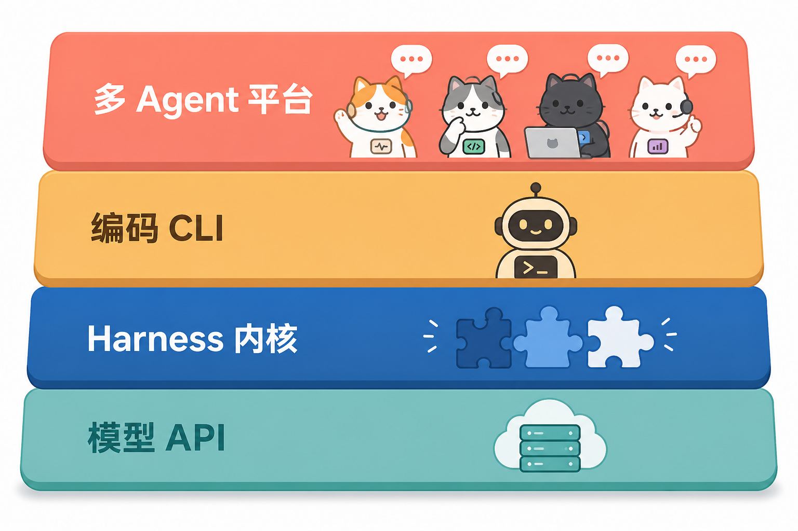
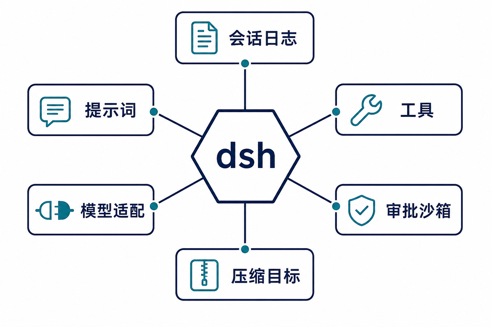
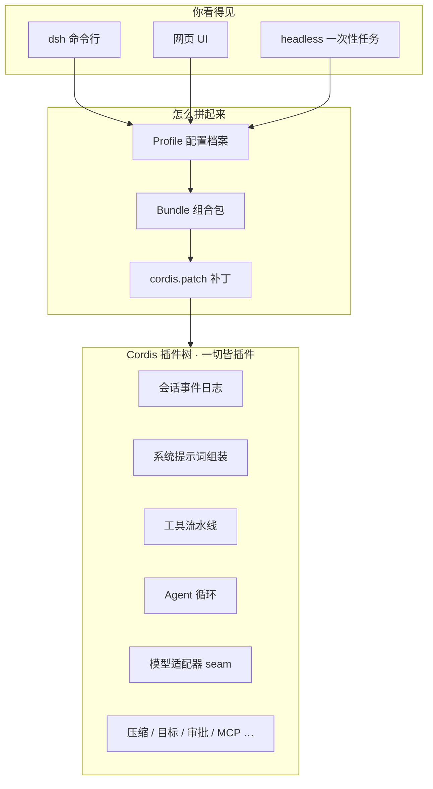
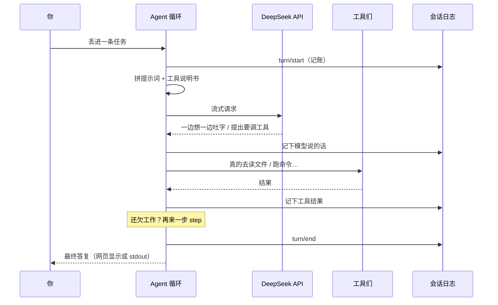
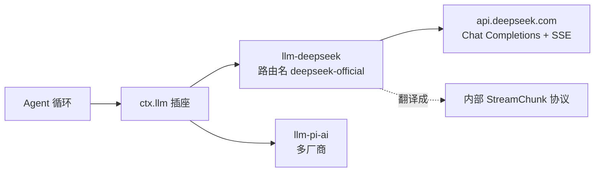
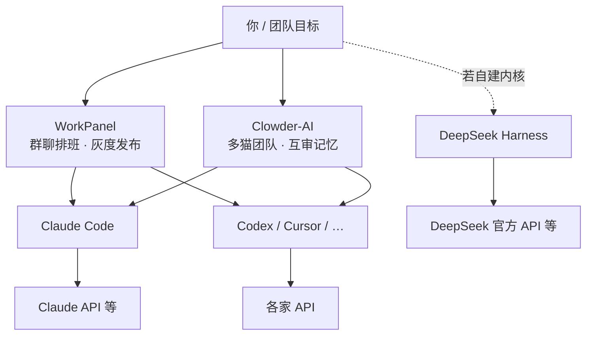

# 【拆解 DeepSeek Harness】用人话说：它到底在干嘛？

> 图文白话版 · 2026-08-20  
> 技术原文：[2026-08-20-dsh-disassembly-investigation.md](./2026-08-20-dsh-disassembly-investigation.md)  
> 机制借鉴版：[dsh-analysis-report.md](./dsh-analysis-report.md)

---

## 先给结论（30 秒版）

把 AI 编程世界想成四层楼：



| 楼层 | 像什么 | 代表 |
|---|---|---|
| 多 Agent 平台 | **工头 / 群聊排班** | WorkPanel、Clowder-AI |
| 编码 CLI | **熟练工匠** | Claude Code、Codex、Cursor |
| Harness 内核 | **工匠身上的作业系统** | **DeepSeek Harness（dsh）** |
| 模型 API | **供电 / 大脑接口** | DeepSeek Chat API 等 |

**dsh 不是又一个聊天窗口。**  
它更像给智能体装的一套「可拆可换的操作系统」：记日志、拼提示词、调工具、接模型、问你批不批准、会话太长就摘要……这些都能插拔。

---

## 1. 它到底做了什么？（人话）

### 你能直接碰到的

| 你敲的命令 | 发生了啥 |
|---|---|
| `dsh web` | 打开网页控制台，在本机跑完整智能体 |
| `dsh --profile headless "帮我做某某"` | 不启动网页：干完活，把最终回答打到终端，然后走人 |
| `dsh plugin …` | 给某个「配置档案」装卸插件 |

注意：它还是 **开发者预览**，而且依赖很重（新 Node、一大包 `@deepseek-ai/dsh-*`）。弱内存机器上硬装，很容易把自己撑爆——我们之前就遇到过。

### 工程上真正交付的（四件事）

1. **转起来一轮「想 → 说 → 动手 → 再想」**  
2. **所有重要事情写成只能追加的流水账**（以后能回放，不靠脑补）  
3. **能力都做成「插座」**：换硬盘（文件系统）、换沙箱、换模型适配器，不用把整机拆了  
4. **用「配置档案 + 组合包」拼出成品**：同一套内核，既能变网页版，也能变无头脚本版  

> 比喻：不是卖你一把螺丝刀，而是卖你一张**可重组的工具台**。

---

## 2. 架构长什么样？

### 2.1 一张能力雷达图（它管哪些事）



中间是 dsh；周围六块是最常打交道的能力。官方叫它们 **Capability Seams（能力接缝）**——你可以只换其中一块的「实现」，其它继续用。

### 2.2 分层（从外到内）



### 2.3 一轮对话在内部怎么走？

用人话：**先开门（turn）→ 可能多步（step）→ 每步里问模型、调工具 → 再关门。**



**设计狠点：** 模型「看见」的东西，账本里必须能重建出来。  
偷偷改 system prompt、又不记账 → 在 dsh 的世界观里算「犯规」。

---

## 3. 设计理念（不用黑话也能懂）

| 他们的说法 | 人话翻译 |
|---|---|
| Everything is a Plugin | **没有神圣内核**，功能都是插件；拔掉就撤消副作用 |
| Capability Seams | **能力 = 插座规格 + 插头实现 + 用电器**，三者一起设计 |
| 仅追加事件日志 | **流水账只能往后写**，历史靠重放，不靠改旧账 |
| Profile / Bundle | **同一厨房，换菜单就能做出网页套餐或脚本套餐** |
| 审批 fail-closed | **没人点头 = 不许干**（不是「默认放行」） |

核心理念一句话：

> **把智能体产品拆成：可审计、可替换、可回放的积木。**

---

## 4. 和底层 DeepSeek API 处得怎么样？

### 短答

**处得相当深，但 dsh ≠ DeepSeek SDK。**

API 只是墙上的一个「模型插座」；墙上还有别的插座（例如走 pi-ai 的多厂商适配）。

### 稍细一点



| 能力 | 贴合度 | 人话 |
|---|---|---|
| 流式对话 | 很高 | 官方 SSE 直译进内部协议 |
| 工具调用 | 很高 | 跟工具流水线打通 |
| Thinking / 推理强度 | 很高（产品向） | 配置里就能开，还有 effort 档位 |
| 换模型名 | 灵活 | 目录可配；没登记的 model id 也能透传 |
| 看图 | 中等、可选 | 默认不一定挂视觉模型；配了才走 |
| Key / Base URL | 常规 | 环境变量 + 可改网关地址 |

和「套一层 OpenAI 兼容代理再接 DeepSeek」不同：  
dsh 这条官方路径更像 **按 DeepSeek 自家说明书精修的翻译官**，thinking、重试、大图省略都按产品语义处理。

---

## 5. 和另外三家怎么比？（一张表 + 一张图）



| | **dsh** | **Claude Code** | **Clowder-AI** | **WorkPanel** |
|---|---|---|---|---|
| 一句话 | 可拆的智能体 OS | 超强编程工匠 | 让多只「猫」成队协作 | 群里 @谁干、怎么发版 |
| 你主要省心什么 | 内核可组合、可回放 | 写代码体验拉满 | 跨模型传话、身份、纪律 | 调度、交接、生产灰度 |
| 模型 | DeepSeek 深度适配，也可换 | 主打 Claude | 多 CLI / 多模型 | 模型在各 CLI 里 |
| 像不像「群聊编排」 | 不太像（偏单核） | 不像 | **很像** | **很像** |
| 开源内核 | 是（预览期） | 产品主导 | 平台开源 | 自有平台 |

### 排比口诀

- **Claude Code**：我要把活干漂亮。  
- **dsh**：我要把干活的「机床」做成可改装的。  
- **Clowder**：我不要再当人工路由器，让猫们自己协作。  
- **WorkPanel**：我要在群里排班、留墓志铭、稳稳发版。

**所以：dsh 替代不了 Claude Code；也替代不了 WorkPanel。**  
它更适合被 **抄作业（机制）**，而不是整仓搬进你们 1.8G 的生产机。

---

## 6. 以后会怎么走？（带一点判断）

### 上游 dsh 可能

1. 预览 → 契约逐渐稳住（否则跟版本太累）  
2. 跟着 DeepSeek API 升级 thinking / 长上下文 / 视觉  
3. 更多「插座实现」：远程沙箱、编辑器协议、第三方 `dsh-plugin`  
4. headless 输出契约更适合 CI / 外部工头调用  

### 行业大概会收敛成

```text
模型 API  →  harness 内核  →  单兵 CLI  →  多 Agent 平台
              ↑ dsh 在这            ↑ Claude Code     ↑ Clowder / WorkPanel
```

### WorkPanel 建议怎么蹭（可落地）

| 优先级 | 蹭什么 | 别做什么 |
|---|---|---|
| 高 | 任务流水账事件、上下文注入「插座」 | 别把 Cordis 塞进 Rust 里 |
| 高 | epitaph 交接 → 真正注入并记账 | 别只写文档不进 prompt |
| 中 | 长会话摘要、目标续跑、权限套餐命名 | 别默默截断聊天记录 |
| 低 | 隔离机验证 `dsh headless` 再谈适配器 | 别在生产机 `npm i @deepseek-ai/dsh` |

---

## 7. 风险（说人话）

- **还在预览**：今天学的接口，明天可能改名。  
- **太重**：安装和内存不友好；和 Cursor/Codex 并行容易抢爆小机器。  
- **对比有边界**：Clowder / Claude Code 主要靠公开材料，不是逐行扒源码。  
- **API 适配**：结论来自官方适配器文档与架构说明，不是本机抓包联调。

---

## 8. 带走三句话

1. **dsh = 智能体操作系统内核**，不是聊天 App，也不是群聊平台。  
2. **对 DeepSeek 官方对话 API 适配很深**，但整仓不等于「DeepSeek SDK」。  
3. **WorkPanel 该抄它的账本 / 插座 / 压缩 / 权限思路，不该整楼搬迁。**

---

## 附件图

| 文件 | 内容 |
|---|---|
| [assets/dsh-layers-plain.png](./assets/dsh-layers-plain.png) | 四层楼示意 |
| [assets/dsh-seams-plain.png](./assets/dsh-seams-plain.png) | 能力雷达 / 接缝示意 |
