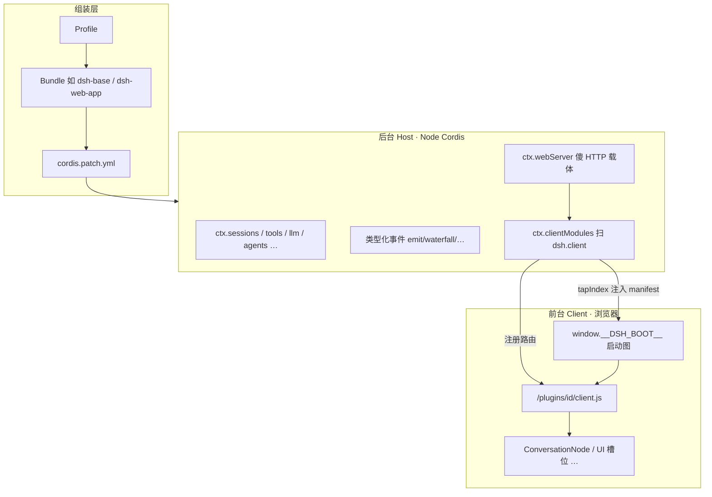
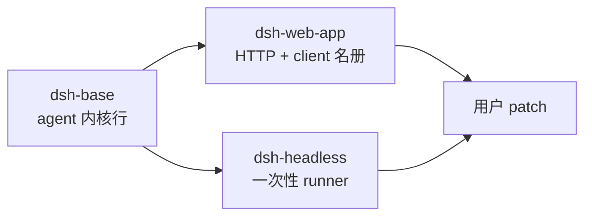
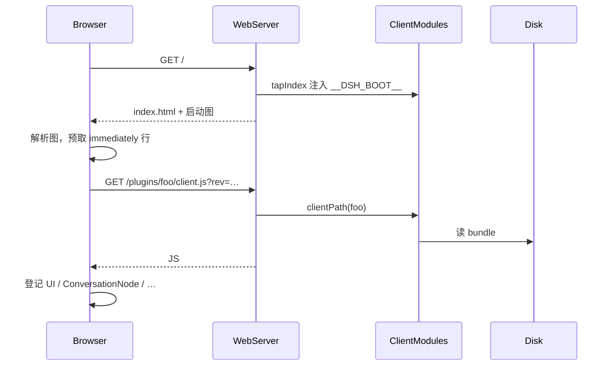

# 【拆解DeepSeek Harness】DeepSeek Harness 是怎么做到插件化的

| 项 | 内容 |
|---|---|
| 焦点 | **前台（浏览器 Client）** 与 **后台（Host / agent 运行时）** 如何各自插件化、又如何对上 |
| 对象 | [deepseek-ai/deepseek-harness](https://github.com/deepseek-ai/deepseek-harness)（Cordis 插件树） |
| 证据 | `docs/cordis-primer`、`architecture`、`client-modules`、`web-server`、`extensions`、`bundle/{base,web-app}`、cookbook |
| 日期 | 2026-08-20 |
| 关联 | [拆解调查](./2026-08-20-dsh-disassembly-investigation.md) · [白话图文](./2026-08-20-dsh-plain-illustrated.md) · [借鉴报告](./dsh-analysis-report.md) |

---

## 0. 一句话

dsh 的插件化不是「前端写个 plugin 市场」那么简单，而是 **同一套 Cordis 思想在两条运行时上落地**：

1. **后台（Host）**：Node 进程里挂服务、事件、工具、模型适配器——靠 `inject` / `apply(ctx)` / 可逆 `effect`。  
2. **前台（Client）**：浏览器里另有一套「client 半」包，靠 `package.json` 的 `dsh.client` 声明进启动图，经 Host 注入 `window.__DSH_BOOT__`，再按需拉 `/plugins/<id>/client.js`。

产品面（`web` / `headless`）只是 **Profile + Bundle 补丁栈** 组装出来的不同插件树，不是两套框架。



---

## 1. 插件化的「宪法」：Cordis 五条

后台几乎所有能力都遵守同一套 Cordis 规则（vendor 引入）：

| 概念 | 含义 |
|---|---|
| **插件 = 实现 Service 的对象** | 函数（`inject` + `apply(ctx)`）或 `Service` 子类 |
| **上下文 `ctx` = 服务容器** | 别人找的是 `ctx.tools`，不是某个具体 npm 实现路径 |
| **`inject` 声明依赖** | 等依赖就绪再启动；顺序靠依赖图，不靠手写启动脚本 |
| **类型化事件通信** | `emit` / `waterfall` / `parallel` / `serial`；扩展点往往是事件 |
| **注册是可逆副作用** | `ctx.effect()` / `ctx.on()`；插件卸载时撤消提示词、工具、监听器 |

实践口诀（官方 primer）：

- 工具流水线事件 → `ctx.tools`  
- 模型流式 → `ctx.llm`  
- 实时协调 → `ctx.agents`  
- **拦截用事件，直接能力用服务方法**

这就是「Everything is a Plugin」能落地的原因：**没有特权内核要打补丁，只有并排挂载与可逆注册。**

---

## 2. 后台（Host）怎么插件化？

### 2.1 组装：Profile → Bundle → Patch

运行中的 `dsh` 是一棵 **按序叠加的插件配置树**：

```text
空根
  → profile.bundles 里每个 Bundle 的 cordis.patch（如 dsh-base，再 dsh-web-app）
  → profile 自己的 cordis.patch.yml
  → $DSH_HOME 级 patch
  → CLI --patch overlay
```

- **`dsh-base`**：第一层；插入模型适配、工具、持久化、策略、凭据、遥测、默认 subagent 等「每个 profile 都要的」行。  
- **`dsh-web-app`**：叠在 base 上；插入 webserver、API gateway、client 插件名册、HMR、`web-runtime` 胶水等。  
- **`dsh-headless`**：兄弟面，**同一 base**，不装 Web 那一层。

补丁语义关键点：**按 id 整行替换 config**（不是深合并字段）。模式相关默认值放在 mode bundle，不塞进 base。



### 2.2 单个后台插件长什么样？

Cookbook 约定一个 `@deepseek-ai/dsh-*` 包大致是：

```text
packages/<group>/<pkg>/
  package.json   # peer: @deepseek-ai/cordis
  src/index.ts   # 默认导出服务或 { name, inject, apply, Config }
  README.md      # 服务 API、事件、扩展点
```

挂进树后，典型动作包括：

1. **贡献服务**：占据 `ctx.<key>`（如 `ctx.compaction`）  
2. **注册提供方**：挂到已有 seam（如 `ctx.llm` 上注册 `deepseek-official`）  
3. **注册消费方**：工具 schema 进 `ctx.tools`，提示词片段进 `ctx.systemPrompt`  
4. **监听瀑布事件**：如 `tools/pre-execute`、`agent/pre-step`，可 `next()` 或短路  
5. **扩展会话事件类型**：declaration merging 扩 `SessionEventMap`（compaction/goal 等）

**Capability Seam** = Definition + Provider + Consumer 一起设计——所以换沙箱提供方时，Bash/PTY 等消费者不用各自 fork。

### 2.3 后台的「HTTP 插件化」：傻载体 + 聪明注册者

`ctx.webServer`（`dsh-host-webserver`）刻意 **不懂 harness 业务**：

- 只提供具名路由注册表 + index HTML 转换钩子 + 一个 SPA 回退席位  
- `/api`、插件 bundle、HMR SSE **全部由别的插件** `register()` 上去  
- `dsh-client-modules` 用 `tapIndex` 把启动图写进 `index.html`  
- `frontend-static` 认领回退：未匹配路由回 `index.html`

这是前台插件化的 **宿主机**：后台插件负责「把什么 JS 端点暴露给浏览器」。

### 2.4 动态扩展（agent 现场写插件）

`extensions` 子系统走得更远：允许在会话里 **定义带版本的 Cordis 包**，跑 **Host 半 + Client 半**，并用 inspect 工具查询公开元数据（`ctx.dynamicCordisRunner` / `ctx.cordisInspect`）。  
这是「插件化」的上限形态：**不仅人写死包，模型也能按协议装卸插件**——但仍落在同一 Cordis 生命周期与沙箱约束下。

---

## 3. 前台（Client / 浏览器）怎么插件化？

前台不是另起一套「npm 插件市场运行时」，而是：

> **同一批包可以有 Host 半 + Client 半；Client 半靠 `dsh.client` 声明进入 Web 启动图。**

### 3.1 声明：`package.json` 里的 `dsh.client`

包要进浏览器表，需同时满足大致条件：

1. `package.json` 声明 **`dsh.client`**（`platform: 'web'`，可选 `inject` 边、`immediately` 预取）  
2. **`exports["./client"]`** 指向构建好的 client bundle  
3. 包能从配置树的 `ctx.baseUrl`（cordis.yml 所在目录）解析到  

Host 侧服务 **`ctx.clientModules`（ClientModuleRegistry）** 扫描 Loader entry，组合出启动图。

### 3.2 启动协议：`window.__DSH_BOOT__`

Host 把组合结果做成 **`WebBootGraph`**，作为 `<head>` 里**第一个脚本**注入：

```ts
interface WebBootEntry {
  id: string            // == package name
  url: string           // '/plugins/<id>/client.js?rev=<rev>'
  rev: string           // bundle 内容哈希（缓存失效锚）
  inject?: string[]     // 信息性依赖边
  immediately?: boolean // 第一阶段预取（只做 factory 登记）
  external?: string[]   // 约束代码到达的模块边（同步 require）
}

interface WebBootGraph {
  rev: string
  entries: WebBootEntry[]  // 模块图顺序，≠ Cordis fiber 激活顺序
}
```

要点：

- **图是 Node↔浏览器协议的唯一真源**；图缺失或畸形 → 浏览器大声失败，页面不起。  
- 行 `rev` 变 → URL query 变；图 `rev` 是各行之哈希。  
- `immediately`：启动阶段就拉脚本做登记；其它行 **首次 import 才懒加载**。  
- Cordis 激活顺序与 client entry 顺序 **解耦**（一边靠 fiber 等服务，一边靠模块图）。

### 3.3 投递：`/plugins/<id>/client.js`

- `GET/HEAD` 从磁盘吐已注册 bundle，`Cache-Control: no-cache`，靠 `rev` 一致性  
- 未知 id 或尚未构建 → **404**（故意不让 SPA 回退把 HTML 当 JS 发出）  
- 开发态：`dsh-client-hmr` 轮询 bundle → `rebuilt(id)` → SSE 通知浏览器半  
- 生产图 **不含 HMR 行**

浏览器半有内核机件 `ctx.modules`：按启动图 **lazy CJS** 拉取并物化这些 bundle（细节在 `packages/client/modules` README）。



### 3.4 UI 插件长什么样？（以 Chat 节点为例）

扩展聊天视图的标准路径（cookbook *adding-a-conversation-node*）：

1. **Host 先有可回放事件族**（仅追加 SessionEvent，带稳定业务 id）  
2. **Client 插件**声明 `ConversationNodeDefinition`：  
   - 把事件族收成 Context  
   - 增量构建 State（重放必须确定性）  
   - 用 keyed renderer 画 Chat Node  
3. Client 包编进 Web 组合；**不扫别的节点、不靠「最新未完成」这种脆弱启发式**

其它 UI 域（conversation shell、tool presentation、workflow run…）同样是 **client 包 + 槽位/控制器**，而不是改死一个巨型 React App 内核。

`dsh-web-app` 的职责，就是在 base 之上 **插入 Web host 行 + browser plugin roster + HMR + web-runtime**，把「有哪些 client 包」写进组合，而不是在前端仓库里手维护一张全局插件列表。

---

## 4. 前后台如何「对上号」？

| 通道 | 谁主导 | 作用 |
|---|---|---|
| **Session 事件流** | Host 写入，Client 投影/渲染 | 真源在后台；UI 是派生视图 |
| **`__DSH_BOOT__` + `/plugins/*`** | Host 组合与投递，Client 执行 | 前台代码本身的插件装载 |
| **API gateway / RPC**（GUI 分层笔记） | Host 暴露，Client 调用 | 控制面：会话、设置、工作区… |
| **HMR SSE** | Host 广播 rev，Client 热更 | 仅开发 |
| **Dynamic Cordis + Inspect** | 两半都可有 provider | Agent 可查询/驱动动态插件 |
| **构建面分离** | `tsconfig.host` / `tsconfig.client` | 同仓两套编译面，避免把 Node API 打进浏览器 |

设计哲学：**后台拥有事实与能力；前台拥有呈现与交互插件；二者用启动图 + 事件/API 对齐，而不是共享一个可变全局单例。**

---

## 5. 和「普通前端插件 / VS Code 插件」差在哪？

| | dsh | 常见 SPA 插件 | VS Code Extension |
|---|---|---|---|
| 后台 | Cordis 服务+事件，可逆 | 往往没有对称插件运行时 | Extension Host |
| 前台装载 | Host 扫 `dsh.client` 注入启动图 | 路由表/动态 import 自管 | contribution points |
| 真源 | SessionEvent 回放驱动 UI | 常以 REST 状态为准 | 编辑器模型 |
| 组装 | Profile/Bundle patch 栈 | 环境变量/功能开关 | package.json contributes |
| 动态上限 | Agent 可 define Cordis 包 | 少见 | 受限 |

对 WorkPanel 的可借鉴点（仍建议 **抄语义不抄 Cordis**）：

1. **扩展点显式化**：Host 注册能力，UI 只消费契约（类似你们 AdapterKind / Extension Host）。  
2. **启动清单**：前端扩展列表由后端组合注入，避免前后各维护一份。  
3. **卸载可逆**：配置变更能撤消监听与路由，而不是只「加不能减」。  
4. **UI 节点跟事件族走**：Chat/Logs 行用稳定 id 回放，而不是 DOM 临时状态。

---

## 6. 风险与边界

| 风险 | 说明 |
|---|---|
| 预览期 | Loader / `dsh.client` / boot 图字段可能变 |
| 复杂度 | 双面包 + 双 tsconfig + HMR，学习与构建成本高 |
| 资源 | 整树 Node 插件对弱机不友好 |
| 证据 | 本报告基于官方文档与 cookbook，**未**本机跑通 `dsh web` 热更实操 |
| WorkPanel | 不宜嵌入完整 Cordis；对齐「清单注入 + 可逆注册 + 事件驱动 UI」即可 |

---

## 7. 结论

DeepSeek Harness 的插件化是 **Cordis 一条绳上的两头**：

- **后台**：服务容器 + 类型化事件 + Profile/Bundle 补丁组装 + 可逆副作用；Web 只是再叠一层「傻 HTTP + 聪明注册者」。  
- **前台**：包用 `dsh.client` 报名，Host 生成 `__DSH_BOOT__` 与 `/plugins/<id>/client.js`，浏览器按图懒加载；Chat 等 UI 以 **可回放事件 → ConversationNode** 方式扩展。  
- **对上**：事件真源在 Host，代码装载图与 API 把 Client 拴在同一组合配置上。

这就是它能声称「Everything is a Plugin」、同时还能长出 Web GUI 与 headless 两种脸的原因。
