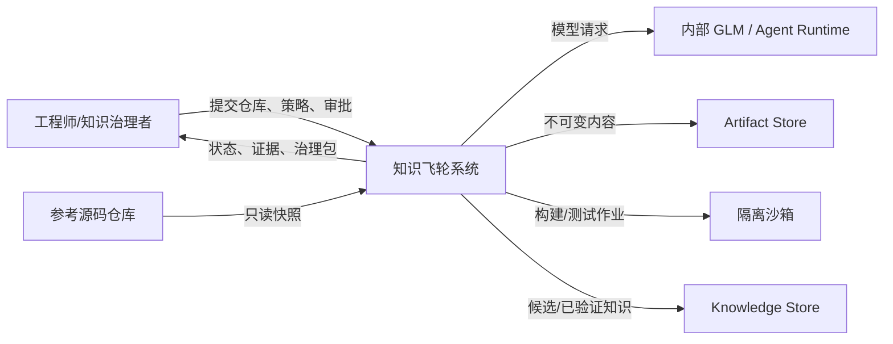

# 系统上下文

## 边界与端口

| 端口 ID | 外部系统 | 核心看到的类型 | 责任 |
|---|---|---|---|
| PORT-001 | Agent Runtime / GLM | `AgentRequest`, `AgentResult` | 结构化生成、取消、超时、用量；由 Provider 适配。 |
| PORT-002 | Artifact Store | `ArtifactRef` | 内容寻址、原子写、摘要校验。 |
| PORT-003 | Sandbox | `ExecutionRequest`, `ExecutionResult` | 隔离执行和资源计量。 |
| PORT-004 | Knowledge Store | `KnowledgeVersion` | 候选、血缘、状态、发布事务。 |
| PORT-005 | Workflow Engine | `WorkflowState`, `CheckpointRef` | 节点、边、checkpoint 和恢复。 |
| PORT-006 | Language Plugin | `LanguageCapability` | 发现、构建、执行与标准化诊断。 |

DSH、LangGraph、Temporal、GLM SDK、数据库驱动和 C++ 工具链均位于 Adapter 外侧；其 SDK 类型不得跨越端口进入领域层。

