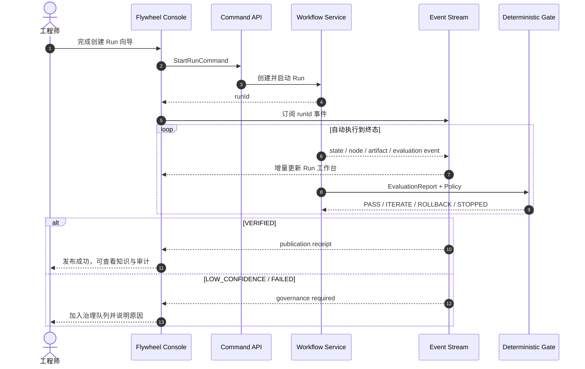

# Knowledge Flywheel 前台产品设计

**状态：Accepted，MVP 实现中｜版本：0.2.0｜日期：2026-09-01**

本文定义 `endlessWpKnowledgeRunner` 从只读知识 Dashboard 演进为 Knowledge Flywheel 产品控制台的用户体验、信息架构、交互边界、接口需求和验收标准。本组件的领域状态、Gate、安全和发布语义以同一组件内的[规范总入口](../README.md)为准；前台不得创造第二套状态或发布权威。

关联规范：

- [用户用例与交互时序](../05-workflows/user-use-cases.md)
- [知识飞轮工作流](../05-workflows/knowledge-flywheel-workflow.md)
- [数据边界与权限矩阵](../09-security/data-boundaries.md)
- [知识发布门禁](../08-evaluation/knowledge-publication-gate.md)

## 1. 产品定位

前台不是 Agent 聊天室，也不是让用户逐步点击状态转换的工作流调试器。它是：

> 面向工程师和知识治理者的本地优先控制台，用于启动自动知识飞轮、观察证据链、处理异常治理，并安全消费已经发布的知识。

### 1.1 产品目标

1. 用户用一个高层动作启动 Run，Workflow Service 自动推进正常路径。
2. 用户能够回答“现在运行到哪里、为什么停下、用了什么证据、发布了哪个版本”。
3. `CANDIDATE`、质量合格、Gate `PASS` 和 `VERIFIED` 在视觉与文案上严格区分。
4. 只有需要人类判断的异常进入治理队列，正常迭代不要求人工逐节点操作。
5. 任一关键结果都能沿 `Run → Agent node → Artifact → Evaluation → GateDecision → Publication` 追溯。

### 1.2 非目标

- 不提供任意状态跳转按钮。
- 不允许用户在页面上直接把候选标记为 `VERIFIED`。
- 不把模型流式文本、思维过程或 Agent 自评分当成进度或证据。
- 不在第一阶段实现通用 IDE、源码编辑器或复杂工作流画布编辑器。
- 不把受信项目 EvalRunner 描述成敌对代码沙箱。

## 2. 用户角色与核心任务

| 角色 | 核心任务 | 默认权限 |
|---|---|---|
| 知识消费者 | 搜索 `VERIFIED` 知识、查看来源、提交使用反馈 | 只读 + feedback |
| 工程师 | 选择项目和模块、启动 Run、观察自动迭代、取消自己的 Run | 受保护写入 |
| 知识治理者 | 查看 Correction、处理 `LOW_CONFIDENCE`、批准重新运行或创建新候选 | 受保护写入 |
| 发布验收者 | 查看固定 commit、测试命令、工具链、Gate 和 publication receipt | 只读审计；受控重跑 |
| 平台维护者 | 配置 Provider、Policy、评测器和安全边界，诊断基础设施失败 | 本地管理员 |

## 3. 产品原则

### 3.1 证据优先

界面先展示确定性事实：状态、测试结果、reason code、ArtifactRef、commit、工具链和 receipt。Agent 名称、模型和耗时是辅助信息，不占据主视觉中心。

### 3.2 自动化可见，但不要求人工遥控

正常路径由 Workflow Service 自动推进。界面展示状态图、节点和事件，但不为 `PLANNED → GENERATING → EVALUATING` 提供人工“下一步”按钮。用户只看到符合当前状态和权限的高层动作。

### 3.3 失败可理解

错误必须归入以下一种用户可理解类别：

- 行为失败：测试或关键门禁未通过。
- 知识问题：Correction 已定位知识路径。
- 基础设施失败：工具、超时、资源或 Provider 不可用。
- 安全拒绝：权限、路径、命令或完整性校验失败。
- 预算停止：迭代上限或停滞策略触发。

### 3.4 渐进披露

概览只展示结果和需要注意的事项；Run 详情展示节点；Evidence Drawer 才展示 argv、摘要和 ArtifactRef；完整原始 Artifact 需要显式打开且受权限控制。

### 3.5 高风险动作显式确认

取消运行、以新策略重跑、发布例外申请和治理决议必须展示影响范围。普通查询、查看证据和下载审计摘要不需要确认。

## 4. 信息架构

### 4.1 实现目录边界

本产品控制台的新增代码必须收口在 `endlessWpKnowledgeRunner/`：

```text
endlessWpKnowledgeRunner/
├── acceptance/            # 固定源码验收 fixture
├── apps/runner/src/       # CLI、HTTP、composition 与 Console read model
├── docs/                  # 架构、运维、迁移
├── packages/              # 领域、端口、应用与适配器
├── specs/                 # 产品、需求、工作流、Schema 与验收规范
├── site/                  # 双主题 GitHub Pages 项目官网
├── tests/                 # unit、contract、integration、acceptance
└── web/                   # HTML、CSS 与浏览器交互
```

Console HTTP adapter 与只读投影分别位于 `apps/runner/src/server.ts` 和 `apps/runner/src/console-read-model.ts`。Console 不得为了页面查询扩张 `packages/application`、`packages/contracts` 或写侧 SQLite Repository；状态变更仍只能委托共享应用服务。

```text
Knowledge Flywheel
├── 概览 Overview
│   ├── 系统健康
│   ├── 运行指标
│   ├── 需要处理
│   └── 最近 Run
├── Runs
│   ├── Run 列表
│   ├── 创建 Run
│   └── Run 工作台
│       ├── 自动化状态图
│       ├── Agent 节点
│       ├── 评测与 Gate
│       ├── Correction / 版本变化
│       └── 事件与证据
├── Knowledge
│   ├── 知识目录
│   ├── 版本详情
│   ├── 版本血缘与 Diff
│   └── 使用反馈
├── Governance
│   ├── LOW_CONFIDENCE
│   ├── 基础设施失败
│   ├── 安全拒绝
│   └── 待批准动作
├── Evidence
│   ├── Artifact 检索
│   ├── EvaluationReport
│   └── Publication receipt
└── Settings
    ├── Policy
    ├── Project / source roots
    ├── Agent Provider
    └── EvalRunner / Sandbox 状态
```

## 5. 全局界面框架

```text
┌───────────────────────────────────────────────────────────────────────────┐
│ ◇ Knowledge Flywheel   [环境: Local] [只读/治理模式] [系统健康] [用户]   │
├──────────────┬────────────────────────────────────────────────────────────┤
│ 概览         │ 页面标题                                      主要动作    │
│ Runs         ├────────────────────────────────────────────────────────────┤
│ Knowledge    │                                                            │
│ Governance 3 │                    页面主内容                              │
│ Evidence     │                                                            │
│ Settings     │                                                            │
│              │                                                            │
├──────────────┴────────────────────────────────────────────────────────────┤
│ Runtime · Registry · CAS · Provider · Evaluator 状态                     │
└───────────────────────────────────────────────────────────────────────────┘
```

全局规则：

- 左侧导航固定，治理队列显示未处理数量。
- 顶栏持续显示当前运行环境和权限模式，避免用户误以为只读页面可以写入。
- 全局搜索覆盖 Run ID、moduleId、versionId、Artifact ID 和关键词。
- 系统健康不是单一绿色圆点，而是 Registry、CAS、Provider、Evaluator 的分项状态。

## 6. 核心页面设计

### 6.1 概览

概览用于回答三个问题：系统是否正常、飞轮是否在工作、我是否需要介入。

```text
┌─ 今日运行 ─────┬─ VERIFIED ─────┬─ 自动迭代 ────┬─ 待治理 ─────────┐
│ 12             │ 38             │ 7             │ 3                │
│ 成功 8 / 运行 2 │ 本周 +5        │ 平均 1.6 轮    │ 1 安全 / 2 停止 │
└────────────────┴────────────────┴───────────────┴──────────────────┘

需要处理
┌────────────────────────────────────────────────────────────────────┐
│ HIGH  ohmyworkpanel-mentions · STOPPED · 迭代预算耗尽  [查看]     │
│ MED   cpp-parser · INFRA_FAILURE · evaluator unavailable [诊断]  │
└────────────────────────────────────────────────────────────────────┘

最近 Run
Module             State          Iteration   Gate       Updated
mentions           EVALUATING     1/5         —          2m
connector-routing  VERIFIED       2/5         PASS       1h
```

禁止使用虚构的“AI 信心分”。指标必须来自 Registry、EvaluationReport 或事件聚合。

### 6.2 创建 Run

采用三步向导，最终提交的是高层 `StartRunCommand`，不是一组裸状态转换。

1. **来源**：选择已配置项目、固定 commit、模块和公开接口范围。
2. **策略**：选择 GatePolicy、最大迭代、评测器和允许的工具。
3. **确认**：展示可访问路径、命令白名单、预计资源和安全边界。

提交后界面立即进入 Run 工作台；Workflow Service 负责后续状态推进。

必须在确认页突出显示：

- 固定 commit 与当前 checkout HEAD 的区别。
- 是否为受信源码执行。
- 当前执行器是否具备 OS 级隔离。
- Agent Provider 是真实模型还是 deterministic scenario。

### 6.3 Run 工作台

这是产品的核心页面。

```text
┌ mentions / run_fad0... ───────────── EVALUATING · Iteration 2/5 ───────┐
│ fixed commit cfef082 · policy local-v1 · trusted-source evaluation      │
│ [取消 Run] [导出审计]                                                   │
├─────────────────────────────────────────────────────────────────────────┤
│ CREATED ✓ → PLANNED ✓ → GENERATING ✓ → EVALUATING ● → REVIEWING       │
│                                    ↖ ITERATING 1                         │
├───────────────────────────────────────────────┬─────────────────────────┤
│ 自动化节点                                    │ 当前节点                │
│                                               │ EvalRunner · attempt 2  │
│ Reference Gate  ✓ 1/1                         │ elapsed 00:42           │
│ DocGen v1       ✓  artifact...                │ command 2/4             │
│ CodeGen v1      ✓                             │                         │
│ Eval v1         ✕ 0/1                         │ [查看实时事件]          │
│ Review          ✓  COR-0001                   │ [查看证据摘要]          │
│ DocGen v2       ✓  changed: 行为规则          │                         │
│ CodeGen v2      ✓  fresh                      │                         │
│ Eval v2         ●                             │                         │
├───────────────────────────────────────────────┴─────────────────────────┤
│ 时间线  10:21 EvalStarted · 10:20 NodeCompleted · 10:18 ArtifactCommitted│
└─────────────────────────────────────────────────────────────────────────┘
```

#### 状态与可用动作

| 状态 | 主信息 | 用户动作 |
|---|---|---|
| `CREATED / PLANNED` | 输入、计划、权限和资源声明 | 取消；无“下一步”按钮 |
| `GENERATING` | 当前 Agent、输入引用、Schema 状态 | 取消；查看节点 |
| `EVALUATING` | 命令进度、测试计数、超时和工具链 | 取消；查看证据 |
| `REVIEWING` | Gate reason codes、Correction | 正常路径自动继续 |
| `ITERATING` | 当前轮次、修改知识路径、剩余预算 | 查看 Diff；正常路径自动继续 |
| `ROLLING_BACK` | historical best、回滚原因 | 查看比较；正常路径自动继续 |
| `PUBLISHING` | 事务阶段和 publication key | 只读等待；不得重复点击发布 |
| `VERIFIED` | 版本、GateDecision、receipt | 打开知识；导出审计 |
| `LOW_CONFIDENCE` | 停止原因、未解决风险、建议动作 | 创建治理决议；以新 Run 重试 |
| `FAILED` | 失败类别、最后 checkpoint | 诊断；满足规则时从新 Run 重试 |
| `CANCELLED` | 取消主体、时间、清理结果 | 查看审计 |

### 6.4 Correction 与知识 Diff

Correction 不使用聊天气泡展示，而使用结构化审阅卡：

```text
Correction COR-0001
知识路径      行为规则
失败判据      AC-E2E-001
证据          evaluation sha256:...
风险          mention parsing behavior remains incorrect

知识变化
  未修改  背景
  已修改  行为规则       [展开 Diff]
  未修改  验证方式

范围校验      PASS · 指定章节外字节一致
```

用户可以查看 Correction 和 Diff，但正常 `ITERATE` 不要求点击批准。只有策略明确要求人工批准或进入 `LOW_CONFIDENCE` 时才出现治理动作。

### 6.5 Knowledge 页面

保留当前左右分栏的高效浏览方式，并增加：

- 模块级版本血缘图。
- `CANDIDATE / VERIFIED / SUPERSEDED / LOW_CONFIDENCE` 状态解释。
- Quality Gate 与 Behavioral Gate 分区，禁止把两个分数合并。
- 与上一版本的 Markdown Diff。
- 产生该版本的 Run、Correction、Evaluation 和 receipt 反向链接。
- `hit / rate / correct` 反馈控件；反馈后明确提示“不会直接改变发布状态”。

### 6.6 Evidence 页面

默认展示脱敏摘要：

- Artifact ID、media type、size、完整性状态。
- 来源 commit、工具链 fingerprint、命令、退出码和耗时。
- 测试总数、通过数、稳定性、critical failures。
- Gate reason codes 和策略版本。

stdout/stderr、Prompt 和源码正文依据权限分级。页面不得通过 URL 参数绕过 Artifact 权限。

### 6.7 Governance 队列

治理条目按风险而不是创建时间优先：

1. 安全与完整性拒绝。
2. 关键行为回归或 `ROLLBACK`。
3. `STOPPED / LOW_CONFIDENCE`。
4. 基础设施失败。
5. 用户 `correct` 反馈。

允许的治理结果只有：创建新 Run、补充来源、调整策略后新建 Run、接受当前 `LOW_CONFIDENCE` 状态、取消。不得直接修改既有 GateDecision 或 publication receipt。

## 7. 自动化交互



前台刷新或断线重连后，必须先读取 Run snapshot，再从最后 `event_seq` 续订事件；不得通过前端本地状态猜测 Run 进度。

## 8. 视觉系统

### 8.1 风格

界面提供深色和浅色两套主题。两者使用同一套语义 token、信息层级和组件尺寸，只改变颜色值与阴影强度。深色适合长时间观察 Run；浅色适合明亮环境、阅读知识正文和打印截图。

| 语义 | 深色 | 浅色 |
|---|---|---|
| 背景 | `#080B10` | `#F4F7F9` |
| 一级表面 | `#10151D` | `#FFFFFF` |
| 二级表面 | `#121A25` | `#F0F4F7` |
| 边框 | `#273140` | `#CBD6DF` |
| 主文字 | `#EEF2F7` | `#17212B` |
| 次文字 | `#9AA8BA` | `#586B7D` |
| 交互强调 | `#71D4FF` | `#07769F` |
| 成功 / VERIFIED | `#76EFBD` | `#087C58` |
| 候选 / 等待 | `#FFD27D` | `#92610F` |
| 失败 | `#FF7D8E` | `#B62F48` |
| 治理 / LOW_CONFIDENCE | `#C7A6FF` | `#7250A8` |

颜色必须同时配合图标和文字，不作为唯一状态表达。

### 8.2 组件

- `StateBadge`：领域状态和解释。
- `RunStepper`：合法状态路径与当前节点。
- `NodeCard`：Agent、输入输出、checkpoint、重试次数。
- `GatePanel`：Outcome、reason codes、策略和证据。
- `ArtifactLink`：摘要显示、复制、完整性状态和权限提示。
- `CorrectionCard`：路径、判据、证据、风险和知识 Diff。
- `GovernanceAction`：高风险动作、影响说明和确认。
- `EventTimeline`：按 `event_seq` 排序，不依赖相同时间戳。

### 8.3 主题切换

- 首次访问跟随 `prefers-color-scheme`。
- 用户手动切换后，把 `light` 或 `dark` 偏好写入独立的 `localStorage` key；主题数据不得与治理 token 共用存储。
- 切换按钮必须有可感知名称，并显示切换后的目标主题。
- 官网和本地 Console 分别适配两套主题。项目官网仍是纯静态页面，不得因为主题切换连接 Registry 或写 API。
- 状态色在两套主题下都要保持文字、边框或图标提示；正文与背景应满足 WCAG AA 对比度。

### 8.4 响应式策略

- ≥1200px：固定侧栏，Run 图与当前节点双栏。
- 768–1199px：可折叠侧栏，详情 Drawer。
- <768px：只保证查询、告警确认和 Run 观察；创建策略与复杂 Diff 引导用户使用桌面宽度。

## 9. 权限与安全体验

- 未配置 `WP_KNOWLEDGE_WRITE_TOKEN` 时，界面明确进入“只读模式”，隐藏写按钮并解释原因。
- token 错误显示 `401`，不得伪装成网络故障。
- token 不得写入 URL、日志或长期浏览器存储；本地 V1 仅保存在当前页面内存中。
- UI 不直接暴露通用 `transition` 操作；产品动作调用高层 Command API。
- 所有治理动作展示 actor、runId、目标资源和预期副作用，并产生审计事件。
- 安全拒绝必须显示 reason code 和受控摘要，不泄露被拒绝的源码或密钥。

## 10. 状态体验

每个页面必须覆盖：

| 状态 | 产品行为 |
|---|---|
| Loading | 使用骨架屏，避免把零值误认为真实指标。 |
| Empty | 解释为什么为空，并提供符合权限的下一动作。 |
| Stale | 显示最后更新时间和重新连接状态。 |
| Partial | 单个 Evidence/Provider 故障不抹掉已持久化的 Run snapshot。 |
| Unauthorized | 显示只读能力和重新验证入口。 |
| Write disabled | 明确要求服务端配置 token，而不是反复要求用户输入。 |
| Conflict | 显示幂等重放或输入冲突的具体原因。 |
| Terminal | 冻结状态视图，只允许审计、新建 Run 或治理动作。 |

## 11. 前端所需 API

### 11.1 当前可复用

| API | 用途 | 产品化判断 |
|---|---|---|
| `GET /api/v1/status` | 顶部基础指标 | 可复用，但需要分项健康信息 |
| `GET /api/v1/knowledge` | 知识列表 | 可复用，需要分页与排序 |
| `GET /api/v1/knowledge/:versionId` | 知识详情 | 可复用，需要血缘和反向链接 |
| `GET /api/v1/query` | 搜索 | 可复用，需要分页和高亮摘要 |
| `GET /api/v1/scan` | 来源候选 | 可复用 |
| `POST /api/v1/feedback` | 用户反馈 | 可复用，需要前端表单 |
| `POST /api/v1/runs` | 创建 Run | 仅创建，不会启动完整自动流 |
| `POST /api/v1/transition` | 裸状态转换 | 只保留运维兼容，不供产品 UI 使用 |
| `POST /api/v1/evaluate` | 录入受信报告 | 只供受信操作端，不作为普通 UI 流程 |
| `POST /api/v1/publish` | 发布 | 由 Workflow/Publisher 调用，不暴露普通按钮 |

### 11.2 产品化前必须新增

| API | 需求 |
|---|---|
| `GET /api/v1/runs` | 按状态、模块、更新时间分页查询 Run。 |
| `GET /api/v1/runs/:runId` | 返回 Run snapshot、策略、当前迭代、best version 和治理摘要。 |
| `GET /api/v1/runs/:runId/events?after=<seq>` | 基于 `event_seq` 增量读取事件。 |
| `GET /api/v1/runs/:runId/nodes` | 返回 node/checkpoint、输入输出引用、重试和耗时。 |
| `GET /api/v1/runs/:runId/evaluations` | 返回评测、GateDecision 和证据摘要。 |
| `GET /api/v1/knowledge/:versionId/lineage` | 返回父子版本、关联 Run、Correction 和 publication。 |
| `GET /api/v1/artifacts/:artifactId` | 按权限返回元数据或受控内容。 |
| `GET /api/v1/governance` | 返回需要人类处理的条目和允许动作。 |
| `GET /api/v1/policies` | 返回可选择的固化策略及解释。 |
| `POST /api/v1/run-commands/start` | 校验输入后创建并启动自动工作流。 |
| `POST /api/v1/run-commands/cancel` | 幂等取消并传播到 Agent/EvalRunner。 |
| `POST /api/v1/run-commands/retry` | 根据治理决议创建新 Run 或合法重试失败节点。 |
| `POST /api/v1/governance/:id/resolve` | 记录受控治理决议，不直接篡改 Gate 或发布记录。 |
| `GET /api/v1/event-stream` | SSE 推送事件；断线后使用 `event_seq` 续传。 |

所有列表接口必须有稳定排序、游标分页和上限；所有 Command 必须包含幂等键并返回关联 `runId/eventId`。

## 12. 产品需求与验收

| ID | 优先级 | 需求 | 验收 |
|---|---|---|---|
| KF-UI-001 | P0 | 用户必须能从一个高层入口启动自动 Run，不接触裸状态转换。 | AC-UI-001 |
| KF-UI-002 | P0 | Run 工作台必须从服务端 snapshot 和事件显示状态、节点、迭代和 Gate。 | AC-UI-002 |
| KF-UI-003 | P0 | 正常 `ITERATE/ROLLBACK/PASS` 路径必须自动推进，前台不得要求逐节点点击。 | AC-UI-003 |
| KF-UI-004 | P0 | Quality Gate 与 Behavioral Gate 必须分区展示，并解释 `ACCEPTED` 不等于 `VERIFIED`。 | AC-UI-004 |
| KF-UI-005 | P0 | 用户必须能从 Run 追踪到 Correction、版本、Evidence、GateDecision 和 receipt。 | AC-UI-005 |
| KF-UI-006 | P0 | 只有 `STOPPED/LOW_CONFIDENCE/FAILED` 或策略要求批准时进入治理队列。 | AC-UI-006 |
| KF-UI-007 | P0 | 只读、未授权和写入关闭必须具有不同且可理解的界面状态。 | AC-UI-007 |
| KF-UI-008 | P0 | 高风险操作必须受权限保护、显式确认、幂等并记录事件。 | AC-UI-008 |
| KF-UI-009 | P1 | 用户可以比较知识版本，并确认 Correction 之外的范围未变化。 | AC-UI-009 |
| KF-UI-010 | P1 | Run 必须支持断线重连和按 `event_seq` 恢复，不丢失已持久化状态。 | AC-UI-010 |
| KF-UI-011 | P1 | 知识消费者可以在不获得发布权限的情况下查询和反馈。 | AC-UI-011 |
| KF-UI-012 | P1 | 界面必须满足键盘导航、可见焦点、语义标签和非纯颜色状态表达。 | AC-UI-012 |
| KF-UI-013 | P1 | 项目官网和本地 Console 必须提供深色/浅色主题，首次跟随系统、允许手动切换并独立保存偏好；主题切换不得持久化治理凭据或改变领域状态。 | AC-UI-013 |

### 12.1 验收场景

| ID | Given / When / Then |
|---|---|
| AC-UI-001 | Given 有效来源和 Policy，When 用户确认创建 Run，Then 系统返回 runId 并自动进入工作流，页面没有手动状态推进控件。 |
| AC-UI-002 | Given 一个活动 Run，When 打开工作台，Then 状态、迭代、节点和事件均来自服务端且刷新后保持一致。 |
| AC-UI-003 | Given 首轮评测失败且预算充足，When Gate=`ITERATE`，Then Review、局部修订、fresh CodeGen 和复评自动发生。 |
| AC-UI-004 | Given Quality=`ACCEPTED` 但无 PASS Gate，When 查看知识，Then 页面仍显示 `CANDIDATE` 并禁止发布表述。 |
| AC-UI-005 | Given 一个 `VERIFIED` 版本，When 从详情逐层导航，Then 能定位原 Run、输入、Correction、评测证据、Gate 和 receipt。 |
| AC-UI-006 | Given Gate=`STOPPED`，When事件到达，Then Run 进入治理队列，页面说明原因、未解决风险和允许动作。 |
| AC-UI-007 | Given未配置 token、错误 token 和有效 token，When进入控制台，Then分别显示只读、未授权和治理模式。 |
| AC-UI-008 | Given用户取消活动 Run，When确认影响，Then请求带幂等键，重复提交只产生一个取消结果和审计事件。 |
| AC-UI-009 | Given Correction 仅指向一个知识章节，When查看 v1/v2 Diff，Then明确显示目标章节变化和范围校验结果。 |
| AC-UI-010 | Given浏览器在第 N 个事件后断线，When恢复，Then先读取 snapshot，再从 N 后续传且事件不重不漏。 |
| AC-UI-011 | Given只读知识消费者，When查询并提交 feedback，Then反馈被记录但知识状态和 GateDecision 不变。 |
| AC-UI-012 | Given仅键盘和屏幕阅读器，When完成查询并打开 Run Gate，Then焦点顺序、名称、状态和错误均可感知。 |
| AC-UI-013 | Given 系统主题为浅色、无已保存偏好，When 首次打开官网或 Console，Then 使用浅色 token；When 用户切换深色并刷新，Then 主题保持且页面没有保存治理 token、发出写请求或改变 Run 状态。 |

## 13. 实施阶段

### Phase 1：知识控制台完善

- 建立全局 Shell 和导航。
- 完善知识目录、状态解释、反馈、版本血缘和 Diff。
- 明确只读模式与写入关闭状态。

### Phase 2：Run 可观察性

- 新增 Run snapshot、事件、节点、评测和 Gate 查询 API。
- 实现 Run 列表、Run 工作台、Evidence Drawer 和断线恢复。
- 此阶段只观察现有 Run，不开放高风险控制。

### Phase 3：自动 Run 与治理

- 增加高层 Start/Cancel/Retry Command API。
- 接入通用 Workflow Service 自动编排。
- 实现治理队列、Correction Diff 和受控重试。

### Phase 4：生产强化

- 接入真实 AgentProvider 和 Provider 健康状态。
- 在安全隔离能力完成后开放对应语言项目执行。
- 增加审计导出、权限细分、可访问性和大规模数据性能验证。

不得在 Phase 2 用前端连续调用 `transition/evaluate/publish` 模拟自动 Orchestrator。自动化必须存在于服务端 Workflow Service，页面只负责命令和观察。

## 14. 当前实现差距

| 能力 | 当前状态 |
|---|---|
| 全局 Shell、响应式导航和 Overview | Implemented：桌面侧栏、移动底栏、运行指标和能力边界已接入真实 API |
| GitHub Pages 项目官网 | Implemented：纯静态、双主题、响应式，提供使用者命令和 Agent 配置 Prompt；不连接 Registry |
| 双主题知识目录、状态筛选、知识详情 | Implemented MVP：官网和 Console 支持深色/浅色切换；目录筛选、搜索、详情 Drawer、provenance 和正文使用同一套语义状态色 |
| Quality / Behavioral Gate 区分 | Implemented MVP：分区展示并解释 `ACCEPTED` 不等于 `VERIFIED`；版本 Diff 仍待实现 |
| Feedback UI | Implemented：使用仅驻留页面内存的 bearer token，明确反馈不改变发布状态 |
| Run 列表与工作台 | Implemented MVP：新增 Run 列表、snapshot、顺序事件、checkpoint、评测和 Gate API/UI |
| 自动 Run 启动 | Planned：固定场景已有自动流，通用 CLI/API 尚未编排 |
| 实时事件 | Partial：已提供 `after=event_seq` 增量查询，SSE 和自动重连尚未实现 |
| Correction / Diff | Partial：固定场景有 Correction 和范围校验，尚无通用查询/UI |
| Governance | Partial：已从终态 Run 形成只读队列，治理决议 Command API 尚未实现 |
| Evidence | Implemented MVP：聚合 EvaluationReport、GateDecision、工具链、测试和证据引用摘要 |
| 真实在线 Agent | Planned |
| 敌对代码安全执行 | Planned；安全能力完成前必须 fail closed |
