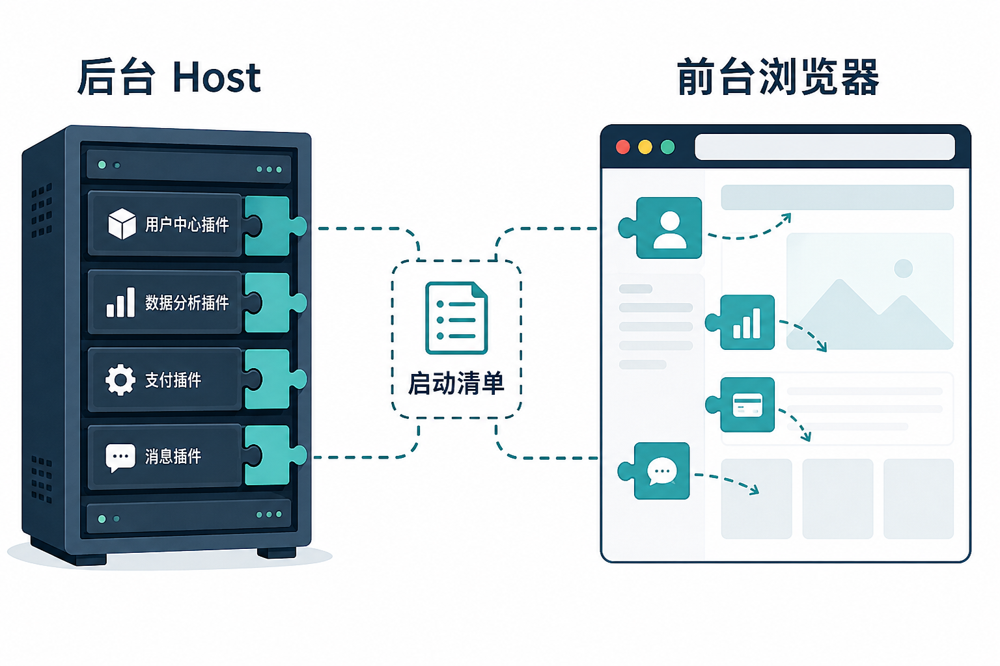
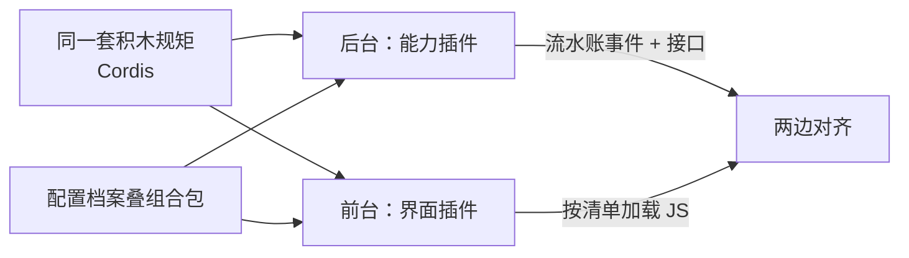
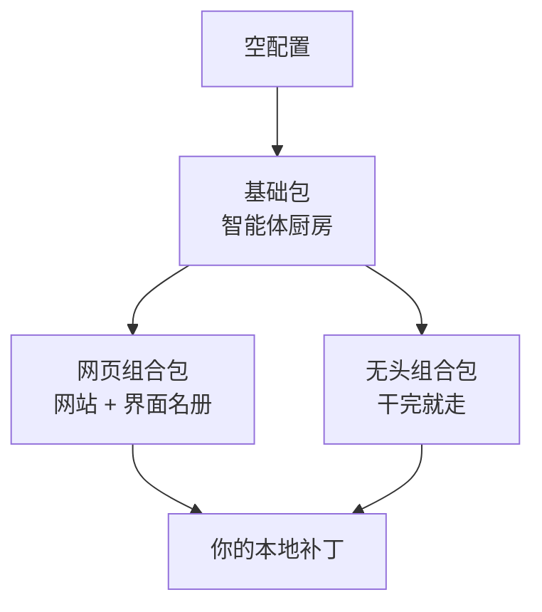
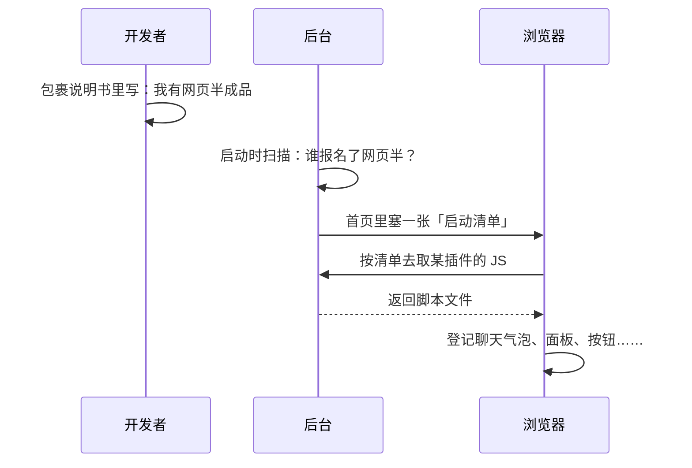
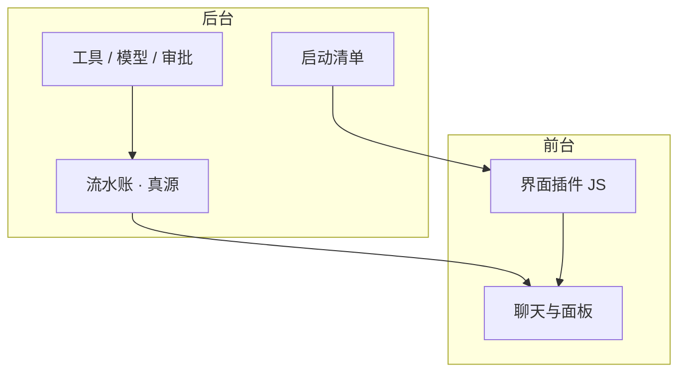

# 【拆解DeepSeek Harness】DeepSeek Harness 是怎么做到插件化的

> **调研报告 · 白话图文版**（2026-08-20）  
> 对象：[deepseek-ai/deepseek-harness](https://github.com/deepseek-ai/deepseek-harness)  
> 专业技术版：[DSH插件化专业技术报告](./DSH插件化专业技术报告.md)
> 想看更多技术入口：见文末「还想深挖」；机制借鉴总表见 [dsh-analysis-report.md](./DSH可借鉴性分析报告.md)

---

## 开篇：我们在调研什么？

很多人听到「插件化」，会想到：

- Chrome 扩展商店  
- VS Code 装个主题  
- 网页里塞一个第三方小组件  

**DeepSeek Harness（下面简称 dsh）说的插件化，比这更大一号。**  
它不只是「页面上能插按钮」，而是：

> **智能体干活的整条流水线——记日志、拼提示词、调工具、接模型、画聊天界面——几乎每一块都能插拔、能替换、拔掉还能收拾干净。**

本报告用人话讲清两件事：

1. **后台**（真正跑智能体的那台「引擎」）怎么插件化？  
2. **前台**（浏览器里你看到的界面）怎么插件化？  
3. 这两边又是怎么对上号的？

---

## 一、先建立直觉：像装修，不像装 App



可以把它想成装修一栋房子：

| 角色 | 像什么 | 在 dsh 里 |
|---|---|---|
| **后台 Host** | 水电结构、开关回路、安防主机 | Node 进程：会话、工具、模型、审批…… |
| **前台浏览器** | 墙面、灯具、开关面板外观 | 网页：聊天区、工具展示、设置页…… |
| **插件** | 可换的模块（灯、门锁、温控） | 一个个小包，插上就工作，拔下就撤消 |
| **配置档案 Profile** | 装修方案图纸 | 决定这次启动装哪些包、什么顺序 |
| **启动清单** | 房间门口贴的「本层有哪些灯具说明」 | 后台告诉浏览器：该去下载哪些界面插件 |

**关键认知：**  
网页漂亮不漂亮，是前台插件的事；  
智能体聪不聪明、记不记得住、敢不敢跑命令，是后台插件的事。  
两边用同一套「积木规矩」，但跑在两个地方。

---

## 二、调研结论（先看结论再看展开）



1. **不是两套框架**，是一套规矩（Cordis）在「引擎」和「浏览器」上各落地一次。  
2. **后台插件** = 往共享「工具箱」里放服务、挂监听、登记工具；拔掉时自动拆线。  
3. **前台插件** = 先在包裹说明里报名「我有浏览器半成品」→ 后台汇总成清单 → 浏览器按需下载脚本。  
4. **网页版 / 无界面版**，只是装修方案不同（多不多装「网页那一层」），底层厨房可以是同一套。  
5. 对 WorkPanel 这类平台：**值得学的是思路（清单、可拆、事件驱动界面），不值得整栋搬迁。**

---

## 三、后台是怎么插件化的？（引擎侧）

### 3.1 规矩只有几条（记住比喻即可）

官方底层叫 **Cordis**。用人话就是：

| 规矩 | 人话 |
|---|---|
| 插件是一个「会干活的模块」 | 插上开始干活，拔下必须收尾 |
| 大家共用一个「前台柜」`ctx` | 找「工具柜」「模型柜」，不找某个具体文件名 |
| 先声明「我依赖谁」 | 电闸没装好，灯不会先亮——靠依赖排队，不靠手写启动脚本 |
| 用「广播 / 接力」通信 | 有人只旁听；有人可以改请求再往下传；也可以直接喊停 |
| 登记都能反悔 | 加过的提示词、工具、监听器，卸载时撤掉 |

> 所以它敢说「Everything is a Plugin」：  
> **没有一块神圣到只能打补丁的主板，只有并排插上去的模块。**

### 3.2 启动时怎么「装修」？

每次你运行 `dsh`，其实是在按图纸叠材料：

```text
空房子
  → 先铺「基础包」dsh-base（模型、工具、存档、安全策略……）
  → 若是网页版，再叠 dsh-web-app（网站、界面插件名册、热更新……）
  → 若是无头脚本版，叠另一套脸（不装网站）
  → 最后盖上你自己的小修改（本地补丁）
```



**人话：**  
同一间厨房，可以做成「带餐厅的店」或「只接外卖单的后厨」——换的是组合方案，不是换锅灶品牌。

### 3.3 一个后台插件通常干什么？

插上之后，常见就这几类活：

1. **贡献一种能力**：比如「我负责压缩超长对话」  
2. **接到已有插座上**：比如「我是 DeepSeek 官方模型的插头」  
3. **登记工具说明书**：让模型知道能调用哪些工具  
4. **在关键路口拦一拦**：比如工具执行前问人批不批准  
5. **往流水账里多记几种事件**：方便以后回放、画界面  

### 3.4 网站在后台眼里是什么？

有意思的一点：**负责开网站的那一层，故意做得「很傻」。**

- 它只提供：注册网址、改首页 HTML、以及「剩下的都交给网页应用」。  
- **真正的接口、插件脚本地址、热更新推送**，都是别的插件挂上去的。  

**比喻：**  
物业只给楼道配电箱和门牌规则；  
每家店自己申请「几楼几号、卖什么」。  

这样前台插件化才有地方「挂招牌」——见下一章。

### 3.5 更猛的一档（知道即可）

dsh 还允许在对话过程中，**由智能体按规矩临时定义插件**（带版本、可查、可卸）。  
这是插件化的「天花板」：不只有人预装，运行中也能长模块。  
日常理解到「能动态装卸」就够；细节留给源码读者。

---

## 四、前台是怎么插件化的？（浏览器侧）

### 4.1 核心套路：先报名，再发清单，再下载

前台插件不是浏览器自己随便 `import` 一堆未知脚本，而是：



三步记牢：

| 步骤 | 人话 |
|---|---|
| **报名** | 包裹说明里声明「我有浏览器这一半」 |
| **发清单** | 后台汇总成一张启动图，塞进网页（官方名叫启动 boot 图） |
| **按需取货** | 浏览器打开 `/plugins/某某/client.js` 这类地址下载；着急的先拉，不急的用到再拉 |

**没有有效清单，页面会直接拒绝启动**——宁可大声失败，也不「半残着跑」。

### 4.2 热更新（开发时才有）

改界面插件代码时：

- 后台盯着文件变了没有  
- 变了就换「版本号」并通知浏览器  
- 生产环境这套监视默认不装，避免多余负担  

### 4.3 界面插件具体长什么样？（聊天为例）

扩展聊天区，官方推荐路径也很好懂：

1. **后台先把事情记进流水账**（带稳定编号，能重放）  
2. **前台插件认领这类流水账**，拼成一块「聊天节点」画出来  
3. **不要靠「最新那条没做完的」这种猜**——重开页面也要画得一样  

**比喻：**  
后台是法院存档；前台是按案号贴公告栏。  
公告栏插件可以换皮肤，但案号体系是后台定的。

---

## 五、前后台怎么对上号？

| 通道 | 一句话 |
|---|---|
| **流水账（会话事件）** | 发生了什么，以后端为准；界面只是放映机 |
| **启动清单 + 插件脚本地址** | 界面代码怎么装，由后端汇总发放 |
| **网页接口** | 点按钮、切工作区、改设置，走控制接口 |
| **开发热更新** | 改代码时推一把「请刷新这块」 |



**设计哲学（调研原话压缩）：**  
后台拥有事实和能力；前台拥有怎么呈现；  
两边用「清单 + 事件 + 接口」对齐，而不是共用一个乱改的大全局变量。

---

## 六、和常见「插件」对比（方便对外讲）

| | **dsh** | **普通网页插件** | **VS Code 扩展** |
|---|---|---|---|
| 后台有没有对称插件体系 | 有，而且是主角 | 常常没有 | 有 Extension Host |
| 界面怎么发现插件 | 后端发启动清单 | 自己写死或动态 import | 贡献点声明 |
| 界面跟什么对齐 | 可回放的流水账 | 接口返回的状态 | 编辑器模型 |
| 拔掉干净吗 | 强调可逆撤消 | 看作者修养 | 框架有卸载 |

---

## 七、对 WorkPanel / 我们自己的启发（可落地）

值得抄的是**作业方法**，不是整仓 Cordis：

| 优先级 | 启发 | 别做的事 |
|---|---|---|
| 高 | **扩展清单由编排侧汇总**，前后端别各维护一份 | 别在 1.8G 机上嵌整棵 dsh |
| 高 | **界面跟可回放事件走**（Experience / Logs） | 别只靠临时 DOM 状态讲故事 |
| 中 | **装卸可逆**：关掉能力要能撤监听/路由 | 别只支持「越加越多」 |
| 低 | 无头模式的稳定「干完打印结果」契约 | 别把 `dsh web` 当生产常驻成员 |

---

## 八、风险与调研边界

- dsh 仍是**开发者预览**，名单字段、启动方式以后可能改。  
- 双端插件 + 双套构建，**学习和运维成本不低**。  
- 本报告依据官方架构/子系统文档与 cookbook，**未在本机完整实操**网页热更新。  
- 配图为示意，帮助建立直觉，不是源码级拓扑。

---

## 九、收束：三句话带走

1. **dsh 的插件化 = 引擎积木 + 界面积木，同一套规矩。**  
2. **后台管能力与流水账；前台按「报名 → 清单 → 下载」装皮肤。**  
3. **对我们：学清单、学可拆、学事件驱动界面；别整栋楼搬进生产机。**

---

## 还想深挖？

| 主题 | 上游入口（关键词） |
|---|---|
| 积木规矩 | Cordis 入门 / primer |
| 后台组装 | Profile、Bundle、`dsh-base` / `dsh-web-app` |
| 前台装载 | client-modules、`dsh.client`、启动 boot 图 |
| 聊天节点 | cookbook：adding-a-conversation-node |
| 总览对比 | [拆解调查](./DSH反汇编调查.md) · [白话总览](./DSH白话图文版.md) |

## 附图

| 文件 | 说明 |
|---|---|
| [assets/dsh-plugin-host-client.png](../资源/dsh-plugin-host-client.png) | 后台 Host ↔ 前台浏览器 ↔ 启动清单 |
