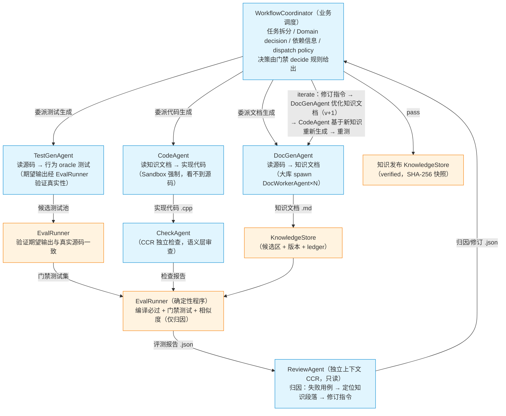
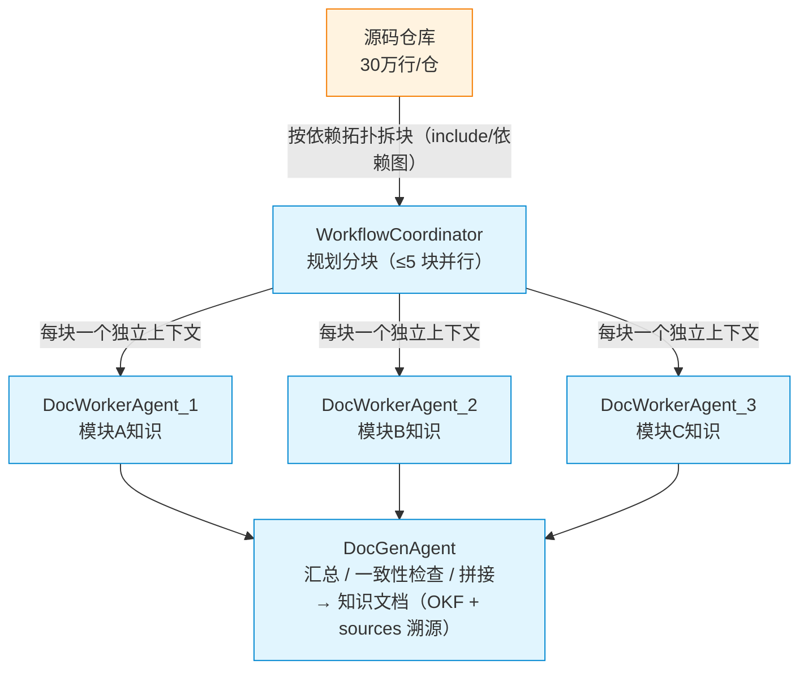
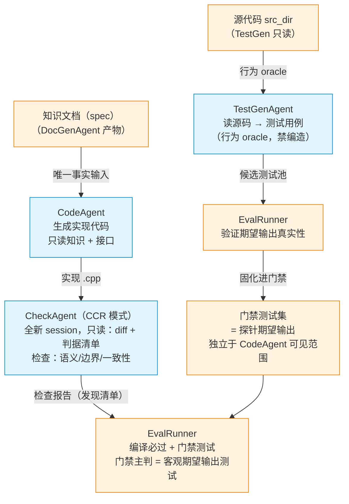
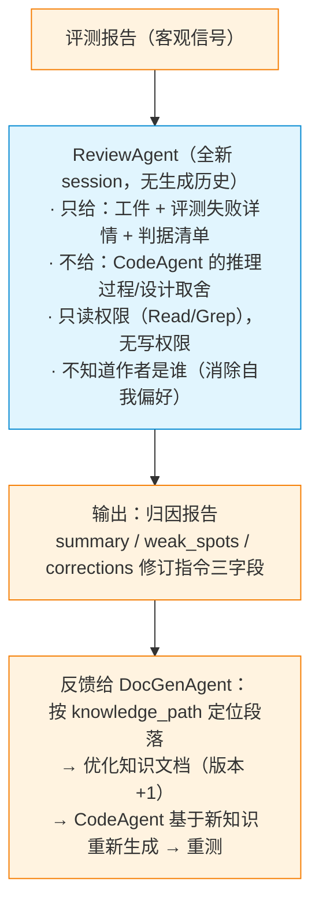

# 01 · 多 Agent 架构设计（业务架构）

> 日期：2026-08-26
> 定位：Knowledge Flywheel 的**业务架构**：Agent 角色、职责边界、信息隔离、产物契约、主循环。技术选型 WHY 见 [02-技术选型与架构决策.md](02-技术选型与架构决策.md)，Agent Platform 实现见 [03-Agent-Platform架构设计.md](03-Agent-Platform架构设计.md)。
> 技术栈：TypeScript。论文依据仅采用 2025+。

---

## 1. 架构本质

```
主干流程 = deterministic engineering workflow + uncertain intelligent steps

Source → DocGen → Code → Eval → Review → Iterate
```

- 业务主流程由 **Workflow Runtime（Temporal）** 驱动：retry / resume / checkpoint / distributed scheduling / workflow history 全部交给 Temporal，业务层不重新实现。
- **LLM Agent 只是 Workflow 中的智能执行节点**：确定性编排在外，智能步骤在内。
- 本架构中没有"自己维护 retry / resume / checkpoint 的 OrchestratorAgent"；编排语义归 Temporal，业务调度语义归 Workflow Coordinator（见 §3）。

---

## 2. Agent 与组件清单

### 2.1 Agent（智能执行节点，共 7 类）

| # | Agent | 职责 | 输入 | 输出 | 类型 |
|---|---|---|---|---|---|
| 1 | **WorkflowCoordinator** | 业务任务拆分、Domain decision、依赖信息、Agent dispatch policy（retry/resume/checkpoint 由 Temporal 承担） | 用户需求、评测报告 | 任务计划、调度指令（pass/iterate/rollback/stopped 由门禁 decide 规则给出） | 核心（必选） |
| 2 | **DocGenAgent** | 知识文档生成（读源码→解释型知识），唯一执笔者；接收 ReviewAgent 修订指令优化知识文档 | 源码文件、模块清单、修订指令 | 知识文档（OKF 格式，sources 溯源） | 核心（必选） |
| 3 | **DocWorkerAgent** | 分块并行生成知识（每块独立上下文），DocGenAgent 的并行实例 | 模块子集、依赖图 | 分块知识片段（回传结构化摘要+溯源） | 可选（大库才开） |
| 4 | **TestGenAgent** | 读源代码→测试/冒烟用例（行为 oracle 提取，期望输出须经真实源码验证） | 源代码、接口头文件 | 测试用例集（候选测试池，经 EvalRunner 验证后进门禁） | 核心（必选） |
| 5 | **CodeAgent** | 知识文档+接口头文件→实现代码（物理隔离源码） | 知识文档（DocGenAgent 产物）、接口 | 实现代码文件 | 核心（必选） |
| 6 | **CheckAgent** | 独立检查（CCR 模式）：语义层审查代码/测试 | 代码 diff、判据清单 | 检查报告（发现清单，非打分） | 核心（必选） |
| 7 | **ReviewAgent** | 评测失败归因 + 修订指令（三字段），反馈给 DocGenAgent 优化知识文档 | 评测报告、知识文档 | 归因报告（weak_spots/corrections，→ DocGenAgent） | 核心（必选） |

> 命名约定：Agent 后缀统一 `Agent`。WorkflowCoordinator 是业务调度者（Domain 层），不是 workflow engine（那是 Temporal）。

### 2.2 非 Agent 组件（确定性程序）

| 组件 | 职责 |
|---|---|
| **EvalRunner** | 编译（g++ -Werror）+ 门禁测试 + 相似度（仅归因）；验证 TestGenAgent 期望输出真实性；门禁主判 |
| **Sandbox** | 路径白名单隔离（allowed_read_dirs=knowledge/interfaces/work；src_dir 硬禁止） |
| **Protection** | SHA-256 写保护（知识/评测集/接口不可被 Agent 篡改） |
| **KnowledgeStore** | 知识库落盘/版本/ledger（Artifact 层，不承担 execution 语义） |
| **Artifact Store** | 所有产物（知识 md/代码/测试/评测 json/归因 json）文件交接，可审计、可断点续跑 |

---

## 3. WorkflowCoordinator 职责边界

WorkflowCoordinator（Domain 层业务调度者）负责：
- 业务任务拆分（仓库 → 模块 → 文件）
- Domain decision（pass / iterate / rollback / stopped 的规则判定）
- Dependency information（模块依赖拓扑）
- Agent dispatch policy（派谁、并行度、上下文策略）

**不负责**（归 Temporal）：
- retry engine
- failure recovery
- checkpoint
- distributed scheduling
- workflow history

> 详见 [03-Agent-Platform架构设计.md](03-Agent-Platform架构设计.md) §AgentProvider 与 [02-技术选型与架构决策.md](02-技术选型与架构决策.md) §Temporal 边界。

---

## 4. 总体工作流程



### 4.1 文档生成阶段（DocGenAgent 分块 + DocWorkerAgent 检索定位）



检索定位（迭代修订时，不重读全文）：修订指令 → 按 knowledge_path 定位段落 → 只取命中段落给 DocGenAgent。每个 DocWorkerAgent 独立上下文 = 防上下文超长的核心手段（Anthropic 实证：subagent 本质是压缩器）。

### 4.2 代码生成阶段（TestGenAgent / CodeAgent / CheckAgent）



### 4.3 Review 阶段（CCR，反馈给 DocGenAgent）



可选增强（P1，关键模块才开）：跨模型家族二查（GLM + DeepSeek）；对抗式（PrimaryReviewer + Challenger + Arbiter）。实证（CCR，2026）：F1 28.6% vs 同会话自审 24.6%；重复审无增益。

---

## 5. 信息隔离（防作弊红线）

| 隔离 | 规则 | 机制 |
|---|---|---|
| **CodeAgent 不能看到源码** | CodeAgent 只读知识文档 + 接口头文件 | Sandbox 物理隔离 src_dir |
| **TestGen / Eval 信息边界** | 门禁测试集对 CodeAgent 不可见 | 测试集独立、写保护、评测隔离 |
| **TestGenAgent 期望输出真实性** | 禁止 LLM 编造期望输出 | EvalRunner 跑真实源码验证，不一致丢弃/修正 |
| **ReviewAgent 上下文隔离** | 不给 CodeAgent 推理历史 | CCR：全新 session + 只读 + 判据清单 |
| **写保护** | 知识/评测集/接口不可篡改 | Protection SHA-256 快照 + 校验 |

盲区消除原理：TestGenAgent 读源码（行为 oracle），CodeAgent 读知识文档（事实输入），两者不共享同一份文档的理解盲区。知识文档若有错，测试（真实行为）必失败 → 触发迭代（ReviewAgent → DocGenAgent 修知识 → CodeAgent 重生成）。

---

## 6. 产物契约（Artifact Contract）

所有产物为文件交接（可审计、可断点续跑），核心类型：

```typescript
interface KnowledgeDoc {
  module: string;
  version: number;
  content: string;          // OKF Markdown
  sources: SourceRef[];     // 溯源锚点（file + symbol + commit）
  status: "draft" | "verified" | "rejected";
  sha256: string;
}
interface SourceRef { file: string; symbol: string; commit: string; }
interface TestCase { id: string; description: string; expected: string; }
interface CodeArtifact { path: string; language: "c" | "cpp"; }
interface EvalReport {
  compileOk: boolean;
  passed: number;
  total: number;
  confidence: number;
  repetitions: { mean: number; variance: number; unstable: boolean };
  similarity: number;       // 仅归因，不进门禁
  failures: string[];
  reasonCodes: string[];
}
interface Correction {
  id: string;               // 修订指令 ID
  knowledgePath: string;    // 知识段落路径
  criterion: string;        // 可执行验证判据
}
interface AttributionReport {
  summary: string;
  weakSpots: string[];
  corrections: Correction[];
}
```

> Agent 执行接口（AgentProvider / AgentRun / AgentSession / ContextPolicy / ResourceClaim / Capability）见 [03-Agent-Platform架构设计.md](03-Agent-Platform架构设计.md)。`interface Agent<I,O> { run(input): Promise<O> }` 已废弃（太薄），长期核心接口是 AgentProvider。

---

## 7. 知识飞轮主循环（Domain 层）

1. **DocGenAgent**：源码 → 知识文档（OKF + sources 溯源），大库分块 DocWorkerAgent×N 并行
2. **TestGenAgent**：源码 → 行为 oracle 测试（EvalRunner 验证期望输出后固化进门禁）
3. **CodeAgent**：知识文档 + 接口 → 实现代码（Sandbox 隔离源码）
4. **CheckAgent**：CCR 语义层独立检查（发现清单）
5. **EvalRunner**：编译必过 + 门禁测试（重复 5 次均值±方差防随机）；主判 = 客观期望输出
6. **ReviewAgent**：归因（失败用例 → 定位知识段落）+ 修订指令三字段 → **反馈给 DocGenAgent 优化知识文档（版本 +1）**
7. **WorkflowCoordinator**：门禁 decide 规则 → pass（发布 verified 快照）/ iterate（重跑 2-6）/ rollback / stopped

迭代收敛判据：confidence = passed/total ≥ 0.8 pass；< 0.8 iterate；倒退 rollback；UNSTABLE（方差 > 0.02）走迭代。

---

## 8. 与 MVP 现状对照

| 环节 | 目标架构 | mvp-flywheel 现状 | 差距 |
|---|---|---|---|
| 业务调度 | WorkflowCoordinator | 确定性编排层（代码） | 命名对齐；retry/resume 迁 Temporal |
| 文档生成 | DocGenAgent + DocWorkerAgent | 单知识生成 agent（chunk 雏形） | 需补 DocWorkerAgent 并行 |
| 测试生成 | TestGenAgent（读源码 → oracle） | 无（评测集直接来自探针） | 需新增；输入=源代码 |
| 代码生成 | CodeAgent | 单 Coder agent | 命名对齐 |
| 独立检查 | CheckAgent（CCR） | 无独立检查 agent，靠 Review | 需新增 |
| 归因修订 | ReviewAgent → DocGenAgent | Review 独立 session | 命名对齐；反馈对象=知识文档 |
| 门禁 | EvalRunner 主判 | 探针期望输出主判 | 一致 |
| Workflow | Temporal | Python 自研状态机 | **迁移到 Temporal** |
| 语言 | TypeScript | Python | 全量迁移（用户定） |
