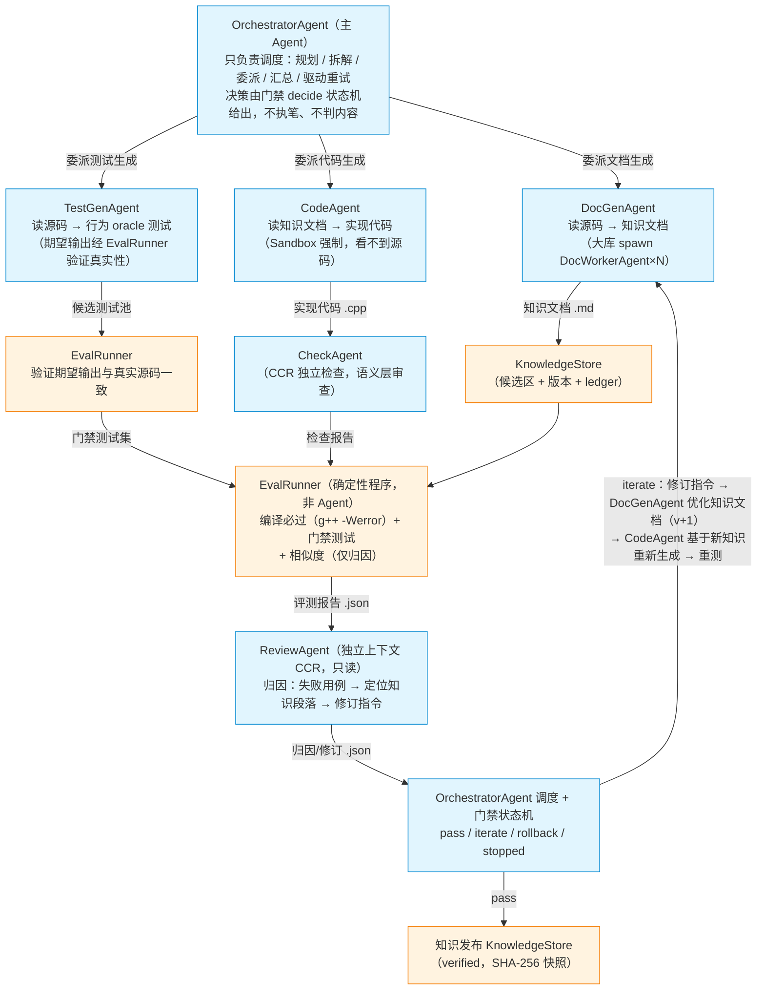
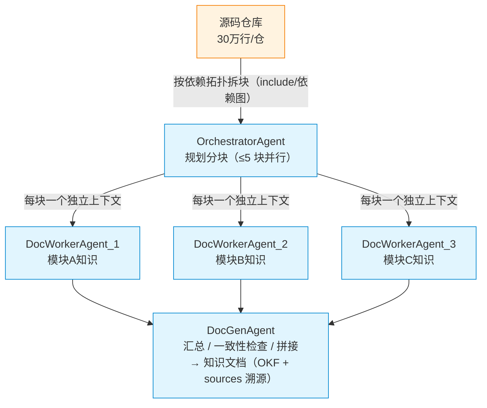
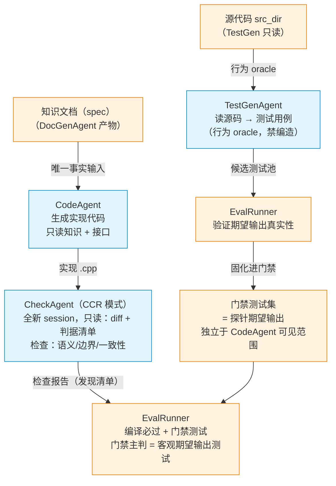
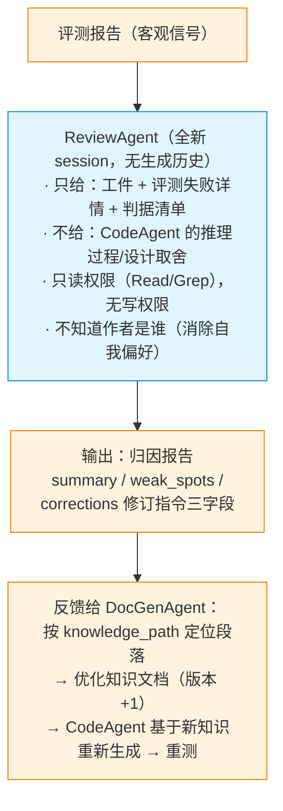
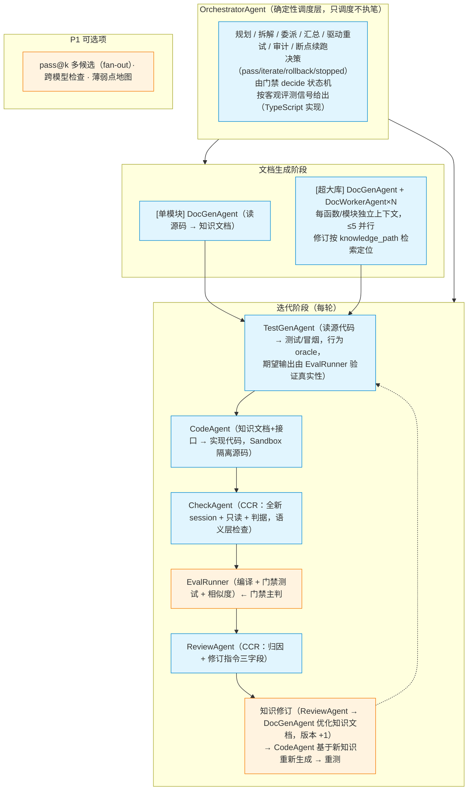

# 知识飞轮目标 Agent 架构（定稿：Agent 清单 + 工作流程）

> 日期：2026-08-26
> 定位：本文是知识飞轮项目多 Agent 架构的**最终定义**：Agent 数量、命名（统一 `xxxAgent`）、职责边界、工作流程，以及每个环节的设计依据（引用论文/技术选型）。技术栈统一 **TypeScript**。论文依据仅采用 2025 年及以后的研究。
> 相关：[02-编排模式调研.md](02-编排模式调研.md)、[03-开源编排框架.md](03-开源编排框架.md)、[04-开源仓库案例.md](04-开源仓库案例.md)、[README.md](README.md)

---

## 4.5.0 Agent 清单（共 7 类，3 类可选实例）

| # | Agent | 职责 | 输入 | 输出 | 类型 |
|---|---|---|---|---|---|
| 1 | **OrchestratorAgent** | **只负责调度**：规划任务/拆解模块/委派 subagent/汇总/驱动重试（决策归门禁规则，不执笔、不判断内容） | 用户需求、评测报告 | 任务计划、调度指令（pass/iterate/rollback/stopped 由门禁 decide 状态机给出） | 核心（必选） |
| 2 | **DocGenAgent** | 知识文档生成（读源码→解释型知识），唯一执笔者；接收 ReviewAgent 修订指令优化知识文档 | 源码文件、模块清单、修订指令 | 知识文档（OKF 格式，sources 溯源） | 核心（必选） |
| 3 | **DocWorkerAgent** | 分块并行生成知识（每块独立上下文），DocGenAgent 的并行实例 | 模块子集、依赖图 | 分块知识片段（回传结构化摘要+溯源） | 可选（大库才开） |
| 4 | **TestGenAgent** | **读源代码→测试/冒烟用例**（行为 oracle 提取，期望输出须经真实源码验证） | **源代码、接口头文件** | 测试用例集（候选测试池，经 EvalRunner 验证后进门禁） | 核心（必选） |
| 5 | **CodeAgent** | 知识文档+接口头文件→实现代码（物理隔离源码） | **知识文档（DocGenAgent 产物）**、接口 | 实现代码文件 | 核心（必选） |
| 6 | **CheckAgent** | 独立检查（CCR 模式）：语义层审查代码/测试 | 代码 diff、判据清单 | 检查报告（发现清单，非打分） | 核心（必选） |
| 7 | **ReviewAgent** | 评测失败归因 + 修订指令（readlist 三字段），**反馈给 DocGenAgent 优化知识文档** | 评测报告、知识文档 | 归因报告（weak_spots/corrections，→ DocGenAgent） | 核心（必选） |

> 非 Agent 组件（确定性程序，不算 Agent）：**EvalRunner**（编译+探针测试+相似度，门禁主判；负责验证 TestGenAgent 产出的期望输出真实性）、**Sandbox**（路径白名单隔离）、**Protection**（SHA-256 写保护）、**KnowledgeStore**（知识库落盘/版本/ledger）。

## 4.5.1 总体工作流程（mermaid 流程图）



分工边界（硬规则）：
- 谁生成谁可改，谁评测谁不改（生成与验证分离）
- DocGenAgent 产出的知识文档是 CodeAgent 的唯一事实输入（Sandbox 强制，CodeAgent 物理看不到源码）
- TestGenAgent 读源码提取行为 oracle（独立链路，不读知识文档）；期望输出必须经真实源码验证，禁止 LLM 编造
- CodeAgent 读知识文档生成实现（独立链路，不读源码）；与 TestGenAgent 各自独立、互不依赖
- ReviewAgent 评审结果反馈给 DocGenAgent 优化知识文档（不改代码；代码由新知识文档驱动重生成）
- OrchestratorAgent 只调度不执笔，决策归门禁规则
- 全部产物文件交接，可审计、可断点续跑

### 设计依据：OrchestratorAgent（主 Agent，只负责调度）

**为什么这么设计**：主 Agent **只负责调度**（规划、拆解、委派、汇总、驱动重试），不执笔、不判断内容质量。决策（pass/iterate/rollback/stopped）由门禁 decide 状态机按规则给出（客观评测信号驱动），避免 LLM 主 Agent 的主观判断污染流程。两种实现路径：LLM orchestrator（动态规划，灵活）或确定性编排层（代码状态机，可控）。我们的判断是"外层确定性 + 内层 agent 自治"。

**参考论文/工作（2025+）**：
- Anthropic《Multi-Agent Research System》（2025.06）：orchestrator-worker 实证，多 agent 比单 agent 提升 90.2%，但 token 消耗 ≈ 15 倍；subagent 滥用教训（50 个 → 成本爆炸）→ https://www.anthropic.com/engineering/multi-agent-research-system
- 自进化代码 Agent 综述（arXiv:2608.03392，2026.08）：Agent 框架/记忆/技能/模型/工作流五类进化对象的分类框架 → https://arxiv.org/abs/2608.03392
- Google ADK（2025-2026）：SequentialAgent/ParallelAgent/LoopAgent 等可组合工作流 agent 基元 → https://github.com/google/adk-python

**论文优缺点与借鉴点**：

| 来源 | 优点（值得借鉴） | 缺点（需要规避） | 我们的取舍 |
|---|---|---|---|
| Anthropic Research System | 查询分解、并行 subagent、结果综合的完整模式 | 早期教训：简单查询 spawn 50 个 subagent 成本爆炸；限制并行数（约 5 个）+ token 预算 | OrchestratorAgent 委派必须设并行上限与预算闸门 |
| 自进化综述 | 软件特有证据分类（结果/环境/轨迹） | 综述性质，无实现细节 | OrchestratorAgent 调度只用客观证据，决策归门禁规则，不依赖自我感觉 |
| Google ADK | 工作流 agent 基元（Sequential/Parallel/Loop） | 绑定 Google Cloud | 借鉴基元思想，用 TypeScript 自研实现 |

**结论**：OrchestratorAgent = 确定性调度层（规划/委派/汇总/重试），控制并行度（≤5）、设 token 预算；**决策（pass/iterate/rollback/stopped）由门禁 decide 状态机按规则给出，主 Agent 不参与内容判断**。

---

## 4.5.2 文档生成阶段（DocGenAgent 分块 + DocWorkerAgent 检索定位）



检索定位（迭代修订时，不重读全文）：
修订指令 → 按 knowledge_path 定位段落 → 只取命中段落给 DocGenAgent
每个 DocWorkerAgent 独立上下文 = 防上下文超长的核心手段
（Anthropic 实证：subagent 本质是压缩器，各自窗口并行探索后压缩回传）

### 设计依据：DocGenAgent + DocWorkerAgent（文档生成分块 + 检索定位）

**为什么这么设计**：30 万行/仓、总量上亿行的源码不可能一次塞进上下文。两个手段：① 生成阶段按依赖拓扑分块，每块一个独立 DocWorkerAgent 上下文；② 修订阶段按 knowledge_path 检索定位，只取命中段落，不重读全文。

**参考论文/工作（2025+）**：
- DocAgent（Facebook，arXiv:2504.08725，2025.04）：拓扑代码处理 + 增量上下文构建 + 验证-重写闭环 → https://arxiv.org/abs/2504.08725
- Anthropic Research System（2025.06）：subagent 本质是"上下文压缩器"，各自窗口并行探索后压缩回传 → https://www.anthropic.com/engineering/multi-agent-research-system
- 上下文工程（Context Engineering，Anthropic 2025.09）：chunk 级检索 > 整文档注入 → https://www.anthropic.com/engineering/effective-context-engineering-for-ai-agents

**论文优缺点与借鉴点**：

| 来源 | 优点（值得借鉴） | 缺点（需要规避） | 我们的取舍 |
|---|---|---|---|
| DocAgent | 拓扑排序天然适配 C/C++ include 依赖；增量上下文防爆炸；Verifier 保证 truthfulness | 5 角色偏多，编排有学习成本 | 采用拓扑排序 + 增量上下文；角色合并（Reader/Searcher→DocWorkerAgent，Writer→DocGenAgent 拼接，Verifier→EvalRunner/ReviewAgent） |
| Anthropic 压缩器思想 | DocWorkerAgent 独立上下文 = 防超长的核心手段 | 汇总环节信息有损 | 每块 DocWorkerAgent 只回传结构化摘要 + 溯源锚点 |
| 上下文工程 | chunk 级检索 > 整文档注入 | 检索质量依赖索引 | 修订时按 knowledge_path 精准定位，不重读全文 |

**结论**：分块粒度按"函数/模块级"（沿用现有 chunk 雏形），DocWorkerAgent 并行上限 5；修订时按修订指令的 knowledge_path 精准定位。

---

## 4.5.3 代码生成阶段（TestGenAgent + CodeAgent + CheckAgent 三 Agent）



注（盲区消除）：TestGenAgent 读的是源代码（行为 oracle），CodeAgent
读的是知识文档（事实输入），两者不共享同一份文档的理解盲区：
- TestGenAgent 期望输出 = 真实源码行为 → 由 EvalRunner 跑真实源码验证，禁 LLM 编造
- CodeAgent 只能看知识文档 → 知识文档若有错，测试（真实行为）必失败 → 触发迭代
- CheckAgent 独立检查 = 语义层补充（测试覆盖不到的：命名/边界/设计）

### 设计依据：TestGenAgent（源代码 → 测试生成，行为 oracle）

**为什么这么设计**：**TestGenAgent 读源代码**（而非知识文档）提取行为 oracle。这样测试基准 = 真实源码行为，与 CodeAgent 的知识文档理解解耦，天然消除"测试与代码共享文档盲区"的问题。期望输出必须经 EvalRunner 跑真实源码验证，禁止 LLM 编造（同探针纪律）。测试定位从"冒烟/需求澄清"升级为**门禁主判的可验证 oracle**。

**参考论文/工作（2025+）**：
- MASTOR（arXiv:2606.10465，2026.06）：多 agent 从源码提取约束生成测试 oracle，提升 mutation score（与本设计最直接对应）→ https://arxiv.org/abs/2606.10465
- TDD-Agent（arXiv:2608.16742，2026.08）：test-first reasoning，LiveCodeBench 上持续优于纯推理基线（GPT 70.04 vs 68.48）；dual-track 代码+测试共精化 → https://arxiv.org/abs/2608.16742
- Spec-Driven Test Gen（Google，arXiv:2608.17177，2026.08）：先显式文档化前置/后置条件再生成测试，bug 检出 +9.8pp（p=0.0352）→ https://arxiv.org/abs/2608.17177
- 2.wiki 研究笔记：TDD-Agent、Spec-Driven Test Gen、覆盖率引导测试生成、变异测试与测试集质量

**论文优缺点与借鉴点**：

| 来源 | 优点（值得借鉴） | 缺点（需要规避） | 我们的取舍 |
|---|---|---|---|
| MASTOR | 从源码/契约提取 oracle 是正解；多 agent 协作提取约束 | 面向 REST API 场景，需改造 | 直接采用"从源码提取行为 oracle"；改造为 C/C++ 头文件+实现输入 |
| TDD-Agent | test-first 是推理框架而非流程摆设；测试是"演化的推理工件" | 单 agent 双轨（测试+代码同一个 agent 写），盲区不消除 | 借鉴 test-first 推理价值；**拆成独立 TestGenAgent**，且读源码不读知识文档 |
| Spec-Driven Test Gen | 显式文档化 pre/post-condition 提升测试质量 9.8pp | 只解决测试生成，不解决代码生成 | 要求 TestGenAgent 先输出"前置/后置条件理解"再写用例（认知脚手架） |

**关键约束（防作弊与防编造）**：
- TestGenAgent 期望输出 = 真实源码行为 → **必须由 EvalRunner 跑真实源码验证**，与真实源码不一致的用例丢弃/修正，禁止 LLM 编造期望输出
- TestGenAgent 生成测试在 Sandbox 内完成，测试集对 CodeAgent 不可见（评测独立）
- 门禁主判 = 经验证的期望输出测试（客观）；CheckAgent 语义检查为补充

---

### 设计依据：CodeAgent（知识文档 → 代码生成）

**为什么这么设计**：代码生成是"开放任务"（目标明确但实现路径未知），由独立 CodeAgent **从 DocGenAgent 产出的知识文档** + 接口头文件生成实现；物理隔离源码（Sandbox），防止抄源码作弊。**知识文档是 CodeAgent 的唯一事实输入**：知识文档若有错，测试（真实行为 oracle）必失败，触发迭代（ReviewAgent → DocGenAgent 修知识 → CodeAgent 重生成）。

**参考论文/工作（2025+）**：
- SDAD（arXiv:2608.20341，2026.05）：spec-driven agentic development，合成权与发布权分离 → https://arxiv.org/abs/2608.20341
- spec-kit（GitHub，2025+）：规格驱动开发的工业实践 → https://github.com/github/spec-kit
- Spec-Driven Test Gen（Google，arXiv:2608.17177，2026.08）：规格契约是"认知脚手架" → https://arxiv.org/abs/2608.17177
- Claude Agent SDK / Codex CLI（2025-2026，开源）：在真实仓库里做代码生成/评审/测试的终端 agent 执行层 → https://github.com/anthropics/claude-agent-sdk-python ｜ https://github.com/openai/codex

**论文优缺点与借鉴点**：

| 来源 | 优点（值得借鉴） | 缺点（需要规避） | 我们的取舍 |
|---|---|---|---|
| SDAD | 合成与发布权分离；显式门禁 + 可审计溯源 | 报告性质，无开源实现细节 | 直接采用"谁生成谁可改，谁评测谁不改"原则（已落地） |
| spec-kit | 工业界规格驱动规模化验证 | 面向新项目，非存量仓库 | 借鉴"知识文档是唯一事实源"思想 |
| Spec-Driven Test Gen | 规格契约提升测试质量 | 面向测试生成，非代码生成 | CodeAgent 输入=知识文档+接口，输出实现 |
| Claude Agent SDK/Codex | 上下文隔离执行层，超大型仓库刚需 | 绑定特定模型/计费 | 作为 CodeAgent 的 LLM 后端接入（公司 GLM 5.1 经 codeagent CLI） |

**结论**：CodeAgent 只读知识+接口（Sandbox 强制），输出实现；不直接评测、不自我验证（生成与验证分离）；知识文档错误通过测试失败暴露，由 ReviewAgent → DocGenAgent 修复。

---

### 设计依据：CheckAgent（独立检查，CCR 模式）

**为什么这么设计**：测试覆盖不到语义层（命名、边界设计、与知识文档的一致性、隐藏缺陷）。需要一个"不知道作者是谁"的独立审查者，用全新 session + 只读 + 判据清单做检查。

**参考论文/工作（2025+）**：
- Cross-Context Review（arXiv:2603.12123，2026.03）：跨上下文独立审查 F1 28.6% vs 同会话自审 24.6%；**同会话重复审两次无增益（p=0.11）** → https://arxiv.org/abs/2603.12123
- Adversarial Code Review（Augment Code，2026-07）：maker-checker 五维分离（上下文/prompt/模型/工具/输出） → https://www.augmentcode.com/blog/adversarial-code-review
- LLM-as-Judge 研究（CodeJudgeBench arXiv:2507.10535，2025.07）：位置偏差 14%、自我偏好 → https://arxiv.org/abs/2507.10535
- 2.wiki 研究笔记：CodeJudgeBench-LLM裁判可靠性

**论文优缺点与借鉴点**：

| 来源 | 优点（值得借鉴） | 缺点（需要规避） | 我们的取舍 |
|---|---|---|---|
| CCR | 方法极简（新 session 而已），收益显著，任意模型可用 | F1 绝对值仍不高（28.6%），不能替代客观测试 | 直接采用：CheckAgent 全新 session + 只给 diff+判据 |
| Adversarial Review | 五维分离清单可操作；跨模型家族补盲区（libfuse 案例） | SWR-Bench 警告：架构本身不保证更强，prompt 决定效果 | 工具只读（Read/Grep）；跨模型二查留 P1 |
| LLM-as-Judge 研究 | 提示词设计要规避位置/详尽度偏差 | LLM 打分不可靠 | CheckAgent 输出"发现清单"而非"打分"；不进通过/失败判定 |

**结论**：CheckAgent 是"语义层补充检查"，输出结构化发现；门禁判定仍由客观测试决定。

---

## 4.5.4 Review 阶段（ReviewAgent 独立上下文 CCR，反馈给 DocGenAgent）



可选增强（P1，关键模块才开）：
- 跨模型家族二查（GLM + DeepSeek 同查，补同族盲区）
- 对抗式（PrimaryReviewer + Challenger + Arbiter）
实证（CCR，2026）：F1 28.6% vs 同会话自审 24.6%；同会话重复审两次无增益

### 设计依据：ReviewAgent（归因 + 修订指令，反馈给 DocGenAgent）

**为什么这么设计**：评测失败后需要定位"知识文档哪段写错了"，产出修订指令（readlist 三字段：ID + 段落路径 + 可执行判据），**反馈给 DocGenAgent 优化知识文档**（版本 +1），再由 CodeAgent 基于新知识重新生成代码。评审对象是知识文档而非代码本身（代码是知识的下游产物，改代码是治标，修知识是治本）。ReviewAgent 独立上下文（CCR），只读，不知道生成者。

**参考论文/工作（2025+）**：
- CCR（arXiv:2603.12123，2026.03）：上下文分离是核心 → https://arxiv.org/abs/2603.12123
- 自进化代码 Agent 综述（arXiv:2608.03392，2026.08）：软件特有证据分类（结果/环境/轨迹），反馈证据组合 → https://arxiv.org/abs/2608.03392
- SDAD（arXiv:2608.20341，2026.05）：修订指令需可执行判据，纯 NL 建议不能驱动合并 → https://arxiv.org/abs/2608.20341
- 2.wiki 研究笔记：反馈优先于流程拓扑（Feedback Over Form，2025 版）

**论文优缺点与借鉴点**：

| 来源 | 优点（值得借鉴） | 缺点（需要规避） | 我们的取舍 |
|---|---|---|---|
| 自进化综述 | 反馈证据分类（结果/环境/轨迹） | 综述性质，无实现细节 | ReviewAgent 输入 = 客观评测报告（结果证据），不掺主观 |
| SDAD | 修订需可执行判据 | 报告性质 | 修订指令三字段（ID+段落路径+可执行判据），纯 NL 不能驱动合并 |
| Feedback Over Form | 反馈质量优先于流程拓扑 | 无具体实现 | 反馈 = 结构化信号（失败用例/diff/通过率）+ NL 解读两层 |
| CCR | 上下文分离消除自我偏好 | F1 绝对值有限 | ReviewAgent 不给 CodeAgent 推理历史 |

**结论**：ReviewAgent 只读评测报告 + 工件，输出结构化归因（summary/weak_spots/corrections）；修订指令必须含可执行判据；**corrections 反馈给 DocGenAgent 优化知识文档，代码由新知识文档驱动重生成（不直接改代码）**。

---

## 4.5.5 Agent 接口定义（TypeScript）

```typescript
// 知识飞轮目标架构 · Agent 接口（TypeScript）
// 约定：所有 Agent 命名后缀统一为 Agent；产物全部文件交接（可审计/断点续跑）

/** 统一 Agent 基类：输入 → 输出（产物落盘路径） */
interface Agent<I, O> {
  readonly name: string;
  run(input: I): Promise<O>;
}

// ---------- 产物类型（文件交接的契约） ----------
interface KnowledgeDoc {
  module: string;
  version: number;
  content: string;          // OKF Markdown
  sources: SourceRef[];     // 溯源锚点（file + symbol + commit）
  status: "draft" | "verified" | "rejected";
  sha256: string;
}

interface SourceRef {
  file: string;
  symbol: string;
  commit: string;
}

interface TestCase { id: string; description: string; expected: string; }
interface CodeArtifact { path: string; language: "c" | "cpp"; }

interface EvalReport {
  compileOk: boolean;
  passed: number;
  total: number;
  confidence: number;       // passed / total
  repetitions: { mean: number; variance: number; unstable: boolean };
  similarity: number;       // 仅归因，不进门禁
  failures: string[];
  reasonCodes: string[];
}

interface Correction {
  id: string;               // 修订指令 ID
  knowledgePath: string;    // 知识段落路径
  criterion: string;        // 可执行验证判据
}

interface AttributionReport {
  summary: string;
  weakSpots: string[];
  corrections: Correction[];
}

// ---------- Agent 接口（7 类） ----------
// OrchestratorAgent：只调度（规划/委派/汇总/驱动重试），决策由门禁 decide 状态机给出
interface OrchestratorAgent extends Agent<{
  request: string;
  moduleGraph: ModuleGraph;
  evalReport?: EvalReport;   // 每轮评测后传入，供调度决策
}, {
  plan: TaskPlan;
  dispatch: DispatchCommand; // 委派指令（谁→什么输入→期望产物）
  decision: "pass" | "iterate" | "rollback" | "stopped"; // 由门禁 decide 规则给出
}> {}

// DocGenAgent：知识文档生成（唯一执笔者）；接收 ReviewAgent 修订指令优化知识文档
interface DocGenAgent extends Agent<{
  module: string;
  srcFile: string;
  sources: SourceRef[];
  corrections?: Correction[];   // ReviewAgent 修订指令（迭代时传入）
}, KnowledgeDoc> {}

interface DocWorkerAgent extends Agent<{
  moduleSubset: string[];
  depGraph: DepGraph;
}, { chunk: string; sources: SourceRef[] }> {}

// TestGenAgent：读源代码提取行为 oracle（期望输出须经 EvalRunner 验证）
interface TestGenAgent extends Agent<{
  srcFile: string;            // 源代码（只读）
  interfaceHeader: string;    // 接口头文件（只读）
}, { testCases: TestCase[] }> {}  // 候选测试池 → EvalRunner 验证后固化进门禁

// CodeAgent：只读知识文档（DocGenAgent 产物）+ 接口，物理看不到源码
interface CodeAgent extends Agent<{
  doc: KnowledgeDoc;          // 唯一事实输入（DocGenAgent 产物）
  interfaceHeader: string;    // 只读接口，物理看不到源码
}, CodeArtifact> {}

interface CheckAgent extends Agent<{
  diff: string;               // 只给 diff，不给生成历史（CCR）
  criteria: string[];
}, { findings: string[] }> {} // 发现清单，非打分

// ReviewAgent：归因 + 修订指令，反馈给 DocGenAgent 优化知识文档
interface ReviewAgent extends Agent<{
  doc: KnowledgeDoc;
  report: EvalReport;         // 客观评测结果
}, AttributionReport> {}      // corrections → DocGenAgent

// ---------- 非 Agent 组件（确定性程序） ----------
interface EvalRunner {
  compile(code: CodeArtifact): { ok: boolean; errors: string[] };
  runTests(code: CodeArtifact, cases: TestCase[]): EvalReport;
}
interface Sandbox { assertReadAllowed(path: string): void; }
interface Protection { snapshot(paths: string[]): void; verify(paths: string[]): void; }
interface KnowledgeStore { save(doc: KnowledgeDoc): void; load(module: string): KnowledgeDoc; }
```

### 设计依据：EvalRunner（探针期望输出主判 + TestGenAgent 期望输出验证）

**为什么这么设计**：门禁主判必须是客观的、独立于任何 agent 理解的信号。期望输出来自"探针程序跑真实源码"，禁止 LLM 编造；编译必过 + 测试通过率主判 + 相似度仅归因。**新增职责：验证 TestGenAgent 产出的候选测试期望输出与真实源码一致**（一致才固化进门禁，不一致丢弃/修正），保证测试集 = 真实行为 oracle。

**参考论文/工作（2025+）**：
- Spec-Driven Test Gen（Google，arXiv:2608.17177，2026.08）：规格契约测试驱动，bug 检出 +9.8pp → https://arxiv.org/abs/2608.17177
- MASTOR（arXiv:2606.10465，2026.06）：从源码/契约提取语义 oracle，提升 mutation score → https://arxiv.org/abs/2606.10465
- 自进化代码 Agent 综述（arXiv:2608.03392，2026.08）：软件特有证据（结果/环境/轨迹）分类，评测六维（正确性/鲁棒性/成本/安全/泛化） → https://arxiv.org/abs/2608.03392
- 2.wiki 研究笔记：变异测试与测试集质量（2025 版）、覆盖率引导测试生成（2025 版）

**论文优缺点与借鉴点**：

| 来源 | 优点（值得借鉴） | 缺点（需要规避） | 我们的取舍 |
|---|---|---|---|
| Spec-Driven Test Gen | 契约测试提升检出率 9.8pp | 面向测试生成，非门禁体系 | 门禁主判 = 经验证期望输出测试；TestGenAgent 测试经 EvalRunner 验证后固化 |
| MASTOR | 语义 oracle 提升 fault detection | 面向 REST API，需改造 | P1 参考：从接口头文件提取约束 |
| 自进化综述 | 评测六维清单（正确性/鲁棒性/成本/安全/泛化） | 综述性质 | 作为验收检查清单，不只盯通过率 |
| 变异测试/覆盖率 | 量化评测集强度（注入 bug 抓不出 = 评测集太弱） | 变异执行成本高 | P1 引入，验证评测集本身合格 |

**结论**：EvalRunner 保持"编译 + 测试 + 相似度（仅归因）"三信号；重复评测 5 次均值±方差防随机；评测集独立受写保护；**TestGenAgent 候选测试的期望输出必须跑真实源码验证，禁止 LLM 编造**。

---

## 4.5.6 与 mvp-flywheel 现状对照（目标 vs 现状差距）

| 环节 | 目标架构（Agent） | mvp-flywheel 现状 | 差距 |
|---|---|---|---|
| 统筹 | OrchestratorAgent（只调度，决策归门禁） | 确定性编排层（代码） | 用户已定：主 Agent 只调度不执笔（README 决策点 2） |
| 文档生成 | DocGenAgent + DocWorkerAgent（分块并行 + 检索定位） | 单知识生成 agent（chunk 雏形） | 需补 DocWorkerAgent 并行（README 决策点 3） |
| 测试生成 | TestGenAgent（读源码 → 行为 oracle，期望输出经 EvalRunner 验证） | 无（评测集直接来自探针） | 需新增（README 决策点 5）；输入=源代码 |
| 代码生成 | CodeAgent | 单 Coder agent | 命名对齐 |
| 独立检查 | CheckAgent（CCR） | 无独立检查 agent，靠 Review | 需新增（README 决策点 4） |
| 归因修订 | ReviewAgent | Review 独立 session（已满足 CCR） | 命名对齐；跨模型二查为 P1 |
| 门禁 | EvalRunner 探针期望输出主判 + TDD 冒烟辅助 | 探针期望输出主判（已满足） | TDD 冒烟未接入 |
| 发布 | OrchestratorAgent 决策 + 门禁通过 | decide() 确定性决策（已满足） | 一致 |
| 语言 | TypeScript | Python | **全量迁移**（用户定） |

---

## 5. 推荐架构（最终定稿，TypeScript）



### 引入多 Agent 的触发条件（成本闸门）

| 场景 | 动作 | 不做的代价 |
|---|---|---|
| 文档 > 单上下文可处理（如 >6000 字符后仍超） | DocGenAgent 分块 + DocWorkerAgent 并行 | 知识质量下降、截断丢信息 |
| 核心/高危模块 | CheckAgent（CCR）或跨模型检查 | 语义缺陷漏网 |
| 反复触发失败的薄弱点 | 薄弱点地图 + 优先重写（可加对抗检查） | 迭代不收敛 |
| 普通模块常规迭代 | 维持最小集（TestGenAgent + CodeAgent + ReviewAgent） | — |

---

## 6. 文献索引（2025+ 仅收录）

| 编号 | 文献 | 关键结论 | 链接 |
|---|---|---|---|
| [1] | Anthropic: How we built our multi-agent research system (2025.06) | orchestrator-worker；多 agent ≈ 15× token；subagent 滥用成本爆炸 | https://www.anthropic.com/engineering/multi-agent-research-system |
| [2] | Cross-Context Review (arXiv 2603.12123, 2026.03) | 上下文分离审查 F1 28.6% vs 自审 24.6%；重复审无增益 | https://arxiv.org/abs/2603.12123 |
| [3] | Augment Code: Adversarial Code Review (2026-07) | maker-checker 5 维分离；跨家族补盲区；SWR-Bench 警告 | https://www.augmentcode.com/blog/adversarial-code-review |
| [4] | TDD-Agent (arXiv 2608.16742, 2026.08) | test-first reasoning + dual-track 代码/测试共精化 | https://arxiv.org/abs/2608.16742 |
| [5] | Spec-Driven Test Gen, Google (arXiv 2608.17177, 2026.08) | spec 脚手架 bug 检出 +9.8pp | https://arxiv.org/abs/2608.17177 |
| [6] | SDAD (arXiv 2608.20341, 2026.05) | 合成与发布权分离；独立多 agent 验证 + 人工签字 | https://arxiv.org/abs/2608.20341 |
| [7] | CodeJudgeBench (arXiv 2507.10535, 2025.07) | LLM 裁判位置偏差 14%、自我偏好 | https://arxiv.org/abs/2507.10535 |
| [8] | DocAgent (arXiv 2504.08725, 2025.04) | 拓扑代码处理 + 增量上下文 + 验证闭环（C/C++ 最相关） | https://arxiv.org/abs/2504.08725 |
| [9] | MASTOR (arXiv 2606.10465, 2026.06) | 从源码/契约提取语义 oracle，提升 mutation score | https://arxiv.org/abs/2606.10465 |
| [10] | 自进化代码 Agent 综述 (arXiv 2608.03392, 2026.08) | 软件特有证据分类；进化对象框架；评测六维 | https://arxiv.org/abs/2608.03392 |
| [11] | Google ADK (2025-2026) | Sequential/Parallel/Loop 工作流 agent 基元 | https://github.com/google/adk-python |
| [12] | Claude Agent SDK subagents / Codex CLI (2025-2026, 开源) | 进程级委派执行层，上下文隔离适合超大仓库（Claude Code 本体闭源黑盒不选） | https://github.com/anthropics/claude-agent-sdk-python ｜ https://github.com/openai/codex |

> 另：上下文工程（Anthropic 2025.09）：chunk 级检索 > 整文档注入 → https://www.anthropic.com/engineering/effective-context-engineering-for-ai-agents

> 📎 相关已有笔记：研究/反馈闭环/自进化Agent脆弱性.md、研究/评测/CodeJudgeBench-LLM裁判可靠性.md（2025 版）

---

## 7. 待定问题（需 PoC 数据）

1. 分块阈值：多大文档该开 DocWorkerAgent 并行？（当前 4000 字符分块阈值是经验值）
2. 跨模型检查是否值得：公司内网若有 GLM 之外的第二模型（如 DeepSeek），用对比实验量化盲区补充收益
3. TestGenAgent 行为 oracle 测试固化进评测集的比例：期望输出经真实源码验证后，哪些进 holdout？哪些进 train？
4. pass@k 多候选（fan-out）的 k 值与聚合策略（P1）
5. OrchestratorAgent 的 LLM 动态规划 vs 纯确定性代码：以首个 PoC 的收敛数据决定

---

## 8. 调研精华落地要点（02/03/04 浓缩，直接可用）

> 本节把 [02-编排模式调研.md](02-编排模式调研.md)、[03-开源编排框架.md](03-开源编排框架.md)、[04-开源仓库案例.md](04-开源仓库案例.md) 三份调研里**真正能用进本方案**的结论浓缩于此，避免重读全文。详细论证见各原文。

### 8.1 模式层结论（来自 02 编排模式调研）

**本架构实际是 3 种模式的组合**，其余模式明确不用：

| 采用模式 | 对应本架构的环节 | 来源依据 |
|---|---|---|
| **Pipeline（固定流水线）** | 主干：源码→知识→测试→代码→评测→归因→修订，拓扑写死 | Anthropic：能用 workflow 就不用 agent |
| **Orchestrator-Worker** | DocGenAgent 委派 DocWorkerAgent×N 分块并行 | Anthropic Research System：subagent=上下文压缩器 |
| **Evaluator-Optimizer** | ReviewAgent 归因 → DocGenAgent 修订知识 → 重测 | 自进化综述：反馈驱动迭代 |

**明确不用**（理由一句话）：
- **Debate/多 Review 辩论**：CCR 实证同会话重复审无增益（p=0.11），多 agent 辩论只增成本
- **Blackboard 黑板**：我们的文件交接就是"显式黑板"（知识 md/代码/评测 json/归因 json 全是持久化共享状态），比内存黑板更可审计、可断点续跑
- **Swarm / Mesh 网络式**：无状态、难追踪，与"可审计"基线冲突
- **Router 路由**：任务路径固定，不需要运行时路由分类

### 8.2 框架层结论（来自 03 开源编排框架 + 05 架构评审）

**核心决策：用 LangGraph 承载本地多 Agent 图；Agent Platform / Domain 自研稳定接口与业务能力。**

项目部署在个人电脑，当前运行形态是本地单进程。LangGraph 负责图结构、条件路由、并行、循环与 checkpoint；SQLite Checkpointer 保存图状态，应用重启后通过 `thread_id` 恢复。副作用幂等、Artifact 版本、权限隔离和评测正确性仍属于平台与业务层。

从 14 个开源框架中**分层取舍**：

| 层 | 框架 | 决策 | 落进本方案哪里 |
|---|---|---|---|
| 本地图编排 | LangGraph | ✅ **采用** | OrchestratorAgent → DocGen/TestGen/Code/Eval/Review 节点、条件边、并行与循环 |
| 本地状态持久化 | LangGraph SQLite Checkpointer | ✅ **采用** | 按 `thread_id` 保存 checkpoint；应用启动时恢复未完成运行 |
| L2 执行层 | Claude Agent SDK / Codex CLI（开源） | ✅ 借鉴 | CodeAgent/CheckAgent 的 LLM 后端候选（公司 GLM 5.1 经 codeagent CLI） |
| L2 结构化 | Pydantic AI | ✅ 借鉴思想 | TypeScript 接口定义（4.5.5）：KnowledgeDoc/TestCase/EvalReport 全类型化 |
| Artifact 层 | 文件 + SHA-256 + Run Registry | ✅ 自研薄层 | 产物交接、版本、幂等发布、审计与启动恢复 |

**明确不选**（理由一句话）：
- 角色/对话范式（CrewAI、AutoGen→Agent Framework）：自由度是生产事故来源，我们要确定性
- 无源码托管黑盒（Bedrock/Foundry）：编排逻辑在服务内部，无法审计、无法接本地 C/C++ 工具链
- 研究原型（ChatDev、CAMEL）：相关度低，仅机制借鉴

### 8.3 案例层结论（来自 04 开源仓库案例）

**业界实证：文档生成类任务的主流成功做法 = 固定流水线 + 产物文件交接**（DocAgent、gpt-engineer 最强印证）。这与本架构完全同构。

直接落地的 4 条经验：

1. **每阶段设校验关卡**：DocAgent 有 Verifier、MetaGPT 有 QA、ChatDev 有 testing、CodeRabbit 有静态分析。→ 我们的 EvalRunner 门禁 + CheckAgent 独立检查 = 同样的"每阶段校验"思想，坚持每阶段校验后再进入下一阶段。
2. **拓扑排序 + 增量上下文**（DocAgent，C/C++ 最相关）：按 include 依赖拆块生成，增量构建上下文防爆炸。→ 已被 4.5.2 DocWorkerAgent 分块设计采用。
3. **SOP 角色手册**（MetaGPT）：把角色知识写成可执行手册。→ 已有 ADAPT_PROMPT.md 雏形，继续完善为知识生成 skill 手册。
4. **阶段内可自由对话、阶段间文件交接**（ChatDev 的柔性变体）：→ 我们选择"阶段内也不自由对话"（全部文件交接），更严格但更可审计；如未来需要可只增强单环节内部。

**反例警示**：SWE-agent（单 agent + 灵活工具）证明自由灵活不适合"防作弊、可审计"的评测闭环，我们保持固定流水线。

---

> 关联文件：[02-编排模式调研.md](02-编排模式调研.md)（模式全景）｜ [03-开源编排框架.md](03-开源编排框架.md)（14 框架对比）｜ [04-开源仓库案例.md](04-开源仓库案例.md)（17 案例实证）
