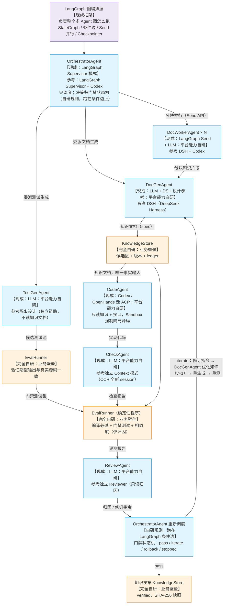

# 02 · 技术选型与架构决策（现成 vs 自研，对照选型图）

> 日期：2026-08-26 ｜ 阅读时间：5～10 分钟
> 定位：**以框架选型图（04 已论证定案）为锚点**，说明图上每一块"用现成框架还是自研、为什么"。先看标注版选型图，再看"现成 vs 自研"总览表，最后按图逐块展开。
> 关联：[01-多agent调研.md](01-多agent调研.md)（业务架构）｜ [03-Agent-Platform架构设计.md](03-Agent-Platform架构设计.md)（自研部分实现）｜ [04-LangGraph选型与多Agent图.md](04-LangGraph选型与多Agent图.md)（框架选型论证）

---

## 0. 标注版选型图（先看这张）

这是框架选型图（用户暂定版）与 01 业务架构的合并图，每个位置标注**【现成框架】还是【自研】**：

**一句话看懂**：
- **紫色框（LangGraph）** = 现成框架：整张图的结构（节点 / 边 / 并行 / 状态 / 循环）不用我们写
- **蓝色框（7 个 Agent）** = 现成框架跑（LLM / Coding Agent）+ 平台自研能力（上下文隔离、资源、会话，见 03）
- **橙色框（EvalRunner / KnowledgeStore）** = 完全自研（业务壁垒，无现成方案）

---

## 1. 现成 vs 自研 总览表（先看这张）

| 图上位置 | 用什么现成 | 自研什么 | 为什么 |
|---|---|---|---|
| 图结构（整个多 Agent 图怎么跑） | **LangGraph**（MIT 开源，TS 一等公民） | 不写图运行时 | 图编排是成熟非差异化基础设施，自研 = 残缺版 + 技术债（04 论证） |
| OrchestratorAgent（调度） | **LangGraph Supervisor** 模式 + Codex 参考 | 门禁状态机规则（pass / iterate / rollback / stopped） | 调度机制是通用的（现成）；决策规则是业务逻辑（自研） |
| DocGenAgent / DocWorkerAgent | **DSH 参考**（Everything is a Plugin）+ LLM | ContextPolicy（fork-all 分块上下文）、ResourceClaim | DSH 是设计参考不是依赖；上下文隔离是业务要求 |
| TestGenAgent | LLM + 真实源码探针 | 期望输出验证逻辑（EvalRunner 前置校验） | 行为 oracle 是业务壁垒，禁 LLM 编造 |
| CodeAgent | **Codex / OpenHands**（走 ACP 接现成 Coding Agent） | ContextPolicy（artifact-only 禁源码）+ Sandbox 物理隔离 | 不重造 Coding Agent；防作弊隔离必须自己做 |
| CheckAgent / ReviewAgent | LLM（CCR 独立上下文） | fresh 上下文强制、归因规则 | 独立审查是业务设计，测试覆盖不到的语义层 |
| EvalRunner（门禁） | 编译器 g++（现成） | 门禁测试 / 相似度 / 归因判定 | 知识工程防作弊评测无现成方案 |
| KnowledgeStore | Postgres / 对象存储（现成） | 知识版本 / ledger / SHA-256 快照 | 知识飞轮是业务壁垒 |
| 本地断点续跑 | **LangGraph Checkpointer + SQLite** | 应用启动恢复与节点幂等 | 匹配个人电脑上的单进程部署，不引入额外运行框架 |
| 协议（接工具 / 接 Coding Agent / 接远程 Agent） | **MCP / ACP / A2A**（现成标准） | 不造私有协议 | 标准协议被证明够用，除非不满足才自研 |

**总原则：能现成绝不自研（图、协议、Coding Agent、编译器）；必须自研才自研（业务壁垒：知识飞轮、防作弊隔离、评测门禁、平台稳定接口）。**

---

## 2. 图上各块展开

### 2.1 图结构：LangGraph（现成，Adopt）

图上最上层"LangGraph 负责整个多 Agent 图怎么跑"= 图编排层，直接采用（完整论证见 04）：

- 图模型 = 我们的架构：节点 = Agent、边 = 交接、条件边 = 门禁路由、Send = DocWorker 并行、Checkpointer = 断点续跑
- langgraphjs v1.x，TypeScript 一等公民（非 Python 包装），MIT 开源，满足"开源可审计"
- 官方 Supervisor 库 = OrchestratorAgent 模式；interrupt 原语 = 未来 HITL
- 生产案例：Uber（代码迁移 + 单测生成多 agent 网络，同领域）、Klarna（8500 万用户）
- 本地持久化：LangGraph Checkpointer 保存图状态；应用重启后根据 `thread_id` 恢复，节点重跑由业务幂等保障

### 2.2 OrchestratorAgent：现成 Supervisor 模式 + 自研门禁规则

- **现成**：LangGraph Supervisor 模式（supervisor-worker）承担调度骨架；Codex 的 `multi_agents.rs` 参考其 spawn / 汇总语义 → https://github.com/openai/codex/blob/main/codex-rs/core/src/session/multi_agents.rs
- **自研**：门禁状态机 decide（pass / iterate / rollback / stopped）规则 = 业务规则，实现为 LangGraph 条件边（conditional edge）
- **为什么这样分**：调度机制是通用的（现成），决策规则是我们的业务（自研）。主 Agent 只调度不执笔（01 硬规则），决策永远来自客观评测信号

### 2.3 蓝色 Agent 节点：现成框架跑 + 平台自研能力

- **现成**：Agent 本体 = LLM（DeepSeek / GLM / OpenAI）或 Coding Agent（Codex / Claude，走 ACP）
- **自研**（详见 03）：AgentProvider（厂商无关稳定接口）、ContextPolicy（上下文隔离，防作弊核心）、ResourceClaim（并行冲突判定）、AgentRun / AgentSession（血缘 / 审计）
- **为什么这样分**：Agent 本体可以换（Codex → Claude → 公司私有模型），平台接口必须稳定自研，否则每次换模型都改业务代码
- 设计参考（只看设计，不绑定）：DSH（Everything is a Plugin，Agent Runtime 是 provider）→ https://github.com/deepseek-ai/deepseek-harness ；OpenHands SDK（资源锁：A 写 moduleA ∥ B 写 moduleB 安全；A ∥ C 写同一文件冲突）→ https://github.com/OpenHands/software-agent-sdk

### 2.4 橙色框（EvalRunner / KnowledgeStore / 知识飞轮）：完全自研

图上橙色框全是确定性程序，**完全自研**，这是业务壁垒：

- EvalRunner（编译 + 门禁测试 + 相似度 + 期望输出真实性校验）
- KnowledgeStore（知识版本 / ledger / SHA-256 快照）
- 知识飞轮（归因 → 修订 → 重生成 → 重测闭环）
- 防作弊信息隔离（CodeAgent 物理看不到源码、TestGenAgent 期望输出经真实源码验证）

这些外面没有现成的"知识工程防作弊评测"方案，**必须自己做**，也是我们领先的地方。

### 2.5 本地断点续跑：LangGraph Checkpointer + 应用恢复

### 2.5.1 图上位置

- OrchestratorAgent 的"调度 + 重新调度" = 图上的循环 → LangGraph 承载
- Checkpointer 在 superstep 边界保存图状态，V1 使用本地 SQLite
- 应用启动时扫描 `RUNNING / INTERRUPTED` 运行，按 `thread_id` 恢复
- 进程在节点中途退出时，该节点可能重跑；LLM 调用、Artifact 写入和知识发布必须幂等

### 2.5.2 为什么不再引入第二套运行框架

- 项目部署在个人电脑，V1 是本地单进程执行，无跨机 worker 和中心调度
- 引入第二套运行框架会带来重复的状态、重试和运维语义
- 本地 checkpoint、应用启动恢复和业务幂等已覆盖当前需求

### 2.5.3 本地恢复的边界

- checkpoint 保存状态，不保存正在运行的进程
- 电脑关机后任务不会继续；下次启动由应用恢复
- 节点中途失败可能重跑，因此业务副作用必须幂等
- LLM 去重使用 `GenerationKey = runId + moduleId + iteration + agentType + promptHash + modelConfigHash`

### 2.5.4 恢复责任分工

- LangGraph 负责 Node / Edge / State / Conditional Routing 与 checkpoint
- 本地 Run Registry 负责记录任务状态并在应用启动时触发恢复
- Agent Platform 负责 LLM 去重、Artifact 幂等、权限、沙箱和上下文隔离

### 2.5.5 什么情况重新 PK Microsoft Agent Framework

Agent Framework（AutoGen + Semantic Kernel 合并，2026-04 GA）是**重点观察项**。当前不选：TypeScript 成熟度、生态稳定性还在观察期。**重新 PK 条件**：其 TS 一等 Durable Workflow 稳定 + 公司明确走微软栈 + 生态成熟。

---

## 3. 协议层：MCP / ACP / A2A（现成标准，不自研）

| 协议 | 管什么 | 图上哪 | 决策 |
|---|---|---|---|
| **MCP** | Agent ↔ 工具 / 知识服务 | Agent 调工具 / 检索的线 | Adopt → https://modelcontextprotocol.io/ |
| **ACP** | Platform ↔ Coding Agent Runtime | CodeAgent 接 Codex / Claude 的线 | Adopt（PoC）→ https://github.com/agentclientprotocol/agent-client-protocol |
| **A2A** | Agent Service ↔ Agent Service | 未来跨系统 Agent 互调 | Adopt（按需）→ https://github.com/a2aproject/A2A |

- 三个协议都现成，业务层不直接写协议，只通过 Adapter 使用
- 协议版本升级只改 Adapter，不动业务

---

## 4. 决策总表（对照图复习）

| 图上位置 | 能力 | 决策 | 方案 | 来源 |
|---|---|---|---|---|
| 图结构（图怎么跑） | Multi-Agent Graph Orchestration | **Adopt** | **LangGraph**（图编排层） | 现成 |
| 本地恢复 | Graph Checkpoint + Run Registry | **Adopt + Build（薄层）** | LangGraph SQLite Checkpointer + 应用启动恢复 | 现成 + 自研 |
| 蓝色 Agent 框 | Agent 运行层 | **Build（稳定内部 Contract）** | AgentProvider（参考 Codex / DSH / OpenHands） | 接口自研，本体现成 |
| CodeAgent 接外部 Coding Agent | Coding Agent 互操作 | Adopt（PoC） | ACP | 现成 |
| Agent 调工具 / 知识 | Tool / Knowledge 协议 | Adopt | MCP | 现成 |
| 未来跨系统 Agent 互调 | Agent-to-Agent | Adopt（按需） | A2A | 现成 |
| 橙色框（Eval / KnowledgeStore） | Knowledge Engineering Domain | **Build（完全自研）** | 知识飞轮 / EvalRunner / KnowledgeStore | 自研 |

---

## 5. V1 / V2 边界

**V1**：LangGraph 定义 7 Agent 图（节点 = Agent、条件边 = 门禁状态机、Send = DocWorker 并行、SQLite checkpointer）+ 本地 Run Registry / 启动恢复 + AgentProvider / ContextPolicy / ResourceClaim / ACP PoC（平台自研）+ DocGen / TestGen / Code / Eval / Review（业务）+ MCP。

**V2+**：Agent Teams（Task DAG）、rich A2A、跨 repo 调度、云端 KnowledgeStore 同步与冲突治理。

---

## 6. 成功标准（怎么算选对了）

1. 新 Coding Agent 出现 → 只加 Provider 或 ACP 配置，**不动**飞轮 / 图 / EvalRunner / KnowledgeStore
2. LangGraph 被替换 → 只改图的定义（节点 / 边描述），**不重写**平台和业务
3. Checkpointer 被替换 → 只改本地持久化 Adapter，**不重写**平台和业务
4. 模型 DeepSeek → GLM → OpenAI → private → 只改 Model / Agent Provider
