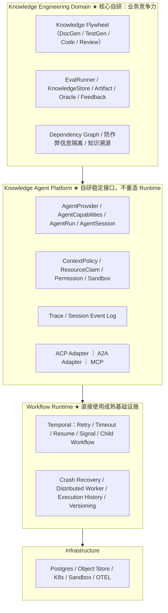

# 02 · 技术选型与架构决策（ADR）

> 日期：2026-08-26 ｜ 阅读时间：5～10 分钟
> 定位：Architecture Decision Record。本文只保留**当前结论 + 核心证据 + WHY**。历史调研过程由 Git 保存，正式文档不再保留被推翻的旧结论。
> 关联：[01-多agent架构设计.md](01-多agent架构设计.md)（业务架构）｜ [03-Agent-Platform架构设计.md](03-Agent-Platform架构设计.md)（Agent Platform 实现）

---

## 1. 最终决策总表

| 能力 | 决策 | 方案 | WHY |
|---|---|---|---|
| Workflow Runtime | **Adopt** | **Temporal** | durable execution 是成熟非差异化基础设施；避免自研 distributed workflow engine |
| Agent Platform | **Build（稳定内部 Contract）** | 参考 Codex / DSH / OpenHands | 公司级 Agent abstraction，需控制长期 API，vendor-neutral |
| Dynamic Agent Graph | **Defer** | LangGraph（V2+ 候选） | 当前主干不是动态 Agent Graph；abstraction fit 不匹配 |
| Coding Agent Protocol | **Adopt（PoC）** | **ACP** | 避免为 Codex / Claude / Gemini 分别造私有协议 |
| Agent-to-Agent | **Adopt（按需）** | **A2A** | 远程独立 Agent Service 互操作 |
| Tool Protocol | **Adopt** | **MCP** | Agent ↔ 工具/知识服务标准协议 |
| Knowledge Engineering Domain | **Build（完全自研）** | 知识飞轮 / EvalRunner / KnowledgeStore | 真正的业务壁垒 |

**核心原则**：
- 成熟问题用成熟基础设施；知识工程壁垒自研
- 第三方 Runtime / Framework 全部通过稳定内部接口隔离
- 不追求"零第三方框架"，也不堆热门 Agent 框架
- 未来任何底层 Agent / Model / Runtime 都可替换

---

## 2. 四层架构



---

## 3. Workflow Runtime：Temporal（Adopt）

### 3.1 为什么

- 主干本质 = **long-running deterministic engineering workflow with intelligent agent steps**（Source → DocGen → Code → Eval → Review → Iterate），Temporal 的 abstraction（Workflow/Activity/Child Workflow/Signal）与问题匹配。
- 需求清单（30 万行/仓、多仓库、数小时任务、分布式 worker、故障恢复、HITL、版本升级）**逐项是 Temporal 原生能力**。

### 3.2 核心证据（官方）

- Temporal 官方把 **LLM invocations 明确列为 Activity 场景**（与 API calls / DB queries / file I/O 并列）；Activity 结果记入 Event History，**重放时复用、不重算**。→ https://docs.temporal.io/workflows
- 官方将 **"a read that should be memoized, like an LLM call"** 列为 Activity 用例；Activity 失败按 retry policy 重试，可用 Heartbeat + details payload 从检查点继续。→ https://docs.temporal.io/activities
- 生产案例：Netflix（部署故障率 4% → ~0.0001%）、Stripe、Coinbase、DoorDash、Snap、HashiCorp 等；峰值 300K executions/sec。→ https://temporal.io/news/temporal-io-raises-usd100-million-series-b-company-valuation-passes-usd1-5 ｜ https://byteiota.com/temporal-workflow-engine-netflixs-10x-speed-secret-2026/

### 3.3 Temporal 的边界（诚实说明）

**Temporal 提供 execution reliability，不提供 domain correctness**：

- **不要写**："用了 Temporal 后 LLM 不会重复调用"
- **正确表述**：Workflow replay 时，已成功写入 Event History 的 Activity Result 会被复用，不会因 replay 再执行。但存在竞态窗口：**LLM 已返回 → Worker 收到结果 → ActivityTaskCompleted 未成功提交 → Worker/网络崩溃 → Temporal retry → LLM 可能再次调用**。
- 因此**业务副作用幂等由 Agent Platform / Domain 负责**，例如设计 `GenerationKey = workflowRunId + moduleId + iteration + agentType + promptHash + modelConfigHash`，LLM 调用去重、Artifact 写幂等、知识发布幂等由平台层实现。

### 3.4 Temporal 与业务层边界

| Temporal 负责（execution reliability） | Agent Platform / Domain 负责（domain correctness） |
|---|---|
| Execution History / Workflow Replay | LLM invocation deduplication |
| Retry Scheduling / Timeout / Heartbeat | Artifact write idempotency |
| Cancellation / Signal / Update | Knowledge publish idempotency |
| Child Workflow / Distributed Worker | External API idempotency |
| Workflow Recovery / Task Queue | Artifact schema / Knowledge schema |
| Workflow Version Routing | Agent semantic errors |
| | Permission / Sandbox / Context isolation |
| | Business concurrency policy / Eval correctness |

### 3.5 真实成本（不是"唯一成本就是部署"）

- Temporal Server / Cloud 部署运维
- Workflow deterministic constraints（非 Activity 代码不能直接调外部 IO / 随机 / 系统时间）
- Activity semantics / Retry policy / Heartbeat / Timeout / Task Queue
- Child Workflow / Continue-As-New / Signal / Update / Worker Versioning / Event History 管理
- 团队学习成本 + 运维成本

**最终判断**："学习和运营成熟 workflow engine" 明显优于 "自己研发和维护 distributed workflow engine"。

### 3.6 什么情况下重新 PK Microsoft Agent Framework

Agent Framework（AutoGen + Semantic Kernel 合并，2026-04 GA，MIT + LTS）覆盖 Agent / Workflow / fan-out-fan-in / HITL / persistence / Durable Extension，是**重点观察项**。当前不选它的原因：语言/runtime 成熟度、TypeScript 支持、生态稳定性仍在观察期；Temporal 在 durable execution 领域更成熟、更中立。**重新 PK 条件**：Agent Framework TypeScript 一等的 Durable Workflow 稳定 + 公司微软栈绑定明确 + 社区生态成熟。

---

## 4. LangGraph：Defer（V2+ 候选）

### 4.1 为什么不现在用

不是"LangGraph 没生产能力"（它现在有 persistence / queue / retry / resume / distributed execution / timeout / checkpoint），而是 **abstraction fit** 问题：

- LangGraph 核心 abstraction = Node / Edge / State / Conditional Routing / Graph → 适合 **Agent Graph / Dynamic Agent Workflow**
- Temporal 核心 abstraction = durable long-running application workflow → 适合我们的主干
- 我们的主干 = deterministic engineering workflow + intelligent steps → **Temporal abstraction 与问题更匹配**

### 4.2 定位

- Temporal → Workflow Runtime
- LangGraph → **V2+ 局部 Agent Graph DSL 候选**（未来出现动态 agent 图 / 多 agent 自由协作评审时，在 Agent Platform 上层定义图，调度到 Temporal 执行）
- 两者不是能力高低，是 abstraction fit

---

## 5. Agent Platform 设计参考（Build）

### 5.1 OpenAI Codex（开源，重点研究源码）

仓库：https://github.com/openai/codex （multi_agents.rs: https://github.com/openai/codex/blob/main/codex-rs/core/src/session/multi_agents.rs ）

当前 multi-agent 原语：`spawn_agent` / `followup_task` / `send_message` / `wait_agent` / `interrupt_agent` / `list_agents`，**child agent 可 spawn child agent**。官方多 agent 指南：https://developers.openai.com/api/docs/guides/responses-multi-agent

我们吸收：
1. **Agent = Session / Thread，而不是 run(prompt)**
2. parent-child lineage
3. explicit context fork（`fork_turns = all / N / none` → Agent Context 是正式 Platform abstraction）
4. lifecycle / cancellation / role / model / permission per Agent
5. durable / resumable Agent identity

### 5.2 DeepSeek Harness（DSH，开发者预览，参考设计）

仓库：https://github.com/deepseek-ai/deepseek-harness ；官方：https://www.deepseek.com/harness/en/

- **Everything is a Plugin**（基于 Cordis）：models / tools / skills / sessions / sandboxes / storage / loops / scheduling / UI 全可替换
- **Capability Seam**：Service Definition → Service Provider → Consumer。例如 SubagentProvider → spawn / fork / ACP / Codex / Claude Code / DSH SDK
- 证明：**Agent Runtime backend 应该是 provider，Domain 不应知道具体实现**
- ⚠️ DSH 当前明确处于 Developer Preview，存在 compatibility-breaking changes：**参考设计，不把核心 Domain API 绑定 DSH**
- DSH Workflow Engine 不替代 Temporal：它是"模型生成 orchestration JavaScript → worker_thread → 调 subagents"的 **Agent orchestration DSL**，不是 distributed durable workflow runtime

### 5.3 OpenHands Software Agent SDK

仓库：https://github.com/OpenHands/software-agent-sdk ；文档：https://docs.openhands.dev/sdk

重点吸收：`ParallelToolExecutor` / `ResourceLockManager` / `DeclaredResources` / Workspace isolation / Agent runtime separation。

教训：**并发不是简单 maxConcurrency = N**，要考虑共享资源冲突：
```
Agent A writes moduleA
Agent B writes moduleB   → A ∥ B safe
Agent C writes moduleA   → A ∥ C conflict
```
→ **ResourceClaim 应成为 Agent Platform 的正式模型**。

### 5.4 OpenAI Agents SDK

可参考：Agent / Handoff / Guardrail / Session / Tracing。但 **OpenAI Agent 绝不能成为内部核心 Domain 类型**：必须是 `Our AgentProvider → OpenAI Agents Adapter`，原因 vendor-neutral。

### 5.5 DSH Agent Teams（V2 参考）

值得吸收：Durable Roster / Durable Mailbox / Shared Task DAG / revision-CAS / blockedBy / writeScopes。V1 不完整复制；Task DAG、revision/CAS、resource scope 留作平台演进设计。

---

## 6. 协议分层（MCP / ACP / A2A）

**不自己造重复协议**。除非标准协议被证明无法满足，否则不新建 CompanyAgentProtocol。

| 协议 | 定义 | 在本项目的位置 |
|---|---|---|
| **MCP** | Agent ↔ Tool / Knowledge Service | Tools / Search / Knowledge Services 接入 |
| **ACP** | Platform ↔ Coding Agent Runtime | 本地 / CLI Coding Agent（Codex / Claude / Gemini 等） |
| **A2A** | Agent Service ↔ Agent Service | 远程独立 Agent Service 互操作 |

- **ACP**（Agent Client Protocol）：https://github.com/agentclientprotocol/agent-client-protocol ；官方 TS SDK v1.4：https://agentclientprotocol.github.io/typescript-sdk/ 。评估其成为主要 Coding Agent Adapter。结构：`Knowledge Agent Platform → AgentProvider → ACP Adapter → Codex / Claude / Other ACP Agents`。业务层不直接依赖 ACP 类型，ACP 只是 Adapter；ACP v2/v3 breaking 只改 Adapter。
- **A2A**：https://github.com/a2aproject/A2A （Linux Foundation，Apache 2.0，Google 贡献）；2026-08 A2A 与 MCP 并入 Agentic AI Foundation（https://www.forbes.com/sites/janakirammsv/2026/08/19/agent2agent-joins-the-agentic-ai-foundation-alongside-mcp/ ）。A2A 定义 agent 间跨组织通信，MCP 定义 agent 连工具/数据源，互补。
- **MCP**：https://modelcontextprotocol.io/ （版本 2026-07-28）；https://github.com/modelcontextprotocol/servers 。

---

## 7. Knowledge Domain 哪些必须自己做

我们的领先**不体现为"自己写了 workflow engine"**，而体现为：

- Knowledge Contract / Artifact Contract
- Source → Knowledge reconstruction
- Knowledge dependency modeling / provenance
- Eval-driven knowledge flywheel
- Test Oracle
- Anti-cheating / information isolation（CodeAgent 看不到源码；TestGen/Eval 信息边界）
- Knowledge attribution / correction
- Large-repo incremental update / cross-repo knowledge dependency
- Quality gate / knowledge version evolution

成熟基础设施（durable execution、协议、容器编排、存储）不重复造。

---

## 8. V1 / V2 边界

### V1
- **Workflow Runtime**：Temporal
- **Agent Platform**：AgentProvider / AgentCapabilities / AgentRun / AgentSession / ContextPolicy / ResourceClaim / Artifact Contract / Permission / Sandbox / Trace Context / Basic Session Event Log / Model Adapter / ACP PoC
- **Knowledge Domain**：DocGen / Code / Eval / Review / Knowledge iteration loop
- **协议**：MCP；ACP PoC / Adapter
- **暂不引入**：LangGraph、完整 Agent Teams、高自由度 Agent swarm

### V2+
- Dynamic Agent Graph（LangGraph evaluation）
- Agent Teams / Shared Task DAG / Durable mailbox
- richer A2A / cross-repo scheduling / distributed Agent provider
- more sophisticated Resource Scheduler

---

## 9. 成功标准（替换能力测试）

1. **新 Coding Agent（NewAgent-X）出现** → 只需新增 `NewAgentProvider` 或 ACP Adapter 配置，不修改 Knowledge Flywheel / Temporal Workflow / EvalRunner / KnowledgeStore / Artifact semantics。
2. **Temporal 被替换** → 主要修改 WorkflowRuntime Adapter，不重写 Agent Platform / Knowledge Domain。
3. **模型更换（DeepSeek → GLM → OpenAI → private）** → 只修改 Model / Agent Provider。

若做不到以上任意一条，说明 Agent Platform abstraction 设计失败。

---

## 10. 证据来源（官方优先）

| 主题 | 来源 |
|---|---|
| Temporal Workflow semantics | https://docs.temporal.io/workflows |
| Temporal Activities（retry/heartbeat/LLM call） | https://docs.temporal.io/activities |
| Temporal 生产客户 | https://temporal.io/news/temporal-io-raises-usd100-million-series-b-company-valuation-passes-usd1-5 |
| LangGraph checkpoint API | https://langchain-ai.github.io/langgraphjs/reference/modules/langgraph-checkpoint.html |
| Temporal LangGraph Plugin 博客 | https://temporal.io/blog/temporal-langgraph-plugin-durable-execution |
| OpenAI Codex（multi-agent 源码） | https://github.com/openai/codex/blob/main/codex-rs/core/src/session/multi_agents.rs |
| Codex Multi-agent 指南 | https://developers.openai.com/api/docs/guides/responses-multi-agent |
| DeepSeek Harness | https://github.com/deepseek-ai/deepseek-harness ｜ https://www.deepseek.com/harness/en/ |
| OpenHands Software Agent SDK | https://github.com/OpenHands/software-agent-sdk ｜ https://docs.openhands.dev/sdk |
| ACP | https://github.com/agentclientprotocol/agent-client-protocol ｜ https://agentclientprotocol.com/get-started/introduction |
| A2A | https://github.com/a2aproject/A2A ｜ https://a2a-protocol.org/latest/specification/ |
| MCP | https://modelcontextprotocol.io/ ｜ https://github.com/modelcontextprotocol/servers |
| Microsoft Agent Framework | https://github.com/microsoft/agent-framework |
