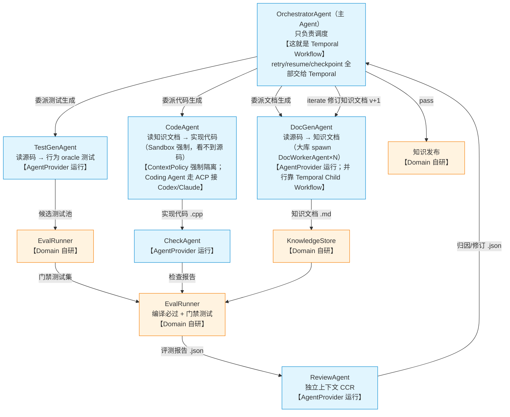

# 02 · 技术选型与架构决策（对照架构图）

> 日期：2026-08-26 ｜ 阅读时间：5～10 分钟
> 定位：**以 01 的 Agent 架构编排图为锚点**，说明图上每一块"用了什么技术、为什么"。先看标注版架构图，再按图逐块展开。
> 关联：[01-多agent调研.md](01-多agent调研.md)（业务架构）｜ [03-Agent-Platform架构设计.md](03-Agent-Platform架构设计.md)（平台实现）

---

## 0. 标注版架构图（先看这张）

这是 01 里的编排图，我们在**图上每个位置标上技术选型**：

**一句话看懂**：
- **蓝色框（Agent）** = 会"思考"的节点 → 由 **Agent Platform（Provider）** 提供运行能力，接什么 Coding Agent 由 **ACP** 统一
- **橙色框（EvalRunner/KnowledgeStore）** = 确定性程序 → **完全自研**（业务壁垒）
- **整条流程的箭头（委派/重试/迭代/并行）** = 业务主流程 → 由 **Temporal** 驱动（断点续跑、崩溃恢复、重试都是它的事）
- Agent 要**调工具/检索/知识服务** → 走 **MCP**；要**调远程 Agent 服务** → 走 **A2A**

下面按图从上到下逐块讲"为什么"。

---

## 1. 蓝色框（Agent 节点）：谁在跑？→ Agent Platform + ACP

图上所有蓝色框（DocGen / TestGen / Code / Check / Review）都是 **LLM Agent**。

### 1.1 运行它们的层：Agent Platform（自研稳定接口）

- **决策：Build**（自己定义稳定 Contract，不绑定任何厂商）
- **为什么**：这些 Agent 未来会换底层（Codex → Claude → 公司私有模型），平台层必须是**厂商无关的接口**，否则每次换模型都要改业务代码
- **设计参考（只看设计，不绑定）**：
  - OpenAI Codex（开源）：Agent = Session/Thread，可 spawn 子 agent → https://github.com/openai/codex/blob/main/codex-rs/core/src/session/multi_agents.rs
  - DeepSeek Harness（DSH）：Everything is a Plugin，Agent Runtime 是 provider → https://github.com/deepseek-ai/deepseek-harness
  - OpenHands SDK：并发时资源锁（A 写 moduleA ∥ B 写 moduleB 安全；A ∥ C 写同一文件冲突）→ https://github.com/OpenHands/software-agent-sdk
- **详细接口（AgentProvider/AgentRun/ContextPolicy/ResourceClaim）见 [03](03-Agent-Platform架构设计.md)**

### 1.2 接具体 Coding Agent 的协议：ACP（Adopt，PoC）

- **问题**：CodeAgent 未来可能要接 Codex、Claude Code、Gemini 等不同 Coding Agent，不能给每家写私有协议
- **方案**：**ACP（Agent Client Protocol）**，统一 Platform ↔ Coding Agent Runtime 的协议 → https://github.com/agentclientprotocol/agent-client-protocol （TS SDK v1.4）
- **图上位置**：D3（CodeAgent）接 Coding Agent 的那条线
- **注意**：业务层不直接写 ACP，它只是 Adapter；ACP 版本升级只改 Adapter，不动业务

### 1.3 调工具/知识服务：MCP（Adopt）

- **问题**：Agent 要读知识库、调检索、跑工具，不能每家一个协议
- **方案**：**MCP（Model Context Protocol）** = Agent ↔ Tool / Knowledge Service 标准 → https://modelcontextprotocol.io/ （版本 2026-07-28）
- **图上位置**：任何 Agent 需要工具/知识时的接入线

### 1.4 调远程 Agent 服务：A2A（Adopt，按需）

- **问题**：未来跨仓库/跨团队调"另一个 Agent 服务"（不是本地 CLI Agent）
- **方案**：**A2A（Agent2Agent）** = Agent Service ↔ Agent Service → https://github.com/a2aproject/A2A （Linux Foundation，Apache 2.0）
- **图上位置**：当前图上没有，V2+ 跨 repo 时出现

### 1.5 三个协议别混

| 协议 | 管什么 | 图上哪 |
|---|---|---|
| MCP | Agent ↔ 工具/知识服务 | Agent 调工具/检索的线 |
| ACP | Platform ↔ Coding Agent Runtime | CodeAgent 接 Codex/Claude 的线 |
| A2A | Agent Service ↔ Agent Service | 未来跨系统 Agent 互调 |

**不自己造私有协议**：除非标准协议被证明不够用。

---

## 2. 橙色框（EvalRunner / KnowledgeStore）：Domain 自研

图上橙色框全是确定性程序，**完全自研**，这是业务壁垒：

- EvalRunner（编译 + 门禁测试 + 相似度）
- KnowledgeStore（知识版本 / ledger / SHA-256 快照）
- 知识飞轮（归因 → 修订 → 重生成）
- 防作弊信息隔离（CodeAgent 看不到源码、TestGen 期望输出经真实源码验证）

这些外面没有现成的"知识工程防作弊评测"方案，**必须自己做**，也是我们领先的地方。

---

## 3. 整条流程的箭头：Temporal（Adopt）

### 3.1 图上位置

- OrchestratorAgent 框（主调度）→ **这就是 Temporal Workflow**
- 委派/重试/迭代/并行箭头 → Temporal 的 Workflow/Activity/Child Workflow
- 崩溃恢复 / 断点续跑 / cancel / resume → Temporal 原生

### 3.2 为什么用 Temporal（而不是自研、不是 LangGraph）

| 对比 | 结论 |
|---|---|
| 自研 workflow | ❌ 等于重写一个分布式 workflow engine，长期技术债 |
| LangGraph | ❌ abstraction 不匹配（见 3.4） |
| **Temporal** | ✅ durable execution 是成熟非差异化基础设施，直接用它 |

**核心证据（官方）**：
- Temporal 官方把 **LLM 调用明确列为 Activity 场景**，Activity 结果记入 Event History，**重放时复用不重算** → https://docs.temporal.io/workflows
- 官方把 **"memoized read like an LLM call"** 列为 Activity 用例 → https://docs.temporal.io/activities
- 生产案例：Netflix（部署故障 4% → 0.0001%）、Stripe、Coinbase、DoorDash → https://temporal.io/news/temporal-io-raises-usd100-million-series-b-company-valuation-passes-usd1-5

### 3.3 Temporal 的边界（必须诚实）

**Temporal 解决 execution reliability，不解决 domain correctness**。

- ❌ 错误说法："用了 Temporal 后 LLM 不会重复调用"
- ✅ 正确说法：Workflow replay 时，已写入 Event History 的 Activity 结果会被复用，不会因 replay 再执行；但存在竞态窗口（LLM 已返回 → 结果未提交 → 崩溃 → retry → LLM 可能再调一次）
- **所以副作用幂等由业务层做**：LLM 去重用 `GenerationKey = workflowRunId + moduleId + iteration + agentType + promptHash + modelConfigHash`

| Temporal 负责 | 业务层负责 |
|---|---|
| retry / timeout / heartbeat / cancel / resume | LLM 调用去重 |
| child workflow / 分布式 worker | Artifact 写幂等 |
| crash recovery / execution history / 版本路由 | 知识发布幂等 |
| | 权限 / 沙箱 / 上下文隔离 / Eval 正确性 |

### 3.4 为什么不是 LangGraph（abstraction fit，不是能力高低）

LangGraph 现在也有 persistence/retry/resume/distributed/checkpoint，**不是"没生产能力"**，而是：

- LangGraph 的核心抽象 = **Node / Edge / State / Conditional Routing（图）** → 适合 **动态 Agent Graph**
- Temporal 的核心抽象 = **durable long-running workflow** → 适合我们的主干
- 我们的主干 = `Source → DocGen → Code → Eval → Review → Iterate` 是 **确定性长流程 + 智能步骤**，不是自由图

**结论**：Temporal = Workflow Runtime（现在用）；LangGraph = V2+ 出现动态 Agent Graph 时的 DSL 候选（现在不用）。

### 3.5 Temporal 的真实成本（不是"唯一成本就是部署"）

- Server/Cloud 部署运维
- Workflow 确定性约束（Activity 之外不能直接调 IO/随机/系统时间）
- Activity/retry/heartbeat/timeout/task queue 概念要学
- Continue-As-New / Signal / Update / Worker Versioning / Event History 管理
- 团队学习 + 运维成本

**但**："学习和运营成熟 workflow engine" 远优于 "自己研发和维护 distributed workflow engine"。

### 3.6 什么情况重新 PK Microsoft Agent Framework

Agent Framework（AutoGen + Semantic Kernel 合并，2026-04 GA）覆盖 Agent/Workflow/HITL/persistence，是**重点观察项**。当前不选：TypeScript 成熟度、生态稳定性还在观察期。**重新 PK 条件**：其 TS 一等 Durable Workflow 稳定 + 公司明确走微软栈 + 生态成熟。

---

## 4. 决策总表（对照图复习）

| 图上位置 | 能力 | 决策 | 方案 |
|---|---|---|---|
| 蓝色 Agent 框 | Agent 运行层 | Build（稳定接口） | AgentProvider（参考 Codex/DSH/OpenHands） |
| CodeAgent 接外部 Coding Agent | Coding Agent 互操作 | Adopt（PoC） | ACP |
| Agent 调工具/知识 | Tool/Knowledge 协议 | Adopt | MCP |
| 未来跨系统 Agent 互调 | Agent-to-Agent | Adopt（按需） | A2A |
| 橙色框（Eval/KnowledgeStore） | Knowledge Domain | Build（完全自研） | 知识飞轮 |
| 整条流程箭头 | Workflow Runtime | Adopt | Temporal |
| 未来动态 Agent 图 | Dynamic Agent Graph | Defer | LangGraph（V2+） |

---

## 5. V1 / V2 边界

**V1**：Temporal（流程）+ AgentProvider/ContextPolicy/ResourceClaim/ACP PoC（平台）+ DocGen/Code/Eval/Review（业务）+ MCP。暂不引入 LangGraph / Agent Teams / A2A 完整实现。

**V2+**：LangGraph evaluation（动态 Agent 图）、Agent Teams（Task DAG）、rich A2A、跨 repo 调度、分布式 Agent Provider。

## 6. 成功标准（怎么算选对了）

1. 新 Coding Agent 出现 → 只加一个 Provider 或 ACP 配置，**不动**飞轮/Workflow/EvalRunner/KnowledgeStore
2. Temporal 被替换 → 只改 Workflow Adapter，**不重写**平台和业务
3. 模型 DeepSeek → GLM → OpenAI → private → 只改 Model/Agent Provider
