# 02 · LLM 多 Agent 编排模式调研

> 日期：2026-08-26
> 定位：从零选型的模式层调研。回答"业界有哪些编排模式、各有什么优劣、何时选哪个"，并澄清 workflow vs orchestration 的核心区别。
> 配套：[01-多agent调研.md](01-多agent调研.md)（评审/验证相关实证）、[03-开源编排框架.md](03-开源编排框架.md)、[04-开源仓库案例.md](04-开源仓库案例.md)

---

## 〇、核心概念澄清：Workflow vs Orchestration

这是理解一切模式的前提。业界两个最权威的定义框架：

**Anthropic（《Building Effective Agents》，2024.12 首发、持续更新；基础定义文档，非研究论文）**：
- **Workflow（工作流）**：LLM 和工具被"预定义代码路径"编排起来的系统，步骤拓扑在构建期写死，LLM 只在节点内部工作。
- **Agents（智能体）**：LLM **动态地**主导自己的过程和工具使用，下一步做什么由模型在运行时决定。
- 关键洞察：workflow 和 agent **都离不开 orchestration**（编排是共性），区别在于**控制权归代码还是归模型**。

**Google/Kaggle《Agents》白皮书（2025）**：认知架构 = Agent + Tools + **Orchestration Layer（编排层）**。编排层负责规划、决策、上下文管理与工具调用调度，它把"做什么"和"怎么做"连接起来。

### 一句话区分（建议直接采用）

| 概念 | 本质 | 类比 |
|---|---|---|
| **Workflow** | 对"过程结构"的**静态描述**：步骤集合 + 依赖拓扑 | 施工图纸 |
| **Orchestration** | 对"运行时协调"的**动态管理**：调度、传参、重试、并行、错误处理、路由决策 | 项目经理 |
| **Agentic Workflow** | 步骤拓扑**由 LLM 在运行时动态生成/调整**的工作流 | AI 边画图边施工 |
| **Workflow Orchestration** | 对**预定义流程**的确定性协调（Airflow/Temporal/LangGraph 静态图） | 按图纸施工 |
| **Agent Orchestration** | 对**自主 agent 群体**的协调（supervisor/handoff/图） | 管理一群会自己干活的工人 |

**核心区别一句话**：Workflow 回答"任务分几步、按什么顺序"，Orchestration 回答"谁来调度、如何传递状态、出错怎么办"；"Agentic" 修饰的是**控制权是否由 LLM 动态行使**。成熟生产系统通常是"外层确定性编排 + 内层 agent 自治"（LangGraph 正是把两者统一到一张图上）。

来源：
- Anthropic: https://www.anthropic.com/engineering/building-effective-agents
- Google Agents 白皮书: https://ia800601.us.archive.org/15/items/google-ai-agents-whitepaper/Newwhitepaper_Agents.pdf
- Andrew Ng 四模式: https://learn.deeplearning.ai/courses/agentic-ai/
- 综述: https://arxiv.org/abs/2412.17481 ｜ https://www.mdpi.com/1999-5903/18/6/326

---

## 一、模式全景图（分类法）

按**控制拓扑 × 决策时点**两维分类（综合 MDPI 2026 综述与业界实践）：

- **集中式（centralized）**：router、orchestrator-worker、supervisor，单一决策点
- **分散式（decentralized）**：swarm、debate、network、event-driven(choreography)，无中央协调
- **分层式（hierarchical）**：分层 supervisor / 树状分解，集中式的递归扩展
- **共享内存式**：blackboard，无直接通信，共享状态驱动
- **实现载体**：graph-based 可统一承载以上所有模式；event-driven 是通信层选择

---

## 二、各模式详解

### 1. Sequential Workflow（顺序工作流）

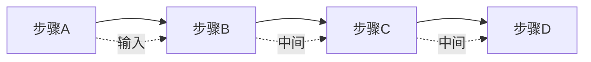
（拓扑在构建期写死，前一步输出=后一步输入）

- **定义**：多个步骤按固定顺序线性执行，前一步输出即后一步输入，拓扑在构建期写死（Anthropic 称之为 Prompt Chaining）。
- **优点**：简单直观、易调试、可预测；每步可独立评测/缓存；成本最低。
- **缺点**：延迟为各步之和；拓扑固定无法绕行；错误/幻觉沿链累积无重路由。
- **适用**：任务可分解为固定顺序阶段且有清晰输入输出契约的场景（文档抽取→清洗→结构化→入库）。
- **业界代表**：CrewAI Sequential Process；LangGraph 链式图。（AutoGen Sequential Chat 曾为代表，本体已进维护模式，仅作范式参考）
- **决策要点**：步骤顺序确定、无需动态分支时**优先选**，它是所有模式的基础，Anthropic 明确建议"能用 workflow 就不用 agent"。
- 来源：https://www.anthropic.com/engineering/building-effective-agents ｜ https://docs.crewai.com/concepts/processes

### 2. Pipeline（流水线）

（顺序工作流的泛化：各阶段可独立伸缩/并行/缓冲）

- **定义**：顺序工作流的泛化，多个阶段串联，各阶段可独立伸缩/并行/缓冲，强调吞吐与解耦（数据流视角）。
- **优点**：高吞吐、阶段可独立扩展替换、天然支持流式与批处理。
- **缺点**：端到端调试难；阶段间需要严格数据契约；背压/重试/错误传播复杂；单阶段延迟叠加。
- **适用**：海量数据批处理/流处理，如知识飞轮中"源码→知识文档"的批量转换。
- **业界代表**：LlamaIndex Workflows、Haystack Pipeline、Apache Airflow、Prefect、Kubeflow、n8n。
- **决策要点**：数据量大、阶段间契约稳定、需要独立扩缩容时选。
- 来源：https://developers.llamaindex.ai/typescript/workflows/ ｜ https://airflow.apache.org/

### 3. Router（路由）

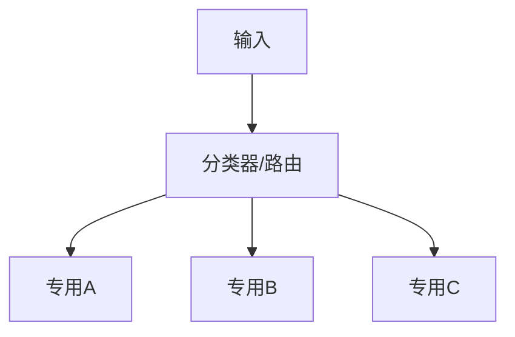
（入口只分类不分发处理，自身不完成任务）

- **定义**：一个入口分类器（LLM 或语义模型）只负责把输入分发给正确的下游（专用 agent/提示词/流程），自身不处理任务。
- **优点**：分类比让单一 agent 处理一切更简单可靠；可隔离复杂度；可让简单请求走便宜模型降成本。
- **缺点**：分类错误即全错（需 fallback）；路由层是单点；类别过多时精度骤降。
- **适用**：意图可枚举且互斥的场景（客服分流、问题分诊、按语言/类型路由）。
- **业界代表**：Anthropic Routing；aurelio-labs/semantic-router；LangGraph 条件边。
- **决策要点**：任务类型**可枚举、互斥、可评测分类精度**时选；常作为更复杂系统（supervisor）的第一步。
- 来源：https://www.anthropic.com/engineering/building-effective-agents ｜ https://github.com/aurelio-labs/semantic-router

### 4. Fan-out / Fan-in（扇出扇入 / 并行化）

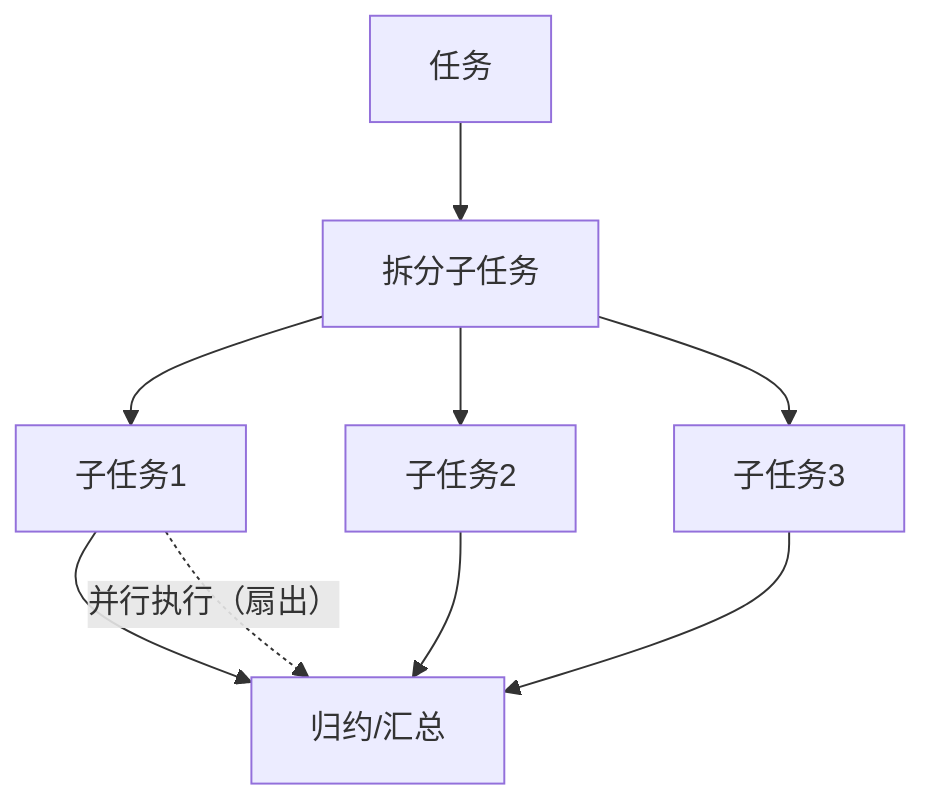
（静态切分：子任务真独立；与 orchestrator 的动态分派不同）

- **定义**：一个任务拆成 N 个独立子任务并行执行（扇出），结果汇总/归约后进入下一阶段（扇入），即 map-reduce；Anthropic 称之为 Parallelization（sectioning 切分 / voting 投票）。
- **优点**：延迟理论降为 1/N；子任务独立可水平扩展；天然支持多数决提升鲁棒性。
- **缺点**：成本放大 N 倍；归约是瓶颈和信息丢失点；子任务必须真独立；reducer 需处理冲突/冗余。
- **适用**：多文件并行分析、多路检索、批量代码审查、评测投票仲裁。
- **业界代表**：LangGraph Send API / map-reduce 模式；Anthropic 并行子代理；传统 MapReduce。
- **决策要点**：子任务**真独立**且合并逻辑清晰时选；与 orchestrator-worker 的区别：扇出是**静态切分**，编排者是**动态分派**。
- 来源：https://www.anthropic.com/engineering/building-effective-agents ｜ https://deepwiki.com/langchain-ai/langchain-academy/7.3-parallelization-techniques

### 5. Orchestrator-Worker（编排者-工作者）

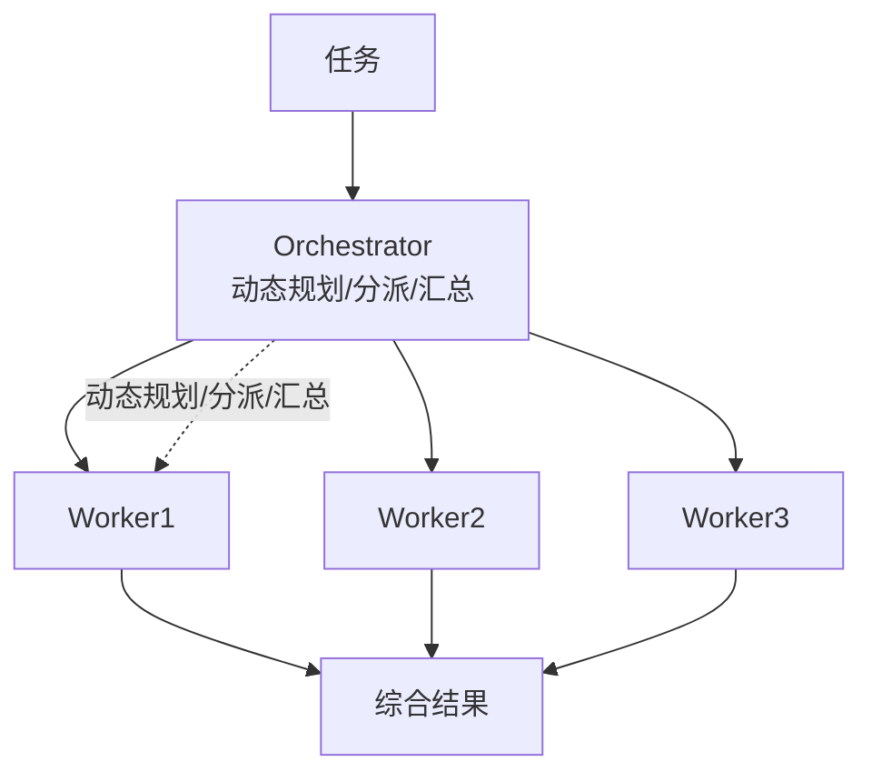
（拓扑运行时生成，非预写死；orchestrator 是单点）

- **定义**：一个主 agent 动态规划任务、将子任务分派给多个专用 worker，并汇总结果；**拓扑运行时生成而非预写死**（Anthropic 核心 agent 模式之一）。
- **优点**：能处理开放/未知任务；worker 可复用并行；决策集中、可观测。
- **缺点**：orchestrator 是单点（失败/上下文超限即崩）；规划质量决定上限；多轮 LLM 调用成本高；深链易漂移。
- **适用**：目标明确但路径未知的复杂任务，如深度研究、大型代码库分析、多源信息综合。
- **业界代表**：Anthropic 多 Agent 研究系统（Claude Opus 主导 + Sonnet 子代理并行）；LangGraph supervisor 变体；CrewAI Hierarchical Process。
- **决策要点**：任务开放、需要**动态任务分解+并行探索**时选；与 supervisor 的区别：orchestrator 聚焦"任务分解执行"，supervisor 聚焦"交互路由与治理"（两者常合体）。
- 来源：https://www.anthropic.com/engineering/multi-agent-research-system ｜ https://www.anthropic.com/engineering/building-effective-agents

### 6. Hierarchical（分层）

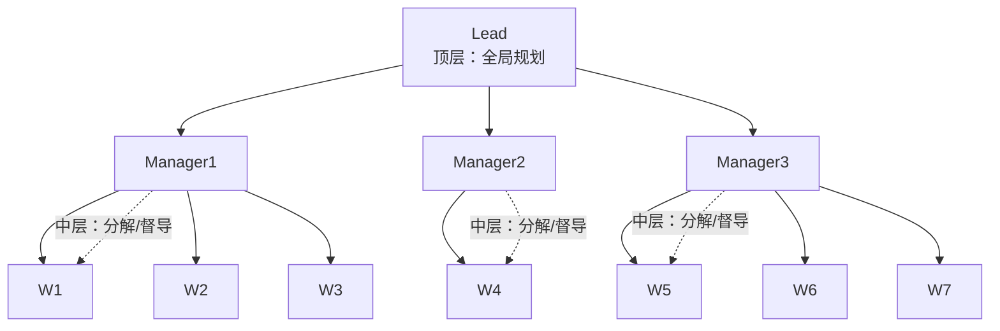
（orchestrator-worker 的两层特例；天然映射仓→模块→文件）

- **定义**：多层级树状组织，高层 agent 管中层、中层管底层，任务逐级分解、结果逐级上报；orchestrator-worker 是其两层特例。
- **优点**：控制粒度可调、每层职责单一；可扩展到大规模团队；天然映射组织/代码结构。
- **缺点**：层级越深延迟与成本叠加、上下文逐层失真；顶层信息过载；过度结构化损失灵活性。
- **适用**：大规模团队协作仿真（软件公司流水线）；超大代码库分层治理（仓→模块→文件→函数）。
- **业界代表**：MetaGPT（产品经理→架构师→工程师→QA 的 SOP 层级，开源仓库）；LangGraph Hierarchical 文档；CrewAI Hierarchical Process。
- **决策要点**：任务规模大且**可天然分层**时选，知识飞轮场景中按代码库层级组织 agent 非常契合。
- 来源：https://github.com/FoundationAgents/MetaGPT ｜ https://langchain-ai.github.io/langgraph/concepts/multi_agent/

### 7. Supervisor（监督者）

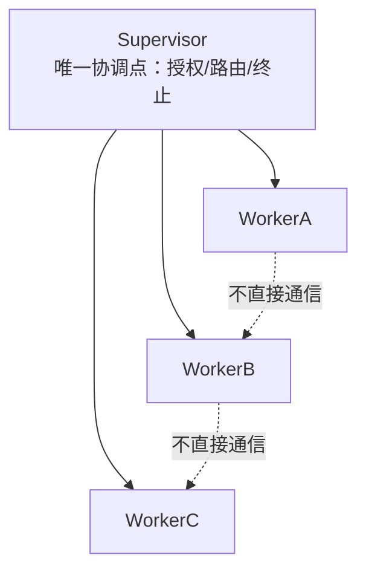
（worker 之间不直接通信，一切经 supervisor 中转）

- **定义**：一个监督 agent 与多个 worker 交互，**worker 之间不直接通信**，一切经 supervisor 中转、授权、路由与终止判断（LangGraph 官方"LLM 作为路由器+状态机"）。
- **优点**：单一协调点便于审计/权限控制/强制终止；防 agent 失控互聊；新增 worker 成本低。
- **缺点**：supervisor 上下文成瓶颈；消息串行过它导致延迟；监督决策失误影响全局。
- **适用**：需要强治理、合规、人审、防失控的生产系统（客服、代码审查、金融流程）。
- **业界代表**：LangGraph Supervisor 库（langchain-ai/langgraph-supervisor）；CrewAI manager agent。（AutoGen GroupChat 曾为代表，本体已维护模式）
- **决策要点**：需要集中控制与安全护栏时选，业界公认**最接近"生产可用"的默认多 agent 架构**。
- 来源：https://github.com/langchain-ai/langgraph-supervisor ｜ https://langchain-ai.github.io/langgraph/concepts/multi_agent/

### 8. Swarm（群集）

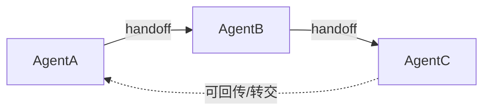
（无中央协调者；控制权在个体间动态转交；短会话角色切换）

- **定义**：无中央协调者的对等网络，agent 通过 **handoff（交接）** 把控制权动态转交给另一个 agent，决策分散在个体（OpenAI Swarm 原语：routines + handoffs）。
- **优点**：原语极简、代码量小；天然模拟客服转接等场景；新增 agent 几乎零成本。
- **缺点**：无全局视图导致难追踪审计；交接链可能死循环/失控；上下文随交接累积膨胀；不适合需全局规划的任务。
- **适用**：短会话内的角色切换（客服、预订流程）、快速原型验证。
- **业界代表**：OpenAI Swarm（教育性质），OpenAI Agents SDK（生产升级版）；LangGraph Swarm 模式（langgraph-swarm-py）。
- **决策要点**：场景是"**转接**"而非"任务分解"时选；生产环境用 Agents SDK 或 LangGraph 而非 Swarm 本身。
- 来源：https://github.com/openai/swarm ｜ https://openai.github.io/openai-agents-python/ ｜ https://github.com/langchain-ai/langgraph-swarm-py

### 9. Graph-based（图执行）

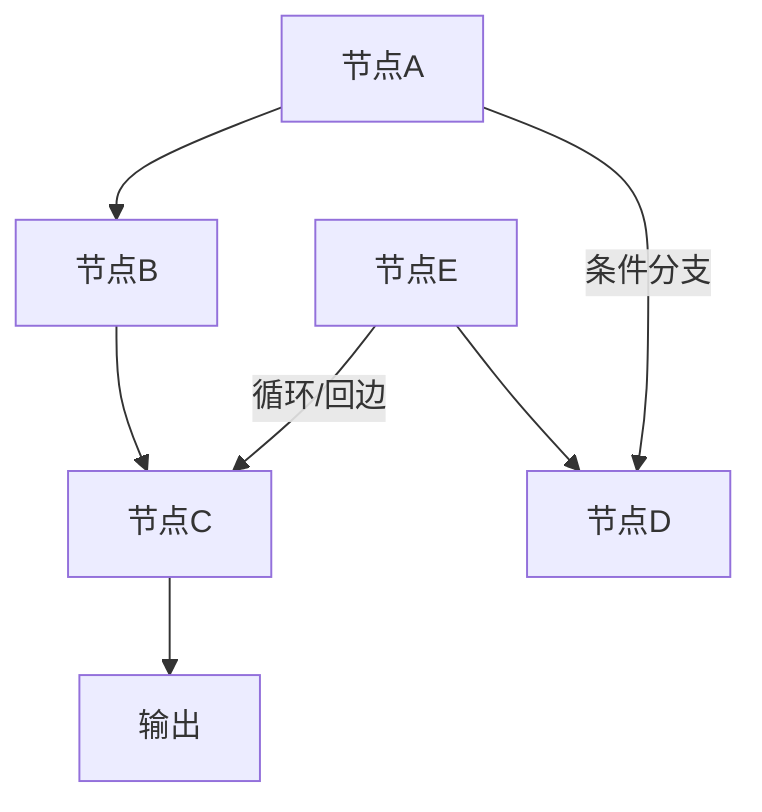
（统一载体：可表达顺序/并行/循环/分支/人工审批/断点续跑）

- **定义**：把控制流建模为有向图（节点=步骤/agent，边=转移），支持条件分支、循环、并行与状态持久化；是上述多种模式的**统一实现载体**。
- **优点**：表达力最强（任意拓扑）；状态显式、可检查点/断点续跑（durable execution）；可观测可测试。
- **缺点**：学习曲线陡；显式建模所有路径工作量大；易过度设计。
- **适用**：复杂生产系统、需要 human-in-the-loop、错误恢复、长时任务。
- **业界代表**：**LangGraph（事实标准）**、Dify/Coze 工作流、Temporal（通用执行层）。（AutoGen Graph 团队模式曾为代表，本体已维护模式）
- **决策要点**：需要**组合多种模式 + 持久化/恢复/人工审批**时选；知识飞轮这类复杂闭环建议以图为核心骨架（候选方案之一）。
- 来源：https://www.langchain.com/langgraph ｜ https://microsoft.github.io/autogen/

### 10. Debate / Consensus（辩论 / 共识）

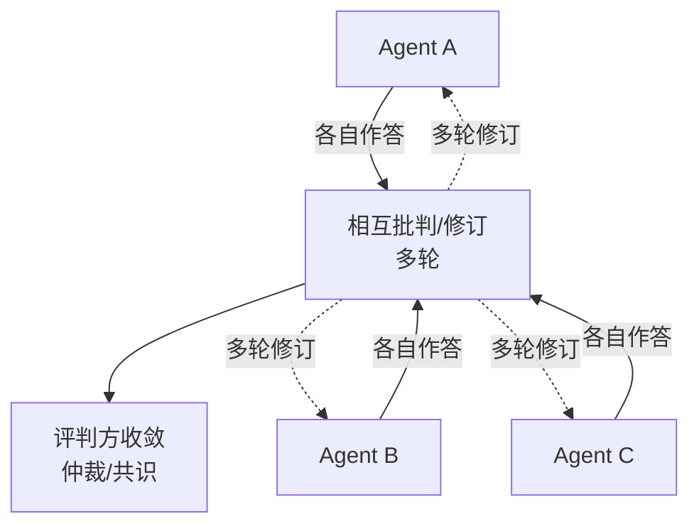
（高价值低频率决策；成本随 轮次×agent数 暴涨）

- **定义**：多个 agent 对同一问题各自作答、相互批判、多轮修订，再由评判方收敛答案（Multi-Agent Debate, MAD；又称 Society of Minds）；CrewAI 称之为 Consensual Process。
- **优点**：多视角暴露单 agent 盲点（2026 年对抗评审实证：maker-checker 5 维分离补盲区）；无需额外训练。
- **缺点**：成本随 轮次×agent数 暴涨；可能收敛到共同错误（群体偏差）；评判 agent 自身会错；延迟高。
- **适用**：高价值低频率决策，如代码方案评审、安全审查、事实核查、评测答案仲裁。
- **业界代表**：Augment Code Adversarial Code Review（2026-07，maker-checker）；Cross-Context Review（arXiv 2603.12123，2026.03）；CrewAI Consensual Process。
- **决策要点**：**质量优先于成本/延迟**且有可仲裁答案时选；用不同模型/提示词提升多样性可显著增强效果；但 CCR 实证显示**辩论式多 Review 对代码评审无增益**（重复审 p=0.11），评审场景优先独立上下文审查。
- 来源：https://www.augmentcode.com/blog/adversarial-code-review ｜ https://arxiv.org/abs/2603.12123

### 11. Blackboard（黑板）

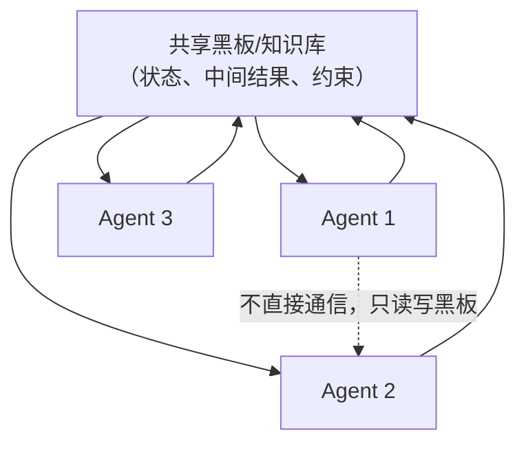
（agent 不直接通信，只读写黑板；由黑板内容驱动下一步）

- **定义**：agent 之间**不直接通信**，只读写一块共享"黑板"（共享状态/知识库），由黑板内容驱动下一个 agent 行动（经典 Hearsay-II 架构的 LLM 化）。
- **优点**：高度解耦、agent 即插即用；天然支持增量式求解与信息长期共享；单个 agent 失败不影响全局。
- **缺点**：黑板成读写瓶颈与一致性难点；缺明确终止条件；"谁下一步"的调度策略难设计；调试困难。
- **适用**：复杂开放问题的渐进式求解、多源信息综合、需长期共享记忆的场景（知识飞轮的共享知识库可视作黑板）。
- **业界代表**：bMAS（arXiv:2507.01701）；agent-blackboard 开源实现；经典 Hearsay-II。
- **决策要点**：问题无固定解法、信息需持续累积共享、agent 异构时选；常与 event-driven 结合。
- 来源：https://arxiv.org/abs/2507.01701 ｜ https://github.com/claudioed/agent-blackboard

### 12. Event-driven（事件驱动）

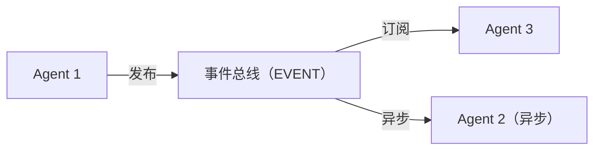
（发布/订阅解耦触发；异步、松耦合、可水平扩展）

- **定义**：agent 不直接调用彼此，而是**发布/订阅事件**，由事件总线（Kafka/Redis Streams/SQS）解耦触发；异步、松耦合、可水平扩展（choreography 式编排）。
- **优点**：强解耦、弹性伸缩、异步高吞吐；新增 agent 不影响现有流程；天然适配流式数据。
- **缺点**：端到端追踪难；事件风暴/乱序/死信处理复杂；测试困难；最终一致性。
- **适用**：高吞吐数据管道、实时流处理，如"代码变更→触发文档更新→触发评测→反馈回流"。
- **业界代表**：LlamaIndex Workflows（事件驱动 DSL）；Temporal/Airflow 事件触发；Kafka+Serverless 架构。
- **决策要点**：步骤可异步解耦、需弹性伸缩时选；生产必须配分布式追踪。
- 来源：https://developers.llamaindex.ai/typescript/workflows/ ｜ https://supergood.solutions/blog/event-driven-agent-architectures-how-to-scale-agentic-workflows-without-polling/

### 补充模式（简要）

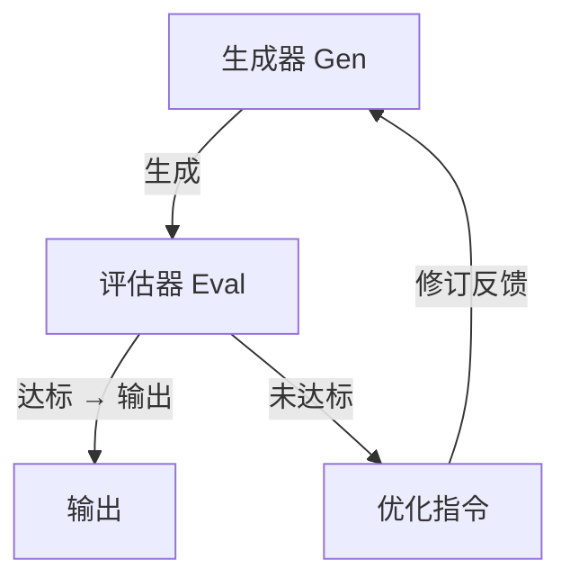
（生成器产出→评估器反馈→循环迭代至达标；代码生成后跑测试再迭代即此模式）

- **Evaluator-Optimizer（评估-优化器）**：生成器产出→评估器反馈→循环迭代至达标。适用有明确评估标准且反馈可操作的场景（如代码生成后跑测试/静态检查再迭代）。来源：Anthropic Building Effective Agents。
- **Network（网络式）**：任意 agent 可互相通信的无结构拓扑；表达力最强但最难控制；LangGraph 的 network 架构。来源：https://langchain-ai.github.io/langgraph/concepts/multi_agent/
- **AutoGen 会话模式（仅范式参考，本体已维护模式）**：two-agent chat / sequential chat / group chat / nested chat，是上述模式的对话式实现。来源：https://microsoft.github.io/autogen/0.2/docs/tutorial/conversation-patterns/

---

## 三、决策框架

**决策树（按序自检）：**
1. **路径是否预知？** 预知 → Workflow 系：sequential / pipeline / router / fan-out-fan-in（确定性、便宜、可测）
2. **不预知但目标明确？** → Agent 系：orchestrator-worker / supervisor
3. **需要强治理、防失控、人审？** → supervisor / graph-based（带 interrupt）
4. **需要大规模、可分层？** → hierarchical
5. **需要角色快速切换？** → swarm（handoff）
6. **需要多视角批判或仲裁？** → debate / voting（fan-in 变体）
7. **需要长期共享记忆、渐进求解？** → blackboard
8. **需要解耦伸缩、流式异步？** → event-driven
9. **要组合以上多种？** → graph-based（LangGraph）作为统一载体

**通用原则（Anthropic 官方建议）：**
- **最简单方案优先**：先 workflow，只有需要"动态决策"才升级 agent
- **可评测才谈优化**：没有评估标准就不要上复杂编排
- 在公共组件上加显式约束，控制上下文膨胀
- 用成本-延迟-质量三角衡量每个模式的取舍
- 生产必备：可观测性（LangSmith/Langfuse）、状态持久化、超时与终止条件、权限最小化

---

## 四、结合知识飞轮项目的选型候选（供决策，不预设结论）

基于"30万行/仓、总量上亿行、源码→知识文档→代码→评测→反馈"的背景，各环节的模式候选：

| 环节 | 任务性质 | 候选模式 |
|---|---|---|
| 源码 → 知识文档 | 确定性批量任务 | **Pipeline + Fan-out/Fan-in**（按 仓→模块→文件 静态切分并行，配增量索引与缓存） |
| 知识文档 → 代码生成 | 开放任务 | **Orchestrator-Worker**（动态拆解）或 **Supervisor**（需质量治理时） |
| 评测环节 | 可并行 | **Fan-out + Debate/Voting 仲裁**（多 agent 评判一致性，降误判） |
| 反馈回流 | 事件触发 | **Event-driven**（评测完成事件→触发知识更新→触发新一轮生成） |
| 跨仓治理 | 规模化 | **Hierarchical**（仓级 lead → 模块级 → 文件级 worker） |
| 共享知识层 | 长期记忆 | **Blackboard**（各 agent 读写同一知识层而非直接互聊） |
| 整体闭环 | 复杂回路 | **Graph-based**（带反馈回路的闭环天然适合图执行：循环、并行、断点续跑、人审） |

**最需要警惕**：上亿行规模下，**上下文管理与增量处理**比模式选择更关键，任何模式都要配缓存、检索过滤与状态压缩。

---

## 五、参考资料总表（权威来源）

**官方文档/博客**
- Anthropic 编排模式权威定义: https://www.anthropic.com/engineering/building-effective-agents
- Anthropic 多 Agent 研究系统: https://www.anthropic.com/engineering/multi-agent-research-system
- OpenAI Swarm: https://github.com/openai/swarm
- OpenAI Agents SDK: https://openai.github.io/openai-agents-python/
- LangGraph 多 Agent 文档: https://langchain-ai.github.io/langgraph/concepts/multi_agent/
- LangGraph Supervisor 库: https://github.com/langchain-ai/langgraph-supervisor
- CrewAI Processes: https://docs.crewai.com/concepts/processes
- AutoGen 会话模式（AutoGen 本体已进维护模式，仅作对话范式参考）: https://microsoft.github.io/autogen/0.2/docs/tutorial/conversation-patterns/
- LlamaIndex Workflows: https://developers.llamaindex.ai/typescript/workflows/
- Google Agents 白皮书: https://ia800601.us.archive.org/15/items/google-ai-agents-whitepaper/Newwhitepaper_Agents.pdf
- Andrew Ng 四模式课程: https://learn.deeplearning.ai/courses/agentic-ai/

**论文**（仅 2025+，25 年前论文已按口径剔除）
- bMAS 黑板架构 LLM 化: https://arxiv.org/abs/2507.01701
- LLM 多 Agent 编排综述 (MDPI 2026): https://www.mdpi.com/1999-5903/18/6/326
