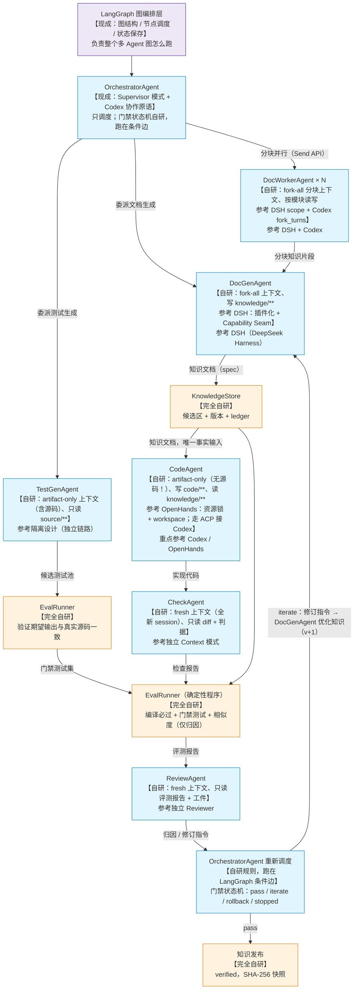
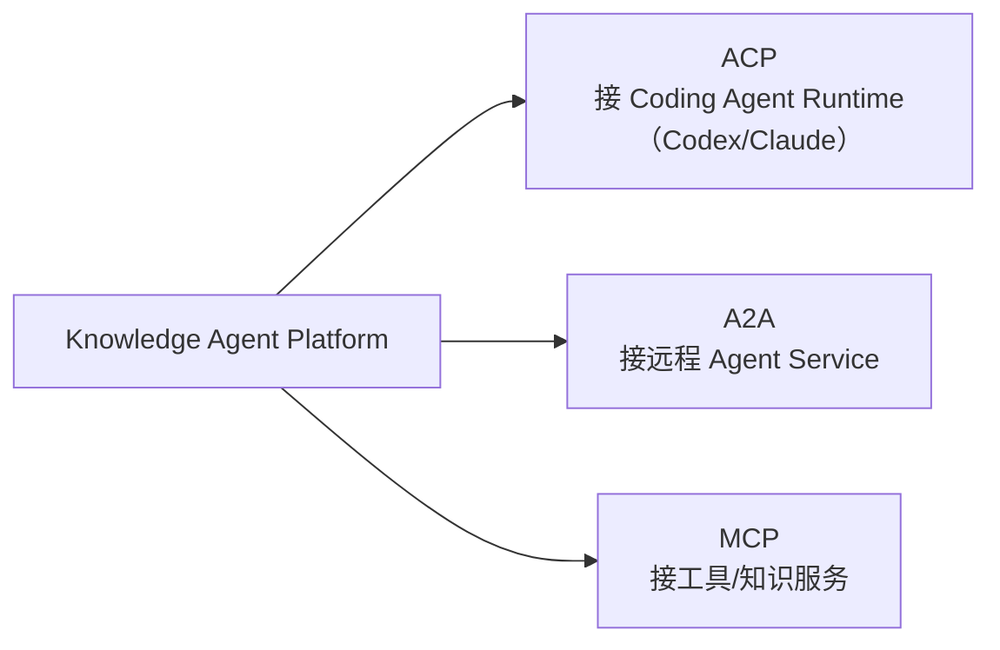

# 03 · Agent Platform 架构设计（现成框架之外的"自研部分"）

> 日期：2026-08-26
> 定位：**以框架选型图（用户版）为锚点**，说明哪些能力是现成框架已经给的（LangGraph 图、Codex / Claude / DeepSeek Agent 本体、MCP / ACP / A2A 协议），哪些必须平台自研（AgentProvider / ContextPolicy / ResourceClaim / AgentRun / AgentSession / 副作用幂等），以及自研部分怎么实现。选型图上每个"参考 XXX"具体参考它的哪些部分，见第 2 节参考清单。
> 关联：[01-多agent调研.md](01-多agent调研.md)（业务架构）｜ [02-技术选型与架构决策.md](02-技术选型与架构决策.md)（为什么这么选）｜ [04-LangGraph选型与多Agent图.md](04-LangGraph选型与多Agent图.md)（框架选型）

---

## 0. 标注版选型图（每个 Agent 需要什么自研能力）

这是框架选型图（用户暂定版），蓝色 Agent 框上标注**【平台必须自研的能力】**与**参考来源**：



**一句话看懂**：
- **紫色 LangGraph** = 现成：图结构 / 节点调度 / 状态保存（checkpoint），不用我们写
- **蓝色 Agent** = 现成框架跑（LLM / Coding Agent），但"**用什么上下文跑（ContextPolicy）+ 能读写哪些资源（ResourceClaim）+ 用哪个 Provider 跑（AgentProvider）**"这 3 件事必须平台自研（防作弊隔离是硬约束，不能靠 prompt）
- **橙色框** = 完全自研（业务壁垒）

---

## 1. 现成 vs 自研 分工（先看这张表）

| 能力 | 现成（用谁的） | 自研（平台做） |
|---|---|---|
| 图编排（节点 / 边 / 并行 / 循环 / 状态保存） | LangGraph（checkpointer 存图状态） | 不写图运行时 |
| 调度模式 | LangGraph Supervisor（OrchestratorAgent 骨架） | 门禁状态机规则（条件边实现） |
| Agent 本体 | Codex / Claude / DeepSeek / GLM（走 ACP 或 Provider） | 不重造 Coding Agent |
| 上下文注入策略 | 无现成（prompt 约束是软约束） | **ContextPolicy**（artifact-only 禁源码等，物理不给） |
| 资源冲突判定 | 无现成（maxConcurrency 只限数量） | **ResourceClaim**（A∥B safe / A∥C conflict） |
| 运行句柄 / 血缘 / 审计 | 无现成 | **AgentRun / AgentSession**（Session Event Log） |
| 副作用幂等 | LangGraph 节点失败后可能重跑 | **GenerationKey** 去重 |
| 确定性评测 / 知识库 | 编译器 g++ / Postgres / 对象存储 | **EvalRunner / KnowledgeStore**（知识飞轮） |
| 接外部 | MCP / ACP / A2A 标准协议 | 协议 Adapter |

**判定标准**：能现成（图、Agent 本体、协议、编译器）绝不重复造轮子；现成给不了的（上下文隔离、资源冲突、会话审计、评测门禁、知识版本）必须自研，这是防作弊与业务壁垒所在。

---

## 2. 参考映射：每个 Agent / 协议 → 参考框架的哪个部分（核心）

> 原则：参考的是**机制**不是**代码**。DSH 官方 developer preview（会有 breaking change），只借鉴设计不引入依赖；Codex 的"共享工作区"我们**反用**为物理隔离。所有机制来自官方源码 / 官方文档（2026 现状）。

### 2.1 OrchestratorAgent（调度）← LangGraph Supervisor + Codex

| 我们用在哪里 | 参考框架 | 参考它的哪个部分 | 机制是什么 | 证据 |
|---|---|---|---|---|
| 委派骨架（规划 / 拆解 / 委派 / 汇总） | LangGraph Supervisor | `create_supervisor` 模式 | supervisor 节点统一协调一组专业 agent，控制所有通信流与任务委派 | https://github.com/langchain-ai/langgraph-supervisor |
| 交接方式 | LangGraph Supervisor | Tool-based handoff | agent 之间通过工具调用交接（官方推荐的手动 supervisor 模式） | 同上 |
| 汇总防上下文膨胀 | LangGraph Supervisor | 消息历史管理（output_mode） | full_history（保留全部）或 final_response（只留最终回复） | 同上 |
| 子任务调用面 | Codex | 协作原语六件套 | spawn_agent / followup_task / send_message / wait_agent / interrupt_agent / list_agents | https://github.com/openai/codex/blob/main/codex-rs/core/src/session/multi_agents.rs |
| 并行上限 | Codex | max_concurrent_threads_per_session | 会话级并发槽位（"up to N agents can be active at once"） | 同上 |
| 决策路由 | 自研 | 门禁状态机（条件边实现） | pass / iterate / rollback / stopped 是业务规则，不参考框架 | 01 §4.5.1 |

### 2.2 DocGenAgent（文档生成）← DSH

| 我们用在哪里 | 参考框架 | 参考它的哪个部分 | 机制是什么 | 证据 |
|---|---|---|---|---|
| 运行底座可插拔 | DSH | Everything is a Plugin | 模型适配器 / 工具注册表 / 会话日志 / agent loop 全是插件，无特权核心，任何部分可替换 | https://github.com/deepseek-ai/deepseek-harness （docs/architecture.md） |
| Provider 三角色 | DSH | Capability Seam | Service Definition（接口声明）+ Service Provider（实现）+ Consumer（使用方） | 同上 |

### 2.3 DocWorkerAgent × N（分块并行）← DSH + Codex

| 我们用在哪里 | 参考框架 | 参考它的哪个部分 | 机制是什么 | 证据 |
|---|---|---|---|---|
| 每块独立上下文 | DSH | agent.ctx（scope） | per-agent 作用域注册，只对单个 agent 生效 | https://github.com/deepseek-ai/deepseek-harness （docs/architecture.md） |
| 上下文传播粒度 | Codex | fork_turns 参数 | all（全量）/ none（不传）/ N（最近 N 轮）→ 对应 fork-all / fresh / fork-last-n | https://github.com/openai/codex/blob/main/codex-rs/core/src/session/multi_agents.rs |
| 分块产物交接 | Codex | 共享工作区语义（**反用**） | 原意：所有 agent 共享目录、编辑立即可见；我们只交接产物文件（结构化摘要 + 溯源锚点），源码物理隔离 | 同上 |

### 2.4 TestGenAgent（行为 oracle）← 隔离设计（01 论文依据，非外部框架）

| 我们用在哪里 | 参考框架 | 参考它的哪个部分 | 机制是什么 | 证据 |
|---|---|---|---|---|
| 独立链路 | 01 隔离设计（TDD-Agent 教训） | test-first 推理 + 独立 TestGenAgent | 读源码提取行为 oracle、**不读知识文档**；期望输出经 EvalRunner 验证真实性，禁 LLM 编造 | 01 §4.5.3 设计依据 |

### 2.5 CodeAgent（代码生成）← Codex / OpenHands（经 ACP 接入）

| 我们用在哪里 | 参考框架 | 参考它的哪个部分 | 机制是什么 | 证据 |
|---|---|---|---|---|
| 接现成 Coding Agent | ACP（Codex / OpenHands 均实现该协议） | 协议规范 + 官方 TS SDK v1.4 | Platform ↔ Coding Agent Runtime 标准协议，只做 Adapter | https://github.com/agentclientprotocol/agent-client-protocol |
| 上下文隔离 | Codex | fork_turns=none 语义（**反用强化**） | 不给源码：artifact-only 只注入知识文档 + 接口 | https://github.com/openai/codex/blob/main/codex-rs/core/src/session/multi_agents.rs |
| 资源冲突判定 | OpenHands | ResourceLockManager | per-resource FIFO 锁：同资源串行、异资源并发；排序获取防死锁；前缀区分超时 | https://github.com/OpenHands/software-agent-sdk （resource_lock_manager.py） |
| 运行形态 | OpenHands | Conversation + workspace | Agent 绑定 workspace 运行，工具在 workspace 内生效 | https://github.com/OpenHands/software-agent-sdk |
| 物理隔离沙箱 | OpenHands | Ephemeral workspaces（Agent Server） | Docker / K8s 临时工作区运行 Agent | 同上 |

### 2.6 CheckAgent（独立检查）← 独立 Context 模式（01 论文依据 CCR）

| 我们用在哪里 | 参考框架 | 参考它的哪个部分 | 机制是什么 | 证据 |
|---|---|---|---|---|
| fresh 上下文 | CCR（Cross-Context Review） | 上下文分离审查 | 全新 session、不知道作者、只读 diff + 判据；F1 28.6% vs 同会话自审 24.6%，重复审两次无增益（p=0.11） | https://arxiv.org/abs/2603.12123 （01 §4.5.3） |

### 2.7 ReviewAgent（归因修订）← 独立 Reviewer（01 论文依据 CCR + SDAD）

| 我们用在哪里 | 参考框架 | 参考它的哪个部分 | 机制是什么 | 证据 |
|---|---|---|---|---|
| 独立归因 | CCR | 独立评审者模式 | 只读评测报告 + 工件，无生成历史，消除自我偏好 | https://arxiv.org/abs/2603.12123 （01 §4.5.4） |
| 修订指令 | SDAD | 可执行判据 | 修订指令三字段（ID + 段落路径 + 可执行判据），纯 NL 建议不能驱动合并 | https://arxiv.org/abs/2608.20341 （01 §4.5.4） |

### 2.8 协议：ACP / MCP / A2A ← 直接采用标准（不是"参考"，是"采用"）

| 协议 | 我们用在 | 采用它的哪个部分 | 证据 |
|---|---|---|---|
| ACP | CodeAgent 接 Codex / Claude | 协议规范 + 官方 TS SDK v1.4；只做 Adapter，业务不直接写协议 | https://github.com/agentclientprotocol/agent-client-protocol |
| MCP | Agent 调工具 / 检索 / 知识 | 协议规范直接采用（版本 2026-07-28） | https://modelcontextprotocol.io/ |
| A2A | 未来跨系统 Agent 互调 | 协议规范直接采用（按需，Linux Foundation） | https://github.com/a2aproject/A2A |

### 2.9 平台组件参考汇总（跨 Agent 复用的自研组件，各参考了什么）

| 平台组件 | 参考框架 | 参考它的哪个部分 | 详见 |
|---|---|---|---|
| AgentProvider | DSH | Capability Seam 三角色 + Everything is a Plugin | 第 4 节 |
| AgentSession（Session Event Log） | DSH | Session Event Log（"Model-visible means logged"；fork / resume / telemetry 都从日志派生） | 第 5 节 |
| ContextPolicy | Codex + DSH | Codex fork_turns（all / none / N）；DSH agent/pre-step（进模型前最后一道裁剪） | 第 6 节 |
| ResourceClaim | OpenHands | ResourceLockManager（per-resource FIFO 锁 / 排序防死锁 / 前缀超时） | 第 7 节 |
| Sandbox | OpenHands + DSH | OpenHands ephemeral workspaces；DSH ctx.sandbox / ctx.fs provider | 第 6 节 |

## 3. 平台给每个 Agent 什么（先看这张表）

| 图上节点 | 用什么上下文（ContextPolicy） | 能读写什么（ResourceClaim） | 谁在跑 |
|---|---|---|---|
| DocGenAgent | fork-all（继承分块指令） | 读 source/，写 knowledge/ | AgentProvider（参考 DSH 插件化实现） |
| DocWorkerAgent×N | fork-all（每块独立上下文，Codex fork_turns 语义） | 各读 source/moduleX/，写 knowledge/moduleX/ | AgentProvider（LangGraph Send 并行） |
| TestGenAgent | artifact-only（源码+接口） | 读 source/（只读） | AgentProvider |
| CodeAgent | **artifact-only（知识文档+接口，无源码！）** | 读 knowledge/，写 code/ | AgentProvider / ACP（Codex / OpenHands） |
| CheckAgent | fresh（全新 session） | 读 diff+判据（只读） | AgentProvider |
| ReviewAgent | fresh（全新 session） | 读评测报告+工件（只读） | AgentProvider |

下面逐个能力解释"是什么、为什么、图上哪用"。这些都是**自研部分**。

---

## 4. AgentProvider：Agent 由谁运行（自研稳定接口）

### 4.1 图上位置

所有蓝色 Agent 框的"运行底座"。

### 4.2 为什么需要它

没有它，业务代码就会写 `if provider === "codex"` / `if provider === "deepseek"`，换模型就要改业务。Provider 把"跑哪个 Agent"变成可替换的（对应 DSH 的 Everything is a Plugin，见 2.3）。

### 4.3 与 LangGraph 的关系（节点 = 薄包装）

LangGraph 图上的每个蓝色节点 = **薄包装**：节点逻辑 = 调 `AgentProvider.start()` + 应用 ContextPolicy / ResourceClaim。图的结构（谁接谁、怎么循环）归 LangGraph，节点内部"跑哪个模型、注入什么上下文"归平台。

### 4.4 定义

```typescript
interface AgentProvider {
  readonly name: string;
  capabilities(): AgentCapabilities;       // 先问能力
  start(request: AgentStartRequest): Promise<AgentRun>;  // 再启动
}
```

- Provider 可以包装：本地 LLM API（DeepSeek / GLM）、Codex CLI、Claude Agent SDK、任意 NewAgent-X
- 设计参考：DSH 的 Capability Seam（Service Definition → Provider → Consumer，见 2.3）→ https://github.com/deepseek-ai/deepseek-harness ；Codex 的协作原语（见 2.2）→ https://github.com/openai/codex/blob/main/codex-rs/core/src/session/multi_agents.rs

### 4.5 能力声明（AgentCapabilities）：先问会不会，再派活

```typescript
interface AgentCapabilities {
  structuredOutput: boolean;   // 能输出结构化结果吗
  contextFork: boolean;        // 能显式 fork 上下文吗（Codex fork_turns）
  resume: boolean;             // 能恢复吗
  subagent: boolean;           // 能 spawn 子 agent 吗（Codex spawn_agent）
  toolFilter: boolean;         // 能限制工具白名单吗
  sandbox: boolean;            // 自带沙箱吗（OpenHands ephemeral workspace）
  streaming: boolean;          // 流式吗
}
```

**Fail loud（响亮失败，不静默降级）**：业务要求 `structuredOutput=true`，Provider 不支持 → 直接报 `UNSUPPORTED_CAPABILITY`，绝不偷偷降级成普通文本（否则 Eval / Artifact 契约会被破坏）。

---

## 5. AgentRun / AgentSession：Agent 不是一次函数调用

### 5.1 图上位置

所有蓝色 Agent 框的"运行时形态"。

### 5.2 为什么

旧接口 `run(input): Promise<output>` 太薄：Agent 可能跑几分钟、可能被取消、可能崩溃要恢复、可能有父子关系。要表达这些，需要运行句柄 + 会话。

### 5.3 AgentRun（执行句柄）

```typescript
interface AgentRun {
  id: AgentRunId;
  sessionId: SessionId;
  result: Promise<AgentResult>;       // 完成结果
  cancel(reason?: string): void;      // 取消（要级联子 agent）
  dispose(): Promise<void>;           // 释放
  status(): AgentStatus;              // created/running/completed/failed/aborted
}
```

### 5.4 AgentSession / Lineage（会话与血缘）

```typescript
interface AgentInstance {
  agentId: AgentId;
  sessionId: SessionId;
  parentSessionId?: SessionId;   // 父子血缘（DocGen → DocWorker 就是父子）
  role: string;                   // DocGen / TestGen / Code / Check / Review ...
  model: ModelId;
  permission: PermissionSet;
  workspace: WorkspaceRef;
  contextLineage: ContextPolicy;  // 上下文继承策略
  status: AgentStatus;
}
```

### 5.5 两套状态别混（LangGraph / Agent Session）

| | LangGraph graph state | Agent Session Event Log |
|---|---|---|
| 语义 | 图走到哪了（节点执行顺序） | 交互真相（模型看到了什么、调了什么工具） |
| 记录 | checkpoint（superstep 边界） | AgentStarted / ModelRequest / ToolCall / SubagentEnded... |
| 用途 | 本地断点续跑（图级） | 语义审计 / trace / eval 溯源 |
| 参考来源 | LangGraph（现成） | **DSH Session Event Log**（"Model-visible means logged"，见 2.3） |

图上：LangGraph 管"图结构"与本地 checkpoint，Session Log 管"蓝色框"里 LLM 干了什么。

---

## 6. ContextPolicy：Agent 用什么上下文跑（自研，本项目最重要的能力）

### 6.1 图上位置

- **CodeAgent 必须看不到源码** → artifact-only（知识文档+接口，无源码）
- **TestGenAgent 读源码** → artifact-only（含源码）
- **CheckAgent / ReviewAgent 全新上下文** → fresh（不知道作者、无生成历史）
- **DocWorkerAgent 分块** → fork-all（继承分块指令）

### 6.2 定义

```typescript
interface ContextPolicy {
  mode:
    | "fresh"            // 全新上下文（Check/Review 默认，对应 Codex fork_turns=none）
    | "fork-all"         // 继承全部父上下文（DocWorker 子任务，对应 Codex fork_turns=all）
    | "fork-last-n"      // 只继承最近 N 轮（控制膨胀，对应 Codex fork_turns=N）
    | "artifact-only";   // 只注入指定 Artifact（CodeAgent：知识文档+接口）
}
```

### 6.3 为什么是"平台能力"而不是"prompt 约束"

- prompt 里写"不要看源码" = 软约束，Agent 可能违反
- **ContextPolicy = 硬约束**：平台在注入上下文时**物理上就不给**源码 → 配合 Sandbox 双重强制
- 注入时机参考 DSH `agent/pre-step`（进模型前最后一道裁剪，见 2.3）；模式语义参考 Codex `fork_turns`（见 2.2）

---

## 7. ResourceClaim：谁和谁可以并行（自研）

### 7.1 图上位置

- DocWorkerAgent×N 并行 → 需要判定 A/B/C 是否真独立
- 未来多 Agent 并行写产物 → 需要资源冲突判定

### 7.2 为什么不是 maxConcurrency = 5

OpenHands 的教训：并发不只是"限数量"，还要看**共享资源冲突**：

```
Agent A writes moduleA
Agent B writes moduleB   → A ∥ B safe（可以并行）
Agent C writes moduleA   → A ∥ C conflict（不能并行）
```

### 7.3 定义

```typescript
interface ResourceClaim {
  uri: string;              // 如 "knowledge/moduleA/**"
  mode: "read" | "write";
}
```

| Agent | read | write |
|---|---|---|
| DocWorker A | source/moduleA/** | knowledge/moduleA/** |
| DocWorker B | source/moduleB/** | knowledge/moduleB/** |
| CodeAgent | knowledge/moduleA/** | code/moduleA/** |

调度系统据此判定：无写冲突 → 可并行；有写冲突 → 串行。比 `maxConcurrency=5` 精确得多。

**实现参考 OpenHands `ResourceLockManager`（见 2.4）**：
- per-resource 锁（按 `uri` 键加锁），同一资源串行、不同资源并发
- 锁按排序顺序获取，防死锁（多 Agent 申请重叠资源集时）
- FIFO 公平，不饥饿；按资源前缀区分超时（文件写 vs 长任务）

---

## 8. 副作用幂等（自研，业务正确性）

### 8.1 图上位置

Agent 每次调 LLM / 写 Artifact / 发知识，都要防重复。

### 8.2 为什么需要

LangGraph 节点在中途崩溃后可能重跑，存在"LLM 已返回但结果没提交 → 进程退出 → 节点重跑 → 再调一次"的窗口。所以**业务副作用去重要平台自己做**：

- LLM 调用去重：`GenerationKey = runId + moduleId + iteration + agentType + promptHash + modelConfigHash`
- Artifact 写幂等：同 key 重复写不产生脏产物
- 知识发布幂等：按版本号幂等

---

## 9. 连接外部：ACP / A2A / MCP（现成协议，只做 Adapter）



| 协议 | 图上哪 | 什么场景 | 来源 |
|---|---|---|---|
| **ACP** | CodeAgent 接 Codex / Claude | 本地 / CLI Coding Agent | 现成 → https://github.com/agentclientprotocol/agent-client-protocol |
| **A2A** | 未来跨系统 | 远程独立 Agent Service | 现成 → https://github.com/a2aproject/A2A |
| **MCP** | Agent 调工具 / 检索 / 知识 | Tool / Knowledge Service | 现成 → https://modelcontextprotocol.io/ |

**结构（业务不直接碰协议）**：

```
Knowledge Agent Platform
   → AgentProvider（稳定 Contract）
      → ACP Adapter → Codex / Claude / Other
```

ACP v2/v3 升级 → 只改 Adapter。

---

## 10. V1 / V2 边界（对照图）

**V1**：
- LangGraph 定义 7 Agent 图：节点 = AgentProvider 薄包装、条件边 = 门禁状态机、Send = DocWorker 并行、SQLite checkpointer
- 图上所有蓝色框跑在 AgentProvider 上
- CodeAgent 的 ContextPolicy = artifact-only（看不到源码）
- DocWorker 并行用 ResourceClaim 判定（参考 OpenHands ResourceLockManager）
- 本地恢复：LangGraph SQLite checkpointer + Run Registry（应用启动恢复）
- 接 Codex / Claude 用 ACP PoC；工具 / 知识用 MCP
- 副作用幂等（GenerationKey）就位

**V2+**：
- Agent Teams（Task DAG / durable mailbox / writeScopes）
- rich A2A / 跨 repo 调度 / 分布式 Agent Provider / 智能 Resource Scheduler
- 云端 KnowledgeStore 同步、版本冲突治理与发布审核

## 11. 成功标准（怎么算设计对）

1. 新 Coding Agent（NewAgent-X）出现 → 只加 Provider 或 ACP 配置，**不动**飞轮 / 图 / EvalRunner / KnowledgeStore
2. LangGraph 被替换 → 只改图的定义（节点 / 边描述），**不重写**平台和业务
3. Checkpointer 被替换 → 只改本地持久化 Adapter，**不重写**平台和业务
4. 模型 DeepSeek → GLM → OpenAI → private → 只改 Model / Agent Provider

**若做不到以上任意一条，说明 Agent Platform abstraction 设计失败。**
