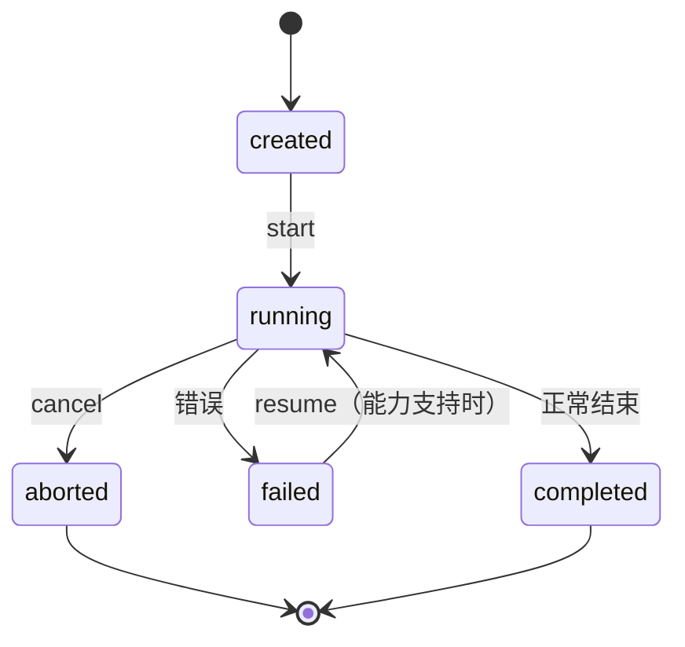
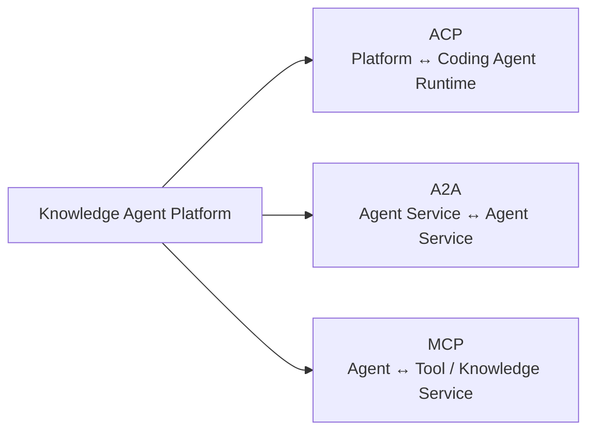

# 03 · Agent Platform 架构设计

> 日期：2026-08-26
> 定位：Agent Platform 的**稳定内部 Contract** 设计。这是长期核心抽象，定义"Agent 是什么、如何运行、如何隔离、如何互操作"。外部项目（Codex / DSH / OpenHands）只作为**设计证据**，不以它们为中心。
> 关联：[01-多agent架构设计.md](01-多agent架构设计.md)（业务架构）｜ [02-技术选型与架构决策.md](02-技术选型与架构决策.md)（为什么这么选）

---

## 1. 设计目标

- **Stable Contract**：Agent Platform 是公司级长期 API，必须 vendor-neutral、可演进、可替换底层
- **Fail loud, no silent degradation**：能力不满足直接报 UNSUPPORTED_CAPABILITY，不偷偷降级
- **信息隔离是 Platform capability，不是 prompt 约束**：CodeAgent 看不到源码、TestGen/Eval 边界，由平台强制
- **业务层不直接依赖任何第三方 Agent abstraction**：不出现 `if provider === "codex"`

### 核心原则：Agent 是一个运行实体，不是一个函数

废弃过薄的接口：

```typescript
// ❌ 废弃：太薄，无法表达 Session / Lifecycle / Context / Permission / Cancellation
interface Agent<I, O> {
  run(input: I): Promise<O>;
}
```

Agent 具有：Session、Lifecycle、Context、Permission、Workspace、Capabilities、Parent/Child、Cancellation、Resume。

---

## 2. AgentProvider

### 2.1 定义

```typescript
interface AgentProvider {
  readonly name: string;
  capabilities(): AgentCapabilities;
  start(request: AgentStartRequest): Promise<AgentRun>;
}
```

- Provider 是 Agent Runtime backend 的抽象（DSH Capability Seam 思想：Service Definition → Service Provider → Consumer）
- 一个 Provider 可以包装：Codex CLI、Claude Agent SDK、DSH、OpenHands、公司内部 codeagent CLI、未来任意 NewAgent-X
- **Domain 层绝不能出现 `if provider === "codex"`**；所有差异通过 Adapter 隔离

### 2.2 Provider 分类

| Provider | 场景 |
|---|---|
| LocalProvider（自研薄封装） | 直接调 LLM API（DeepSeek / GLM / OpenAI），自带 Sandbox |
| ACPProvider | 通过 ACP 控制任意 Coding Agent Runtime（Codex / Claude / Gemini） |
| DSHProvider（评估期） | 通过 DSH SDK 接入其插件生态（Developer Preview，不绑定） |
| OpenHandsProvider（评估期） | 通过 OpenHands Software Agent SDK |

---

## 3. AgentCapabilities（能力声明）

参考 DSH capability seam。**能力协商在前，运行在后**：

```typescript
interface AgentCapabilities {
  structuredOutput: boolean;   // 结构化输出
  contextFork: boolean;        // 显式上下文 fork（fork_turns）
  resume: boolean;             // 可恢复
  subagent: boolean;           // 可 spawn 子 agent
  toolFilter: boolean;         // 工具白名单/过滤
  sandbox: boolean;            // 自带沙箱
  streaming: boolean;          // 流式输出
}
```

**Fail loud 示例**：业务要求 `structuredOutput = true`，Provider 不支持 → 直接抛 `UNSUPPORTED_CAPABILITY`，绝不静默降级成普通文本（否则 Eval/Artifact 契约会被破坏）。

---

## 4. AgentRun（执行句柄）

参考 Codex + DSH。Agent 执行不是 Promise，是有生命周期的运行实体：

```typescript
interface AgentRun {
  id: AgentRunId;
  sessionId: SessionId;
  result: Promise<AgentResult>;       // 完成结果
  cancel(reason?: string): void;      // 取消（parent cancel 需级联 child）
  dispose(): Promise<void>;           // 释放资源
  status(): AgentStatus;              // created / running / completed / failed / aborted
}
```

生命周期：



Parent cancellation 必须考虑 **child cascade**（子 agent 树级联取消），由 AgentSession lineage 驱动。

---

## 5. AgentSession / Lineage

```typescript
interface AgentInstance {
  agentId: AgentId;
  sessionId: SessionId;
  parentSessionId?: SessionId;   // parent-child lineage
  role: string;                   // DocGen / TestGen / Code / Check / Review ...
  model: ModelId;                 // DeepSeek / GLM / OpenAI / private
  permission: PermissionSet;
  workspace: WorkspaceRef;
  contextLineage: ContextPolicy;  // 上下文继承策略
  status: AgentStatus;
  runHistory: AgentRunSummary[];
}
```

**Agent Session ≠ Temporal Workflow**：

| | Temporal Event History | Agent Session Event Log |
|---|---|---|
| 语义 | workflow execution truth | agent semantic interaction truth |
| 记录 | Commands / Events / Activity 结果 | AgentStarted / ModelRequest / ToolCall / SubagentEnded ... |
| 用途 | 执行恢复 / 审计 | 语义审计 / trace / eval provenance |

二者**不能混**：Temporal 管执行真相，Session Log 管交互真相。

---

## 6. ContextPolicy（上下文策略）

本项目最重要的能力之一。参考 Codex explicit context fork（`fork_turns = all / N / none`）：

```typescript
interface ContextPolicy {
  mode:
    | "fresh"            // 全新上下文（CheckAgent / ReviewAgent 默认）
    | "fork-all"         // 继承全部父上下文（DocWorker 子任务）
    | "fork-last-n"      // 只继承最近 N 轮（控制膨胀）
    | "artifact-only";   // 只注入指定 Artifact（CodeAgent：知识文档 + 接口）
}
```

**为什么必须**：DocGen / CodeAgent / TestGen / ReviewAgent 绝不能默认看到同样 Context。尤其 **CodeAgent 不能看到原始 Source** —— 上下文隔离必须是 Platform capability（Sandbox + ContextPolicy 双层强制），不能只靠 prompt 约束。

业务默认映射：

| Agent | ContextPolicy | 可见内容 |
|---|---|---|
| DocGenAgent | fork-all（大库：fresh + artifact） | 源码块 / 依赖图 |
| DocWorkerAgent | fork-all（继承分块指令） | 模块子集 |
| TestGenAgent | artifact-only | 源码 + 接口头文件 |
| CodeAgent | **artifact-only** | **知识文档 + 接口（无源码）** |
| CheckAgent | fresh | 代码 diff + 判据清单 |
| ReviewAgent | fresh | 评测报告 + 工件 |

---

## 7. ResourceClaim（资源声明）

参考 OpenHands `ResourceLockManager` + DSH `writeScopes`。**并发控制不是 maxConcurrency = N**，而是资源冲突判定：

```typescript
interface ResourceClaim {
  uri: string;              // 资源路径，如 "knowledge/moduleA/**"
  mode: "read" | "write";
}
```

示例：

| Agent | read | write |
|---|---|---|
| DocWorker A | `source/moduleA/**` | `knowledge/moduleA/**` |
| DocWorker B | `source/moduleB/**` | `knowledge/moduleB/**` |
| CodeAgent | `knowledge/moduleA/**` | `code/moduleA/**` |

调度系统据此判定：A ∥ B safe（无重叠）；若 Agent C write `knowledge/moduleA/**` 则 A ∥ C conflict。比 `maxConcurrency = 5` 更精确。ResourceClaim 也是 **WorkflowCoordinator dispatch policy 的输入**（哪些任务可并行、哪些必须串行）。

---

## 8. Agent Session Event Log

参考 DSH。持久化 Agent 语义事件：

```
AgentStarted
UserMessage
ContextInjected
ModelRequest
AssistantMessage
ToolCall
ToolResult
SubagentStarted
SubagentEnded
AgentFailed
AgentCancelled
AgentCompleted
```

用途：audit / trace / debugging / session resume / eval provenance / observability。

核心原则：**model-visible information should be reconstructable**（模型看到什么必须可重建，支持 eval 溯源与防作弊审计）。但**不要重新实现 Temporal execution log**（执行层事件归 Temporal，语义层事件归 Session Log）。

---

## 9. 协议适配（ACP / A2A / MCP）

### 9.1 分层（不造重复协议）



| 协议 | 用途 | 在本项目的场景 |
|---|---|---|
| **MCP** | Agent ↔ Tool / Knowledge Service | 工具 / 检索 / 知识服务接入 |
| **ACP** | Platform ↔ Coding Agent Runtime | 本地 / CLI Coding Agent（Codex / Claude / Gemini） |
| **A2A** | Agent Service ↔ Agent Service | 远程独立 Agent Service 互操作 |

除非标准协议被证明无法满足，否则不新建 CompanyAgentProtocol。

### 9.2 ACP（Coding Agent 主要 Adapter 候选）

```
Knowledge Agent Platform
        │
   AgentProvider（稳定 Contract）
        │
    ACP Adapter
        │
 ┌──────┼──────────┐
 ▼      ▼          ▼
Codex  Claude   Other ACP Agents
```

- 官方：https://github.com/agentclientprotocol/agent-client-protocol ；TS SDK v1.4：https://agentclientprotocol.github.io/typescript-sdk/
- 业务层**不直接依赖 ACP 类型**：AgentProvider Contract 是稳定层，ACP 只是 Adapter
- ACP v2/v3 breaking → 只修改 ACP Adapter

---

## 10. 副作用幂等（Domain correctness）

Temporal 保证 execution reliability，**不保证业务副作用幂等**。Agent Platform 必须实现：

- **LLM invocation deduplication**：`GenerationKey = workflowRunId + moduleId + iteration + agentType + promptHash + modelConfigHash`
- **Artifact write idempotency**：同 key 重复写不产生重复/脏产物（CAS 或版本号）
- **Knowledge publish idempotency**：知识发布按版本号幂等

> 背景竞态：LLM 已返回 → Worker 收到结果 → ActivityTaskCompleted 未提交 → 崩溃 → Temporal retry → LLM 可能再次调用。平台层用 GenerationKey 去重。

---

## 11. 设计证据（外部项目，仅参考）

| 项目 | 吸收什么 | 不吸收什么 |
|---|---|---|
| OpenAI Codex | Agent=Session；parent-child lineage；explicit context fork（fork_turns）；lifecycle/cancellation/permission per agent | 绑定 OpenAI 模型/协议 |
| DeepSeek Harness | Everything is a Plugin；Capability Seam（Provider 抽象）；Session Event 记录；Agent Teams（V2） | Developer Preview 的不稳定 API；DSH workflowEngine（那是 Agent DSL，不是 durable runtime） |
| OpenHands SDK | ParallelToolExecutor；ResourceLockManager；DeclaredResources；Workspace isolation | 其 Python-first API 形态 |
| OpenAI Agents SDK | Agent/Handoff/Guardrail/Session/Tracing 概念 | 不让 OpenAI Agent 成为核心 Domain 类型 |
| Microsoft Agent Framework | 重点观察（Workflow/Durable/HITL） | 当前不采用（成熟度观察期，见 02 §3.6） |

---

## 12. V1 / V2 实现边界

**V1 实现**：AgentProvider / AgentCapabilities / AgentRun / AgentSession / ContextPolicy / ResourceClaim / Artifact Contract / Permission / Sandbox / Trace Context / Basic Session Event Log / Model Adapter / ACP PoC。

**V2+ 演进**：完整 Agent Session Event 体系；Resource Scheduler（基于 ResourceClaim 的智能调度）；Agent Teams（Durable Roster / Mailbox / Shared Task DAG / revision-CAS / writeScopes）；rich A2A；distributed Agent Provider；Dynamic Agent Graph（LangGraph evaluation）。

**成功标准**（可替换测试）：
1. 新 Coding Agent 出现 → 新增 Provider 或 ACP 配置，不动 Domain / Workflow / Eval
2. Temporal 被替换 → 只改 WorkflowRuntime Adapter
3. 模型更换 → 只改 Model / Agent Provider
