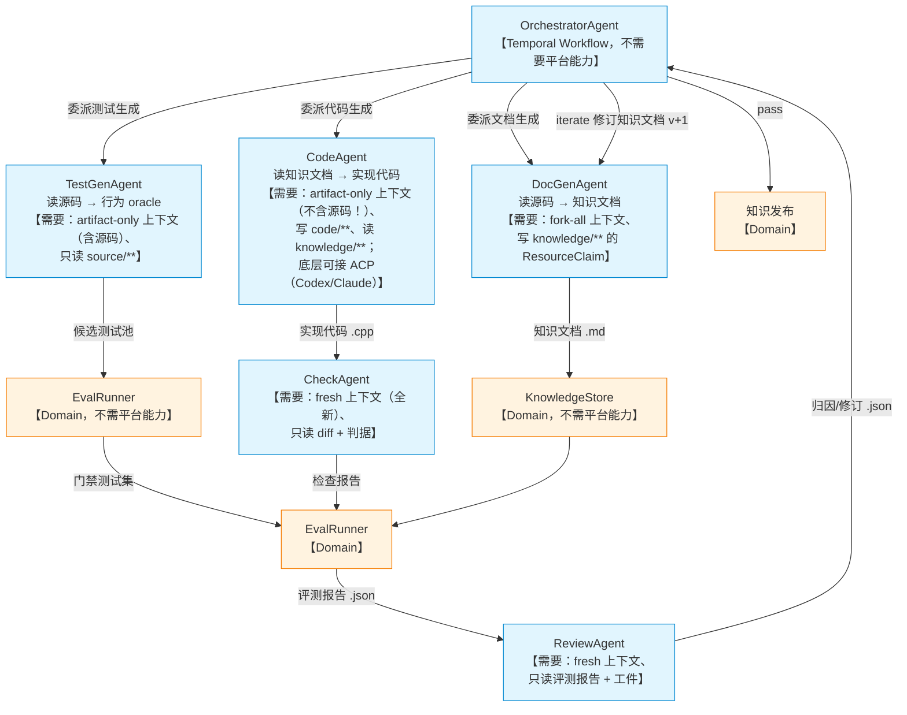
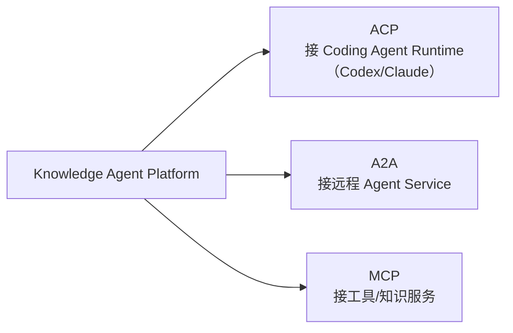

# 03 · Agent Platform 架构设计（对照架构图）

> 日期：2026-08-26
> 定位：**以 01 的 Agent 架构编排图为锚点**，说明每个 Agent 节点"运行时需要平台提供什么能力"，以及这些能力怎么实现。先看标注版架构图，再按图逐块展开。
> 关联：[01-多agent调研.md](01-多agent调研.md)（业务架构）｜ [02-技术选型与架构决策.md](02-技术选型与架构决策.md)（为什么这么选）

---

## 0. 标注版架构图（每个 Agent 需要什么能力）



**一句话看懂**：每个 Agent 需要的平台能力 = **"用什么上下文跑（ContextPolicy）+ 能读写哪些资源（ResourceClaim）+ 用哪个 Provider 跑（AgentProvider）"**。这张图就是 03 的目录。

---

## 1. 平台给每个 Agent 什么（先看这张表）

| 图上节点 | 用什么上下文 | 能读写什么 | 谁在跑 |
|---|---|---|---|
| DocGenAgent | fork-all（继承分块指令） | 读 source/，写 knowledge/ | AgentProvider |
| DocWorkerAgent×N | fork-all（每块独立上下文） | 各读 source/moduleX/，写 knowledge/moduleX/ | AgentProvider（并行） |
| TestGenAgent | artifact-only（源码+接口） | 读 source/（只读） | AgentProvider |
| CodeAgent | **artifact-only（知识文档+接口，无源码！）** | 读 knowledge/，写 code/ | AgentProvider / ACP |
| CheckAgent | fresh（全新 session） | 读 diff+判据（只读） | AgentProvider |
| ReviewAgent | fresh（全新 session） | 读评测报告+工件（只读） | AgentProvider |

下面逐个能力解释"是什么、为什么、图上哪用"。

---

## 2. AgentProvider：Agent 由谁运行

### 2.1 图上位置

所有蓝色 Agent 框的"运行底座"。

### 2.2 为什么需要它

没有它，业务代码就会写 `if provider === "codex"` / `if provider === "deepseek"`，换模型就要改业务。Provider 把"跑哪个 Agent"变成可替换的。

### 2.3 定义

```typescript
interface AgentProvider {
  readonly name: string;
  capabilities(): AgentCapabilities;       // 先问能力
  start(request: AgentStartRequest): Promise<AgentRun>;  // 再启动
}
```

- Provider 可以包装：本地 LLM API（DeepSeek/GLM）、Codex CLI、Claude Agent SDK、任意 NewAgent-X
- 设计参考：DSH 的 Capability Seam（Service Definition → Provider → Consumer）→ https://github.com/deepseek-ai/deepseek-harness ；Codex 的 multi-agent 源码 → https://github.com/openai/codex/blob/main/codex-rs/core/src/session/multi_agents.rs

### 2.4 能力声明（AgentCapabilities）：先问会不会，再派活

```typescript
interface AgentCapabilities {
  structuredOutput: boolean;   // 能输出结构化结果吗
  contextFork: boolean;        // 能显式 fork 上下文吗
  resume: boolean;             // 能恢复吗
  subagent: boolean;           // 能 spawn 子 agent 吗
  toolFilter: boolean;         // 能限制工具白名单吗
  sandbox: boolean;            // 自带沙箱吗
  streaming: boolean;          // 流式吗
}
```

**Fail loud（响亮失败，不静默降级）**：业务要求 `structuredOutput=true`，Provider 不支持 → 直接报 `UNSUPPORTED_CAPABILITY`，绝不偷偷降级成普通文本（否则 Eval/Artifact 契约会被破坏）。

---

## 3. AgentRun / AgentSession：Agent 不是一次函数调用

### 3.1 图上位置

所有蓝色 Agent 框的"运行时形态"。

### 3.2 为什么

旧接口 `run(input): Promise<output>` 太薄：Agent 可能跑几分钟、可能被取消、可能崩溃要恢复、可能有父子关系。要表达这些，需要运行句柄 + 会话。

### 3.3 AgentRun（执行句柄）

```typescript
interface AgentRun {
  id: AgentRunId;
  sessionId: SessionId;
  result: Promise<AgentResult>;       // 完成结果
  cancel(reason?: string): void;      // 取消（要级联子 agent）
  dispose(): Promise<void>;           // 释放
  status(): AgentStatus;              // created/running/completed/failed/aborted
}
```

### 3.4 AgentSession / Lineage（会话与血缘）

```typescript
interface AgentInstance {
  agentId: AgentId;
  sessionId: SessionId;
  parentSessionId?: SessionId;   // 父子血缘（DocGen → DocWorker 就是父子）
  role: string;                   // DocGen / TestGen / Code / Check / Review ...
  model: ModelId;
  permission: PermissionSet;
  workspace: WorkspaceRef;
  contextLineage: ContextPolicy;  // 上下文继承策略
  status: AgentStatus;
}
```

### 3.5 ⚠️ Agent Session ≠ Temporal Workflow（别混）

| | Temporal Event History | Agent Session Event Log |
|---|---|---|
| 语义 | 执行真相（谁跑了、重试几次、崩溃点） | 交互真相（模型看到了什么、调了什么工具） |
| 记录 | Commands/Events/Activity 结果 | AgentStarted/ModelRequest/ToolCall/SubagentEnded... |
| 用途 | 执行恢复/审计 | 语义审计/trace/eval 溯源 |

图上：Temporal 管"流程箭头"的执行，Session Log 管"蓝色框"里 LLM 干了什么。

---

## 4. ContextPolicy：Agent 用什么上下文跑（本项目最重要的能力）

### 4.1 图上位置

- **CodeAgent 必须看不到源码** → artifact-only（知识文档+接口，无源码）
- **TestGenAgent 读源码** → artifact-only（含源码）
- **CheckAgent / ReviewAgent 全新上下文** → fresh（不知道作者、无生成历史）
- **DocWorkerAgent 分块** → fork-all（继承分块指令）

### 4.2 定义

```typescript
interface ContextPolicy {
  mode:
    | "fresh"            // 全新上下文（Check/Review 默认）
    | "fork-all"         // 继承全部父上下文（DocWorker 子任务）
    | "fork-last-n"      // 只继承最近 N 轮（控制膨胀）
    | "artifact-only";   // 只注入指定 Artifact（CodeAgent：知识文档+接口）
}
```

### 4.3 为什么是"平台能力"而不是"prompt 约束"

- prompt 里写"不要看源码" = 软约束，Agent 可能违反
- **ContextPolicy = 硬约束**：平台在注入上下文时**物理上就不给**源码 → 配合 Sandbox 双重强制
- 参考：Codex 的显式上下文 fork（`fork_turns = all / N / none`）

---

## 5. ResourceClaim：谁和谁可以并行

### 5.1 图上位置

- DocWorkerAgent×N 并行 → 需要判定 A/B/C 是否真独立
- 未来多 Agent 并行写产物 → 需要资源冲突判定

### 5.2 为什么不是 maxConcurrency = 5

OpenHands 的教训：并发不只是"限数量"，还要看**共享资源冲突**：

```
Agent A writes moduleA
Agent B writes moduleB   → A ∥ B safe（可以并行）
Agent C writes moduleA   → A ∥ C conflict（不能并行）
```

### 5.3 定义

```typescript
interface ResourceClaim {
  uri: string;              // 如 "knowledge/moduleA/**"
  mode: "read" | "write";
}
```

| Agent | read | write |
|---|---|---|
| DocWorker A | source/moduleA/** | knowledge/moduleA/** |
| DocWorker B | source/moduleB/** | knowledge/moduleB/** |
| CodeAgent | knowledge/moduleA/** | code/moduleA/** |

调度系统据此判定：无写冲突 → 可并行；有写冲突 → 串行。比 `maxConcurrency=5` 精确得多。参考：OpenHands `ResourceLockManager` / `DeclaredResources` → https://github.com/OpenHands/software-agent-sdk

---

## 6. 副作用幂等（业务正确性，Temporal 不管这个）

### 6.1 图上位置

Agent 每次调 LLM / 写 Artifact / 发知识，都要防重复。

### 6.2 为什么需要

Temporal 重试时，可能存在"LLM 已返回但结果没提交 → 崩溃 → 重试 → 再调一次"的窗口。所以**业务副作用去重要平台自己做**：

- LLM 调用去重：`GenerationKey = workflowRunId + moduleId + iteration + agentType + promptHash + modelConfigHash`
- Artifact 写幂等：同 key 重复写不产生脏产物
- 知识发布幂等：按版本号幂等

---

## 7. 连接外部：ACP / A2A / MCP（图上的"线"）



| 协议 | 图上哪 | 什么场景 |
|---|---|---|
| **ACP** | CodeAgent 接 Codex/Claude | 本地/CLI Coding Agent |
| **A2A** | 未来跨系统 | 远程独立 Agent Service |
| **MCP** | Agent 调工具/检索/知识 | Tool / Knowledge Service |

**结构（业务不直接碰协议）**：

```
Knowledge Agent Platform
   → AgentProvider（稳定 Contract）
      → ACP Adapter → Codex / Claude / Other
```

ACP v2/v3 升级 → 只改 Adapter。官方：https://github.com/agentclientprotocol/agent-client-protocol （TS SDK v1.4）；A2A：https://github.com/a2aproject/A2A ；MCP：https://modelcontextprotocol.io/

---

## 8. V1 / V2 边界（对照图）

**V1**：
- 图上所有蓝色框跑在 AgentProvider 上
- CodeAgent 的 ContextPolicy = artifact-only（看不到源码）
- DocWorker 并行用 ResourceClaim 判定
- 流程箭头由 Temporal 驱动
- 接 Codex/Claude 用 ACP PoC；工具/知识用 MCP
- 副作用幂等（GenerationKey）就位

**V2+**：
- 动态 Agent 图（LangGraph evaluation）
- Agent Teams（Task DAG / durable mailbox / writeScopes）
- rich A2A / 跨 repo 调度 / 分布式 Agent Provider / 智能 Resource Scheduler

## 9. 成功标准（怎么算设计对）

1. 新 Coding Agent（NewAgent-X）出现 → 只加 Provider 或 ACP 配置，**不动**飞轮/Workflow/EvalRunner/KnowledgeStore
2. Temporal 被替换 → 只改 Workflow Adapter，**不重写**平台和业务
3. 模型 DeepSeek → GLM → OpenAI → private → 只改 Model/Agent Provider

**若做不到以上任意一条，说明 Agent Platform abstraction 设计失败。**
