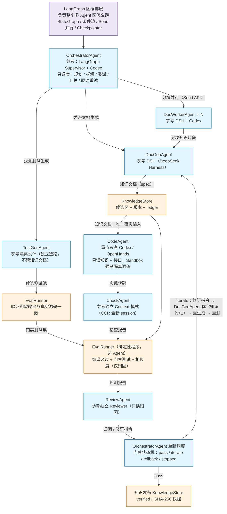

# 04 框架选型：LangGraph 多 Agent 图编排（选型图 + 竞品对比）

> 日期：2026-08-26
> 定位：本文把框架选型图（暂定）与 01 的业务架构合成为一张 mermaid 图，回答两个问题：① 为什么多 Agent 编排选 **LangGraph**（不重复造轮子）；② 为什么不用其他竞品框架。技术栈统一 TypeScript。框架收录标准沿用：相关度低的不收、无开源实现的不收。
> 相关：[01-多agent调研.md](01-多agent调研.md)（业务架构，Agent 定稿）、[02-技术选型与架构决策.md](02-技术选型与架构决策.md)（ADR：LangGraph / ACP / A2A / MCP）、[03-Agent-Platform架构设计.md](03-Agent-Platform架构设计.md)（Agent 运行层）、[README.md](README.md)（决策索引）

---

## 1. 一张图：选型图（暂定）× 01 业务架构

图例（三层职责）：

| 颜色 | 框 | 归属 |
|---|---|---|
| 紫色 | LangGraph 图编排层 | 整张图的结构（节点 / 边 / 并行 / 状态 / 循环）由 LangGraph 承载 |
| 蓝色 | 7 个 Agent | 图上的节点，内部实现走 Agent Platform（AgentProvider / ContextPolicy / ResourceClaim，见 03） |
| 橙色 | EvalRunner / KnowledgeStore | 确定性程序，Domain 完全自研（业务壁垒，见 02 决策表） |

与 01 的语义对齐说明：

- 选型图中 DocGen / TestGen / DocWorker 三条线汇入 CodeAgent 是简化画法；按 01 定稿语义：DocWorkerAgent 的分块产物先经 **DocGenAgent 汇总拼接**成知识文档；TestGenAgent 的候选测试池先经 **EvalRunner 验证期望输出真实性**，才固化进门禁。
- ReviewAgent 输出回到 OrchestratorAgent **重新调度**（选型图）；调度决策由门禁状态机给出（pass / iterate / rollback / stopped，01）；iterate 时修订指令回到 **DocGenAgent 优化知识文档（v+1）**，代码由新知识驱动重生成（01 硬规则：改知识治本，改代码治标）。

## 2. 为什么选 LangGraph（不重复造轮子）

核心论点：**01 的架构本来就长成一张图，LangGraph 的图模型与它一一对应**。不是"选个框架再适配"，而是"图模型天然匹配"。逐条映射：

| 我们的架构需求 | LangGraph 原生能力 | 证据（官方） |
|---|---|---|
| 整个多 Agent 图怎么跑（选型图第一行） | StateGraph：节点 = Agent、边 = 交接、条件边 = 分支路由 | https://docs.langchain.com/oss/javascript/langgraph/ |
| OrchestratorAgent 参考 LangGraph Supervisor + Codex | 官方 langgraph-supervisor 库，supervisor-worker 模式开箱即用 | https://github.com/langchain-ai/langgraph-supervisor |
| DocWorkerAgent × N 并行分块 | Send API（map-reduce）：一个节点动态生成 N 个并行分支，全部完成后汇聚 | https://docs.langchain.com/oss/python/langgraph/graph-api |
| 门禁 pass / fail / iterate 循环（Review 后重新调度） | 条件边（conditional edges）：按 EvalRunner 结果路由到 ReviewAgent / 发布 / 重试 | https://docs.langchain.com/oss/python/langgraph/graph-api |
| 断点续跑 / 审计（长任务数小时） | Checkpointer：每个 superstep 结束后保存图状态，支持 SQLite / Postgres | https://docs.langchain.com/oss/javascript/langgraph/checkpointers |
| 未来 HITL（人工介入） | interrupt 原语：暂停并持久化图状态，等人工输入后恢复 | https://docs.langchain.com/oss/javascript/langgraph/interrupts |
| 语言栈 TypeScript | langgraphjs v1.x 是一等公民实现（非 Python 包装），核心原语与 Python 对齐 | https://github.com/langchain-ai/langgraphjs |
| 生产验证（同领域：代码库 + 测试生成） | Uber Developer Platform 用 LangGraph 构建多 agent 网络做大规模代码迁移与单元测试生成；Klarna AI 助理服务 8500 万活跃用户 | https://www.langchain.com/built-with-langgraph 、 https://www.langchain.com/blog/customers-klarna |

补充两点：

- **许可证**：LangGraph MIT 开源，满足"开源源码可审计"标准（不用黑盒）。
- **本地断点续跑**：LangGraph Checkpointer 按 superstep 保存图状态；V1 使用 SQLite，应用重启后通过 `thread_id` 恢复。节点重跑的副作用由 GenerationKey 和 Artifact 幂等保障。

## 3. 为什么不选其他框架（竞品对比）

| 框架 | 排除结论（一句话 WHY） | 关键证据 |
|---|---|---|
| **OpenAI Agents SDK**（Swarm 后继） | 轻量 agent 循环（agents / handoffs / guardrails / tracing 四个原语），**没有图控制、没有内置持久化**；门禁循环与并行分块都要自造 | https://developers.openai.com/agents/ |
| **AutoGen** | 2026 年进入**维护模式**（社区托管，仅 bug / 安全修复），微软官方明确新项目用 Microsoft Agent Framework | https://github.com/microsoft/autogen |
| **Microsoft Agent Framework**（AutoGen + Semantic Kernel 合并产物） | 运行时更重、.NET 基因、图编排控制不如 LangGraph 直接；GA 于 2026-04，生态迁移期 | https://github.com/microsoft/agent-framework |
| **CrewAI** | 角色化高层封装，原型快；但门禁级条件路由 / 状态控制弱，**企业功能（AMP）闭源**，不满足开源可审计 | https://github.com/crewAIInc/crewAI |
| **Google ADK** | 2025-12 才有官方 TypeScript 版（@google/adk）；基元是高层组合（Sequential / Parallel / Loop），门禁级条件边 + 状态持久化组合的成熟案例少；评测 / 部署工具绑定 Google Cloud | https://github.com/google/adk-js |
| **Claude Agent SDK** | 单 agent SDK（封装 Claude Code 能力），**不是图编排器**；绑定 Anthropic 生态；我们的 Coding Agent 互操作已定走 ACP（参考 Codex / OpenHands） | https://github.com/anthropics/claude-agent-sdk-typescript |
| **Semantic Kernel** | 已并入 Microsoft Agent Framework（2025-10），不再单列 | https://github.com/microsoft/agent-framework |
| **MetaGPT / AgentScope 等学术框架** | 角色扮演 SOP 研究向，非生产基础设施 | https://github.com/geekan/MetaGPT 、 https://github.com/modelscope/agentscope |
| **Pydantic AI** | Python-only，不满足 TypeScript 栈 | https://github.com/pydantic/pydantic-ai |
| **自研图编排** | 明确不造轮子。workflow / graph runtime 是成熟非差异化基础设施，自研 = 残缺版 + 最贵技术债（02 架构评审结论） | 见 02 评审记录 |

排除逻辑（两条硬标准）：**相关度低的不收**（Pydantic AI 单 agent、MetaGPT 学术向）；**没有开源实现的不收**（CrewAI AMP 闭源）。其余在"图层"这个位置上：要么缺图控制（OpenAI Agents SDK / Claude Agent SDK），要么缺持久化 / 门禁级路由的成熟度（ADK / CrewAI），要么维护模式或运行时过重（AutoGen / MS Agent Framework / Semantic Kernel）。

## 4. LangGraph 的边界与代价（诚实清单）

| 边界 | 影响 | 对策 |
|---|---|---|
| checkpoint 保存"数据"不保存"执行"（进程死在节点执行中途，该节点要重跑） | 数小时长任务崩溃恢复依赖重跑节点，可能重复调用 LLM | 应用启动时按 `thread_id` 恢复；节点幂等设计：GenerationKey 去重（runId + moduleId + iteration + agentType + promptHash + modelConfigHash，见 02） |
| LangChain 生态 API 变更历史 | 版本升级破坏风险 | 只依赖 @langchain/langgraph 核心包，锁版本（v1.x）；不引入 langchain 大杂烩集成 |
| 分布式 worker：LangGraph Platform 为商业托管；自托管需自己部署 checkpointer 和多副本 | 当前个人电脑部署不需要跨机执行 | V1 保持本地单进程 + SQLite checkpointer；云端只同步已发布知识 |
| LangSmith 可观测为商业组件 | 全链路 trace 需额外成本 | V1 用 OpenTelemetry 集成；LangSmith 可选 |

## 5. 决策变更记录（与 02 的关系）

- 02 决策表原记 **Dynamic Agent Graph = Defer（LangGraph 作为 V2+ DSL 候选）**；按本文选型图（暂定，现已验证成立），LangGraph 提前为 **Adopt：多 Agent 图编排层**（"负责整个多 Agent 图怎么跑"）。
- **本地恢复定位**：LangGraph checkpoint 保存图状态，本地 Run Registry 记录运行状态，应用启动时负责重新进入图。
- **03 的 Agent Platform 不变**：蓝色 Agent 框都是 LangGraph 图上的节点，节点内部实现仍走 AgentProvider / ContextPolicy / ResourceClaim / Session Event Log。
- README 决策索引已同步（见 [README.md](README.md)）。

## 6. V1 落地清单（后续工程骨架输入）

1. 用 LangGraph 定义 7 Agent 图：节点 = Agent（经 AgentProvider 调用）、条件边 = 门禁状态机（pass / iterate / rollback / stopped）、Send = DocWorker 并行分块。
2. Checkpointer = 本地 SQLite；每个 run 必须有稳定 `thread_id`。
3. 本地 Run Registry 记录 `RUNNING / INTERRUPTED / COMPLETED / FAILED`，应用启动时恢复未完成运行。
4. 文件交接保留为 Artifact 层（可审计、可断点续跑），节点幂等由 GenerationKey + Artifact hash 保障。
5. 锁版本：@langchain/langgraph v1.x；依赖面只留核心包。
