# 04 · 业界开源多 Agent 编排实现案例

> 日期：2026-08-26
> 定位：从零选型的案例层调研。调研 17 个真实开源仓库/系统，看业界实际怎么编排多 agent，作为本项目选型的参考案例。
> 配套：[01-多agent调研.md](01-多agent调研.md)、[02-编排模式调研.md](02-编排模式调研.md)、[03-开源编排框架.md](03-开源编排框架.md)

**结论先行**：业界没有"标准答案"，但存在清晰的**谱系**：从「固定流水线 + 文件/产物交接」（MetaGPT、gpt-engineer、CrewAI sequential）到「图/事件驱动 + 消息总线」（LangGraph、OpenHands）。**『固定流水线+文件交接』有大量直接印证案例，且恰是文档生成类任务的主流做法**；反驳主要来自"灵活编排派"和"单 agent 派"，但它们的复杂度和适用场景与知识飞轮项目不同。

---

## 一、Anthropic 官方

### 1.1 Anthropic Multi-Agent Research System（Claude Research 功能）

- **链接**：https://www.anthropic.com/engineering/multi-agent-research-system （官方工程博客，含架构图；社区有多个复刻实现如 `The-Swarm-Corporation/AdvancedResearch`、`krishnaclouds/anthropic-multi-agent-demo`）
- **编排模式**：**orchestrator-worker（编排者-工人）层级模式**，1 个 lead agent 负责分解任务、委派、综合，多个 worker subagent 并行执行。
- **Agent 角色**：Lead/Orchestrator（规划与综合）+ 若干并行 Researcher/Worker（各带独立上下文与受限工具）。
- **通信方式**：**结构化消息**，subagent 返回 JSON 结果给 orchestrator；上下文通过 prompt 传入。
- **关键技术点**：查询分解、并行执行、结果综合；博客明确披露早期失败教训，**简单查询 spawn 了 50 个 subagent 导致成本爆炸**，最终限制并行 subagent 数量（约 5 个）与 token 预算。
- **可借鉴处**：**层级固定 + 角色明确 + 严格控制并行度**。这是对我们方案的直接印证，"克制"是生产级编排的第一原则。
- **复杂度**：中等｜重型框架：不需要（内部就是普通程序+API 调用）。
- **对方案**：✅ 印证，固定的 orchestrator→worker 层级本质上就是固定流水线；且其教训支持"不要过度自由"。

### 1.2 Claude Agent SDK Subagents（Anthropic，开源）

- **链接**：https://github.com/anthropics/claude-agent-sdk-python （本体 Claude Code 闭源黑盒不选，机制借鉴用开源 SDK 版）
- **编排模式**：主 agent 通过 **Task 工具动态 spawn subagent**（任务型/动态委派）。
- **Agent 角色**：用户自定义 subagent，声明在项目 `.claude/agents/` 目录，每个 = **name + description（何时被调用）+ system prompt**；可定义"后台 agent"并行执行。
- **通信方式**：**独立上下文窗口 + 结果回传**，subagent 全程在隔离 context 中运行，只把结果（文本/文件）交回主 agent。
- **关键技术点**：description 驱动的自动选择、上下文隔离防膨胀、可并行。
- **可借鉴处**：**"任务说明 + 返回结果"的契约式接口**与文件交接异曲同工；隔离上下文对超大代码库极重要（否则 context 爆炸）。
- **复杂度**：简单｜重型框架：不需要。
- **对方案**：✅ 印证，父进程调度、子任务独立上下文、结果落盘回传，就是"流水线+交接"的工程形态。

### 1.3 anthropics/claude-cookbooks 与 anthropics/claude-quickstarts

- **链接**：https://github.com/anthropics/claude-cookbooks 、 https://github.com/anthropics/claude-quickstarts
- **内容**：官方 cookbook 含 **Orchestrator-Subagents 模式**、多 agent 研究系统示例、customer-service 多 agent quickstart 等可运行代码。
- **可借鉴处**：作为最小可运行的多 agent 参考实现（纯 Python + API，无框架依赖）。
- **复杂度**：简单｜重型框架：不需要。
- **对方案**：✅ 印证，官方推荐的最简模式就是"一个编排循环 + 若干固定角色 subagent"。（quickstarts 内具体示例清单需进一步核实）

---

## 二、LangGraph 生态（图驱动派代表）

### 2.1 langchain-ai/langgraph（核心库 + examples/multi_agent/）

- **链接**：https://github.com/langchain-ai/langgraph （`examples/multi_agent/` 下有 multi-agent-collaboration、supervisor、swarm 等官方 notebook）
- **编排模式**：**显式有状态图**，节点=agent/工具，边=转移条件；支持 supervisor（层级）、swarm（交接）、handoff、plan-and-execute 等模式。
- **Agent 角色**：任意，由用户定义；典型为 Supervisor + 多个 Specialist。
- **通信方式**：**共享 State（channel）** + 消息流；节点间通过 reducer 合并状态。
- **关键技术点**：checkpoint 持久化/断点续跑、`interrupt` 人工介入、图可编译成可执行程序。
- **可借鉴处**：显式图 = 显式流水线的形式化；State 共享 ≈ 文件交接的"内存版"；checkpoint 能力值得借鉴（我们的文件交接天然支持断点续跑）。
- **复杂度**：中等～复杂｜重型框架：是（LangGraph 本身就是框架）。
- **对方案**：⚖️ 半印证，它证明"显式流程优于自由对话"，但用图+状态而非文件；对固定流水线场景，LangGraph 可能是"杀鸡用牛刀"（需评估）。

### 2.2 langchain-ai/langgraph-supervisor-py / langgraph-swarm-py

- **链接**：https://github.com/langchain-ai/langgraph-supervisor-py 、 https://github.com/langchain-ai/langgraph-swarm-py
- **编排模式**：官方把两种多 agent 架构做成了库：**Supervisor（层级）** 与 **Swarm（agent 间 handoff 交接上下文）**；官方后续建议"直接用 tools 实现 supervisor 而非专用库"。
- **可借鉴处**：说明业界对 supervisor 模式的认可；swarm 的 handoff 概念（把上下文打包交给下一个 agent）与文件交接逻辑一致。
- **复杂度**：中等｜重型框架：是。
- **对方案**：✅ 印证（supervisor = 流水线调度者）。
- ⚠️ 注：`langchain-ai/multi-agent-template` 仓库名需进一步核实（LangChain 官方模板现通过 `create-langchain` 脚手架分发，未直接确认该独立仓库）。

---

## 三、AutoGen（消息对话派代表）

### 3.1 microsoft/autogen

- **链接**：https://github.com/microsoft/autogen
- **编排模式**：两代架构：
  - **0.2 旧版**：ConversableAgent + **GroupChat（群聊）+ GroupChatManager**，由 Manager 决定下一个发言者（round-robin / LLM 驱动 / 自定义策略）。
  - **0.4 新版**（2025.1 重构）：**actor 模型 + 事件驱动 + 异步**，RoutedAgent 通过 Topic 收发消息；分层 API（AgentChat 快速开发 / Core 底层事件管线）。
- **Agent 角色**：任意角色（如 Researcher、Writer、Critic、UserProxy 模拟用户）。
- **通信方式**：**消息（chat message）**，0.4 为异步事件消息（可分布式）。
- **关键技术点**：GroupChatManager 的"发言者选择"是可编程的；0.4 强调可观测性、分布式、韧性。
- **可借鉴处**：**GroupChat 的 LLM 驱动发言者选择恰好反衬固定流水线的价值**，自由群聊发散性强、不可控，工业界普遍转向受控流程。
- **复杂度**：复杂｜重型框架：是。
- **对方案**：⚖️ 半反驳半印证，0.4 证明事件驱动是"重"方案的顶点；但对知识飞轮这种确定性任务，AutoGen 的灵活性是用不上的复杂度。

---

## 四、CrewAI（角色+任务流水线派）

### 4.1 crewAIInc/crewAI + crewAI-examples

- **链接**：https://github.com/crewAIInc/crewAI 、 https://github.com/crewAIInc/crewAI-examples
- **编排模式**：**Crew（编队）= Agent + Task + Process**；Process 支持 **sequential（顺序流水线）/ hierarchical（manager 协调）/ custom**；Flow 提供状态管理与条件分支。
- **Agent 角色**：role / goal / backstory 三段式角色定义（如 Researcher、Writer、QA）。
- **通信方式**：**任务输出（task output）自动作为下一个 task 的上下文**，本质是产物交接；Crew 内共享 memory。
- **关键技术点**：任务依赖声明、输出传递、Flow 编排跨 crew 流程。
- **可借鉴处**：**sequential process 就是"固定流水线+产物交接"的直接产品化**，是业界接受度最高的入门模式；role/goal/backstory 角色建模可参考。
- **复杂度**：简单～中等｜重型框架：是（但抽象很薄，易学）。
- **对方案**：✅✅ 强印证，CrewAI 最流行的用法就是线性任务链 + 输出交接。

---

## 五、MetaGPT / ChatDev（软件公司流水线派）

### 5.1 FoundationAgents/MetaGPT

- **链接**：https://github.com/foundationagents/metagpt
- **编排模式**：**SOP（标准作业流程）驱动的角色装配线**，产品经理→架构师→项目经理→工程师→QA，全程按软件公司 SOP 编排。
- **Agent 角色**：PM（需求文档）、架构师（系统设计）、PM 角色协调、工程师（编码）、QA（测试反馈）。
- **通信方式**：**共享 Message Pool + 发布/订阅机制**，角色按"感兴趣的消息类型"订阅，结构化消息带 type 字段；另有**可执行反馈回路**（运行生成代码，把报错喂回工程师）。
- **关键技术点**：SOP 编码进框架、消息池解耦、验证反馈闭环。
- **可借鉴处**：**SOP=固定流水线的学术级背书**；消息池订阅比文件交接更解耦，但对固定流程反而增加心智负担；"执行反馈"（跑编译/测试再回写）对 C/C++ 场景极有价值。
- **复杂度**：复杂｜重型框架：是（本身即框架）。
- **对方案**：✅ 印证（流程固定）+ 💡 补充（可加"编译验证→回填错误"的闭环）。

### 5.2 OpenBMB/ChatDev（2023 研究原型，仅作机制借鉴）

- **链接**：https://github.com/openbmb/ChatDev （相关度低已从框架选型剔除，此处仅因"阶段间文件交接"机制与本案印证保留）
- **编排模式**：**Chat Chain（对话链）**，采用瀑布模型四阶段：designing→coding→testing→documenting；**阶段内是双角色自由对话**（如 CTO×程序员、程序员×测试员），**阶段间以产物文件交接**（设计文档、代码文件、测试报告）。
- **Agent 角色**：CEO/CTO/CPO（设计）、程序员（编码）、测试员（测试）、文档员（文档）等。
- **通信方式**：**混合**，阶段内 chat 消息；阶段间文件/代码仓库交接。
- **关键技术点**：communicative dehallucination（通信去幻觉，约束角色发言必须基于事实，防止连环胡编）。
- **可借鉴处**：**"阶段内自由讨论 + 阶段间文件交接"是固定流水线的柔性变体**；去幻觉机制提醒我们：文件交接的内容要做一致性校验。
- **复杂度**：中等｜重型框架：是。
- **对方案**：✅ 强印证，阶段间产物交接正是"文件交接"；其"阶段内自由对话"可作为流水线中单个环节内部的可选增强。

---

## 六、代码评审 / 编码代理类

### 6.1 CodeRabbit（AI PR 评审）

- **链接**：https://www.coderabbit.ai/ （开源仓库仅有 `coderabbitai/awesome-coderabbit` 资源列表）
- **编排模式**：商业闭源产品。公开信息表明是**单 agent 驱动的多阶段流水线**：PR 元数据收集→变更解析→静态分析（40+ linter）→逐文件 LLM 评审→安全分析→评论聚合发布。
- **通信方式**：内部各阶段产物传递，最终输出 GitHub 评论。
- **可借鉴处**：**把"评审"拆成可审计的阶段管线**；元数据+静态分析先行的思路对 C/C++（先跑 clang-tidy/编译）高度适用。
- **复杂度**：中等｜重型框架：不需要（自研管线）。
- **对方案**：✅ 印证（流水线化）；⚠️ 内部编排细节闭源，**需进一步核实**。

### 6.2 princeton-nlp/SWE-agent

- **链接**：https://github.com/SWE-agent/SWE-agent （论文：arxiv.org/abs/2405.15793）
- **编排模式**：**单 agent + ACI（Agent-Computer Interface）**，不搞多 agent，而是把文件查看/编辑、shell 等工具精心设计成对 LLM 友好的接口（类似"给 LLM 的 UI"）。
- **Agent 角色**：单 agent。
- **可借鉴处**：**"接口设计 > 编排设计"**，工具与交互格式的打磨收益常大于多 agent 化；单 agent 在 SWE-bench 上已解决大量真实 issue。
- **复杂度**：简单（单 agent）｜重型框架：不需要。
- **对方案**：⚖️ 部分反驳，证明**很多任务不需要多 agent**；但知识飞轮（文档+知识库）是流水线型任务，与 SWE-bench 的"修一个 issue"性质不同。

### 6.3 All-Hands-AI/OpenHands（原 OpenDevin）

- **链接**：https://github.com/All-Hands-AI/OpenHands
- **编排模式**：**Event Stream（事件流）架构**，UI、Agent Controller、沙箱环境全部通过统一事件流通信；Agent 可插拔（CodeActAgent、DelegatorAgent 等），支持 **agent 委派子 agent**（事件流内嵌 delegation 逻辑）；另有 **microagents** 机制（按仓库目录注入专家提示）。
- **Agent 角色**：通用 coding agent + 可插拔专用 agent；microagents 可视为"静态角色"。
- **通信方式**：**事件总线（EventStream）**，全部动作（思考、命令、文件编辑）都是事件。
- **关键技术点**：Docker 沙箱执行、事件可重放/持久化、REST API 多 agent 服务（Agent Server/Canvas）。
- **可借鉴处**：事件流=最强形态的消息总线（可审计、可回放）；microagents（按目录注入上下文）对超大代码库的"局部专家化"很有启发。
- **复杂度**：复杂｜重型框架：是（自研平台级）。
- **对方案**：⚖️ 半反驳，它证明事件驱动架构的威力，但**建设成本极高**；对固定流程项目属于过度设计。

### 6.4 Aider-AI/aider

- **链接**：https://github.com/Aider-AI/aider
- **编排模式**：**Architect/Editor 双模型模式**，architect 模型只读做规划（输出修改方案），editor 模型把方案翻译成具体文件编辑；可配置不同模型分工（如 o3-mini 规划 + Sonnet 编辑）。
- **通信方式**：规划文本（diff 描述）从 architect 传给 editor。
- **可借鉴处**：**"计划者+执行者"是最小可用的多 agent 分工**，成本低、效果好；git 集成保证每次修改可回滚，文件交接+版本控制的典范。
- **复杂度**：简单｜重型框架：不需要。
- **对方案**：✅ 印证，固定两角色流水线 + 文本交接 + git 审计。

---

## 七、知识库 / 文档生成类（与知识飞轮最相关）

### 7.1 facebookresearch/DocAgent ⭐ 重点参考

- **链接**：https://github.com/facebookresearch/DocAgent （论文：arxiv.org/abs/2504.08725）
- **编排模式**：**Orchestrator 协调的 5 角色多 agent 系统 + 拓扑代码处理**：按依赖拓扑排序处理代码文件（先依赖后本文件），实现**增量上下文构建**；流程为 Reader→Searcher→Writer→Verifier 的迭代循环。
- **Agent 角色**：Reader（读代码）、Searcher（检索内外部上下文）、Writer（按标准写 docstring/文档）、Verifier（校验真实性与完整性，不合格打回重写）、Orchestrator（调度）。
- **通信方式**：上下文/文档产物在角色间传递，最终输出文档文件。
- **关键技术点**：**topological code processing**（依赖感知的处理顺序）、增量上下文（避免 context 爆炸）、**验证-重写闭环**（Verifier 保证 truthful）。
- **可借鉴处**：**对 C/C++ 超大代码库最直接可借鉴**，头文件/include 依赖天然适合拓扑排序；Verifier 环节 = 我们的"质检关卡"；增量上下文 = 超大库的必然选择。
- **复杂度**：中等｜重型框架：不需要（自研编排）。
- **对方案**：✅✅✅ **最强印证**，文档生成领域的最新学术+工业实现就是"固定角色流水线 + 产物交接 + 拓扑排序 + 验证闭环"。

### 7.2 OpenBMB/RepoAgent

- **链接**：https://github.com/OpenBMB/RepoAgent
- **编排模式**：基于 AST 解析的流水线：解析仓库→LLM 生成文档→构建**代码知识图谱（黑盒）**→文档落盘到仓库；相邻文件共享上下文。
- **通信方式**：markdown 文档文件输出到仓库；知识图谱作为跨文件上下文。
- **关键技术点**：黑盒代码知识图谱、跨文件上下文注入、pre-commit 钩子集成（随提交增量更新）。
- **可借鉴处**：**"文档入库 + 增量更新 + 图谱沉淀"**与知识飞轮的知识库沉淀目标高度吻合。
- **复杂度**：中等｜重型框架：不需要。
- **对方案**：✅ 印证，流水线 + 文件产出 + 增量执行。

### 7.3 DeepWiki（Cognition）与开源复刻 deepwiki-open

- **链接**：官方（闭源）https://www.deepwiki.com/ ；开源复刻 https://github.com/AsyncFuncAI/deepwiki-open （原 d-bui/deepwiki-open，MIT）
- **编排模式**：官方实现闭源，公开行为是：分析仓库结构→为每个文件/目录生成 wiki 页面→提供可对话问答。开源版为简化复刻：解析仓库→逐模块生成 markdown 页面→构建索引。
- **可借鉴处**：**per-file 页面化文档 + 问答接口**的产品形态；Cognition 用单一编码 agent（Devin 同源）而非多 agent 完成，说明**工具与模型能力可替代部分多 agent 复杂度**。
- **复杂度**：中等｜重型框架：不需要。
- **对方案**：✅ 印证（流水线生成）；⚠️ 官方内部编排细节闭源，**需进一步核实**；开源版实现较简化。

---

## 八、其他代表性生产级仓库

### 8.1 browser-use/browser-use

- **链接**：https://github.com/browser-use/browser-use
- **编排模式**：**单 agent（DomAgent）** + 浏览器工具集（Playwright 封装 + Vision + DOM 提取），agent 自主循环。
- **可借鉴处**：不是多 agent 案例，但展示"把工具工程化到极致"的路线；其对 DOM 状态的可序列化处理值得借鉴（≈文件交接思想的工具版）。
- **复杂度**：简单｜重型框架：不需要。
- **对方案**：⚖️ 无关但佐证"工具质量 > agent 数量"。

### 8.2 AntonOsika/gpt-engineer ⭐ 最贴近本方案

- **链接**：https://github.com/AntonOsika/gpt-engineer
- **编排模式**：**`steps.py` 定义的固定步骤流水线**（clarify→spec→generate→write files，可自定义/增删 AI steps）；每一步一次 LLM 调用，**产物全部落盘到 workspace 目录**；支持编辑 message logs 后重放（rerun）。
- **通信方式**：**纯文件**，workspace 目录 + 各步骤消息日志。
- **关键技术点**：步骤可插拔、**日志落盘可重放/可审计**、human-in-the-loop 交接。
- **可借鉴处**：**它就是"固定流水线+文件交接"的最纯粹开源实现**，且被广泛使用；"每一步落盘+可重放"正是我们需要的可观测性。
- **复杂度**：简单｜重型框架：不需要。
- **对方案**：✅✅✅ **最直接印证**，生产实践证明该模式简单可靠、可审计、可断点续跑。

### 8.3 The-Swarm-Corporation/swarms（框架补充）

- **链接**：https://github.com/The-Swarm-Corporation/swarms
- **编排模式**：多 agent 框架，内含对 Anthropic orchestrator-worker 的增强实现（AdvancedResearch 等 swarm 示例）。
- **可借鉴处**：作为 orchestrator-worker 模式的开源参考实现。
- **复杂度**：复杂｜重型框架：是。
- **对方案**：⚖️ 印证模式本身，但框架过重。

---

## 九、综合结论与选型建议

### 9.1 编排模式谱系图（按复杂度）

```mermaid
flowchart LR
    subgraph SIMPLE["固定流水线 + 文件交接（简单）"]
        G1["gpt-engineer<br/>步骤A→B→C，产物落盘"]
        C1["CrewAI seq<br/>Task 输出交接"]
        C2["ChatDev 阶段间<br/>文件交接"]
        D1["DocAgent<br/>5 角色 + 拓扑序"]
        R1["RepoAgent<br/>AST 流水线"]
        A1["aider<br/>双模型"]
        AN["Anthropic<br/>orchestrator"]
    end

    subgraph GRAPH["图/状态驱动（中）"]
        L1["LangGraph<br/>(A)→(B)→(C)，共享 State"]
        L2["LangGraph supervisor / swarm"]
        A2["AutoGen 0.2 GroupChat"]
    end

    subgraph EVENT["事件/消息总线（较复杂）"]
        E1["AutoGen 0.4<br/>Agent→Event 事件总线"]
        E2["OpenHands<br/>EventStream（可重放）"]
    end

    subgraph FREE["自由对话（复杂）"]
        M1["MetaGPT 消息池<br/>Pub/Sub 订阅，角色自由协作"]
        CH["ChatDev 阶段内<br/>双角色对话"]
    end

    SIMPLE --> GRAPH --> EVENT --> FREE

    classDef s fill:#e8f5e9,stroke:#388e3c;
    classDef g fill:#e1f5fe,stroke:#0288d1;
    classDef e fill:#fff3e0,stroke:#f57c00;
    classDef f fill:#fce4ec,stroke:#c2185b;
    class G1,C1,C2,D1,R1,A1,AN s;
    class L1,L2,A2 g;
    class E1,E2 e;
    class M1,CH f;
```

项目数：印证"流水线+交接" = 7+ 个 ｜ 印证"图/事件" = 4 个 ｜ 单 agent 替代 = 3 个

### 9.2 对『固定流水线+文件交接』的总体判断

- **强印证（7 个案例）**：MetaGPT（SOP）、ChatDev（阶段间文件交接）、gpt-engineer（steps+workspace）、CrewAI sequential、DocAgent（拓扑流水线+验证闭环）、RepoAgent、aider（双角色+git）。**文档生成/代码生成类任务的主流成功做法就是固定流水线+产物交接**，与知识飞轮场景同构。
- **部分反驳（3 类）**：① 灵活派（LangGraph/AutoGen/OpenHands）认为图/事件驱动更可扩展，但代价是框架绑定与高复杂度；② 单 agent 派（SWE-agent/aider/browser-use）证明**好的工具/接口设计可替代多 agent**，提醒我们每个流水线环节的"工具打磨"（如 C/C++ 的编译/静态分析工具）同样重要；③ Anthropic 的教训（subagent 滥用导致成本爆炸）支持"固定+克制"而非"自由+动态"。
- **关键补充（业界共性）**：几乎所有成功案例都有**验证/质检环节**（DocAgent Verifier、MetaGPT QA、ChatDev testing、CodeRabbit 静态分析），建议我们的流水线**每个阶段后设校验关卡**（编译通过、文档可解析、引用存在性检查）。

### 9.3 针对 C/C++ 超大代码库场景的具体建议（候选方向）

1. **采用固定流水线+文件交接为主架构**（gpt-engineer/DocAgent 路线），不引入重型框架，自研薄调度层即可。
2. **引入 DocAgent 的拓扑排序**：按 include/依赖图决定文件处理顺序，天然适配 C/C++。
3. **每阶段产物落盘 + 版本化**（git），支持断点续跑与审计（gpt-engineer/aider 做法）。
4. **加入编译验证闭环**：C/C++ 可先跑编译/clang-tidy 再进入下一阶段（MetaGPT 可执行反馈思路）。
5. **控制并行度**：并行仅用于无依赖的独立文件组，并设上限（Anthropic 教训）。
6. **如后续需要灵活性**：可在"阶段间"升级为 LangGraph 显式图（状态即文件路径），不必一开始就用图框架。

### 9.4 需进一步核实的信息

- `langchain-ai/multi-agent-template` 独立仓库是否存在（模板现通过 create-langchain 分发）
- CodeRabbit、DeepWiki 官方内部编排细节（均闭源）
- anthropics/claude-quickstarts 中多 agent 示例的完整清单

---

## 十、案例速查表

| 项目 | 编排模式 | 通信 | 重型框架 | 对『流水线+交接』 |
|---|---|---|---|---|
| Anthropic Research | orchestrator-worker | 结构化消息 | 否 | ✅ 印证 |
| Claude Agent SDK subagents | 动态委派 | 上下文隔离+回传 | 否 | ✅ 印证 |
| LangGraph | 显式图 | 共享 State | 是 | ⚖️ 半印证 |
| AutoGen | 群聊/事件 | 消息 | 是 | ⚖️ 半反驳 |
| CrewAI sequential | 顺序流水线 | 任务输出交接 | 是（薄） | ✅✅ 强印证 |
| MetaGPT | SOP 装配线 | 消息池订阅 | 是 | ✅ 印证 |
| ChatDev | 阶段对话链 | 阶段间文件 | 是 | ✅ 强印证 |
| CodeRabbit | 多阶段管线 | 产物传递 | 否 | ✅ 印证 |
| SWE-agent | 单 agent + ACI | 工具接口 | 否 | ⚖️ 部分反驳 |
| OpenHands | 事件流 | 事件总线 | 是 | ⚖️ 半反驳 |
| aider | 双模型（architect/editor） | 规划文本 | 否 | ✅ 印证 |
| DocAgent | 5 角色 + 拓扑序 | 产物传递 | 否 | ✅✅✅ 最强印证 |
| RepoAgent | AST 流水线 | 文件+图谱 | 否 | ✅ 印证 |
| DeepWiki | 逐文件生成 | 文件+索引 | 否 | ✅ 印证 |
| gpt-engineer | 固定步骤流水线 | 纯文件 | 否 | ✅✅✅ 最直接印证 |
