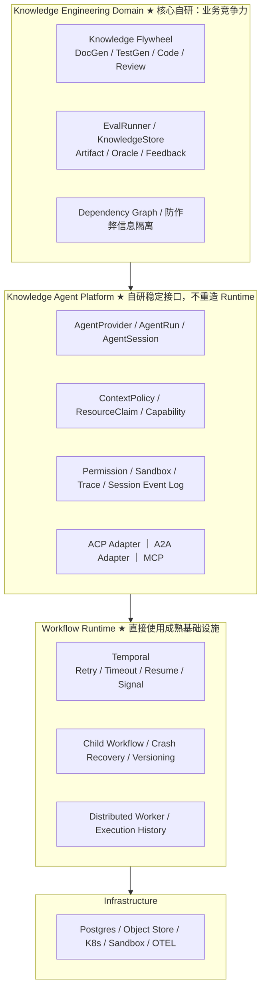

# 多 Agent 选型（架构决策索引）

> 更新：2026-08-26 ｜ 读完本文 1～3 分钟，即可掌握当前架构真相。
> 原则：成熟问题用成熟基础设施；知识工程壁垒自研；所有第三方通过稳定内部接口隔离。

## 当前最终决策

| 能力 | 决策 | 方案 | WHY（一句话） |
|---|---|---|---|
| Workflow Runtime | **Adopt** | **Temporal** | durable execution 是成熟非差异化基础设施，不重造 workflow engine |
| Agent Platform | **Build（稳定内部 Contract）** | 参考 Codex / DSH / OpenHands | 公司级 Agent abstraction，需要控制长期 API，不绑定任何厂商 |
| Coding Agent Interop | **Adopt（PoC）** | **ACP** | 避免为 Codex / Claude / Gemini 各造私有协议 |
| Remote Agent Interop | **Adopt（按需）** | **A2A** | 远程独立 Agent Service 互操作标准 |
| Tool / Knowledge Service | **Adopt** | **MCP** | Agent ↔ 工具/知识服务的标准协议 |
| Knowledge Engineering Domain | **Build（完全自研）** | 知识飞轮 / EvalRunner / KnowledgeStore | 真正的业务壁垒，无现成方案 |

## 四层架构

## 架构核心判断

1. **主干本质**：deterministic engineering workflow + uncertain intelligent steps。业务主流程由 **Workflow Runtime（Temporal）** 驱动；**LLM Agent 只是 Workflow 中的智能执行节点**。
2. **Temporal 解决 execution reliability，不解决 domain correctness**：LLM 去重、Artifact 幂等、知识发布幂等、权限/沙箱/上下文隔离、Eval 正确性，全部由 Agent Platform / Domain 负责。
3. **所有 Agent 运行时差异通过 Adapter 隔离**：业务层绝不出现 `if provider === "codex"`。未来新增 NewAgent-X = 新增 Provider 或 ACP 配置，不动 Flywheel / Workflow / EvalRunner / KnowledgeStore。
4. **不重复造协议**：MCP（Agent↔工具）、ACP（Platform↔Coding Agent）、A2A（Agent Service↔Agent Service），除非标准协议被证明不满足，否则不建私有协议。
5. **Temporal 与 DSH/LangGraph 分层**：Temporal = Workflow Runtime（分布式 durable execution）；DSH Workflow / LangGraph = Agent Platform 上层 orchestration DSL，两层不混。

## 看哪篇文档

| 文档 | 内容 | 什么时候看 |
|---|---|---|
| [01-多agent架构设计.md](01-多agent架构设计.md) | **业务架构**：Agent 角色、Eval / Artifact / 隔离、知识飞轮主循环 | 想了解业务怎么跑 |
| [02-技术选型与架构决策.md](02-技术选型与架构决策.md) | **为什么这么选**：ADR / 技术选型与架构决策（Temporal / ACP / A2A / MCP / DSH / Codex / OpenHands） | 想了解每个决策的 WHY |
| [03-Agent-Platform架构设计.md](03-Agent-Platform架构设计.md) | **Agent Platform 怎么实现**：AgentProvider / AgentRun / Session / ContextPolicy / ResourceClaim / Capability / ACP | 要开始实现 Agent Platform |
