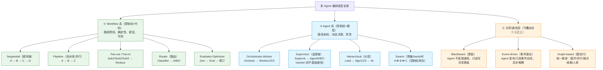
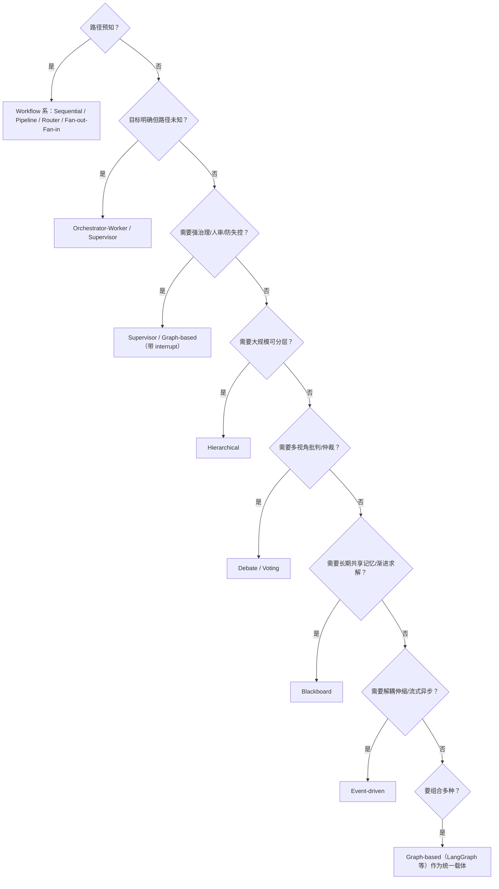

# 多 Agent 选型调研（文件夹索引）

> 状态：**调研完成，选型未定**（决策待用户拍板）
> 日期：2026-08-26
> 背景：知识飞轮项目（C/C++ 超大代码库，源码→知识→代码→评测→反馈闭环）。用户假设"什么都没选"，从零调研多 Agent 编排的完整选型空间。

## 本文件夹包含（可直接点击跳转）

| 文件 | 内容 | 回答的问题 |
|---|---|---|
| [01-多agent调研.md](https://github.com/linlisWorkTeam/wpKnowledge/blob/main/knowledge/2.wiki/多agent选型/01-多agent调研.md) | **目标架构定稿**：Agent 清单（7 Agent）+ 工作流程（三链路）+ TypeScript 接口 + 每板块设计依据（论文/技术选型） | Agent 怎么定？每个环节为什么这么设计？ |
| [02-编排模式调研.md](https://github.com/linlisWorkTeam/wpKnowledge/blob/main/knowledge/2.wiki/多agent选型/02-编排模式调研.md) | 12+3 种编排模式全景（含每种模式的纯文本流程图） | 有哪些模式？各什么时候选？workflow vs orchestration 区别？ |
| [03-开源编排框架.md](https://github.com/linlisWorkTeam/wpKnowledge/blob/main/knowledge/2.wiki/多agent选型/03-开源编排框架.md) | 14 个框架深度对比（LangGraph/CrewAI/Agent Framework/Agents SDK/ADK/CLI agents/MetaGPT/Temporal/Pydantic AI 等；已剔除相关度低与无源码黑盒） | LangGraph 之类框架怎么选？各自代表什么范式？ |
| [04-开源仓库案例.md](https://github.com/linlisWorkTeam/wpKnowledge/blob/main/knowledge/2.wiki/多agent选型/04-开源仓库案例.md) | 17 个业界真实开源项目怎么编排多 agent | 别人实际怎么落地？对"流水线+文件交接"是印证还是反驳？ |
| [05-架构评审-Workflow-Runtime底座选型.md](https://github.com/linlisWorkTeam/wpKnowledge/blob/main/knowledge/2.wiki/多agent选型/05-架构评审-Workflow-Runtime底座选型.md) | 架构评审：**推翻"零框架"结论，L1 用 Temporal 做底座**（证据链 + 6 质疑回应 + 分层决策） | 自研编排还是成熟 runtime？Temporal 还是 LangGraph？ |

## 编排选型总览（纯文本流程图）

以下是本文件夹调研的**主要编排模式家族**，按"控制权归代码还是归模型"排列：

**一句话选型逻辑**（详见 [02-编排模式调研.md](https://github.com/linlisWorkTeam/wpKnowledge/blob/main/knowledge/2.wiki/多agent选型/02-编排模式调研.md) 第 0 节与第 3 节）：

## 阅读顺序建议

1. 先读 [02-编排模式调研.md](https://github.com/linlisWorkTeam/wpKnowledge/blob/main/knowledge/2.wiki/多agent选型/02-编排模式调研.md) 理解模式空间（workflow vs orchestration 概念澄清在第 0 节，每种模式的流程图在其小节内）
2. 再读 [03-开源编排框架.md](https://github.com/linlisWorkTeam/wpKnowledge/blob/main/knowledge/2.wiki/多agent选型/03-开源编排框架.md) 看具体框架候选（结论速览在第 0 节）
3. 最后读 [04-开源仓库案例.md](https://github.com/linlisWorkTeam/wpKnowledge/blob/main/knowledge/2.wiki/多agent选型/04-开源仓库案例.md) 看业界实证（案例速查表在最后一节）
4. [01-多agent调研.md](https://github.com/linlisWorkTeam/wpKnowledge/blob/main/knowledge/2.wiki/多agent选型/01-多agent调研.md) 是评审环节的专项深挖，决策 Review 方案时读

## 当前未决决策点（供讨论）

| # | 决策点 | 候选 | 倾向（调研倾向，非结论） |
|---|---|---|---|
| 1 | 主干架构 | ① 固定流水线+文件交接（自研薄调度）② LangGraph 图执行 ③ Pydantic AI+Temporal ④ Microsoft Agent Framework（开源 LTS） | 案例调研显示文档生成类任务主流是①；框架调研显示②③控制力更强；云托管黑盒（Bedrock/Foundry）已剔除 |
| 2 | 是否需要主 agent | ① 确定性调度层（只调度，决策归门禁规则，现状）② LLM orchestrator ③ supervisor | 用户已定：主 Agent **只负责调度**，不执笔不判内容，决策由门禁 decide 状态机给出；①满足 |
| 3 | 文档生成是否分块并行 | ① 不分块 ② 分块 + subagent 并行（fan-out）③ 增量+拓扑排序（DocAgent） | 超大代码库必须③或②；③对 C/C++ 更契合（include 依赖） |
| 4 | Review 模式 | ① 独立上下文单 review（CCR，现状）② 辩论式多 review ③ 跨模型对抗 review | CCR 实证最强且成本最低；③做关键模块增强 |
| 5 | TestGenAgent（读源码）+ CodeAgent（读知识文档）+ 独立检查 | ① 不用 ② TestGenAgent 读源码做行为 oracle ③ 测试也读知识文档 | 用户已定：TestGenAgent **输入=源代码**（行为 oracle，期望输出经 EvalRunner 验证），CodeAgent 输入=知识文档；门禁主判=经验证的期望输出 |
| 6 | 框架引入 | ① 零框架（自研）② LangGraph ③ Temporal 做 L1 底座 ④ Temporal + 局部 LangGraph | **已定：Temporal 做 L1 Workflow Runtime 底座**（见 [05-架构评审](05-架构评审-Workflow-Runtime底座选型.md)）；LangGraph 仅 V2+ 动态 agent 图时作 L2 DSL |

## 关键事实速记

- 多 Agent 系统 token 消耗 ≈ 普通对话 **15 倍**（Anthropic 实测），只在"重并行/超上下文/多工具"场景划算
- 代码生成类任务主流成功做法 = **固定流水线 + 产物交接**（gpt-engineer、DocAgent、RepoAgent、CrewAI sequential 等 7+ 案例印证）
- **AutoGen 已进维护模式**（2025-10），新项目不要选；继任者 Microsoft Agent Framework（2026-04 GA）
- LangGraph（图）≈3.5-3.8万★、CrewAI（角色）≈4.4-5万★、AutoGen（对话）≈5.6万★冻结、OpenAI Agents SDK（handoff）≈2.8万★
- 2026 趋势：框架趋薄，MCP（工具）+ A2A（agent 互操作）+ Temporal（耐久）成为标准件
