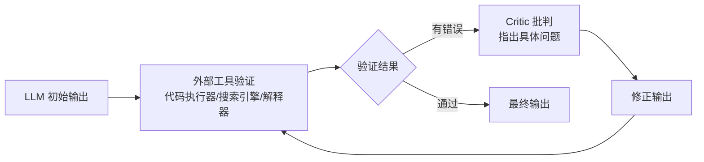

# CRITIC: Large Language Models Can Self-Correct with Tool-Interactive Critiquing

## 基本信息

| 项目 | 内容 |
|------|------|
| **链接** | https://arxiv.org/abs/2305.11738 |
| **作者** | Zhibin Gou, Zhihong Shao, Yeyun Gong, Yelong Shen, Yujiu Yang, Nan Duan, Weizhu Chen |
| **发布时间** | 2023-05-19（ICLR 2024） |
| **一句话总结** | LLM 自我纠错不能只靠"想"，要**调用外部工具**（执行代码、查搜索引擎）拿到客观反馈，再根据反馈修正 |

---

## 置信度评估

| 信号 | 评估 |
|------|------|
| 发表场所 | ICLR 2024（顶会接收） |
| 引用/影响 | 高（大量引用） |
| 代码可用 | 有 |
| 来源机构 | 腾讯 AI Lab 等 |
| **综合置信度** | **✅ 高** |
| 需谨慎点 | 外部验证 > 内部反思的结论稳健 |

## 它解决了什么问题

LLM 会幻觉、生成错误代码、产出不当内容。让它"自我纠错"看似简单——重新想想改改就行。但纯靠模型内部反思纠错能力有限：模型不知道自己哪里错了，因为**错误信息不在模型脑子里，在外面**（代码跑不跑得过的执行结果、事实对不对的外部证据）。

CRITIC 的核心论点：**自我纠错必须借助工具**，用工具交互拿到外部验证，再批判性地修正。

---

## 方法核心

循环过程（与工具交互）：

1. **生成**：LLM 先给出初始答案/代码
2. **工具验证**：把输出交给外部工具——代码就执行、事实就搜索、数学就调用计算器
3. **批判**：工具返回错误信息（编译错误、运行失败、搜索到的反例），LLM 针对性地分析哪里错
4. **修正**：基于批判重写
5. 循环直到工具验证通过

论文在三个任务族验证：代码生成（用代码执行器）、数学推理（用计算器）、事实问答（用搜索引擎）。

---

## 实验结果

- **代码生成**：结合执行反馈的自我纠错，显著超过无工具的自纠错和单次生成
- **数学推理**：计算器验证修正计算错误，效果提升明显
- **事实问答**：搜索验证对抗幻觉，回答准确性提升
- 结论：**工具交互是自我纠错的必要环节**，纯内部反思（无工具）效果有限

---

## 局限与注意

- 依赖工具可用性：没有代码执行环境/搜索接口就退化
- 循环次数有上限，无限循环成本高
- 工具返回的错误信息如果含糊，批判质量也受影响

---

## 对我们项目的启发 ⭐

### 可以直接借鉴的

**① "外部验证 > 内部反思"**：这是对我们飞轮设计最重要的方法论背书。Agent 生成代码后，与其让它自己"觉得"对不对，不如直接和源码对比（我们的"外部工具"就是源码本身）。CRITIC 证明这条路线有效。

**② 验证-修正循环结构**：生成 → 工具验证 → 批判 → 修正 → 再验证。我们的飞轮就是"生成代码 → 对比源码 → 差异分析 → 优化知识 → 再生成"，结构一致。可以照它的循环终止逻辑设计（验证通过即停）。

### 需要改造的

**① 工具从"执行器"换成"源码对比器"**：CRITIC 的工具是代码执行/搜索。我们的验证工具是"生成代码 vs 原始源码的差异对比"——更严格（源码就是真值），且不依赖测试覆盖率。差异分析器就是我们的"Critic"。

**② 批判对象从"输出"换成"知识"**：CRITIC 修正的是自己的输出；我们修正的是知识文档——因为知识是生成代码的源头，改知识才能根治（这正是飞轮和普通 self-correction 的区别）。

### 需要注意的

- CRITIC 的自我批判仍是 LLM 生成的自然语言，可能不精确。我们的差异对比如果是确定性算法（diff/AST），批判会更可靠——尽量把"批判"环节做成可复现的客观分析，而不是让 LLM 自由发挥。

---

## 关联

- **对应飞轮环节**：第三步（差异对比/验证）+ 第四步（反馈优化）
- **相关论文**：Reflexion（2303.11366）——同一时期的反馈循环代表作，反思存记忆；CRITIC 强调工具交互
- **相关论文**：Feedback Over Form（2604.21950）——执行反馈 vs 流程形式
