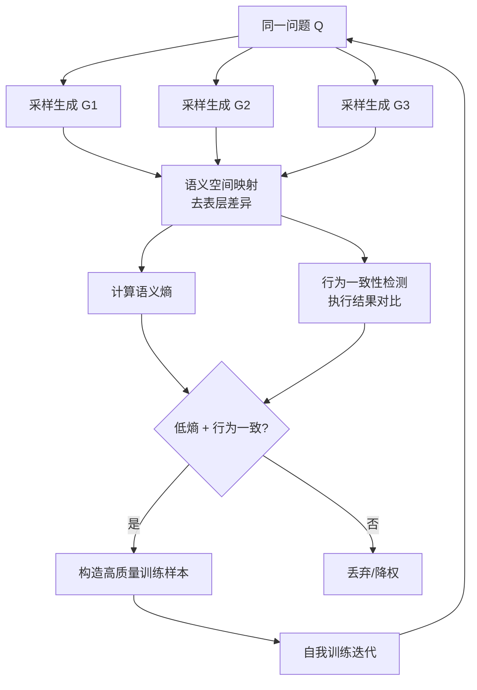
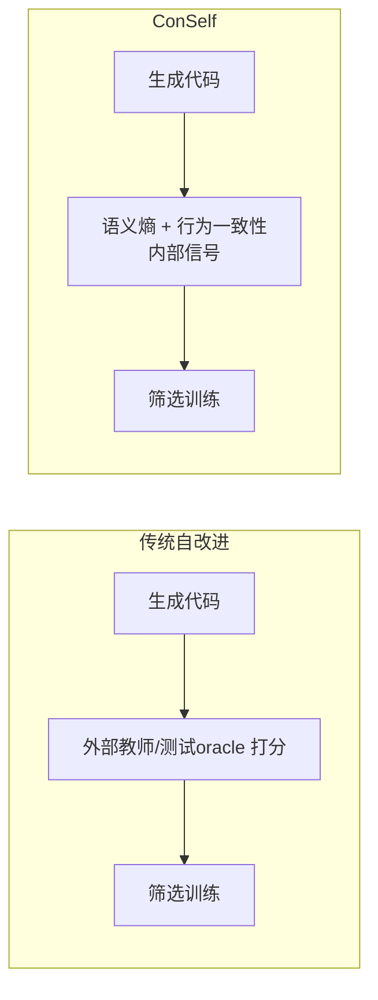

# ConSelf — 无教师、无测试预言机的自改进代码生成

> 论文：https://arxiv.org/abs/2603.29292
> 名称：Self-Improving Code Generation via Semantic Entropy and Behavioral Consensus

## 基本信息

| 项目 | 内容 |
|------|------|
| **链接** | https://arxiv.org/abs/2603.29292 |
| **发布时间** | 2026-03 |
| **一句话总结** | 代码模型不靠更强教师、不靠测试预言机，仅靠**代码语义熵**（内部不确定性度量）挑选高置信生成，再通过**行为一致性**（多次生成共识）构造训练信号，实现自我改进 |
| **核心创新** | 把"自我评估信号"从外部 oracle 换成模型内部的不确定性度量 |

## 置信度评估

| 信号 | 评估 |
|------|------|
| 发表场所 | arXiv 预印本（2026-03） |
| 引用/影响 | 低-中（新发布） |
| 代码可用 | 待确认 |
| 来源机构 | 学术机构 |
| **综合置信度** | **⚠️ 谨慎**（新发布未验证，但思路与飞轮高度吻合） |
| 需谨慎点 | 语义熵的度量方式需复现验证；行为一致性可能偏向保守生成 |

## 它解决了什么问题

LLM 代码生成能力的提升通常靠两条路：

1. **监督微调（SFT）**：需要高质量（问题, 答案）对，背后是更强的教师模型或人工标注
2. **偏好优化（DPO/RLHF）**：需要可靠的正负样本，背后是测试预言机（test oracle）

现实场景中，**参考解和测试预言机比问题描述和测试输入难获得得多**。一个公司内部的大代码库，有海量源码，但每个函数都有配套测试和权威答案的场景很少见。论文提出的问题非常尖锐：**代码模型能不能在既没有更强教师、也没有测试预言机的情况下自我改进？**

这个问题与知识飞轮的前提完全一致：我们的飞轮只有源码 + GLM 5.1，没有外部教师，没有现成的 oracle，改进信号完全来自"基于知识生成的代码 vs 原始源码"的差异对比。

## 方法核心

### 两个关键构件

**① 代码语义熵（Code Semantic Entropy）**

模型对同一问题采样多次生成，把生成结果映射到语义空间（去除命名、格式等表层差异），计算语义层面的不确定度。高熵 = 模型对答案没把握，低熵 = 模型内部一致地"认为"自己是对的。

**② 行为一致性（Behavioral Consensus）**

同一问题多次独立生成的代码，如果执行行为一致（输出相同），说明该答案被模型"内部投票"认可。用行为一致的样本来构造训练信号。

### 与经典方法的区别

传统方法的外部信号（教师、oracle）在真实仓库场景常常不可用；ConSelf 的信号全部来自模型自身，天然适配"只有源码没有答案"的场景。

## 实验结果（摘要信息）

- 论文报告在多个代码生成基准上，ConSelf 的自我改进循环显著提升模型表现（具体数值需复现确认）
- 关键结论方向：**内部不确定性信号可以替代外部 oracle**，至少在部分基准上成立
- 语义熵相比简单 logprob 置信度更鲁棒（logprob 会被模型过拟合的表面模式骗到，语义熵不受表层差异影响）

## 局限与注意

- **语义熵的计算成本**：多次采样 + 语义映射开销大，可能比一次生成贵几倍
- **行为一致性偏向保守**：模型内部一致"认为对"的答案可能只是常见套路，遇到新问题容易失效
- **自举风险**：自我改进的样本来自模型自己，如果模型系统性错误，错误会被放大（与 Fragility 的自我提升脆弱性结论一致）
- 预印本，尚未经过同行评审和独立复现

## 对我们项目的启发

### 直接借鉴 ✅

1. **门禁信号的替代方案**：我们的门禁是"基于知识生成的代码 vs 源码"的对比，不需要 oracle。ConSelf 证明"内部信号也能驱动改进"，支持我们用**结构/行为对比**而非测试全通过作为门禁信号（与 设计/门禁与评测机制.md 的多信号组合思路吻合）
2. **差异对比的粒度**：行为一致性告诉我们，对比时应该看**行为等价**（执行结果一致）而非逐字相同，这正好对应 80% 相似度门禁里"相似度"的定义方式

### 需要改造 🔧

- ConSelf 是**无源码参考**的自我改进；我们的飞轮有源码参考，信号更强。可以把语义熵作为**辅助信号**：当生成代码与源码对比模糊（差异难判断）时，用语义熵补充判断置信度

### 需要注意 ⚠️

- **自举风险直接命中 Fragility 警告**：自我改进必须有外部锚点。我们的外部锚点是源码本身（未过门禁的知识不合并 + 自动回滚，见 设计/知识飞轮流程设计.md §5）

## 关联

- [自进化Agent脆弱性.md](自进化Agent脆弱性.md) — 自我改进的脆弱性（ConSelf 的自举风险是其佐证）
- [反馈优先于流程拓扑.md](反馈优先于流程拓扑.md) — 反馈质量 > 流程形式
- 设计/门禁与评测机制.md §3.5 — 门禁评测的可靠性约束
- [大语言模型自调试.md](大语言模型自调试.md) — 执行反馈的作用（ConSelf 的行为一致性是执行反馈的一种）
