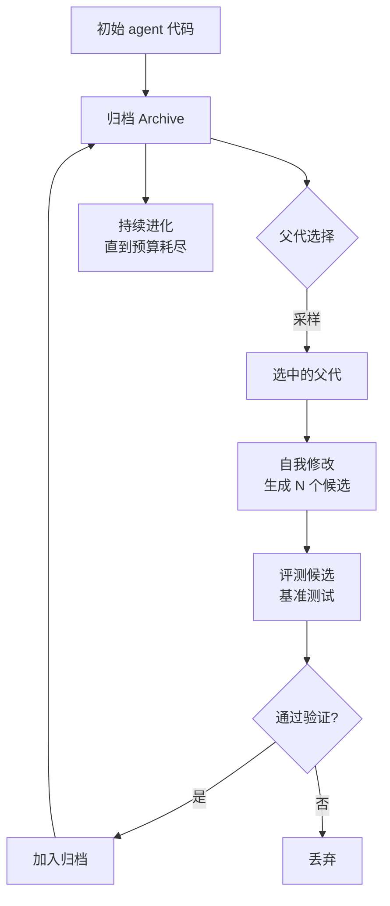

# Darwin Gödel Machine: Open-Ended Evolution of Self-Improving Agents

## 基本信息

| 项目 | 内容 |
|------|------|
| **链接** | https://arxiv.org/abs/2505.22954 |
| **代码** | https://github.com/jennyzzt/dgm（⭐2237） |
| **作者** | Jenny Zhang, Shengran Hu, Cong Lu, Robert Lange, Jeff Clune（不列颠哥伦比亚大学、Sakana AI 等） |
| **发布时间** | 2025-05-29（v3 更新于 2026-03-12） |
| **一句话总结** | 让编码 agent 修改自己的代码，用归档保存所有历史版本，从归档中选父代继续进化：用开放进化突破单一谱系的改进上限 |

---

## 置信度评估

| 信号 | 评估 |
|------|------|
| 发表场所 | arXiv 预印本（2025，v3 更新于 2026-03） |
| 引用/影响 | 高（自进化领域标志性工作，仓库 ⭐2237） |
| 代码可用 | 有，官方开源（Python），最近推送 2025-08 |
| 来源机构 | 不列颠哥伦比亚大学 / Sakana AI / Vector Institute |
| **综合置信度** | **🟢 高** |
| 需谨慎点 | 论文核心是编码 agent 的自我修改，与我们的知识文档演化在改进对象上不同；仓库最近推送距今约一年，维护活跃度偏低 |

## 它解决了什么问题

自改进 agent 面临一个根本矛盾：**只沿着一条谱系改进，最终会停止改进**。

标准做法是从当前最优版本派生下一代。这带来两个问题。第一，一旦某个版本卡在局部最优，后续所有版本都继承这个缺陷。第二，早期版本中某些有价值的能力可能被后续改动破坏，但在单一谱系下无法回退到那个分支再向前发展。

自然界的解决办法是开放进化：保留多个谱系，让不同分支并行探索，允许看似退步的中间形态存在，因为它们可能是通往更好形态的步进石。

DGM 把这个思路搬到编码 agent 上。agent 可以修改自己的代码，每次修改产生一个新版本。关键在于**所有版本都进入归档，任何一个都可以被选为下一代的父代**。

---

## 方法核心

### 三个关键设计

**① 自我修改的对象是自身源代码**

agent 读自己的代码，提出修改，执行修改，然后编译运行。改动可以是新增工具、改进提示词、调整搜索策略。这与只改提示词的做法有本质区别：改进空间从文本扩展到完整程序。

**② 归档保留所有走过的路径**

不是只保留最优，而是保留所有成功通过验证的版本。归档是开放的：新版本不断加入，旧版本不被删除。这使得进化可以随时从任意历史节点分叉。

**③ 父代选择基于归档采样**

新版本的父代从归档中按规则采样，不是固定选最优。这避免了单一谱系的锁死。论文强调这种设计让系统能持续发现改进，而非在某个局部最优处停滞。

### 与传统做法对比

| 维度 | 单一谱系自改进 | DGM |
|---|---|---|
| 版本保存 | 只保留当前最优 | 归档保留全部有效版本 |
| 父代来源 | 当前版本 | 归档中任意版本 |
| 改进上限 | 受限于当前谱系 | 多分支并行探索 |
| 局部最优 | 容易陷入 | 可从其他分支绕开 |
| 代价 | 存储与评测成本低 | 需要维护归档与多次评测 |

---

## 实验结果

论文在编码基准上验证自我改进效果，报告的关键观察包括：

- 自我修改产生的 agent 在基准任务上优于初始版本，改进来自 agent 自己写的代码改动
- 归档机制使进化持续进行，避免了单一谱系下的提前停滞
- 部分中间版本的单项表现不如前代，但作为后续改进的基础仍有价值，说明保留非最优版本有意义
- 论文同时报告了安全考量：自我修改能力需要沙箱等约束，防止 agent 做出破坏性改动

具体数值与基准细节需查阅原文，本文件不做转述以免失真。

---

## 局限与注意

- **改进对象是编码 agent 自身**，不是知识文档。迁移到我们的场景需要把「自我修改代码」替换为「修改知识文档」
- 归档规模会随进化轮次膨胀，论文未充分讨论归档剪枝与检索效率问题
- 父代选择规则的具体设计对结果影响大，需要在我们的场景重新调参
- 自我修改带来安全风险，需要沙箱与审计；论文承认这是待解决方向
- 仓库最近推送在 2025-08，如需复现需注意依赖版本

---

## 对我们项目的启发 ⭐

### 可以直接借鉴的

**① 归档保留全部有效版本，而非只留最优**

项目文档写着「当前不自动选择历史最优并回滚」，并注明「保留历史最佳、关键回归回滚及停滞转 LOW_CONFIDENCE 是目标要求，当前尚未实现」。DGM 的归档机制给出了直接答案：**所有通过门禁的版本都进归档，任何版本都能成为下一轮的父代**。

这解决了两个具体问题。第一，当某轮改动导致回归时，可以从归档中选取之前的版本继续，而不是只能在此基础上修补。第二，某条改进路线走到尽头时，可以从更早的节点分叉探索其他方向。

**② 允许非最优版本进入归档**

DGM 报告部分中间版本单项指标不如前代，但作为后续改进基础仍有价值。这意味着归档的准入标准应该是「通过门禁」而非「超过当前最优」。项目现有的 CANDIDATE → ACCEPTED → VERIFIED 状态机已经支持这一点：只要进入 VERIFIED 就保留，不因为分数低于历史峰值而丢弃。

**③ 父代选择不要固定选最优**

从归档中按规则采样父代，而不是每次都选最高分。这一条与 GEPA 的发现互相印证：GEPA 消融显示按「在多少样本上最佳」加权采样优于贪心选择。两个独立工作指向同一结论，**多候选加互补选择优于单冠军更新**。

### 需要改造的

**① 改进对象从代码换成知识文档**

DGM 的 agent 改自己的源代码，我们改的是知识文档。需要重新定义「修改算子」：知识文档的合法改动是什么（增加条目、修正描述、细化约束、补充边界条件），以及怎么验证改动正确。

EGO-Prompt 在这方面给出了可参考的形态：领域知识表示为节点加自然语言边的图结构，修改算子是受约束的增删改。

**② 归档的组织方式**

DGM 的归档是一组版本。我们的知识文档有模块与层级结构，归档需要回答：是整文档快照，还是按模块的增量版本？如果按模块，怎么保证跨模块改动的一致性？

项目已有 KnowledgeVersion 与父版本的概念，方向对，需要补齐归档的物理组织方式。

**③ 预算与归档规模的权衡**

DGM 未充分讨论归档膨胀。项目的 evaluation 阶段有轮次上限与预算耗尽停止的约束，归档增长会加剧这个问题。需要设计归档剪枝策略：哪些版本冻结、哪些继续扩充。搜索预算方向的工作（Inference-Time Budget Control、SkillMOO）可以提供参考。

### 需要注意的

- **归档不是免费的正确性保障**。DGM 的归档版本都经过基准验证，我们的归档版本也需要经过门禁验证才能进入。否则归档会积累未经证实的版本，回滚等于引入未知风险
- **回滚本身需要评测**。从归档选取历史版本继续，需要确认该版本在当前代码状态下仍然有效。源码已经演进，旧版知识文档可能已经过时
- **自我修改的安全边界**。DGM 需要沙箱约束 agent 的破坏性改动。我们的场景下，知识文档的修改需要有审计轨迹（项目已有 epitaph 交接约定），防止积累错误知识

---

## 关联

- **对应飞轮环节**：轮次路由（workflow_router）与候选判断（candidate_knowledge）。具体是「未达标时选哪个版本继续」这一步
- **相关论文**：GEPA（2507.19457）：，父代选择的加权采样策略，消融数据支持多候选互补选择
- **相关论文**：AlphaEvolve（2506.13131）：，进化式代码搜索，维护候选程序池
- **相关论文**：Huxley-Gödel Machine（2510.21614）：，DGM 后续，用元生产力指标近似最优自改进
- **相关论文**：Gödel Agent（2410.04444）：，自指框架，运行时修改自身逻辑
- **项目缺口对应**：项目 Knowledge 文档标注「当前不自动选择历史最优并回滚」「保留历史最佳、关键回归回滚及停滞转 LOW_CONFIDENCE 是目标要求，当前尚未实现」
