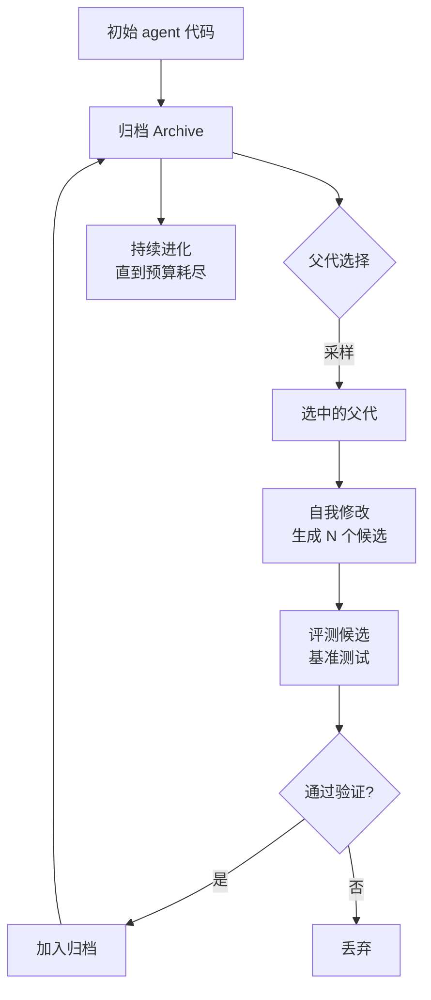

# Darwin Gödel Machine: Open-Ended Evolution of Self-Improving Agents

## 基本信息

| 项目 | 内容 |
|------|------|
| **链接** | https://arxiv.org/abs/2505.22954 |
| **代码** | https://github.com/jennyzzt/dgm（⭐2237） |
| **作者** | Jenny Zhang, Shengran Hu, Cong Lu, Robert Lange, Jeff Clune（不列颠哥伦比亚大学、Sakana AI 等） |
| **发布时间** | 2025-05-29（v3 更新于 2026-03-12） |
| **一句话总结** | 让编码 agent 修改自己的代码，用归档保存所有历史版本，从归档中选父代继续进化：用开放进化突破单一谱系的改进上限 |

---

## 置信度评估

| 信号 | 评估 |
|------|------|
| 发表场所 | arXiv 预印本（2025，v3 更新于 2026-03） |
| 引用/影响 | 高（自进化领域标志性工作，仓库 ⭐2237） |
| 代码可用 | 有，官方开源（Python），最近推送 2025-08 |
| 来源机构 | 不列颠哥伦比亚大学 / Sakana AI / Vector Institute |
| **综合置信度** | **🟢 高** |
| 需谨慎点 | 改进对象是编码 agent 自身代码，不是知识文档；仓库最近推送距今约一年，维护活跃度偏低 |

## 它解决了什么问题

自改进 agent 有一个根本矛盾：**只沿着一条谱系改进，最终会停止改进**。

标准做法是从当前最优版本派生下一代。这带来两个问题。第一，一旦某个版本卡在局部最优，后续所有版本都继承这个缺陷。第二，早期版本中某些有价值的能力可能被后续改动破坏，但在单一谱系下无法回退到那个分支再向前发展。

自然界的解决办法是开放进化：保留多个谱系，让不同分支并行探索，允许看似退步的中间形态存在，因为它们可能是通往更好形态的步进石。

DGM 把这个思路搬到编码 agent 上。agent 可以修改自己的代码，每次修改产生一个新版本。关键在于**所有版本都进入归档，任何一个都可以被选为下一代的父代**。

---

## 方法核心



### 三个关键设计

**① 自我修改的对象是自身源代码**

agent 读自己的代码，提出修改，执行修改，然后编译运行。改动可以是新增工具、改进提示词、调整搜索策略。这与只改提示词的做法有本质区别：改进空间从文本扩展到完整程序。

**② 归档保留所有走过的路径**

不是只保留最优，而是保留所有成功通过验证的版本。归档是开放的：新版本不断加入，旧版本不被删除。这使得进化可以随时从任意历史节点分叉。

**③ 父代选择基于归档采样**

新版本的父代从归档中按规则采样，不是固定选最优。这避免了单一谱系的锁死。论文强调这种设计让系统能持续发现改进，而非在某个局部最优处停滞。

### 与传统做法对比

| 维度 | 单一谱系自改进 | DGM |
|---|---|---|
| 版本保存 | 只保留当前最优 | 归档保留全部有效版本 |
| 父代来源 | 当前版本 | 归档中任意版本 |
| 改进上限 | 受限于当前谱系 | 多分支并行探索 |
| 局部最优 | 容易陷入 | 可从其他分支绕开 |
| 代价 | 存储与评测成本低 | 需要维护归档与多次评测 |

---

## 实验结果

论文在编码基准上验证自我改进效果，报告的关键观察包括：

- 自我修改产生的 agent 在基准任务上优于初始版本，改进来自 agent 自己写的代码改动
- 归档机制使进化持续进行，避免了单一谱系下的提前停滞
- 部分中间版本的单项表现不如前代，但作为后续改进的基础仍有价值，说明保留非最优版本有意义
- 论文同时报告了安全考量：自我修改能力需要沙箱等约束，防止 agent 做出破坏性改动

具体数值与基准细节需查阅原文，本文件不做转述以免失真。

---

## 局限与注意

- **改进对象是编码 agent 自身**，不是知识文档。迁移到本项目需要把「自我修改代码」替换为「修订知识文档」
- 归档规模会随进化轮次膨胀，论文未充分讨论归档剪枝与检索效率问题
- 父代选择规则的具体设计对结果影响大，需要在具体场景重新调参
- 自我修改带来安全风险，需要沙箱与审计
- 仓库最近推送在 2025-08，如需复现需注意依赖版本

---

## 对本项目的启发 ⭐

本项目 `docs/specs/domainFunction/knowledge/Knowledge.md` 写着一句话：

> 回滚状态仅为迁移兼容，当前不自动选择历史最优并回滚。

`src/domain/Domain.ts` 里 `ROLLING_BACK` 已经存在于业务状态机中，迁移边也已连好：

```
REVIEWING  →  PUBLISHING | ITERATING | ROLLING_BACK | LOW_CONFIDENCE | FAILED | CANCELLED
ROLLING_BACK  →  GENERATING | LOW_CONFIDENCE | CANCELLED | FAILED
```

`src/application/services/AutomatedProjectWorkflow.ts` 也已把 `ROLLING_BACK` 与 `PLANNED`、`ITERATING` 一起映射到 `GENERATING`。

**也就是说，回滚的通道已经铺好，缺的是「回滚到哪个版本、依据什么判断」这个决策逻辑。** DGM 的归档机制正好填这一段。

### 解决哪个环节的什么问题

**环节：`workflow_router` 的 ITERATE 分支，以及 `ROLLING_BACK` 状态的入口条件。**

当前 `evaluation` 阶段输出 PASS / ITERATE / STOPPED，ITERATE 走 `workflow_router` 加一轮，下一轮继续在**这份文档的最新版本**上修改。问题在于：如果第 3 轮的修改引入回归，第 4 轮仍然在这份已经变差的文档上继续改，前两轮的有效改动无法取回。

DGM 提供的思路是：**把 ITERATE 的起点的选择权交给归档，而不是固定用最新版本。**

### 具体怎么落地

**① 归档的存储形态可以直接用现有实体**

本项目的 `KnowledgeVersion` 已经保存了「版本身份、moduleId、父版本、正文引用、来源与状态」，`ArtifactRef` 用 sha256 加大小和媒体类型描述正文。这套结构本身就是归档。

需要补的是「归档检索」能力：按 moduleId 找出该模块的全部 `KnowledgeVersion`，按状态过滤出可回退的候选。`KnowledgeSearchApp` 已有 `describe` / `loadDocument`，可以在授权列表内取回历史版本的描述与正文。

**② 可回退版本的准入条件**

DGM 的准入是「通过基准验证」。对应到本项目，可回退的版本应当是**曾经进入过 `VERIFIED` 的版本**，因为它们关联了有效 Gate 与唯一发布回执。

`CANDIDATE` 状态不能作为回退目标：它只表示未发布版本，是否通过质量评分都不知道。`SUPERSEDED` 可以，它表示被后继发布替代，本身是有效版本。

**③ 回退触发的判据**

DGM 用的是「新版本未通过验证」。本项目 `evaluation` 阶段已有明确的失败事实：

| GateDecision 事实 | 是否触发回退 |
|---|---|
| `criticalFailures > 0`（CRITICAL_TEST_FAILURE） | 候选。说明本轮改动破坏了测试 |
| `stability < minimumStability`（STABILITY_BELOW_THRESHOLD） | 候选。说明本轮改动让结果不稳定 |
| `checkBlocking` / `reviewBlocking` | 候选，但需先确认是知识问题还是实现问题 |
| `infrastructureFailure` | 不触发。属于环境问题，回退知识文档没有帮助 |
| `TESTS_INCOMPLETE`（requireAllTests 且通过数不等于总数） | 不触发。属于测试未跑完，不是知识缺陷 |

建议触发条件是：**在 ITERATE 分支上，若连续两轮出现 `criticalFailures > 0` 或 `stability` 跌破阈值，且当前版本不是首轮版本，则进入 ROLLING_BACK，回退到最近一个 VERIFIED 版本重新开始。**

**④ 回退后走什么路径**

`ROLLING_BACK → GENERATING` 这条边已经存在。回退到历史 VERIFIED 版本后重新进入 `GENERATING`，由 DocGen 在该版本基础上修订。

这里需要注意 `IterationBudget` 的计数。`src/domain/workflow/IterationBudget.ts` 的 `canStartIteration(iteration, maxIterations)` 与 `canContinueIteration(iteration, maxIterations)` 已经统一了入口与继续条件，`maxIterations` 含首轮。**回退不应重置轮次计数**，否则会让一个 Run 的实际轮数超过 `maxIterations`，绕过 AC-AGENT-105 的验收。

### 提供了什么思路

**① 归档是回滚的前提，不是回滚的替代**

项目文档把「保留历史最佳」和「关键回归回滚」并列为目标要求，DGM 说明这两件事是同一套机制的两面：先有归档，才谈得上选择。所以实现顺序应该是先建归档检索，再实现回退决策。

**② 「非最优也保留」的原则可以直接采用**

DGM 报告部分中间版本单项表现不如前代，但作为后续改进基础仍有价值。本项目 `KnowledgeVersion` 保留 `SUPERSEDED` 历史的设计与此一致，不需要因为分数低于历史峰值而删除版本。

**③ 回退的选择依据应该是事实而非评分**

DGM 从归档采样父代时依赖验证结果。本项目的优势在于门禁是确定性的：`criticalFailures`、`stability`、`checkBlocking` 都是可复核的事实。回退决策可以直接建立在这些事实之上，不需要引入「模型自评分」这类不可靠信号（`Evaluation.md` 也明确写了相似度和模型自评分不能覆盖 Gate 条件）。

### 需要注意的

- **回退需要重新评测**。存档的 VERIFIED 版本是在**当时的源码状态**下验证的。源码已经演进时，旧版知识文档可能已经与当前源码不匹配，直接回退等于引入未验证的知识。回退后必须重新走 check 与 evaluation
- **归档的物理组织方式待定**。`KnowledgeVersion` 是按版本存的整份正文，回退粒度是整份文档。本项目单文档飞轮约束（DocGen IO-18 每次只修订一份文档）让这个问题暂时可控，但如果将来支持多文档，需要考虑按模块回退
- **回退与「达标立即结束」的关系**。`Evaluation.md` 的 IO-20 确认文档达标后立即结束本次飞轮，不再为提高分数追加轮次。回退只应在 ITERATE 路径上触发，PASS 后不应再回退
- **不要照搬 DGM 的自我修改复杂度**。DGM 的 agent 改的是自己运行的程序，本项目改的是知识文档。知识文档的修改算子应该更受约束（参考 EGO-Prompt 的增删改三算子加端点清单）

---

## 关联

- **对应环节**：`workflow_router` 的 ITERATE 分支；`ROLLING_BACK` 状态的入口条件；`evaluation` 阶段的 GateDecision 事实
- **对应缺口**：`Knowledge.md` 的「回滚状态仅为迁移兼容，当前不自动选择历史最优并回滚」；`Evaluation.md` 的「保留历史最佳、关键回归回滚及停滞转 LOW_CONFIDENCE 同样已有目标要求，当前尚未实现」
- **相关论文**：GEPA（2507.19457）：父代选择的加权采样策略，与 DGM 的归档采样互为补充
- **相关论文**：AlphaEvolve（2506.13131）：进化式代码搜索，维护候选程序池
- **相关论文**：Huxley-Gödel Machine（2510.21614）：DGM 后续，用元生产力指标近似最优自改进
- **相关论文**：MOSS（2605.22794）：源码级重写实现自进化，改动落在源码层
- **本项目代码**：`src/domain/workflow/IterationBudget.ts`、`src/domain/Domain.ts`（状态机与 KnowledgeStatus）、`src/domain/knowledge/MarkdownDiff.ts`
