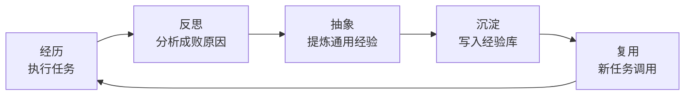

# EvolveR: Self-Evolving LLM Agents through an Experience-Driven Lifecycle

## 基本信息

| 项目 | 内容 |
|------|------|
| **链接** | https://arxiv.org/abs/2510.16079 |
| **作者** | Rong Wu, Xiaoman Wang, Jianbiao Mei 等 |
| **发布时间** | 2025-10-17（v3 更新于 2026-05-16） |
| **一句话总结** | 给 agent 一个完整的"经验生命周期"：经历 → 反思 → 抽象 → 沉淀 → 复用，形成闭环自我改进 |

---

## 置信度评估

| 信号 | 评估 |
|------|------|
| 发表场所 | arXiv 预印本（2025） |
| 引用/影响 | 低-中 |
| 代码可用 | 待确认 |
| 来源机构 | 学术机构 |
| **综合置信度** | **🟡 中** |
| 需谨慎点 | 生命周期框架清晰，效果依赖反思质量 |

## 它解决了什么问题

LLM agent 工具用得不错，但**不会系统性地从自己的经验里学习**。现有框架大多在补外部知识缺口（检索、RAG），忽略了一个更根本的问题：agent 自己干过的事、踩过的坑，为什么不沉淀下来变成能力？

EvolveR 把"从经验学习"做成一个完整的闭环生命周期，而不是零散的记忆。

---

## 方法核心

生命周期各阶段：

| 阶段 | 作用 |
|------|------|
| **经历（Experience）** | agent 执行任务，记录过程与结果 |
| **反思（Reflect）** | 分析为什么成功/失败，找出可复用模式 |
| **抽象（Abstract）** | 把具体案例提炼成通用策略，避免只记死案例 |
| **沉淀（Store）** | 结构化写入经验库，带元数据便于检索 |
| **复用（Reuse）** | 新任务时检索相关经验，指导行动 |

关键设计：经验要经过**抽象**再存档——把"这次这个 bug 这样修"变成"这类 bug 通常这样排查"。抽象后的经验复用价值更高。

---

## 实验结果

- 在多个 agent 任务上对比有/无经验生命周期的效果
- 经验驱动的 agent 随任务累积持续提升，无经验版本止步不前
- 反思 + 抽象的组合比单纯存记录效果好
- 经验库随规模增长有收益递减，需要质量筛选（不是存越多越好）

---

## 局限与注意

- 经验质量依赖反思质量：反思不准，抽象出的经验是错的
- 经验库增长后检索成本上升，需要管理和淘汰
- 存在"经验污染"风险：早期错误经验可能长期误导后续任务

---

## 对我们项目的启发 ⭐

### 可以直接借鉴的

**① 生命周期设计**：EvolveR 的"经历 → 反思 → 抽象 → 沉淀 → 复用"就是知识飞轮的文字版。我们飞轮的"生成代码 → 对比差异 → 优化知识"对应它的"经历 → 反思 → 沉淀"。它的阶段划分可以作为我们飞轮流程设计的参照。

**② "抽象"这一步是关键**：它强调经验要抽象成通用策略，不能只存具体案例。对应我们：差异反馈不能只记"这个函数写错了"，要抽象成"这类函数的知识模板缺了 X 部分"——抽象程度决定知识复用价值。

**③ 经验库要筛选**：收益递减 + 污染风险提醒我们：知识库不是越大越好，要有质量门槛（门禁）和淘汰机制（过期/失效知识）。

### 需要改造的

**① 经验的"真值"不同**：EvolveR 的经验来自任务成败，我们的"经验"来自源码——源码是客观真值，比任务反馈更可靠。这让我们的知识沉淀比它的更可验证。

**② 抽象由谁做**：EvolveR 靠 LLM 抽象。我们可以让"差异分析器"兼任抽象者：把每次对比差异抽象成知识改进建议。这个环节值得做成独立组件，保证抽象质量。

### 需要注意的

- 经验污染 = 知识污染：如果早期知识生成得差，飞轮可能把错误"学"进知识库。建议：知识变更走版本控制 + 门禁，未通过门禁的优化不合并——这是 EvolveR 没强调但我们必须要的。

---

## 关联

- **对应飞轮环节**：第四步（反馈优化）+ 知识库管理（沉淀/筛选/淘汰）
- **相关论文**：A Survey of Self-Evolving Agents（2507.21046）——综述框架
- **相关论文**：SEW（2505.18646）——工作流进化
