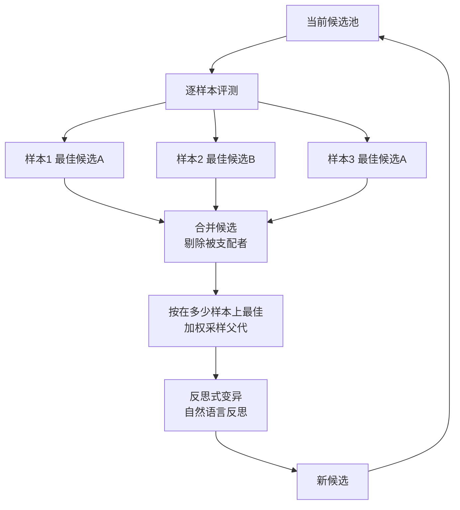

# GEPA: Reflective Prompt Evolution Can Outperform Reinforcement Learning

## 基本信息

| 项目 | 内容 |
|------|------|
| **链接** | https://arxiv.org/abs/2507.19457 |
| **作者** | Lakshya A. Agrawal, Shangyin Tan, Dilara Soylu 等（UC Berkeley 等联合） |
| **发布时间** | 2025-07（更新于 2026-02） |
| **一句话总结** | 用自然语言反思做提示词进化，父代选择改为逐样本找最佳加加权采样：消融显示 Pareto 互补选择显著优于贪心与 beam search |

---

## 置信度评估

| 信号 | 评估 |
|------|------|
| 发表场所 | arXiv 预印本（2025，持续更新） |
| 引用/影响 | 高（提示词优化方向代表性工作，附完整消融） |
| 代码可用 | 有（开源实现） |
| 来源机构 | UC Berkeley 等 |
| **综合置信度** | **🟢 高** |
| 需谨慎点 | 成本优势有特定口径，需分开看（见局限）；AIME-2025 上是反例 |

## 它解决了什么问题

用强化学习优化提示词需要大量 rollout，成本高。仅用贪心策略做提示词搜索，又容易陷入局部最优。

GEPA 的思路是：**用自然语言反思代替数值梯度，用多候选互补选择代替单冠军更新**。

第一，反思信号来自执行轨迹的自然语言分析，而非标量奖励。模型读自己的推理过程与失败原因，产出「应该怎么改」的自然语言描述。这比标量奖励携带更多信息。

第二，候选保留策略不用单一最优。这一条直接对应本项目的修订意见处理，是本文件重点。

---

## 方法核心



### 父代选择的关键设计

GEPA 的候选选择分三步。

**第一步，逐样本找最佳**。对每个验证样本，找出在该样本上得分最高的候选。注意是逐样本单独看，不是看总分。

**第二步，合并并剔除被支配者**。如果候选 A 在所有样本上都不差于候选 B，且至少一个样本上更好，则 B 被支配，可以剔除。保留那些在至少一个样本上无可替代的候选。

**第三步，按覆盖度加权采样**。统计每个候选在多少个样本上是最佳，用这个计数作为采样权重。在多数样本上最佳的候选更容易被选中，但只在一个样本上最佳的候选也有机会。

关键点在于：**某候选总分可能不高，但它是某个特定样本上的唯一最优解，那么它仍然值得成为父代**。它携带了其他候选没有的能力。

### 消融数据

论文报告了「样本级 Pareto 互补选择」与其他候选保留策略的对比：

| 候选保留策略 | 得分 |
|---|---|
| Pareto 互补选择 | 61.28 |
| 贪心 | 54.89 |
| beam search（宽度 4） | 53.95 |

三组数据在同一实验条件下对比，说明按样本级互补性选候选，明显优于只留总分最高的贪心策略。beam search 保持多个候选但保留的是总分靠前的，同样不如按互补性选择。

对这个结果的理解是：**保留多个候选的意义在于能力互补，而不是分数接近**。beam search 保留的是分数相近的候选，它们往往有相同的能力与相同的缺陷。Pareto 互补选择保留的是能力不同的候选，覆盖面更广。

---

## 实验结果

- 在若干基准上优于 GRPO 等强化学习方法，同时消耗的 rollout 更少
- 成本优势有特定口径：IFBench 上达到最佳提示时用了 678 次 rollout，对比 GRPO 的 24000 次
- GEPA 的完整优化预算是 3593 次 rollout
- AIME-2025 上是反例，GEPA 落后对比方法（−6.00）

**678 与 3593 是两个不同含义的数字**，前者是达标所需次数，后者是完整优化预算，引用时不能混用。论文如实报告了反例，没有宣称普遍优越。

---

## 局限与注意

- **成本口径需仔细区分**，678 次与 3593 次不可混用
- **不全面优于强化学习**，AIME-2025 是反例
- **反思质量依赖模型能力**，基础模型推理能力影响优化效果
- **验证样本的质量决定选择结果**，样本集有偏会导致选择偏向局部样本
- **Pareto 维度是样本级任务得分**，不是「准确率 vs 成本」这类多目标维度，容易误读

---

## 对本项目的启发 ⭐

先看修订链路是怎么走的：

```
evaluation → ReviewAgent 输出 corrections → Application 映射 → 下一轮 DocGen 修订
```

`docs/specs/domainFunction/agents/reviewAgent/ReviewAgent.md` 记录了一条明确边界：

> 真实模型对文档问题的定位、因果分析和历史总结质量尚未验收。

Review 输出的 `Correction` 结构（`docs/specs/schemas/Correction.schema.json`）只有五个字段：`correctionId`、`knowledgePath`、`criterion`、`evidenceRefs`、`risk`。

**`criterion` 是一个字符串字段。** 当同一轮出现多个 criteria 指向同一段落的不同问题，或者不同段落的问题互相冲突时，下一轮 DocGen 面对的是几个并列的字符串，没有优先级、没有互补性判断。GEPA 的候选选择机制正好补这一段。

### 解决哪个环节的什么问题

**环节：`review` 输出 corrections 之后，`workflow_router` 的 ITERATE 分支进入下一轮 DocGen 之前的这一段。**

当前状态是：corrections 是一个列表，全部交给 DocGen 执行修改。问题是列表里可能包含互相不兼容的修订方向（例如同一个段落既被要求「补充边界条件」又被要求「简化描述」），或者某条 correction 只对个别测试用例有效但被当作通用问题处理。

### 具体怎么落地

**① 用「逐测试项找最佳修订」替代「按总分排序修订」**

本项目的测试集是固定的（`oracle_validation` 在参考源码上实校通过后按源码内容身份固定，`tests/` 与源码不变则复用）。这正好提供了 GEPA 所需的「样本集」。

做法是：把每轮 DocGen 产出的文档版本，在**固定测试集**上逐项评测，记录每个版本在每个测试项上的通过情况。总通过率只是副产品，真正要看的是逐项明细。

具体来说，`EvaluationReport` 已经包含测试计数与 `criticalFailures`，需要补的是**逐测试项的通过明细**，用于判断某个文档版本在哪些测试项上是唯一最优。

**② 按覆盖度决定哪些 correction 进入下一轮**

如果某个文档版本在大多数测试项上表现一般，但在某个关键测试项上是通过的唯一版本，那么它携带的那部分修订内容应该保留。

落地方式是：`Correction` schema 增加一个字段（例如 `coveredTestIds`），记录该修订针对的测试项。下一轮 DocGen 的输入按覆盖度加权，让覆盖独有测试项的 correction 优先执行。

**③ corrections 冲突时的取舍依据**

两条 correction 冲突时，判断依据是哪一条能覆盖更多测试项。谁覆盖多谁优先，省掉了在自然语言层面的合理性争论。

### 提供了什么思路

**① 互补性比总分更重要**

GEPA 的消融数据是这一节里最硬的证据：61.28 对 54.89。差距说明保留候选的意义在于能力互补，不在分数接近。本项目如果引入多候选文档版本，选择依据应该是「在哪些测试项上不可替代」而非「综合评分」。

**② 反思信号可以用自然语言，但判断依据必须是外部事实**

GEPA 的反思是自然语言生成的（对应本项目的 ReviewAgent 输出 `criterion` 与 `risk`），但**选择哪些候选保留**是程序化计算的。这个分工值得采用：让 ReviewAgent 自由生成修订意见，让程序根据测试项覆盖度决定取舍。这符合本项目 `Evaluation.md` 的既有边界：

> 相似度、模型自评分和自然语言「通过」不能覆盖这些条件。

**③ 被支配候选的剔除规则可以直接用**

候选 A 在所有测试项上都不差于 B，且至少一项更好，则 B 可剔除。这是简单的偏序比较，能有效压缩 corrections 列表，减少 DocGen 的工作量。

### 需要注意的

- **测试集覆盖度是前提**。GEPA 的方法在样本集有偏时效果退化。本项目测试集在源码不变时复用，需要确认覆盖度足够，否则逐项选择会偏向已覆盖的场景
- **不要引入「模型自评分」作为选择依据**。GEPA 的反思信号用于生成候选，不用于选择候选。本项目 `Evaluation.md` 已明确模型自评分不能覆盖 Gate 条件，这个边界应保持
- **固定测试集的复用规则带来约束**。测试集按源码内容身份固定，源码变化时会重建。如果回退到历史知识版本，测试集可能也变了，逐项对比需要对齐到同一测试集
- **成本口径要对齐**。GEPA 完整预算 3593 次 rollout。本项目每轮评测都要跑生成代码与固定测试，成本更高，需要评估逐项记录明细带来的额外开销
- **AIME-2025 反例要记住**。如果有人认为「反思式进化普遍优于强化学习」，这个反例是反驳

---

## 关联

- **对应环节**：`review` 阶段的 corrections 生成与取舍；`workflow_router` 的 ITERATE 分支；下一轮 `doc_gen` 的输入组织
- **对应缺口**：`ReviewAgent.md` 的「真实模型对文档问题的定位、因果分析和历史总结质量尚未验收」；`Evaluation.md` 的「历史版本评分和可比性细节仍需细化」
- **相关论文**：DGM（2505.22954）：归档与父代选择，与 GEPA 的加权采样互为补充
- **相关论文**：Promptbreeder（2309.16797）：同属提示词进化路线，wiki 已有单篇
- **相关论文**：Learning to Evolve（2604.20714）：文本参数图优化的多智能体自改进
- **本项目代码**：`docs/specs/schemas/Correction.schema.json`、`docs/specs/schemas/EvaluationReport.schema.json`、`src/domain/evaluation/EvalRunnerDomainService.ts`
- **本项目测试**：`tests/acceptance/AgentRevisionFlow.test.ts`（修订与再评测流程）
