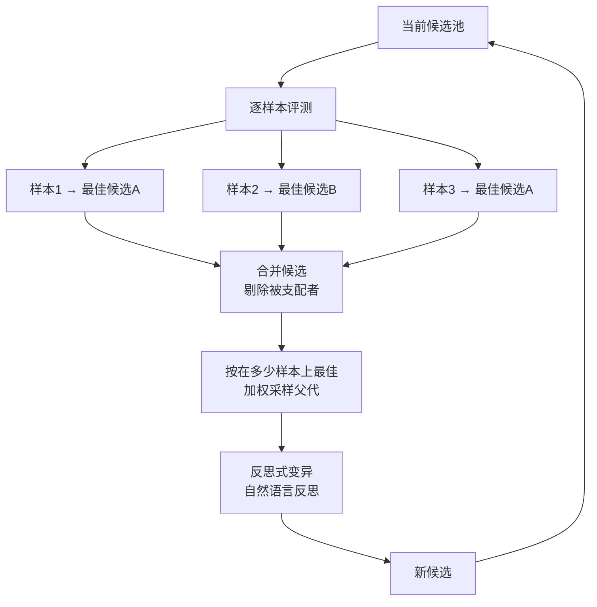

# GEPA: Reflective Prompt Evolution Can Outperform Reinforcement Learning

## 基本信息

| 项目 | 内容 |
|------|------|
| **链接** | https://arxiv.org/abs/2507.19457 |
| **作者** | Lakshya A. Agrawal, Shangyin Tan, Dilara Soylu 等（伯克利等联合） |
| **发布时间** | 2025-07（更新于 2026-02） |
| **一句话总结** | 用自然语言反思做提示词进化，父代选择改为逐样本找最佳加加权采样：消融显示 Pareto 互补选择显著优于贪心与 beam search |

---

## 置信度评估

| 信号 | 评估 |
|------|------|
| 发表场所 | arXiv 预印本（2025，持续更新） |
| 引用/影响 | 高（提示词优化方向代表性工作，附完整消融） |
| 代码可用 | 有（开源实现，可复现） |
| 来源机构 | UC Berkeley 等 |
| **综合置信度** | **🟢 高** |
| 需谨慎点 | 成本优势的表述有特定口径，需分开看（见局限一节） |

## 它解决了什么问题

用强化学习优化提示词需要大量 rollout，成本高。仅用贪心策略做提示词搜索，又容易陷入局部最优。

GEPA 的思路是：**用自然语言反思代替数值梯度，用多候选互补选择代替单冠军更新**。

两个关键点。

第一，反思信号来自执行轨迹的自然语言分析，而非标量奖励。模型读自己的推理过程与失败原因，产出「应该怎么改」的自然语言描述。这比标量奖励携带更多信息。

第二，候选保留策略不用单一最优。这一条是本文件重点，因为它直接对应我们的父代选择设计。

---

## 方法核心

### 父代选择的关键设计

GEPA 的候选选择分三步。

**第一步，逐样本找最佳**。对每个验证样本，找出在该样本上得分最高的候选。注意是逐样本单独看，不是看总分。

**第二步，合并并剔除被支配者**。如果候选 A 在所有样本上都不差于候选 B，且至少一个样本上更好，则 B 被支配，可以剔除。保留那些在至少一个样本上无可替代的候选。

**第三步，按覆盖度加权采样**。统计每个候选在多少个样本上是最佳，用这个计数作为采样权重。在多数样本上最佳的候选更容易被选中，但只在一个样本上最佳的候选也有机会。

这个设计的关键在于：**某候选总分可能不高，但它是某个特定样本上的唯一最优解，那么它仍然值得成为父代**。它携带了其他候选没有的能力。

### 消融数据

论文报告了「样本级 Pareto 互补选择」与其他候选保留策略的对比：

| 候选保留策略 | 得分 |
|---|---|
| Pareto 互补选择 | 61.28 |
| 贪心 | 54.89 |
| beam search（宽度 4） | 53.95 |

这三组数据在同一实验条件下对比，说明按样本级互补性选候选，明显优于只留总分最高的贪心策略。beam search 保持多个候选但保留的是总分靠前的，同样不如按互补性选择。

对这个结果的理解是：**保留多个候选的意义在于能力互补，而不是分数接近**。beam search 保留的是分数相近的候选，它们往往有相同的能力与相同的缺陷。Pareto 互补选择保留的是能力不同的候选，覆盖面更广。

---

## 实验结果

GEPA 在多个任务上报告了结果，与强化学习方法对比：

- 在若干基准上优于 GRPO 等强化学习方法，同时消耗的 rollout 更少
- 成本优势有特定口径：IFBench 上达到最佳提示时用了 678 次 rollout，对比 GRPO 的 24000 次
- GEPA 的完整优化预算是 3593 次 rollout

**这两个数字必须分开看**。678 是「达到最佳提示所需的次数」，3593 是「完整优化预算」。引用时不能混用。

论文同时报告了反例：AIME-2025 上 GEPA 落后于对比方法（−6.00）。这说明 GEPA 不全面优于强化学习，论文如实报告了这一点。

---

## 局限与注意

- **成本口径需仔细区分**。678 次与 3593 次是两个不同含义的数字，混用会高估或低估优势
- **不全面优于强化学习**。AIME-2025 上是反例。论文没有宣称普遍优越
- **反思质量依赖模型能力**。反思是自然语言生成的，基础模型的推理能力会影响优化效果
- **验证样本的质量决定选择结果**。逐样本找最佳的前提是样本集能覆盖真实任务分布。样本集有偏，选择就会偏向局部样本
- **Pareto 维度是样本级任务得分**，不是「准确率 vs 成本」这类多目标维度。这一点容易误读

---

## 对我们项目的启发 ⭐

### 可以直接借鉴的

**① 父代选择按覆盖度加权，不按总分排序**

这是本项目最直接可用的一条。项目的 iteration 阶段会产出多个候选知识修改，需要决定哪个作为下一轮的父代。

GEPA 的答案很清楚：不要只选综合评测分数最高的。要先看每个候选在哪些具体测试用例上表现最好，保留那些在某个用例上无可替代的候选，然后按「覆盖多少个用例」加权采样。

具体到项目场景：假设某个知识修改让 80% 的测试通过，另一个修改让 60% 通过但解决了前一个解决不了的边界情况。按总分排序会选前者，按 GEPA 的规则后者仍然有资格成为父代。

**② 消融数据给了设计信心**

Pareto 互补选择 61.28 vs 贪心 54.89 的差距不是微小差异，说明候选保留策略的选择对最终效果影响显著。这意味着项目在父代选择上投入设计工作是有回报的。

**③ 剔除被支配者的判据可用**

候选 A 在所有样本上不差于 B 且至少一个样本更好，则 B 被支配。这是偏序关系而非全序关系，计算上简单，能有效压缩候选池。

### 需要改造的

**① 样本集对应项目的测试用例集**

GEPA 在验证样本上评估候选。项目里对应的是 check 阶段与 test_gen 阶段的测试用例集。需要确认项目现有的测试用例集是否足够覆盖，否则逐样本找最佳会偏向覆盖到的样本。

项目文档提到「具体业务阈值、历史版本评分和可比性细节仍需细化」，这说明评测集建设本身就是待办项。GEPA 这个方法的前提是评测集质量足够。

**② 成本口径要对齐项目预算**

GEPA 的完整优化预算是 3593 次 rollout。项目的预算约束在 evaluation 阶段（轮次上限与预算耗尽停止）。需要把 GEPA 的预算口径换算成项目的具体约束：多少轮、每轮评多少用例。

**③ 反思信号的来源**

GEPA 的反思来自模型对自己推理过程的自然语言分析。项目里更可靠的信号是「生成代码与原源码的差异」加测试失败信息。这是外部信号，比自我反思更硬。可以把两者结合：外部差异作为事实基础，自然语言反思用于生成修改方向。

### 需要注意的

- **不要只引用 678 这个数字**。完整预算 3593 才是可比的成本口径。对外表述时要说明清楚是哪个
- **AIME-2025 反例要记住**。如果项目里有人主张「反思式进化普遍优于强化学习」，这个反例是反驳
- **验证样本覆盖度是前提**。GEPA 的方法在样本集有偏时效果会退化。项目的测试用例集如果只覆盖部分场景，逐样本选择会偏向这些场景
- **Pareto 维度不要误读为多目标权衡**。有人可能把 GEPA 的 Pareto 理解成「准确率 vs 成本」的权衡，实际是样本级任务得分的互补性

---

## 关联

- **对应飞轮环节**：反馈闭环（review 阶段生成纠正意见、workflow_router 选择父代）
- **相关论文**：DGM（2505.22954）：，归档加父代采样，与 GEPA 的加权采样互相印证
- **相关论文**：Promptbreeder（2309.16797）：，同属提示词进化路线，wiki 已有单篇
- **相关论文**：Learning to Evolve（2604.20714）：，文本参数图优化的多智能体自改进
- **相关论文**：AgentGrad（2609.08572）：，干预引导的多智能体提示优化
- **项目缺口对应**：项目标注「历史版本评分和可比性细节仍需细化」，本论文给出的逐样本互补选择是细化方向之一
