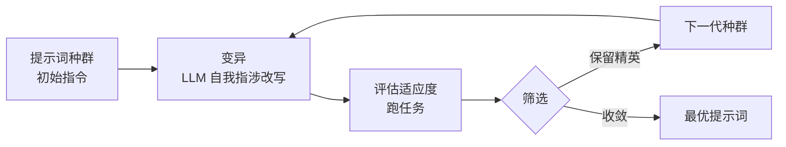

# Promptbreeder: Self-Referential Self-Improvement Via Prompt Evolution

## 基本信息

| 项目 | 内容 |
|------|------|
| **链接** | https://arxiv.org/abs/2309.16797 |
| **作者** | Chrisantha Fernando, Dylan Banarse, Henryk Michalewski, Simon Osindero, Tim Rocktäschel（DeepMind） |
| **发布时间** | 2023-09-28 |
| **一句话总结** | 让 LLM 自己繁殖、变异、进化提示词——提示词策略本身变成可进化的种群，自动发现比手写 CoT 更好的指令 |

---

## 置信度评估

| 信号 | 评估 |
|------|------|
| 发表场所 | arXiv 预印本（DeepMind） |
| 引用/影响 | 高（568+） |
| 代码可用 | 无官方代码 |
| 来源机构 | DeepMind（Google） |
| **综合置信度** | ✅ 高 |
| 需谨慎点 | 进化搜索计算成本高；提示词进化结果可能过拟合特定任务 |

## 它解决了什么问题

Chain-of-Thought 这类提示词策略是人手工设计的，往往不是最优。Promptbreeder 的思路：**把提示词当成可进化的对象**——从一个提示词种群出发，用 LLM 当变异算子（自我指涉：提示词自己进化出更好的提示词），在任务上评估适应度，优胜劣汰，自动发现更优提示词。

---

## 方法核心

关键设计：
- **自我指涉（self-referential）**：进化用的"变异提示词"本身也是进化对象——提示词能改进自己
- **LLM 当变异算子**：不靠随机字符串变异，而是让 LLM 理解现有提示词、生成更有希望的新变体
- **评估**：在目标任务上跑出分数作为适应度，精英保留
- **任务多样**：思维链、复杂推理、数学问题等场景都验证过

---

## 实验结果

- 在数学推理、常识推理等任务上，自动进化的提示词**超过手写 CoT**
- 进化出的提示词有时是反直觉的、人想不到的写法
- 自我指涉的变异机制能持续产生有意义的改进（不只是随机扰动）

---

## 局限与注意

- 每轮进化都要跑任务评估，token 成本高
- 提示词进化结果可能过拟合评估任务，泛化性要测
- 变异出的提示词可能不可解释（人看不懂但效果好）

---

## 对我们项目的启发 ⭐

### 可以直接借鉴的

**① 知识/提示词作为可进化种群**：Promptbreeder 把"指令"当进化对象，我们飞轮里"知识文档"就是天然的进化对象。它的进化机制（变异 → 评估 → 筛选）可以用于知识优化：差异反馈作为变异指导，门禁分数作为适应度，精英知识保留。

**② 自我指涉的二阶进化**：不仅进化知识，还能进化"生成知识的 Skill 提示词"——这是 SEW 超进化（HE）的同款思路，Promptbreeder 更早提出。飞轮跑稳后可以升级到二阶。

**③ 反直觉解**：进化可能找到人想不到的好知识写法，提示我们不要过早用"常识"限制知识模板。

### 需要改造的

**① 变异算子不同**：Promptbreeder 用 LLM 自我指涉变异。我们的"变异"由差异分析驱动——生成代码 vs 源码的差异就是变异信号，比它更客观、更有方向性。

**② 适应度不同**：它的适应度是任务分数。我们是"知识还原代码的相似度"——更贴合我们的目标，且可重复。

### 需要注意的

- 进化搜索成本高。海量知识全量进化不现实，建议按模块小范围试点，验证有效再推广（与 SEW 的结论一致）。

---

## 关联

- **对应飞轮环节**：第四步（反馈优化）——知识进化的机制参考
- **相关论文**：SEW（2505.18646）——工作流进化，超进化同源
- **相关论文**：EvolveR（2510.16079）——经验生命周期
