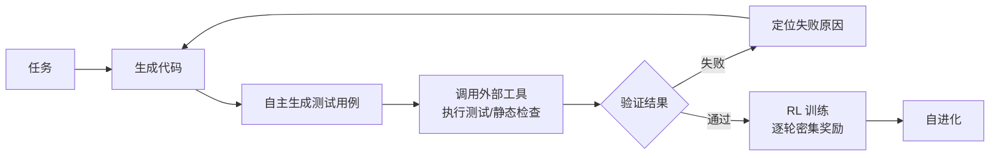

# ReVeal: Self-Evolving Code Agents via Reliable Self-Verification

## 基本信息

| 项目 | 内容 |
|------|------|
| **链接** | https://arxiv.org/abs/2506.11442 |
| **作者** | Yiyang Jin, Kunzhao Xu, Hang Li, Xueting Han, Yanmin Zhou, Cheng Li, Jing Bai |
| **发布时间** | 2025-06-13（v2 更新于 2025-10-21） |
| **一句话总结** | 代码 agent 自己生成测试、自己调用工具验证、用可靠信号做强化学习——让"生成-验证"循环可训练、可演化 |

---

## 置信度评估

| 信号 | 评估 |
|------|------|
| 发表场所 | arXiv 预印本（2025） |
| 引用/影响 | 中 |
| 代码可用 | 有 |
| 来源机构 | 学术/工业界 |
| **综合置信度** | **🟡 中** |
| 需谨慎点 | 自主验证思路有价值，RL 训练成本高 |

## 它解决了什么问题

带可验证奖励的强化学习（RLVR）推进了 LLM 推理，但现有方法只靠**最终结果奖励**（测试过没过），有两个问题：

1. 不优化"验证"本身——agent 不知道测试哪里没覆盖到
2. 不可靠信号——测试通过不代表代码对（测试可能太弱）

ReVeal 让 agent 具备**可靠的自我验证能力**：自己生成测试、调用外部工具拿精确反馈、用密集的逐轮奖励做强化学习。

---

## 方法核心

关键设计：

| 组件 | 作用 |
|------|------|
| **自主测试生成** | agent 不只写代码，还自己写测试，弥补测试缺失 |
| **工具调用验证** | 执行测试、静态分析工具，拿精确的逐轮反馈 |
| **密集奖励 RL** | 不只奖励"最终通过"，每轮验证结果都作为奖励信号，训练验证能力本身 |
| **可靠性校准** | 让 agent 学会判断"什么信号可信"，避免被弱测试误导 |

---

## 实验结果

- 在代码生成/修复任务上，ReVeal 的自进化效果优于只用结果奖励的 RLVR 基线
- 自主生成测试 + 工具验证的组合，让 agent 在测试缺失场景也能获得反馈
- 密集逐轮奖励比稀疏结果奖励训练更有效

---

## 局限与注意

- 依赖可执行环境（能跑测试）
- 自主生成的测试本身可能有问题（测试错、覆盖差），需要校验
- RL 训练需要额外资源和数据管线

---

## 对我们项目的启发 ⭐

### 可以直接借鉴的

**① 自主测试生成**：我们的代码库测试覆盖未必全。ReVeal 的思路——让 agent 自己生成测试来验证代码——可以用于门禁：无测试的模块，让 Agent 基于知识生成代码的同时生成测试，用测试辅助验证知识质量。这是对"仅靠相似度门禁"的补充。

**② 验证本身要可靠**：它专门研究"可靠验证"（不被弱测试误导）。我们的门禁也要防类似问题：相似度高不代表逻辑对（可能只是抄了样式）。门禁信号要设计成"可靠信号"。

### 需要改造的

**① 奖励信号换成源码对比**：ReVeal 的奖励来自测试。我们的核心信号是"生成代码 vs 源码"——可以把它的 RL 框架换成"对比相似度 + 测试通过率"双信号，作为知识进化的适应度函数。

**② 训练 vs 提示**：ReVeal 用 RL 更新模型权重，我们无法微调 GLM 5.1。但它的思路可以降级为"提示级"：把验证结果作为反馈写进知识优化 prompt，不更新权重也能自进化（Reflexion 路线）。

### 需要注意的

- 它证明"自主验证"可行，但验证的可靠性需要专门设计——直接照搬"测试通过 = 知识合格"会踩坑。门禁设计建议参考它的可靠性校准思路。

---

## 关联

- **对应飞轮环节**：门禁设计 + 第四步（反馈优化）
- **相关论文**：CRITIC（2305.11738）——工具交互验证
- **相关论文**：Self-Debugging（2304.05128）——执行反馈自调试
