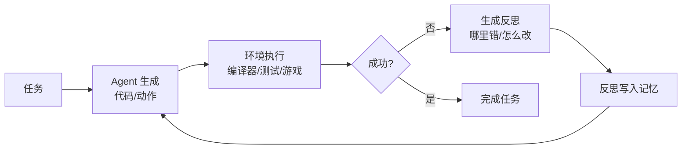

# Reflexion: Language Agents with Verbal Reinforcement Learning

## 基本信息

| 项目 | 内容 |
|------|------|
| **链接** | https://arxiv.org/abs/2303.11366 |
| **代码** | https://github.com/noahshinn/reflexion |
| **作者** | Noah Shinn, Federico Cassano, Edward Berman, Ashwin Gopinath, Karthik Narasimhan, Shunyu Yao |
| **发布时间** | 2023-03-20（NeurIPS 2023） |
| **一句话总结** | 让 agent 把失败经验写成"语言反思"，存进记忆，下次遇到类似任务直接调用——不更新模型权重，纯靠文本记忆实现强化学习 |

---

## 置信度评估

| 信号 | 评估 |
|------|------|
| 发表场所 | NeurIPS 2023（顶会接收） |
| 引用/影响 | 高（大量引用） |
| 代码可用 | 有（github.com/noahshinn/reflexion） |
| 来源机构 | 斯坦福/普林斯顿等 |
| **综合置信度** | **✅ 高** |
| 需谨慎点 | 经典工作，被 Fragility 论文部分质疑可靠性，但机制本身被广泛验证 |

## 它解决了什么问题

Agent 在环境里（编译器、API、游戏）试错时，传统强化学习要更新模型权重，又贵又慢。Reflexion 想证明：**用自然语言做强化学习**——失败后把"哪里错了、该怎么改"写成反思文本存起来，下次就能避开同样的坑。

它是反馈循环的奠基工作之一，后来的自进化 agent 几乎都引用它。

---

## 方法核心

三个组件循环协作：

| 组件 | 作用 |
|------|------|
| **Actor（行动者）** | 生成代码/动作，基于任务 + 历史反思 |
| **Evaluator（评估者）** | 跑环境（编译、测试、游戏得分），给出客观结果 |
| **Self-Reflection（自反思）** | 根据评估结果生成语言反思：失败原因 + 改进策略，存入记忆 |

关键设计：反思是**自然语言**，不是梯度。记忆跨轮次累积，每轮生成时都参考之前的反思，避免重蹈覆辙。在 HumanEval 等代码任务上，反思让模型从 pass@1 的较低水平提升到接近 pass@100 的效果——即"试错 + 反思"能补足单次生成的能力差距。

---

## 实验结果

- **HumanEval**：GPT-4 单次生成准确率约 80%，加 Reflexion 循环后可显著提升，逼近多次采样的上限
- **编程竞赛问题**（APPS/CodeContests）：反思机制让模型逐步修正错误
- **决策类任务**（游戏、问答）：同样有效，证明机制通用

核心结论：**语言反思 + 记忆 = 轻量强化学习**，不用动权重就能持续改进。

---

## 局限与注意

- 反思质量决定上限：模型反思得不准，记忆里全是错误教训
- 依赖客观评估者（测试/环境）：没有可执行反馈的任务用不了
- 记忆累积后可能过长，需要压缩或淘汰
- 后续研究（Fragility 论文）发现：这种记忆型自改进**不稳定**，任务顺序和方差影响大

---

## 对我们项目的启发 ⭐

### 可以直接借鉴的

**① "反思"这一步正是我们飞轮的核心动作**：我们的飞轮是"生成代码 → 对比源码 → 反馈 → 优化知识"。Reflexion 证明了"把失败经验写成文本反馈"有效——对应我们"把差异分析结果写成知识优化指令"。结构完全同构。

**② 语言记忆替代权重更新**：我们不微调 GLM 5.1（本地部署大概率不开放训练），只能靠"改知识文档"来改进系统。Reflexion 证明这条路可行——文本层面迭代就够了。

**③ 评估者必须客观**：Reflexion 用编译器/测试做评估，不靠模型自我感觉。我们的门禁也是客观对比（生成代码 vs 源码），方向一致。

### 需要改造的

**① 反思对象不同**：Reflexion 反思的是"这次任务怎么做"，我们反思的是"知识文档哪里写得不够好"。反馈内容要从"行动改进"改成"知识改进"——差异分析要能指出"知识缺了什么/哪里写错导致代码偏离源码"。

**② 评估信号更强**：Reflexion 的评估是测试通过/失败（二元）。我们的对比（生成代码 vs 源码）信息量更大，可以给出具体差异位置——反馈质量应该比它更好。

### 需要注意的

- 它和"自反馈（Self-Refine）"不同：Reflexion 依赖**外部客观评估**（测试/环境），Self-Refine 靠模型自己挑毛病。前者可靠得多。我们的飞轮要站在 Reflexion 这一侧——门禁对比是客观信号，不是 LLM 自查。

---

## 关联

- **对应飞轮环节**：第三步（差异对比）+ 第四步（反馈优化）的奠基工作
- **相关论文**：On the Fragility of Self-Improving Agents（2608.18066）——对 Reflexion 式记忆自改进的可靠性警告
- **相关论文**：Self-Refine（2303.17651）——另一条自反馈路线（无外部评估）
