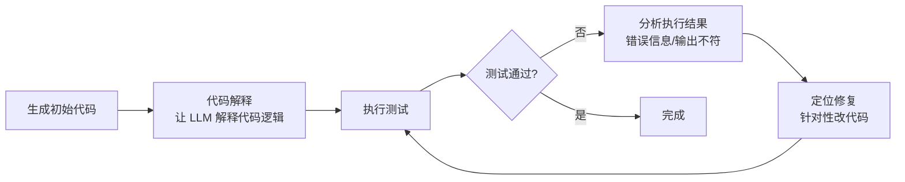

# Teaching Large Language Models to Self-Debug

## 基本信息

| 项目 | 内容 |
|------|------|
| **链接** | https://arxiv.org/abs/2304.05128 |
| **作者** | Xinyun Chen, Maxwell Lin, Nathanael Schärli, Denny Zhou（Google Research） |
| **发布时间** | 2023-04-11（ICLR 2024） |
| **一句话总结** | 让 LLM 自己解释代码 + 跑测试，根据执行结果定位并修复 bug——自调试（self-debugging）的奠基工作 |

---

## 置信度评估

| 信号 | 评估 |
|------|------|
| 发表场所 | ICLR 2024（顶会接收） |
| 引用/影响 | 高（大量引用） |
| 代码可用 | 无官方代码（论文含实现细节） |
| 来源机构 | Google Research |
| **综合置信度** | **✅ 高** |
| 需谨慎点 | 执行反馈结论被后续工作复现 |

## 它解决了什么问题

复杂编程任务一次生成就完全正确很难。之前的程序修复方法要么另训练修复模型，要么重生成。Self-Debug 的思路：**让生成代码的模型自己当调试器**——读自己写的代码、解释它、跑测试、看失败原因、针对性修。

关键是"执行反馈"：要参考**实际运行结果**（测试输出、错误信息）来定位问题。

---

## 方法核心

流程：

1. **代码解释（code explanation）**：先让 LLM 解释自己生成的代码——把逻辑讲清楚，帮助它自己发现问题
2. **执行测试**：跑单元测试，拿到真实执行结果
3. **自调试**：根据测试失败信息，定位错误代码行，修复
4. **循环**：重跑测试直到通过

论文实验了三种反馈形式的效果：无反馈 / 单元测试结果 / 代码解释 + 单元测试。发现**代码解释 + 执行反馈组合效果最好**——解释让模型更理解自己的代码，执行反馈让它知道错在哪。

---

## 实验结果

- 在代码生成基准（TransCoder、MBPP、HumanEval 等）上，自调试显著提升修复准确率
- **代码解释 + 测试反馈**的组合比只用测试反馈更好
- 少样本（few-shot）场景下，自调试能带来更高提升——小模型也能受益
- 结论：执行反馈是自调试的核心，代码解释是有效增强

---

## 局限与注意

- 依赖测试套件：没有测试就无法获得执行反馈
- 自调试循环有 token 成本（每轮都要跑测试 + 分析）
- 复杂 bug（跨文件、依赖外部状态）单靠自调试难以定位

---

## 对我们项目的启发 ⭐

### 可以直接借鉴的

**① 代码解释环节 = 知识生成的前置动作**：Self-Debug 让 LLM"先解释再调试"，解释帮助理解。我们的知识生成 Skill 本质上就是"让 LLM 解释源码"——解释得越好，后续 Agent 基于知识生成的代码越准。可以把"解释"显式作为知识文档的一部分（对应我们知识形态里的"实现思路"）。

**② 执行反馈的三种形式**：它对比了"无反馈/测试/解释+测试"，这个实验设计可以直接搬到我们的门禁设计——评测"生成代码 vs 源码"时，测试反馈 + 静态对比反馈哪个更有效，值得实验验证。

### 需要改造的

**① 反馈来源从"测试"扩展到"源码对比"**：Self-Debug 靠测试结果反馈。我们飞轮的核心反馈是"生成代码 vs 源码差异"——即使没有测试，也能通过 AST/结构对比给反馈。这是对我们的扩展：不依赖测试覆盖率。

**② 调试对象从"代码"换成"知识"**：Self-Debug 修的是代码，我们修的是知识文档。机制可以平移：知识导致代码跑偏 → 分析差异 → 定位知识缺陷 → 修知识。

### 需要注意的

- "代码解释 + 测试反馈"的组合效果最好——说明**解释性内容（知识）和执行验证（门禁）要一起用**，不能只靠一个。这正好对应我们"解释型知识文档 + 客观门禁"的双设计。

---

## 关联

- **对应飞轮环节**：第二步（代码生成）+ 第三步（差异对比）+ 第四步（反馈优化）
- **相关论文**：CRITIC（2305.11738）——工具交互自纠错
- **相关论文**：Reflexion（2303.11366）——反思记忆
