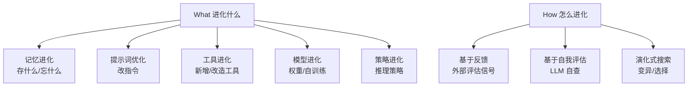

# A Survey of Self-Evolving Agents: What, When, How, and Where to Evolve

## 基本信息

| 项目 | 内容 |
|------|------|
| **链接** | https://arxiv.org/abs/2507.21046 |
| **作者** | Huan-ang Gao, Jiayi Geng, Wenyue Hua 等（伊利诺伊大学、清华等联合综述） |
| **发布时间** | 2025-07-28（v4 更新于 2026-01-16） |
| **一句话总结** | 自进化 Agent 领域最全的综述：系统回答 agent 该进化什么、何时进化、怎么进化、在哪进化——知识飞轮的上位框架 |

---

## 置信度评估

| 信号 | 评估 |
|------|------|
| 发表场所 | arXiv 预印本（2025，多机构联合） |
| 引用/影响 | 中（综述常被引用） |
| 代码可用 | 无（综述性质） |
| 来源机构 | 伊利诺伊大学/清华等 |
| **综合置信度** | **🟡 中** |
| 需谨慎点 | 综述信息量大，但收录方法质量参差需自行判断 |

## 它解决了什么问题

LLM 部署后是**静态的**：不会随任务、知识变化、交互环境自我调整。自进化 Agent（Self-Evolving Agents）研究如何让 agent 在运行中持续改进。这个方向发展快但概念混乱，需要一份系统梳理——这篇综述就是干这个的。

它用四个问题组织整个领域（论文标题就是答案）：

- **What**：进化什么？（记忆 / 提示词 / 工具 / 模型 / 策略）
- **When**：何时进化？（任务中 / 任务后 / 周期性）
- **How**：怎么进化？（基于反馈 / 基于评估 / 基于演化算法）
- **Where**：在哪进化？（个体 / 多 agent 协作 / 群体）

---

## 方法核心

综述把现有方法按"进化对象"分类，其中和我们最相关的是：

- **记忆进化（Memory Evolution）**：agent 保留什么知识、遗忘什么、怎么抽象总结——直接对应我们的"知识文档演化"
- **提示词优化（Prompt Optimization）**：把指令当可搜索对象，用反馈迭代改写指令——对应我们的"知识优化"
- **策略进化（Strategy Evolution）**：agent 的推理和行动计划随经验改进

它还梳理了关键评估问题：自进化 agent 怎么评测才可信（不能只在进化过的任务上自评）。

---

## 实验结果

综述性质，无单一实验结果。核心贡献是**分类框架**和**开放问题清单**：

- 自进化效果如何泛化到新任务？（进化过的 agent 在新任务上还灵不灵）
- 反馈质量如何保证？（很多自进化方法靠自我评估，可靠性存疑）
- 如何防止进化方向跑偏/退化？（越进化越差的案例）
- 评估基准缺失，难以横向比较

---

## 局限与注意

- 综述覆盖广但每类方法深度有限，需要按图索骥读原文
- 领域本身仍在快速变化，2026 年的新方法可能未收录
- 综述承认：自进化的可靠性（方差、退化、任务顺序影响）研究不足——这正是 Fragility 论文补的坑

---

## 对我们项目的启发 ⭐

### 可以直接借鉴的

**① 用"进化什么"框架定位我们的飞轮**：我们的知识飞轮 = **记忆进化的特例**——进化对象是知识文档（记忆），进化信号是"生成代码 vs 源码差异"（外部反馈），进化时机是门禁失败后（任务后）。用综述的框架能帮我们对齐术语、对照已有方法。

**② 反馈来源的分类**：综述把进化信号分"外部反馈"和"自我评估"。我们的飞轮用外部反馈（源码对比）——属于更可靠的一类。这给了我们设计信心：不要退化成"LLM 自己判断知识好不好"。

**③ 开放问题即我们的风险清单**：泛化性（知识改好了，别的地方会不会坏？）、退化（越改越差的可能）、评估基准缺失——这三条直接对应我们飞轮上线后要监控的风险。

### 需要改造的

**① 通用自进化 → 领域定制**：综述是通用 agent 框架。我们聚焦"代码知识"这个具体对象，可以把它的分类法细化为"知识文档进化"的专属流程。

**② 知识进化的专属评测**：综述说评测缺失，我们正好要建——门禁（生成代码 vs 源码 80%）就是知识进化的专属评测，这是我们的差异化贡献。

### 需要注意的

- 综述确认"记忆进化"和"提示词优化"是主流方向——我们的"知识文档进化"同时踩中这两个方向，说明思路前沿。但也要警惕：这两个方向文献里都报告过不稳定案例，飞轮设计要带防退化机制（版本控制、回滚、人工抽查）。

---

## 关联

- **对应飞轮环节**：全部（知识飞轮 = 记忆进化的工程实现）
- **相关论文**：On the Fragility of Self-Improving Agents（2608.18066）——本综述点名的可靠性坑
- **相关论文**：EvolveR（2510.16079）——综述之后的落地框架
