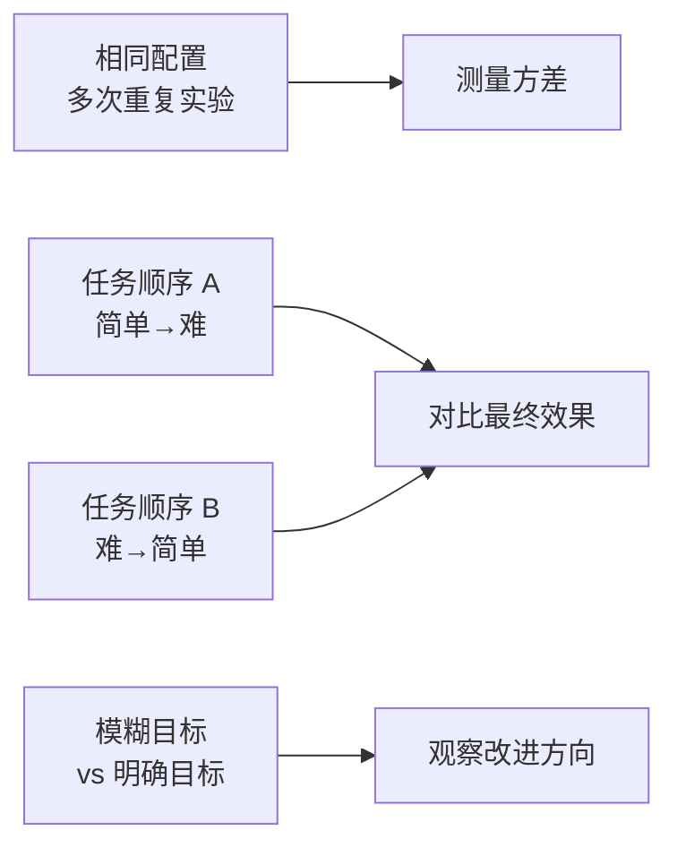

# On the Fragility of Self-Improving Agents: Variance, Task Order, and Underspecification

## 基本信息

| 项目 | 内容 |
|------|------|
| **链接** | https://arxiv.org/abs/2608.18066 |
| **作者** | Qinyuan Ye, Yu Li, Yada Pruksachatkun, Jiaxin Zhang, Chien-Sheng Wu |
| **发布时间** | 2026-08-18（最新，必读） |
| **一句话总结** | 给自改进 agent 泼冷水：基于记忆的自改进（Reflexion 式）非常脆弱——同样的实验跑多次方差巨大、任务顺序影响结果、规格不明确会跑偏。前期乐观结论很多站不住 |

---

## 置信度评估

| 信号 | 评估 |
|------|------|
| 发表场所 | arXiv 预印本（2026-08，最新） |
| 引用/影响 | 低（刚发布） |
| 代码可用 | 待确认 |
| 来源机构 | 学术机构 |
| **综合置信度** | **⚠️ 谨慎（但方向极重要）** |
| 需谨慎点 | 刚发布 2 天，结论本身需更多验证；但它质疑的乐观偏差有独立佐证，作为设计约束采纳 |

## 它解决了什么问题

自改进 agent（维护文本记忆库、随任务流学习提升）在文献里被宣传得很美好。但论文发现：**可靠性被严重忽视了**。绝大多数研究只报告"平均提升"，没做重复实验、没控制任务顺序、没讨论规格歧义——而这些因素对结果影响巨大。

它系统性地检验了记忆型自改进 agent 的三类脆弱性：

1. **方差（Variance）**：同样配置跑多次，结果波动巨大——改进可能是运气
2. **任务顺序（Task Order）**：先学简单后学难，和先难后易，最终效果不同——改进可能只是顺序效应
3. **规格不明确（Underspecification）**：目标没定义清楚时，agent 会"改进"到错误方向——越努力越偏

---

## 方法核心

对记忆型自改进 agent（基于在线任务流 + 文本记忆库）做严格实验：

三组对照实验分别量化：重复实验的方差、任务顺序颠倒的影响、目标明确度的影响。用真实任务和受控合成任务双验证。

---

## 实验结果

论文的发现相当扎心：

- 前期文献声称的"自改进效果"在严格控制实验下**大幅缩水**，甚至消失
- 方差：同配置重复跑，最好和最差结果差异显著——单次实验的"提升"不可信
- 任务顺序：改变顺序结果反转，说明很多"改进"其实是顺序的副产品
- 规格不明确：agent 会自信地改进到错误方向，没有明确目标时自改进是盲目的
- 结论：记忆型自改进的可靠性是开放问题，现有评估方法系统性高估了效果

（另有媒体解读：某研究显示自评 agent 在 54 个测试循环里全部声称进步，但超过一半实际变差了——同一现象的通俗版。）

---

## 局限与注意

- 聚焦记忆型自改进（文本记忆库），其他形式（工具进化、权重更新）不在范围内
- 实验规模有限，但结论和理论预期一致
- 它要求**严格评估**：重复实验、控制顺序、明确规格，而非否定自改进本身

---

## 对我们项目的启发 ⭐

这篇对我们**极其重要**，应该列为飞轮设计的必读。

### 直接影响我们的设计

**① 飞轮效果必须重复验证**：我们的飞轮也是"记忆（知识）驱动的自改进"。按这篇论文，不能跑一次"知识优化后生成代码更接近源码了"就宣布成功。必须：多次重复、不同任务顺序、统计显著性检验。

**② 规格明确性 = 门禁阈值的精确定义**：它警告"目标模糊会跑偏"。我们的门禁（80% 相似度）必须定义得极其明确：相似度怎么算、对齐什么粒度、允许什么差异。否则飞轮会"自信地改进到错误方向"——知识越来越"像"源码的写法，但功能逻辑是错的。

**③ 任务顺序效应**：知识生成顺序（先简单模块还是先核心模块）可能影响知识库整体质量。计划时要有意设计顺序，并测试顺序敏感性。

### 需要改造的

**① 客观反馈 > 自我评估**：论文的脆弱性主要来自自我评估型改进（agent 自己判断自己进步了）。我们的飞轮用**客观对比**（生成代码 vs 源码），理论上比自我评估可靠。但论文提醒：即使客观信号，信号本身定义不清也会跑偏——所以门禁指标的定义质量是关键。

**② 评估协议**：建议在飞轮设计中内置"评估协议"：每个知识优化周期结束，重复跑 N 次门禁评测，报告均值±方差，而不是单次数值。这个协议要在项目文档里写死。

### 需要注意的

- 这篇是 2026-08 的最新研究，直接质疑 Reflexion/Self-Refine 这一整条路线的可靠性。我们的飞轮不能只参考"成功案例"，必须把这篇的警告纳入设计约束。

---

## 关联

- **对应飞轮环节**：全部——飞轮可靠性的全局约束
- **相关论文**：Reflexion（2303.11366）——它质疑的对象
- **相关论文**：A Survey of Self-Evolving Agents（2507.21046）——综述点名的可靠性开放问题
