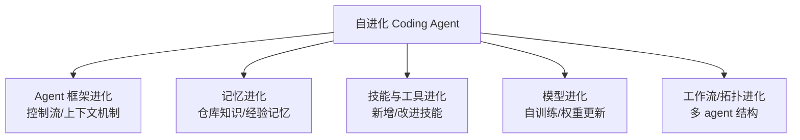

# Self-Evolving Coding Agents（2026 综述）

## 基本信息

| 项目 | 内容 |
|------|------|
| **链接** | https://arxiv.org/abs/2608.03392 |
| **作者** | Hao Zhou, Haichuan Hu, Ye Shang, Quanjun Zhang |
| **发布时间** | 2026-08-04 |
| **一句话总结** | 聚焦"自进化 coding agent"的最新综述：软件工程场景下 agent 该进化什么（框架/记忆/技能/模型/工作流），用软件特有的证据驱动进化 |

---

## 置信度评估

| 信号 | 评估 |
|------|------|
| 发表场所 | arXiv 预印本（2026-08） |
| 引用/影响 | 低（最新发布） |
| 代码可用 | 无（综述性质） |
| 来源机构 | 学术机构 |
| **综合置信度** | **🟡 中** |
| 需谨慎点 | 综述分类框架有价值，但领域快速演化，框架非定论 |

## 它解决了什么问题

coding agent（能看仓库、调工具、跑测试、打补丁的 agent）部署后**基本是静态的**。但软件开发环境一直在变：代码库演进、依赖更新、新需求出现。静态 agent 跟不上。

通用自进化 agent 研究很多，但软件工程场景有特殊性——代码是可执行的、测试是客观证据、仓库是活的。这篇综述专门梳理**软件工程里的自进化**，把散落的工作统一成框架。

---

## 方法核心

综述提出**以进化对象为中心的分类法**：

三个研究问题：

- **RQ1 进化什么**：上面五种对象，按软件工程场景分类
- **RQ2 何时进化、用什么证据**：任务时 / 任务后 / 分阶段；证据包括结果证据（测试过没过）、环境反馈（编译器报错）、轨迹证据（过程数据）
- **RQ3 怎么评测**：正确性、可维护性、鲁棒性、成本、安全性、泛化性

关键区分：coding agent 和普通自进化 agent 的不同在于——**代码是可执行产物，反馈是客观的**（测试、编译、运行），这让软件工程场景的自进化比通用场景更可靠、更可验证。这正是我们知识飞轮的理论基础。

---

## 实验结果

综述性质。核心产出：

- 统一分类框架（进化对象 × 时机 × 证据类型）
- 软件特有证据的分类（结果/环境/轨迹）
- 开放挑战清单：评估基准缺失、泛化性验证不足、安全与成本问题

---

## 局限与注意

- 领域 2026 年仍在快速演化，分类框架是"引导性综合"而非定论
- 多数现有工作聚焦单仓库、小规模，超大规模代码库的自进化研究很少——我们的场景恰恰是空白区
- 评测方法不统一，横向对比困难

---

## 对我们项目的启发 ⭐

### 可以直接借鉴的

**① "软件特有证据"分类直接可用**：综述把软件工程的反馈信号分成结果证据（测试）、环境证据（编译/运行）、轨迹证据（过程）。我们的门禁和反馈设计可以按这个分类做信号选型：能跑测试用结果证据，不能跑用环境证据（编译/静态分析），再辅以源码对比。

**② 进化对象对齐**：我们的知识飞轮 = "记忆进化"（知识文档）+ "技能进化"（知识生成 Skill 优化）的组合。用综述的框架可以清楚地定位我们在做什么、还有什么没做。

**③ 评测维度清单**：正确性/可维护性/鲁棒性/成本/安全/泛化——这六维可以作为我们飞轮验收的检查清单，不只盯 80% 相似度。

### 需要改造的

**① 超大规模空白区 = 我们的机会**：综述承认现有工作聚焦小仓库。我们的上亿行代码场景没有现成方案，飞轮设计本身就是前沿探索——这既是挑战也是差异化价值。

**② 证据要组合**：单靠"生成代码 vs 源码相似度"一种信号不够。按综述的分类，建议组合：源码对比（结构）+ 编译检查（环境）+ 测试（结果，有则用）。多信号门禁更可靠。

### 需要注意的

- 综述多次强调"泛化性验证不足"：知识进化后要在**没参与进化的新代码**上验证，不能只在老代码上自评——这和 Code-QA-Bench 的防作弊思路一致。

---

## 关联

- **对应飞轮环节**：全部（软件工程场景自进化的全景框架）
- **相关论文**：A Survey of Self-Evolving Agents（2507.21046）——通用自进化综述，本论文是软件工程定制版
- **相关论文**：SEW（2505.18646）、EvolveR（2510.16079）——综述收录的代表性框架
