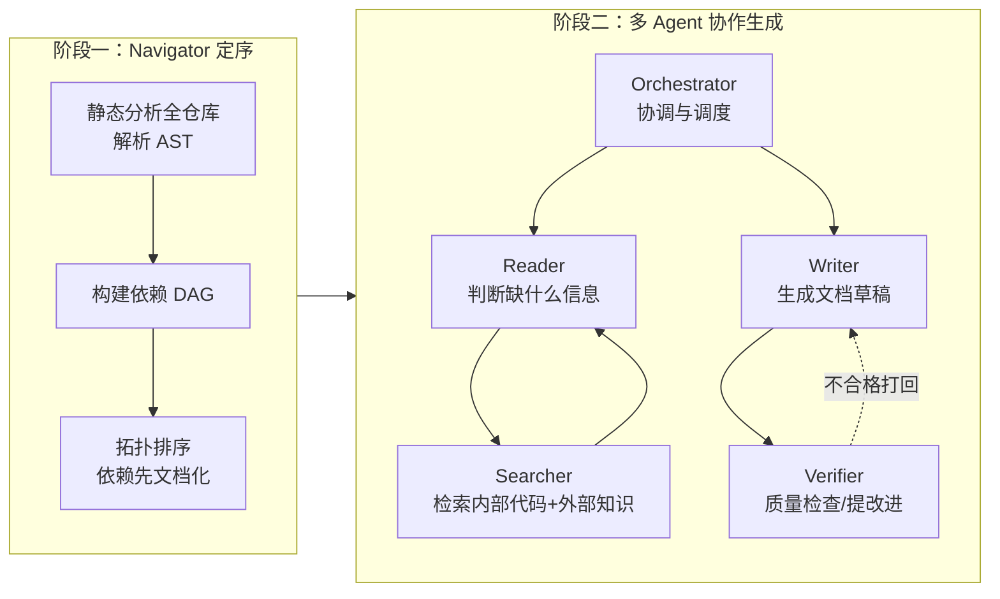

# DocAgent: A Multi-Agent System for Automated Code Documentation Generation

## 基本信息

| 项目 | 内容 |
|------|------|
| **链接** | https://arxiv.org/abs/2504.08725 |
| **作者** | Dayu Yang, Antoine Simoulin, Xin Qian, Xiaoyi Liu, Yuwei Cao, Zhaopu Teng, Grey Yang（Salesforce 等） |
| **发布时间** | 2025-04-11 |
| **一句话总结** | 用 5 个分工明确的 Agent（Reader/Searcher/Writer/Verifier/Orchestrator）协作生成代码文档，并配套自动评测框架 |

---

## 置信度评估

| 信号 | 评估 |
|------|------|
| 发表场所 | arXiv 预印本（2025） |
| 引用/影响 | 中 |
| 代码可用 | 待确认 |
| 来源机构 | Salesforce 等 |
| **综合置信度** | **🟡 中** |
| 需谨慎点 | 多 Agent 设计合理，需自行验证效果 |

## 它解决了什么问题

论文指出现有 LLM 文档生成方法有三个反复出现的毛病：

1. **不完整**：只写摘要级别的内容，缺少实用细节
2. **没用**：抓不住组件真正相关的文件、依赖和外部引用
3. **事实错误**：生成的内容和真实代码对不上

根因有两个：大型复杂仓库里"该看哪些上下文"很难定位；依赖链复杂，全塞进 prompt 会爆上下文窗口。

---

## 方法核心

DocAgent 分两阶段：先定处理顺序，再让多 Agent 协作生成。

### 阶段一：Navigator（依赖感知定序）

对全仓库做静态分析，解析 AST 识别函数、方法、类和它们之间的依赖（函数调用、类继承、属性访问、模块导入），构建 DAG。然后拓扑排序，遵守"依赖优先"原则：**一个组件只有等它依赖的所有组件都文档化之后才处理**。

### 阶段二：多 Agent 协作

| Agent | 职责 |
|-------|------|
| **Reader** | 分析目标组件，判断需要哪些信息。输出结构化 XML 请求两类信息：内部信息（依赖 = 它调用了谁；引用 = 谁调用了它，展示真实用法）和外部知识（领域知识、第三方库） |
| **Searcher** | 用工具满足 Reader 的请求：内部代码分析工具（检索源码、找调用点、沿依赖图追踪）+ 外部知识检索工具。把结果整理成结构化上下文 |
| **Writer** | 接收代码 + 上下文，按组件类型生成结构化文档（函数/方法：摘要 + 扩展描述；类：整体概述 + 方法细节） |
| **Verifier** | 对照预定义标准（信息价值、详细程度、完整性）评估文档，通过则批准，不通过给具体改进建议，打回 Writer |
| **Orchestrator** | 调度以上 4 个 Agent 的协作流程 |

关键设计：**Reader 和 Searcher 会来回多轮**——Searcher 把检索结果给 Reader，Reader 看上下文够不够，不够再要更多。像两个人类同事协作讨论。

---

## 实验结果

- 在多个仓库上评测，三个维度：**Completeness（完整性）、Helpfulness（有用性）、Truthfulness（真实性）**
- 对比基线包括单 Agent 方法和现有文档生成框架
- 论文还提出了一套**自动评测框架**，不需要人工打分

（论文的详细数字在 Experiment 章节，读全文可以看具体对比表）

---

## 局限与注意

- 依赖静态分析工具解析依赖图，多语言支持看解析器能力
- 多 Agent 来回检索有额外 token 成本，大仓库上成本可能不低
- 评测框架虽然自动化，但"有用性"这类维度本质上还是主观的

---

## 对我们项目的启发 ⭐

### 可以直接借鉴的

**① 多 Agent 分工**：Reader/Searcher/Writer/Verifier 的职责切分很清晰。我们的知识生成 Skill 可以套用这个模式：先分析需要什么上下文 → 检索 → 写作 → 自查。特别是 Verifier 环节，和我们的"知识质量检查"直接对应。

**② Reader-Searcher 迭代**：上下文不够就继续检索，而不是一次性把仓库全塞进 prompt。我们处理上亿行代码时，这个"按需取上下文"的机制比盲目堆上下文可靠。

**③ 依赖优先的生成顺序**：和 RepoAgent 的拓扑序思路一致，进一步验证了"先生成依赖、再生成被依赖"是文档生成的关键设计。

### 需要改造的

**① 单向生成 → 飞轮闭环**：DocAgent 生成的文档没有经过"Agent 基于文档写代码 → 对比源码"的验证。我们的知识生成必须接上这一步，否则无法自动判断知识质量。

**② 外部知识检索**：DocAgent 会查外部知识（领域知识、第三方库）。我们的场景里外部知识要谨慎——公司代码库的领域知识可能就在仓库内部，优先内部检索，外部知识只做补充。

### 需要注意的

- Verifier 是 LLM 自查，和我们的门禁（客观相似度对比）不是一个量级。它的 Verifier 只能抓格式和明显错误，抓不住"知识能否还原代码"这种深层质量问题——这正是我们要用门禁补的。

---

## 关联

- **对应飞轮环节**：第一步（知识生成）
- **相关论文**：RepoAgent（2402.16667）——单框架拓扑序；DocAgent 是它的多 Agent 升级版
- **相关论文**：RepoRepair（2603.01048）——把文档生成用于下游修复任务
