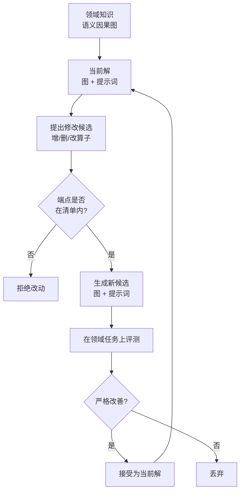

# How to Auto-optimize Prompts for Domain Tasks? Adaptive Prompting and Reasoning through Evolutionary Domain Knowledge Adaptation

## 基本信息

| 项目 | 内容 |
|------|------|
| **链接** | https://arxiv.org/abs/2510.21148 |
| **作者** | 北京邮电大学等（EGO-Prompt 团队） |
| **发布时间** | 2025-10-24 |
| **一句话总结** | 领域知识表示为语义因果图（节点加自然语言边），修改算子限定为受约束的增删改，知识与提示词共同进化：消融显示共同优化显著优于只优化提示词 |

---

## 置信度评估

| 信号 | 评估 |
|------|------|
| 发表场所 | arXiv 预印本（2025-10） |
| 引用/影响 | 中（较新） |
| 代码可用 | 需核实 |
| 来源机构 | 高校研究团队 |
| **综合置信度** | **🟡 中高** |
| 需谨慎点 | 接受策略只维护单一当前解、严格改善才接受，与我们的多候选需求不完全匹配（见局限） |

## 它解决了什么问题

领域任务的提示词优化遇到一个具体困难：**领域知识怎么表达，才能被自动优化**。

把领域知识写成一段说明文字，模型改起来没有结构约束，改动容易失控。把领域知识写成规则列表，又丢掉了规则之间的关系。

EGO-Prompt 的答案是：把领域知识表示为**语义因果图**。节点是概念，边是概念之间的关系，边用自然语言描述。这样知识有了结构，改动可以在结构上进行，同时保留关系的语义。

第二个问题是改动的合法性。如果修改算子无约束，模型可能产生出语法正确但语义荒谬的改动。EGO-Prompt 把算子限定为**增、删、改三类，且改动的端点必须来自指定的清单**。这样任何一次改动都可以被审查。

---

## 方法核心

### 知识的表示形态

领域知识组织成图结构：

- **节点**：领域概念
- **边**：概念之间的关系，用自然语言描述
- **约束**：修改的端点必须来自指定清单，防止模型引入不存在的概念

这种表示的优点是可定位。当任务失败时，可以沿着边追踪到具体的知识条目，而不是面对一整段文字无从下手。

### 修改算子

限定为三类：

| 算子 | 作用 | 约束 |
|---|---|---|
| 增加 | 补充缺失的知识条目或关系 | 端点在清单内 |
| 删除 | 移除错误或冗余的条目 | 端点在清单内 |
| 修改 | 修正已有条目的描述 | 端点在清单内 |

约束的意义在于可审查性。每一次改动都是显式的、小粒度的，可以被独立检查。

### 知识与提示词的联合优化

EGO-Prompt 的关键设计是**同时优化图和提示词**，而不是只优化其中一个。

理由是两者互相依赖：知识结构变了，提示词里引用知识的方式也要变；提示词的推理路径变了，可能需要补充新的知识条目。

消融实验支持这一点：

| 优化对象 | 领域任务 F1 |
|---|---|
| 只优化提示词 | 0.246 |
| 图与提示词共同优化 | 0.333 |

差距明显，说明知识结构本身是优化空间的重要组成部分。

---

## 实验结果

论文在多个领域任务上验证，关键结果包括：

- 图与提示词共同优化显著优于只优化提示词（F1 从 0.246 提升到 0.333）
- 受约束的修改算子使改动可以审查，避免了无约束文本修改的失控
- 领域知识图在优化过程中逐步细化，积累了任务特定的知识

---

## 局限与注意

- **只维护单一当前解**。论文的算法只有一条进化路径，严格改善才接受新版本。这意味着短期表现下降但长期可能有价值的分支会被丢弃
- **没有归档与多父代选择**。与 DGM / GEPA 相比，缺少版本留存与父代采样的机制，容易锁死在局部最优
- **接受策略过于严格**。严格改善才接受，会让优化过程容易停滞。当连续多次修改都无法改善时，需要额外机制打破停滞
- **评测依赖领域任务的成功率**，如果任务样本不足，改善判断会不可靠

---

## 对我们项目的启发 ⭐

### 可以直接借鉴的

**① 知识的中间表示形态**

这是本项目可以直接采用的形态。把领域知识表示为**可定位的关系陈述**：概念作为节点，关系作为边，边用自然语言描述。

对比来看，项目当前的 CANDIDATE → ACCEPTED → VERIFIED 状态机管理的是版本状态，而知识本身的内容形态没有明确规定。引入图结构后有两个收益。第一，知识条目可以按关系检索，不只是按文档切分。第二，改动可以定位到具体条目与关系，便于审查与归因。

**② 受约束的修改算子**

把知识的修改限定为增删改三类，且端点必须在清单内。这一条直接解决项目的一个具体风险：知识修改缺少约束时，模型可能产生看似合理但实际错误的内容。

清单约束的具体落地方式可以是：允许修改的概念与关系来自现有知识图的节点集合，新增节点需要在清单中注册。这样任何改动都可以追溯到具体的知识条目。

**③ 知识与提示词联合优化**

如果项目的知识文档与生成代码时用的提示词/上下文组织方式存在耦合，那么两者应该一起优化。只改知识不改提示词，或者只改提示词不改知识，都会遇到瓶颈。

### 需要改造的

**① 接受策略必须放宽**

EGO-Prompt 严格改善才接受，这一点不能照搬。项目需要 GEPA 那样的多候选保留：某个候选在综合分数上可能不占优，但在特定测试用例上无可替代，就应该保留。

具体做法：把「严格改善才接受」改为「通过门禁即进入归档」，然后用 GEPA 的逐样本互补选择决定下一轮父代。

**② 补上归档与版本留存**

EGO-Prompt 只有单一当前解，没有归档。项目文档明确要求「保留历史最佳、关键回归回滚」，所以必须补上归档机制。DGM 的归档设计可以直接参考。

**③ 评测信号要更硬**

EGO-Prompt 用领域任务成功率作为判断依据。项目有更硬的信号：生成代码与原源码的差异对比。这是外部事实信号，比任务成功率更可靠。可以把外部差异作为主信号，任务成功率作为辅助。

### 需要注意的

- **图结构有维护成本**。节点与关系的注册清单需要人工维护，或由 DocGenAgent 自动维护。清单质量直接决定修改算子的约束效果
- **单谱系优化的停滞风险**。如果只沿用 EGO-Prompt 的严格改善策略，需要额外设计打破停滞的机制（项目文档提到「停滞转 LOW_CONFIDENCE」正是这个方向）
- **F1 数据来自论文特定任务**。0.246 到 0.333 的提升幅度不能直接外推到项目场景

---

## 关联

- **对应飞轮环节**：文档生成（doc_gen）、知识格式（知识的形态设计）
- **相关论文**：GEPA（2507.19457）：，候选保留策略，补 EGO-Prompt 单谱系的不足
- **相关论文**：DGM（2505.22954）：，归档与父代选择，补 EGO-Prompt 缺失的版本留存
- **相关论文**：AutoRefine（2601.22758）：，把轨迹编译为类型化产物，另一条知识组织路线
- **相关论文**：KBSpec（2606.21339）：，带进化领域知识库的形式化规范生成
- **项目缺口对应**：项目标注「当前不自动选择历史最优并回滚」，EGO-Prompt 自身的单谱系设计也没解决这一点，需要与 DGM 的归档机制结合
