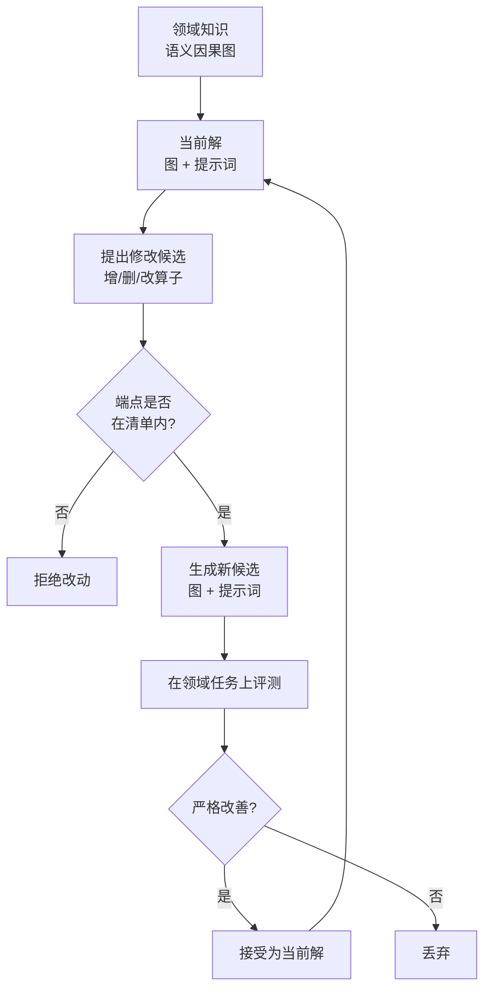

# How to Auto-optimize Prompts for Domain Tasks? Adaptive Prompting and Reasoning through Evolutionary Domain Knowledge Adaptation

## 基本信息

| 项目 | 内容 |
|------|------|
| **链接** | https://arxiv.org/abs/2510.21148 |
| **发布时间** | 2025-10-24 |
| **一句话总结** | 领域知识表示为语义因果图（节点加自然语言边），修改算子限定为受约束的增删改，知识与提示词共同进化：消融显示共同优化显著优于只优化提示词 |

---

## 置信度评估

| 信号 | 评估 |
|------|------|
| 发表场所 | arXiv 预印本（2025-10） |
| 引用/影响 | 中（较新） |
| 代码可用 | 需核实 |
| 来源机构 | 高校研究团队 |
| **综合置信度** | **🟡 中高** |
| 需谨慎点 | 接受策略只维护单一当前解、严格改善才接受，与本项目的多轮迭代需求不完全匹配 |

## 它解决了什么问题

领域任务的提示词优化遇到一个具体困难：**领域知识怎么表达，才能被自动优化**。

把领域知识写成一段说明文字，模型改起来没有结构约束，改动容易失控。把领域知识写成规则列表，又丢掉了规则之间的关系。

EGO-Prompt 的答案是：把领域知识表示为**语义因果图**。节点是概念，边是概念之间的关系，边用自然语言描述。这样知识有了结构，改动可以在结构上进行，同时保留关系的语义。

第二个问题是改动的合法性。如果修改算子无约束，模型可能产生出语法正确但语义荒谬的改动。EGO-Prompt 把算子限定为**增、删、改三类，且改动的端点必须来自指定的清单**。这样任何一次改动都可以被审查。

---

## 方法核心



### 知识的表示形态

- **节点**：领域概念
- **边**：概念之间的关系，用自然语言描述
- **约束**：修改的端点必须来自指定清单，防止模型引入不存在的概念

这种表示的优点是可定位。当任务失败时，可以沿着边追踪到具体的知识条目，而不是面对一整段文字无从下手。

### 修改算子

| 算子 | 作用 | 约束 |
|---|---|---|
| 增加 | 补充缺失的知识条目或关系 | 端点在清单内 |
| 删除 | 移除错误或冗余的条目 | 端点在清单内 |
| 修改 | 修正已有条目的描述 | 端点在清单内 |

约束的意义在于可审查性。每一次改动都是显式的、小粒度的，可以被独立检查。

### 知识与提示词的联合优化

EGO-Prompt 的关键设计是**同时优化图和提示词**。理由是两者互相依赖：知识结构变了，提示词里引用知识的方式也要变；提示词的推理路径变了，可能需要补充新的知识条目。

消融支持这一点：

| 优化对象 | 领域任务 F1 |
|---|---|
| 只优化提示词 | 0.246 |
| 图与提示词共同优化 | 0.333 |

---

## 实验结果

- 图与提示词共同优化显著优于只优化提示词（F1 从 0.246 提升到 0.333）
- 受约束的修改算子使改动可以审查，避免了无约束文本修改的失控
- 领域知识图在优化过程中逐步细化，积累了任务特定的知识

---

## 局限与注意

- **只维护单一当前解**，严格改善才接受新版本。短期表现下降但长期有价值的分支会被丢弃
- **没有归档与多父代选择**，与 DGM / GEPA 相比缺少版本留存机制，容易锁死在局部最优
- **接受策略过于严格**，连续多次修改都无法改善时需额外机制打破停滞
- **评测依赖领域任务成功率**，任务样本不足时改善判断不可靠

---

## 对本项目的启发 ⭐

本项目已经有一套知识文档的结构约定。`src/application/services/KnowledgeWritingGuide.ts` 定义了 `KNOWLEDGE_WRITING_GUIDE`：

- `principles` 要求正文至少四个二级标题，必须有 `## 验证` 章节并给出可复现命令、测试路径或证据链接
- `avoid` 列出要规避的填充连接词与宣传词
- `FORMULAIC_PHRASES` 用正则表检测文风问题（综上所述、总而言之、值得注意的是等）

`src/domain/knowledge/KnowledgeDocument.ts` 定义了文档的数据结构：

```
KnowledgeDocument { body; title; description; keywords }
```

并有确定性序列化 `renderKnowledgeDocument`，校验失败时抛出 `KNOWLEDGE_DESCRIPTION_INVALID` 或 `KNOWLEDGE_MODEL_FRONTMATTER_DENIED`。

`src/domain/knowledge/MarkdownDiff.ts` 对正文做结构化行差异，给出段落与范围校验信息。

**问题是：结构约定存在，但知识本身没有可定位的中间表示。** `body` 是一整段 Markdown 字符串，`MarkdownDiff` 只能给出段落级差异。当 `Evaluation.md` 要求 ReviewAgent 分析「知识卡片的修订位置」时，定位精度受限于段落。

### 解决哪个环节的什么问题

**环节：`doc_gen` 阶段的修订输入，以及 `review` 阶段的修订位置定位。**

具体问题有两个。

第一，DocGen 收到 corrections 后，需要把 `knowledgePath` 映射到正文的具体位置。当前 `knowledgePath` 是路径字符串，落到正文时最细只能到段落。

第二，多轮修订时，同一段落可能被反复修改，缺少「这个段落说明了什么关系」的结构信息，导致后续轮次改一处坏一处。

### 具体怎么落地

**① 在 `body` 之上增加一层可定位的关系表示**

不需要改变 Markdown 作为最终产物。可以在 `KnowledgeDocument` 之外增加一层内部表示：把正文里的关键陈述抽取为「概念节点加关系边」，每个关系边保留回指正文段落的引用。

这样 `Correction.knowledgePath` 可以指向一个具体的关系边，而不只是段落路径。`MarkdownDiff` 的段落差异可以映射到这层关系表示上，回答「哪个知识关系发生了变化」。

**② 修改算子受 `KNOWLEDGE_WRITING_GUIDE` 约束**

EGO-Prompt 的增删改三算子加端点清单，可以直接映射到本项目的现有约定：

| EGO-Prompt 概念 | 本项目对应 |
|---|---|
| 节点（领域概念） | 正文中出现的接口名、命令、配置项、失败现象 |
| 关系边 | 概念之间的因果或依赖陈述 |
| 端点清单 | `KNOWLEDGE_WRITING_GUIDE.principles` 要求的具体接口、命令、数值、来源 |
| 增算子 | 补充缺失的边界条件或失败现象说明 |
| 删算子 | 移除无来源支撑的陈述与宣传词 |
| 改算子 | 修正描述与事实不符的部分 |

这样修改算子的合法性检查是程序化的，不依赖模型自觉。

**③ 用 `KnowledgeReadabilityAssessment` 作为「结构完整性」信号**

`KnowledgeWritingGuide.ts` 已有 `KnowledgeReadabilityAssessment`，包含 `score`、`formulaicPhraseCount`、`oversizedParagraph`。这些可以扩展为结构信号的来源。

举例：如果某轮修订后 `formulaicPhraseCount` 上升，说明模型引入了填充连接词，属于文风退化；如果 `oversizedParagraph` 上升，说明段落结构被破坏。这些都是可程序化检测的退化信号，可用于触发回退或拒绝。

**④ 知识与「提示词」的联合优化对本项目的含义**

本项目的「提示词」对应 DocGen 与 CodeAgent 的材料组织方式（`ProjectWorkflowStages` 加载的历史知识、纠正意见、质量反馈和可信工件）。

EGO-Prompt 的结论提示：如果只改知识文档，不改材料组织方式，效果会受限。具体表现是知识文档里新增的边界条件可能没有被 CodeAgent 的输入组织方式覆盖到。这一点需要在材料装配逻辑里同步调整。

### 提供了什么思路

**① 「可定位」比「结构完整」更重要**

EGO-Prompt 的图结构不是为了好看，是为了让失败能追溯到具体知识条目。本项目 `Evaluation.md` 要求 ReviewAgent 输出「卡片及段落位置」，这个精度可以借助关系表示提升。

**② 修改必须可审查**

受约束的修改算子让每次改动都是显式、小粒度、可独立检查的。这对应本项目的 `MarkdownDiff` 与 `Correction.evidenceRefs`：每次修订都应该有对应的证据引用与差异记录。

**③ 严格改善策略需要配合停滞处理**

EGO-Prompt 严格改善才接受，本项目 `Evaluation.md` 也提到「停滞转 LOW_CONFIDENCE」是目标要求。两者都指向同一个问题：连续多轮无法改善时怎么办。EGO-Prompt 没有给出答案，本项目的 `LOW_CONFIDENCE` 状态正是这个问题的答案。

### 需要注意的

- **图结构有维护成本**。端点清单需要人工维护或由 DocGen 自动维护，清单质量直接决定算子约束的效果
- **不要改变 Markdown 作为最终产物**。本项目的知识文档是给工程师读的，YAML 头加正文的形态不能变。关系表示应该是内部中间层，不暴露给最终用户
- **`renderKnowledgeDocument` 的校验边界要保留**。`KNOWLEDGE_MODEL_FRONTMATTER_DENIED` 阻止模型插入自己的 YAML 头，这个约束引入结构表示后仍然要保留
- **单一谱系的停滞风险**。如果沿用严格改善策略，必须配合 `LOW_CONFIDENCE` 与回退机制（见 DGM 与 GEPA 两篇）
- **F1 数据来自论文特定任务**。0.246 到 0.333 的提升幅度不能直接外推到本项目场景

---

## 关联

- **对应环节**：`doc_gen` 阶段的修订输入组织；`review` 阶段的修订位置定位；`candidate_knowledge` 的质量判断
- **对应缺口**：`ReviewAgent.md` 的「真实模型对文档问题的定位、因果分析和历史总结质量尚未验收」
- **相关论文**：GEPA（2507.19457）：候选保留策略，补 EGO-Prompt 单谱系的不足
- **相关论文**：DGM（2505.22954）：归档与父代选择，补 EGO-Prompt 缺失的版本留存
- **相关论文**：AutoRefine（2601.22758）：把轨迹编译为类型化产物，另一条知识组织路线
- **本项目代码**：`src/application/services/KnowledgeWritingGuide.ts`（写作指南与文风检测）、`src/domain/knowledge/KnowledgeDocument.ts`（文档结构与校验）、`src/domain/knowledge/MarkdownDiff.ts`（结构化行差异）、`src/domain/Domain.ts`（KnowledgeVersion 状态机）
