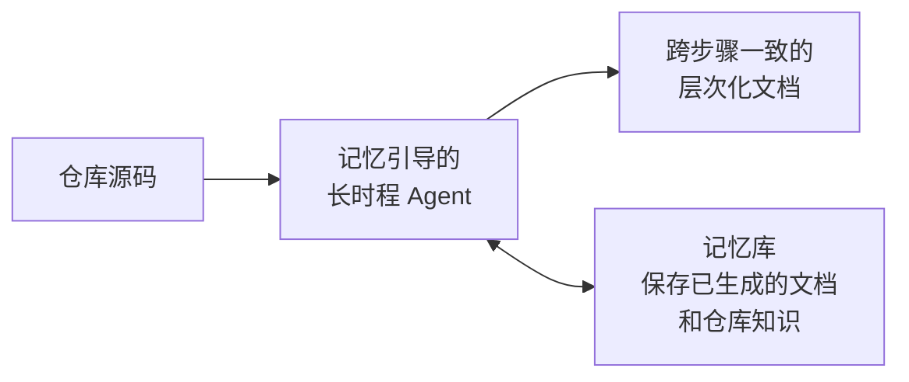

# Remember Your Trace: Memory-Guided Long-Horizon Agentic Framework for Consistent and Hierarchical Repository-Level Code Documentation

## 基本信息

| 项目 | 内容 |
|------|------|
| **链接** | https://arxiv.org/abs/2605.14563 |
| **作者** | Suyoung Bae, Jaehoon Lee, Changkyu Choi, YunSeok Choi, Jee-Hyong Lee |
| **发布时间** | 2026-05-14 |
| **一句话总结** | 把仓库级文档生成当作"长时程 agent 任务"，用记忆机制引导 agent 跨步骤保持一致，产出层次化文档 |

---

## 置信度评估

| 信号 | 评估 |
|------|------|
| 发表场所 | arXiv 预印本（2026） |
| 引用/影响 | 低（新发布） |
| 代码可用 | 待确认 |
| 来源机构 | 学术机构 |
| **综合置信度** | **🟡 中** |
| 需谨慎点 | 记忆一致性思路合理，效果需自行验证 |

## 它解决了什么问题

仓库级文档生成有一个被忽略的痛点：**一致性**。现有方法把每个组件独立处理，各自检索、各自生成，结果就是：

- 不同组件文档之间互相矛盾（比如 A 文档说用 X 接口，B 文档说用 Y）
- 重复检索浪费大量上下文
- 缺少跨文件的全局视角，文档粒度不统一

论文把问题重新定义为：**长时程 agentic 任务**——需要跨很多文档步骤积累和整合仓库级知识，而不是每步独立。

---

## 方法核心

核心是给 agent 加一个**记忆库（memory bank）**：

- agent 每生成一份文档，把关键信息（组件职责、接口约定、依赖关系）写进记忆
- 生成后续文档时，先查记忆，保证新文档和已生成的文档保持一致
- 记忆里还保存"这个仓库的约定"（命名风格、模式），让所有文档语气统一

层次化体现在：先底层（函数/类），再聚合到上层（文件/模块），每层生成时参考下层记忆。

---

## 实验结果

- 在仓库级文档生成任务上评测一致性和质量
- 记忆引导相比独立处理，文档间矛盾显著减少
- 层次化生成让上层文档（文件/模块级）更准确

（具体指标见论文原文，Evaluation 章节）

---

## 局限与注意

- 记忆库本身是文本，长流程中可能有记忆漂移或遗忘
- 长时程任务的 token 成本较高
- 记忆内容的质量直接影响后续生成

---

## 对我们项目的启发 ⭐

### 可以直接借鉴的

**① 记忆库保持跨文档一致性**：我们的知识库是海量的（上亿行代码对应的知识），如果不做一致性控制，知识之间会互相矛盾——Agent 基于矛盾的知识生成的代码必然错。它的记忆机制可以变成我们知识生成 Skill 的"已生成知识索引"，每份新知识先对照已有知识。

**② "长时程任务"视角**：把仓库级知识生成当成一个需要积累的长任务，而不是逐文件独立处理。这个视角对超大仓库尤其重要——一次性处理不了，必须分步走且保持步间一致。

**③ 层次化生成顺序**：先细节后概览，和 RepoRepair 的分层文档（函数级 → 文件级）互相印证。

### 需要改造的

**① 文本记忆 → 结构化知识库**：论文用 LLM 文本记忆，我们直接用 Markdown 知识文档 + frontmatter（OKF 思路）做记忆，天然结构化、可检索、可版本控制。

**② 单向一致性 → 反馈闭环**：它只保证"生成的文档之间一致"，不保证"文档和代码一致"。我们的飞轮用"生成代码 vs 源码对比"来验证文档和代码的一致性，比它更进一步。

### 需要注意的

- 一致性是知识库的隐性需求，容易在单篇评测里漏掉。我们的门禁评测单份知识时，也要抽查跨知识的矛盾（比如两份知识对同一 API 的说法是否冲突）。

---

## 关联

- **对应飞轮环节**：第一步（知识生成）+ 知识库组织
- **相关论文**：RepoAgent（2402.16667）——拓扑序保证依赖一致性；本论文补上"全局一致性"
- **相关论文**：On the Fragility of Self-Improving Agents（2608.18066）——记忆型自改进的脆弱性警告
