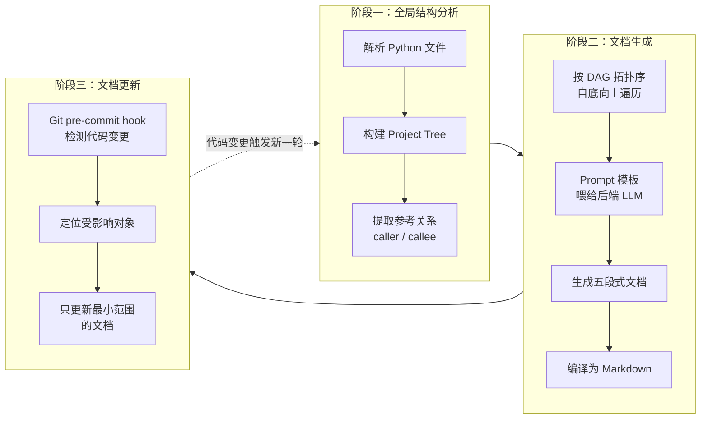
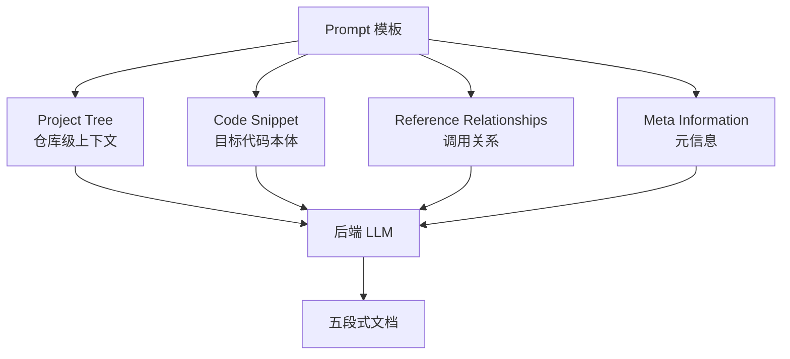
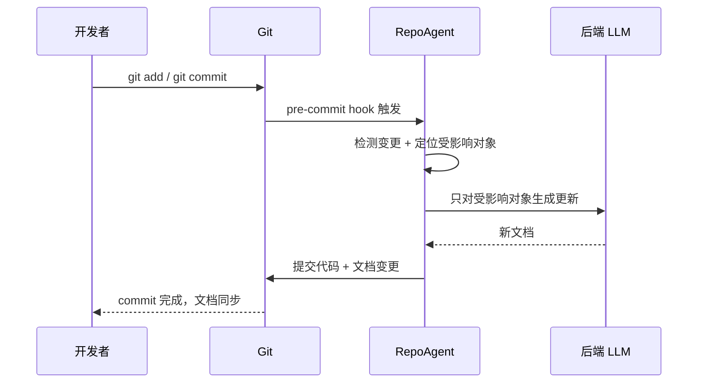

# RepoAgent: An LLM-Powered Open-Source Framework for Repository-level Code Documentation Generation

## 基本信息

| 项目 | 内容 |
|------|------|
| **链接** | https://arxiv.org/abs/2402.16667 |
| **代码** | https://github.com/OpenBMB/RepoAgent |
| **作者** | Qinyu Luo, Yining Ye, Shihao Liang, Zhong Zhang, Yujia Qin, Yaxi Lu, Yesai Wu, Xin Cong, Yankai Lin, Yingli Zhang, Xiaoyin Che, Zhiyuan Liu, Maosong Sun（清华 + 智谱） |
| **发布时间** | 2024-02-26（EMNLP 2024 Demo） |
| **一句话总结** | 第一个用 LLM 主动为整个仓库生成并持续维护代码文档的开源框架 |

---

## 置信度评估

| 信号 | 评估 |
|------|------|
| 发表场所 | EMNLP 2024 Demo（会议接收） |
| 引用/影响 | 高（大量引用） |
| 代码可用 | 有（github.com/OpenBMB/RepoAgent） |
| 来源机构 | 清华/智谱 |
| **综合置信度** | **✅ 高** |
| 需谨慎点 | 开源可用，可直接跑通验证 |

## 它解决了什么问题

论文开头给了一组数字：**开发者大约 58% 的时间花在程序理解上**，高质量文档能显著压缩这部分时间。但维护文档同样烧时间、烧钱、烧人力，很多项目根本没有资源去维护，文档就这样慢慢烂掉。

早期自动文档生成方法（代码摘要）有三个硬伤：

1. **摘要质量差**：只给一句话级别的概述，没有实际指导价值
2. **上下文缺失**：只看单个函数/文件，看不到它在整个仓库里被谁调用、依赖谁，写出来的东西经常和真实用法脱节
3. **无法持续**：代码变了文档不跟着变，很快又过期

RepoAgent 想解决的就是这三件事：文档要够细、要有仓库级上下文、要能跟着代码自动更新。

---

## 方法核心：三大阶段

RepoAgent 整体分三个阶段：全局结构分析 → 文档生成 → 文档更新。

### 阶段一：全局结构分析

这一步的目标是让 LLM 拥有"仓库视角"，而不是"文件视角"。两个核心产物：

**Project Tree（项目树）**：一种数据结构，保存仓库里所有代码对象（模块/类/函数）及其语义层级关系。生成文档时整棵树作为上下文喂给 LLM，让它知道"我写的这个东西在整个仓库里处于什么位置"。

**Reference Relationships（参考关系）**：代码对象之间的调用关系（谁调用了目标函数、目标函数调用了谁）。这有两个作用：

- 作为全局上下文，帮 LLM 推断代码对象的功能语义
- 对目标函数的引用本身就是天然的 **in-context learning 示例**——LLM 看到"别人怎么用这个函数"，就能更准确地写出"这个函数是干什么的"

> 这里用到了 Jedi 工具做引用识别，也是后面局限性的来源（只支持 Python）。

### 阶段二：文档生成

**五段式文档结构**，比普通代码摘要细得多：

| 段落 | 内容 |
|------|------|
| **Functionality** | 用一句清晰简洁的话说清对象功能 |
| **Parameters** | 列举所有参数及含义 |
| **Code Description** | 代码实现细节描述 |
| **Notes** | 使用注意事项、约束 |
| **Examples** | 使用示例（有返回值才生成，动态决定） |

生成时喂给 LLM 的 Prompt 模板包含四类信息：

**生成顺序**：按代码依赖的 DAG 做**拓扑排序，自底向上**生成。保证每个节点的子节点、以及它引用的对象，文档都先生成好。后生成的文档可以引用已生成的，保持前后一致。

**模型自适应**：不同模型上下文长度不同。用短上下文模型（gpt-3.5-turbo、LLaMA 系列）时，如果 prompt 太长，会自动切换到长上下文模型（gpt-3.5-16k、gpt-4-32k）。

### 阶段三：文档更新

这是 RepoAgent 最特别的地方——文档采用**持续维护**方式，而非一次性生成。

通过 Git pre-commit hook 和代码变更联动：

- 代码有改动时，hook 触发 RepoAgent
- 利用低耦合原则：局部代码改动一般不影响其他代码，**不需要重新生成整个仓库的文档**
- 只更新受影响对象的文档，触发条件有三：
  1. 对象源码被修改
  2. 对象的 referrer 不再引用它（被删了引用）
  3. 对象获得了新引用

更新完成后，hook 把代码和文档一起提交，保证**代码和文档始终同步**。

---

## 实验结果

### 人工评估（盲选偏好测试）

在 Transformers 和 LlamaIndex 两个仓库随机采样 150 份文档（100 个类 + 50 个函数），3 名人工评估者盲选"人写的还是 RepoAgent 写的更好"：

- **RepoAgent 胜出率 70%（Transformers）**
- **RepoAgent 胜出率 91%（LlamaIndex）**

文档质量被认为和人类写的相当，甚至更受偏好。

### 定量分析（三项）

| 维度 | 测什么 | 结果 |
|------|--------|------|
| **Reference Recall** | LLM 对全局调用关系的感知能力 | 机器学习方法完全识别不了引用关系；Single-object 方法只能部分识别 callee；Long Context 方法识别不全且随上下文增长召回率下降 |
| **Format Alignment** | 是否严格遵循五段式格式 | GPT 系列和 Llama-2-70b 表现很好 |
| **Parameter Identification** | 参数识别准确率（用 accuracy 而非 recall，因为模型可能幻觉出不存在的参数） | GPT 系列显著优于 LLaMA 系列 |

### 实验设置

- 9 个 Python 仓库，规模从不到 1000 行到超过 10000 行
- 案例研究用 ChatDev 仓库 + gpt-4-0125
- 环境：Python 3.11.4 / CUDA 11.7 / 8×A100 40GB

---

## 局限与注意

论文自己在 Conclusion 里列了几条，对我们很重要：

1. **只支持 Python**：依赖 Jedi 做引用识别，其他语言用不了（多语言是它的未来工作）
2. **依赖后端模型质量**：效果上限由 LLM 决定，开源模型的稳定性还没验证
3. **仍需要人工审查**：技术细节、项目特有约定、领域术语可能需要人工介入
4. **评测难**：论文承认"难以建立统一的量化评测方法"，文档质量评估本身是个开放问题，且学术界缺少"优秀人类文档"基准数据集
5. **幻觉风险**：模型可能生成有偏差或不准确的内容
6. **隐私**：用远程 API 会把代码数据送给外部服务——这条对我们反而是优势，我们用本地部署的 GLM 5.1，天然规避

---

## 对我们项目的启发 ⭐

RepoAgent 是飞轮**第一步（Skill 基于源码生成知识）**最直接的参考实现。可以抄的东西：

### 可以直接借鉴的

**① 依赖拓扑序生成**：按 DAG 自底向上、先生成依赖对象再生成被依赖对象，保证文档间引用一致。我们的知识生成也必须按依赖顺序来，否则知识之间互相矛盾。

**② 五段式结构化输出**：Functionality / Parameters / Code Description / Notes / Examples——这和我们"解释型知识文档"的定位高度重合（代码示例 + 解释 + 适用场景）。可以把它扩展成我们自己的知识模板：加上"为什么这样写""解决什么问题""实现思路"段落。

**③ 全局上下文注入**：Project Tree + 引用关系一起喂给 LLM。我们处理上亿行代码时，上下文注入策略直接决定知识质量——这个思路（仓库视图 + 引用视图）比单纯把大段代码塞进 prompt 可靠。

**④ 增量更新机制**：只更新受影响对象，不整体重生成。我们飞轮每次反馈迭代也只应该更新"差异涉及的那份知识"，而不是全量重新生成——否则反馈循环的成本不可接受。

### 需要改造的

**① Python-only → 多语言**：Jedi 只支持 Python。我们的代码库规模巨大且大概率多语言，需要换用语言无关的引用识别方案（tree-sitter 之类），或者按语言分策略。

**② 单向生成 → 飞轮闭环**：RepoAgent 是"源码 → 文档"单向流水线，没有验证环节。我们要在它后面接上"Agent 基于文档生成代码 → 与源码对比 → 反馈优化文档"，把单向流水线变成闭环。这正是 RepoAgent 没做、而我们项目核心要做的事。

**③ 人工审查 → 门禁自动判定**：RepoAgent 靠人工审查兜底，我们用"生成代码相似度 ≥ 80%"的门禁来自动判定知识合格与否。

### 需要注意的

- 论文的"人类偏好 70%/91%"是主观评估，不代表文档客观上正确——我们的门禁用客观指标，比它严格
- 它评测了"模型感知引用关系的能力"，说明**上下文组织是生成质量的关键变量**，这个结论值得我们在知识生成 Skill 设计时重点验证

---

## 关联

- **对应飞轮环节**：第一步（知识生成）
- **相关论文**：RepoSummary（2510.11039）——同样做仓库级文档，但用"特性视角"而非"目录视角"
- **参考实现**：github.com/OpenBMB/RepoAgent（开源，可以直接跑起来看效果）
