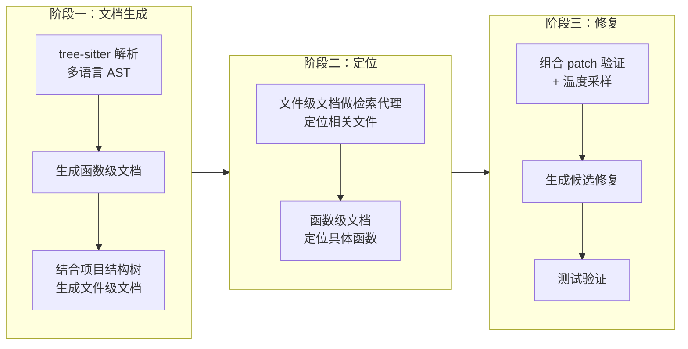

# RepoRepair: Leveraging Code Documentation for Repository-Level Automated Program Repair

## 基本信息

| 项目 | 内容 |
|------|------|
| **链接** | https://arxiv.org/abs/2603.01048 |
| **代码** | https://github.com/ZhongQiangDev/RepoRepair（论文附属参考实现，随论文收录） |
| **作者** | Zhongqiang Pan, Chuanyi Li, Wenkang Zhong, Yi Feng, Bin Luo, Vincent Ng |
| **发布时间** | 2026-03-01 |
| **一句话总结** | 用 LLM 生成的分层代码文档（函数级 + 文件级）作为仓库的语义抽象，大幅提升仓库级程序修复的定位准确率和修复成功率 |

---

## 置信度评估

| 信号 | 评估 |
|------|------|
| 发表场所 | arXiv 预印本（2026-03） |
| 引用/影响 | 低-中（新发布） |
| 代码可用 | 有（论文附属参考实现） |
| 来源机构 | 学术机构 |
| **综合置信度** | **🟡 中** |
| 需谨慎点 | 文档间接验证思路与飞轮高度相关，建议重点验证 |

## 它解决了什么问题

仓库级自动程序修复（APR）要从 issue 描述定位到需要改的代码，再修好它。难点在于：仓库有几百上千个文件，每个文件几千行，LLM 需要"全局、任务感知的理解"才能定位到正确位置。现有方法要么上下文受限，要么靠浅层检索，要么靠昂贵的 agent 迭代，在复杂跨文件 bug 上效果差。

RepoRepair 的核心洞察：**代码文档系统性地抽象了实现细节**。人工写的高质量文档能帮开发者理解代码，那 LLM 生成的文档能不能同样帮 LLM 理解仓库？

---

## 方法核心

RepoRepair 是 agent-free 框架，三个阶段：文档生成 → 定位 → 修复。

### 阶段一：分层文档生成

- **函数级文档**：用 tree-sitter（多语言）把源码解析成 AST，提取函数、类、导入、调用等结构。prompt 里放**完整源码**（不是摘要），保证 LLM 看到所有实现细节。产出：函数/类的实现逻辑说明。
- **文件级文档**：输入 = 该文件所有函数级文档 + 项目结构树。产出：文件的整体目的和架构角色，从实现细节抽象到仓库层面。

两层文档合起来 = 仓库的**分层语义抽象**：底层是具体实现逻辑，顶层是模块职责。

### 阶段二：基于文档的定位

仓库文件太多，不能把所有源码塞进上下文。**用文件级文档做检索代理**（retrieval proxy）——先检索文档而不是源码，定位相关文件；再用函数级文档定位具体函数。文档比源码短得多，检索更高效，且语义信息密度更高。

### 阶段三：修复

定位到目标后，用 LLM 生成修复 patch，配合**组合验证**（combinatorial patch validation）和温度采样，生成多个候选，用测试验证哪个真正修好。

---

## 实验结果

- 在 **SWE-bench Lite** 和更难的 **SWE-bench Multimodal** 两个基准上全面评测
- 不仅看最终修复率，还量化了**文件检索准确率和文件定位准确率**（定位阶段单独评估）
- 结论：分层代码文档显著提升 fault localization 效果，agent-free 方法在性能上可比肩甚至超越很多 agent-based 工具，同时大幅降低成本

（论文在 GitHub 上开源了全部实验产物：生成的文档、源码、结果）

---

## 局限与注意

- 文档生成是整个仓库先跑一遍，计算量大（论文自己承认"computationally intensive"）
- 依赖 tree-sitter 的解析质量，冷门语言支持有限
- 修复能力上限受后端 LLM 制约

---

## 对我们项目的启发 ⭐

这篇对我们特别重要，因为它证明了**"文档 → 下游任务"的价值闭环**，和我们的飞轮是同构的。

### 可以直接借鉴的

**① 文档作为检索代理**：几百上千个文件时，先检索文档而不是源码。我们的知识飞轮消费端（Agent 基于知识写代码）同样面临"知识太多、上下文有限"的问题，用知识文档做检索入口是正确姿势。

**② 分层文档结构（函数级 + 文件级）**：底层实现逻辑 + 顶层架构职责。这正是我们"解释型知识文档"可以采用的粒度结构——先按函数/模块生成细节知识，再聚合出文件/模块级概览知识。

**③ 文档质量的可量化验证**：RepoRepair 用"定位准确率 + 修复成功率"间接量化了文档质量——文档越好，下游任务越成功。这给了我们一个思路：**知识质量可以用下游任务的客观指标来测**，和我们的门禁哲学一致。

### 需要改造的

**① 定位任务 → 生成任务**：RepoRepair 的文档是给"修复"用的，我们的文档是给"重新生成代码"用的。但底层逻辑一样：文档要包含足够的语义信息，让下游 LLM 能还原代码行为。可以把它的"文档 → 定位"评测改造成"文档 → 生成代码 → 对比源码"的评测。

**② 一次性生成 → 反馈迭代**：RepoRepair 文档生成是一次性的，没有根据下游任务失败来更新文档。我们的飞轮恰恰要做这件事：下游生成代码失败 → 差异反馈 → 更新文档。

### 需要注意的

- 它的成功依赖"文档保留了足够实现细节"——函数级文档用完整源码生成。我们生成知识时也要保证关键实现细节不丢失，这正是"解释型知识"和"泛泛摘要"的区别。

---

## 关联

- **对应飞轮环节**：第一步（知识生成）+ 门禁设计（文档质量的间接验证）
- **相关论文**：RepoAgent（2402.16667）、DocAgent（2504.08725）——文档生成框架
- **相关论文**：Requirements are All You Need（2406.10101）——文档质量决定下游代码质量
