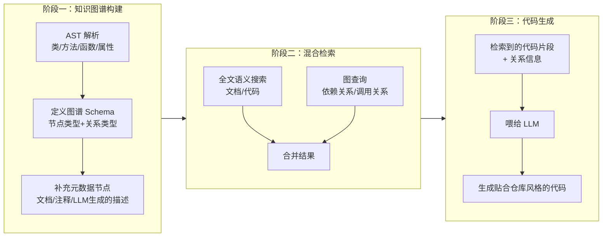

# Knowledge Graph Based Repository-Level Code Generation

## 基本信息

| 项目 | 内容 |
|------|------|
| **链接** | https://arxiv.org/abs/2505.14394 |
| **作者** | Mihir Athale, Vishal Vaddina |
| **发布时间** | 2025-05-20 |
| **一句话总结** | 把代码仓库建成知识图谱（代码元素 + 关系 + 文档/注释节点），用混合检索（全文语义 + 图查询）增强 LLM 的仓库级代码生成 |

---

## 置信度评估

| 信号 | 评估 |
|------|------|
| 发表场所 | arXiv 预印本（2025） |
| 引用/影响 | 低 |
| 代码可用 | 待确认 |
| 来源机构 | 个人/小团队 |
| **综合置信度** | **⚠️ 谨慎** |
| 需谨慎点 | 思路有价值，但实验规模小，多语言支持有限 |

## 它解决了什么问题

LLM 生成代码时是"孤立生成"的——不理解项目特定的架构模式和内部依赖，生成的代码和现有代码库风格不一致、接不上。传统 RAG 靠 web 搜索和文档分析做检索，但在涉及多个交互组件的复杂场景下表现不佳。

关键观察：代码组件（函数、类）的**使用方式**隐含着仓库的编码风格。如果把"谁用了谁、怎么用的"这个关系信息喂给 LLM，生成的代码就能贴合仓库风格。

---

## 方法核心

三阶段：知识图谱构建 → 混合检索 → LLM 代码生成。

### 阶段一：知识图谱构建

- **解析**：用 AST 解析每个代码文件，提取类、方法、函数、属性等核心元素
- **Schema**：定义节点类型（类/方法/函数/属性/文档等）和关系类型（调用、继承、引用、包含等）
- **元数据节点**：把代码文档和注释也存成图谱节点；另外用 LLM 为代码片段生成功能描述，捕获函数语义

关键点：**文档/注释被当作图谱里的一等公民节点**，与代码节点平级。

### 阶段二：混合检索

- **全文语义搜索**：对文档和代码做语义搜索
- **图查询**：基于依赖和调用关系查询

两者合并，既抓到语义相关，又抓到结构相关。

### 阶段三：代码生成

把检索到的代码片段 + 关系信息一起喂给 LLM。关系信息隐式传递了仓库的编码风格，生成的代码与项目结构和需求保持一致。

---

## 实验结果

- 在 **EvoCodeBench**（仓库级代码生成基准）上评测
- 对比传统 RAG 检索方法，知识图谱 + 混合检索在仓库级上下文检索上效果更好
- 生成的代码与仓库结构、依赖、编码规范一致性更高

---

## 局限与注意

- 图谱构建（解析 + LLM 生成描述）有一次性成本
- 图谱 Schema 需要针对仓库设计，关系类型定义影响检索质量
- 论文实现聚焦 Python（AST 解析），多语言需要适配

---

## 对我们项目的启发 ⭐

### 可以直接借鉴的

**① 文档作为图谱一等公民**：文档/注释节点和代码节点平级，检索时能同时命中。我们的知识文档天然就是这个角色——知识图谱里知识文档节点 + 它对应的代码节点 + 关系，检索知识时直接沿关系拿到代码，检索代码时也能沿关系拿到知识。

**② 混合检索（语义 + 图）**：我们门禁和飞轮里"基于知识生成代码"环节，需要从知识库捞相关上下文。语义搜索 + 关系查询组合，比单一检索可靠。

**③ LLM 生成代码片段描述**：用 LLM 给代码片段写功能描述，增强检索。这其实就是"知识生成"的轻量版——从源码提取语义描述，可以看作我们飞轮第一步的简化原型。

### 需要改造的

**① 单向检索增强 → 双向飞轮**：论文用图谱增强生成，但图谱是静态的。我们的飞轮里，知识随反馈演化，图谱也应该随之更新——检索 → 生成 → 反馈 → 更新图谱/知识。

**② 图 Schema 与知识粒度对齐**：论文的图是代码元素粒度。我们要加一层"知识文档节点"，把知识文档和代码元素的关系（文档覆盖哪些代码）也建模进去，让门禁评测时能快速定位"哪份知识管哪段代码"。

### 需要注意的

- 检索质量依赖图谱 Schema 设计，前期投入不小，但对超大仓库（上亿行）来说，图谱可能是唯一可行的知识组织方式——线性扫描不现实，图结构才能支撑"按需取上下文"。

---

## 关联

- **对应飞轮环节**：知识组织 / 检索基础设施（支撑第一步和第二步）
- **相关论文**：GraphCoder（论文中引用，用 Code Context Graphs 做代码补全）
- **相关仓库**：cannbot-knowledge 的 `graph/` 目录（判定缓存/图谱）——同一思路的工程实现
