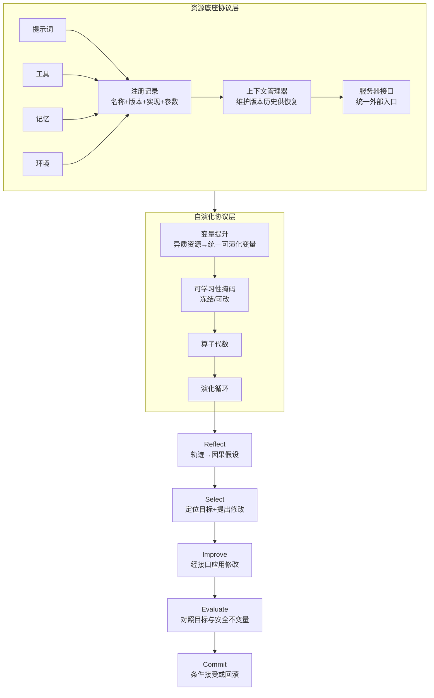

# Autogenesis：把版本管理提升为协议层

## 基本信息

| 项目 | 内容 |
|---|---|
| **论文标题** | Autogenesis: A Self-Evolving Agent Protocol |
| **arXiv** | [2604.15034](https://arxiv.org/abs/2604.15034) |
| **发表时间** | 2026-04（v5 修订 2026-06） |
| **一句话总结** | 把提示词、工具、记忆、环境都建模为带显式状态、生命周期和版本化接口的协议资源：所有状态变更都必须经过接口，因而天然版本化、可审计、可回滚 |

---

## 置信度评估

| 维度 | 评估 |
|---|---|
| **方法可信度** | 高。两层协议都有形式定义（资源实体、注册记录、可演化变量集、算子代数、演化循环），并给出与其他协议（A2A、MCP）的系统对比表 |
| **实验充分度** | 中高。三类基准（科学数理、通用 agent、自演化代码 agent），并与多个优化器内核对照 |
| **可复现性** | 高。代码公开，协议有完整伪代码 |
| **对本项目的适用性** | 中高。「所有变更必须走接口」这条原则与本项目「Domain 不直接操作 CAS、发布」的设计高度一致 |

---

## 它解决了什么问题

现有的 agent 协议（如 A2A、MCP）对**跨实体生命周期、上下文管理、版本追踪和安全更新接口**的定义不充分。后果是系统倾向于变成单体组合和脆弱的粘合代码。

更具体地说，很多 agent 系统把提示词、工具和记忆打包成 agent 的内部组件，这让 agent 逻辑与任务特定指令、能力包纠缠在一起，增加维护成本并限制迁移能力。

论文的观察是：**演化要真正安全可控，就不能靠每个优化器自己保证，而要有协议层的强制约束**。关键机制是让所有状态变更都经过统一的资源接口，这样每一次迁移都自动获得版本、血缘和回滚能力。

---

## 方法核心

### 第一层：资源底座协议层

把 agent 用到的资源建模为**资源实体**，五个核心类型是提示词、agent、工具、环境、记忆。每个资源实体包含唯一名称、简短描述、输入到输出映射、**可演化标记**和元数据字典。

每个资源实例存一条可序列化的**注册记录**，包含资源实体、**版本字符串**、实现描述符（导入路径、类定义或源码字符串）、实例化参数、以及供模型交互的导出表示。

关键机制是**上下文管理器**：每种资源类型由一个上下文管理器治理，作为管理层。它维护资源的注册表、**保留版本化历史以供恢复**，并支持通过生成统一的能力规格来产生契约。

这解决了论文指出的问题：资源被外部化为**一等公民的版本化资源**并带标准接口之后，同一个工具调用策略可以搭配不同的提示词和工具集，在不同任务和环境中原样部署。

### 第二层：自演化协议层

**变量提升**：把离散、异质的资源投影到统一的「可演化变量」表示上。这一步让所有演化算子面对同一套交互界面。

**可学习性掩码**：每个变量带一个二元可学习性约束，严格定义可训练的参量子空间。可演化标记让这一层能**选择性地操作**：冻结的组件（如固定的工具 API）被排除在可训练子空间之外，指定的可演化资源（如系统提示词、工具实现）才暴露给修改。

**算子代数**：演化算子是**带类型的可组合函数**，读入当前可演化状态与辅助信号，产出更新后的状态和向下游传递的信号。

把这个形式化的意义在于：**无论实例化哪种优化策略，每一次修改都是接口介导的、可审计的、可逆的**。

**演化循环**：给定初始可演化状态和空消息，循环的每次迭代按顺序组合应用算子序列，读当前状态与入站消息，产出更新状态与供下一个算子消费的消息，直到收敛或预算耗尽。

论文明确点出这带来的三条性质：

> 所有状态变更都通过资源接口路由，因此每一次迁移都被版本化且可逆，保证演化**有执行数据支撑、可通过版本化更新追溯、且构造上安全**。

反射优化器实例化这个循环时用五个算子：**Reflect**（轨迹与状态映射到因果失败假设）、**Select**（从状态与假设中定位目标可演化实体并生成具体修改提案）、**Improve**（通过接口应用提案产出候选状态）、**Evaluate**（对照目标与安全不变量给候选打分）、**Commit**（**条件性接受或回滚这次迁移**）。

论文强调其他优化器（TextGrad、GRPO、Reinforce++）复用同一套算子接口，只替换单个算子的内部逻辑。

---

## 实验结果

- 在多个需要长程规划与异构资源工具使用的挑战性基准上，相对强基线有一致的改进
- 三类实验覆盖科学数理基准、通用 agent 基准和自演化代码 agent 基准
- 论文报告了与 A2A、MCP 等协议在多维度的对比

---

## 局限与注意

- **协议层的抽象成本**。把一切资源化、版本化、接口化会带来实现复杂度，小系统可能得不偿失
- **论文未报告协议开销的量化数据**
- **五个实体类型被作者称为「最小但表达力足够的公约数」，非穷尽**
- **可学习性掩码需要人工定义**。哪些资源可演化、哪些冻结是设计决策，配错了会导致演化范围错误
- **协议不能保证演化的质量**，只能保证过程可审计、可逆。它约束的是形式，不是效果

---

## 对本项目的启发 ⭐

这篇的价值是**观念层面**的：它把版本管理从「一个功能」提升为「接口的强制属性」。

只要所有状态变更都必须经过统一接口，版本化、血缘与回滚就是**构造上自动获得**的，不依赖每个实现者自觉。这与本项目的一条既有设计原则非常接近。

### 解决哪个环节的什么问题

**环节：版本化与回滚如何从「需要实现的机制」变成「架构自带的性质」。**

本项目有一条已经做对的设计：`Knowledge.md` 记录「Application 层保存正文并将 pending 引用换成实际工件引用，**Domain 不直接操作 CAS、数据库或发布**」。

这条边界与 Autogenesis 的核心机制是同一个思路的局部应用：**变更必须经过指定层，下层不能绕开**。Autogenesis 把这条原则推广到了整个资源层。

### 具体怎么落地

**① 把「可演化标记」映射到角色读取权限**

Autogenesis 用可演化标记区分哪些资源可以改、哪些冻结。本项目 `Evaluation.md` 与角色定义里有对应的机制：所有角色的 `readablePaths` 为空，材料由框架校验后加载，材料槽位不能扩大权限。

这是**读取侧**的同类约束。Autogenesis 提示的是**写入侧**也需要同样的显式标记：哪些知识路径是 Agent 可以生成的，哪些是冻结的（如固定头文件、项目配置、验收答案）。

本项目已经有这方面的约束：`KF-SYS-045` 规定 CodeAgent 结合项目配置裁剪出的标准与依赖约束、以及**允许生成路径**，返回文件列表。这个「允许生成路径」就是写入侧的可演化标记。

**② 五个算子与本项目的阶段有明显对应**

| Autogenesis 算子 | 本项目对应 |
|---|---|
| Reflect（轨迹到因果假设） | `ReviewAgent` 输出 `Correction`（`criterion` 与 `evidenceRefs`） |
| Select（定位目标并提修改） | `Correction.knowledgePath` 定位到正文位置 |
| Improve（经接口应用） | `DocGen` 修订，且修订必须经过 `KnowledgeDocument` 校验 |
| Evaluate（对照目标与不变量） | `evaluation` 阶段的 `GateDecision` |
| **Commit（条件接受或回滚）** | `workflow_router` 的 PASS / ITERATE / ROLLING_BACK |

这个对应关系很有用，因为它说明**本项目的阶段划分是完整的**，缺的是 Commit 这一步里「回滚」分支的实现（`ROLLING_BACK` 状态已存在但选择逻辑未实现）。

**③ 「构造上安全」是本项目可以追求的验收标准**

论文用的词是「safe-by-construction」：安全不靠事后检查，靠所有路径都必须经过约束接口。

本项目可以照此设计版本管理的验收：**不存在一条能改变知识版本状态而不经过 Domain 校验的路径**。这类不变量比「回滚功能能正常工作」更根本，因为它保证了将来新增路径也不会绕过版本化。

**④ 版本化历史由上下文管理器统一维护**

Autogenesis 的每种资源类型有一个上下文管理器维护注册表与版本化历史。本项目对应的是 Application 层对 `KnowledgeVersion` 的管理。

差别在于 Autogenesis 把「维护版本历史供恢复」写成上下文管理器的**固有职责**，而不是可选功能。这个视角对本项目有意义：版本历史不是为回滚这个功能准备的，它是资源管理的必要组成。

### 提供了什么思路

**① 把「可逆」当作接口契约的一部分**

算子代数的定义要求所有变更必须路由过接口，这让「可逆」成为**接口契约的内含项**，不必再作为额外实现的功能。

**② 版本是资源的一等属性**

注册记录里版本字符串和实现描述符与资源名称并列，说明版本不是附属信息。本项目 `KnowledgeVersion` 保存版本身份、`moduleId`、父版本、正文引用、来源与状态，取向一致。

**③ 优化策略与演化机制解耦**

论文强调不同优化器（反射、TextGrad、GRPO）复用同一套算子接口，只换内部逻辑。这个解耦对本项目有直接价值：**「怎么产生修订意见」和「怎么管理版本」应该是两件独立的事**。

本项目当前 `ReviewAgent` 负责产生 `Correction`，`workflow_router` 负责推进状态。这两者已经是分离的，版本管理的引入不应该破坏这个分离。

**④ 预算耗尽作为统一的终止条件**

演化循环「重复直到收敛或预算耗尽」。本项目 `IterationBudget` 已有轮数预算，`Evaluation.md` 的 `IO-20` 规定「达到最大轮次仍未达标或预算耗尽时停止并转人工治理」。终止语义一致。

### 需要注意的

- **别过度抽象**。论文自己也说五个实体类型是「最小公约数」。本项目不需要把一切都资源化，重点是**版本化与可逆成为强制属性**这一条
- **协议不保证效果**。Autogenesis 明确说协议约束的是形式（可审计、可逆），不是演化质量。本项目不能因为有了版本管理就认为回滚决策是对的
- **可演化标记需要人工维护**，配错会导致演化范围错误或写入越权
- **抽象层会增加实现成本**，本项目的 `IterationBudget` 与成本预算仍是缺口，引入新抽象层时要评估开销
- **参照本文的算子划分时注意场景差异**。本文面向通用 agent 资源，本项目的演化对象是知识文档，Reflect 与 Select 的具体实现差异较大

---

## 关联

- **对应环节**：`ROLLING_BACK` 的 Commit 语义；写入侧的可演化标记（允许生成路径）；版本历史作为资源固有属性
- **对应缺口**：`Knowledge.md` 的「回滚状态仅为迁移兼容，当前不自动选择历史最优并回滚」
- **相关论文**：ChronoMem（2607.27773）：版本控制与回滚的具体实现
- **相关论文**：EvoGit（2506.02049）：版本关系的结构表达（偏序与前沿）
- **相关论文**：Governed Evolution of Agent Runtimes（2605.27328）：同一治理脉络
- **本项目代码**：`src/domain/Domain.ts`（状态机）、`Knowledge.md`（`KnowledgeVersion` 与 Application 边界）、`Requirements.md` 的 `KF-SYS-045`（允许生成路径）
