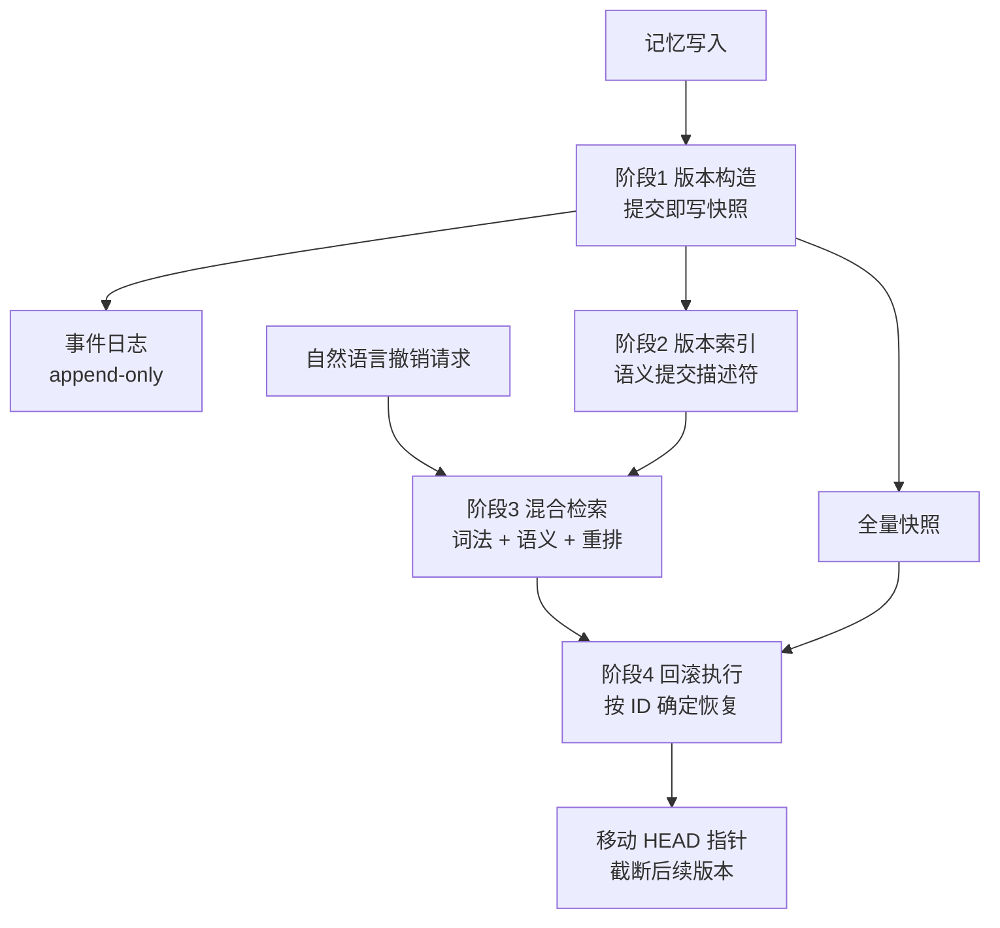

# ChronoMem：Agent 记忆的版本控制与语义回滚

## 基本信息

| 项目 | 内容 |
|---|---|
| **论文标题** | ChronoMem: Version Control and Semantic Rollback for Large Language Model Agent Memory |
| **arXiv** | [2607.27773](https://arxiv.org/abs/2607.27773) |
| **发表时间** | 2026-07（v2 修订于 2026-08） |
| **一句话总结** | 每次记忆写入都提交一份全量快照，用语义提交描述符建版本索引，把自然语言的撤销请求映射到具体历史版本：回滚变成一句话的事，且回滚后行为必须符合反事实要求 |

---

## 置信度评估

| 维度 | 评估 |
|---|---|
| **方法可信度** | 高。事件日志加快照的经典设计，四个阶段都有明确的算法描述，选择与恢复分离的设计让评测可解释 |
| **实验充分度** | 高。两个数据集（LoCoMo、MemoryAgentBench），三个研究问题（版本选择、回滚一致性问答、回滚一致性摘要），三个基线（仅提示词、全历史提示词、仅检索） |
| **可复现性** | 中高。集成在 Google ADK 上，论文标注为首个开源的系统与基准，但并发场景未评测 |
| **对本项目的适用性** | 高。「每次写入全量快照」与项目 `KnowledgeVersion` 按版本存整份正文的形态完全一致 |

---

## 它解决了什么问题

现有的 agent 记忆系统都是**只向前演化**的：不断累积、合并、覆盖知识，没有检查、版本化或还原之前状态的原则性机制。这让 agent 在遇到纠正、概念漂移或记忆损坏时非常脆弱，**尤其是在它已经吸收了后续信息之后**。

论文把这个问题形式化为「暴露后回滚」：agent 已经看到了新信息，现在要让它表现得**好像那些信息从未发生**。这是一个反事实要求，靠提示词说「忘掉刚才那些」做不到，因为信息已经在语义上融进了记忆状态。

---

## 方法核心

### 架构三个组件

**LocalMemoryService（编排者）**：拦截记忆写入以创建版本并持久化，对外暴露两个回滚接口。一个按版本 ID 确定恢复；一个接收自然语言查询，先通过混合检索解析到目标版本，再调用同一个恢复路径。

**SQLite 存储**：持久化追加式事件日志、版本元数据、快照载荷，并维护活跃版本指针 `HEAD`。

**重排模块**：用更强的相关性模型（如交叉编码器）对候选回滚版本做精排。

### 状态模型：三个概念

**追加式事件日志**：每次记忆写入生成一个不可变事件追加到串行日志，遵循事件溯源原则，历史状态可以从事件流重建。日志为可审计性和恢复服务，思路上类似预写日志。

**版本**：对应从日志某个前缀物化出的全量记忆快照，记录该版本对应的最大事件序号。

**日志加快照的设计**：避免回滚时重放整个日志，用存储换快速恢复。

### 四个阶段

**阶段一：提交即写的快照构造**

每次记忆写入后创建一个新版本，以支持细粒度的回滚目标。一次提交的操作是：把新事件追加到日志、物化快照、存储元数据、把活跃指针 `HEAD` 推进到最新版本。整个过程在一个事务里完成。

**阶段二：语义提交描述符**

每个版本用一个语义提交描述符建索引，描述符概括该版本引入的**增量变化**：操作级变化（新增、更新、删除的事实）、一段紧凑的自然语言描述、更新类型、时间元数据。

关键设计：**混合检索在版本索引上进行，不碰完整快照或原始事件**。这让回滚选择的计算量由提交数量决定，**与快照大小无关**。快照载荷只在目标版本选定之后才被访问。

**阶段三：自然语言到版本的映射**

用混合检索把用户的撤销请求映射到具体版本：词法检索负责精确指代，语义检索负责意图相近，再用重排模块精排。论文强调过「相邻版本语义相似」这种近似命中情况的诊断。

**阶段四：按 ID 回滚执行**

语义回滚是控制面操作，负责把自然语言解析成一个具体版本标识符。真正的状态迁移由数据面的确定性原语执行：恢复快照、更新 `HEAD`、**截断后续版本以维持线性历史**。

论文把两件事分开：**选择错误**和**恢复正确性**。这让评测可解释，也让恢复路径本身是确定性的、可复现的。

### 评测协议：暴露后回滚

分两阶段。先让 agent 完整摄入交互流到最终状态；然后发出自然语言回滚请求，恢复到某个具体版本；再在执行恢复后的状态上做下游任务（问答或摘要）。

这个协议强制反事实要求：agent 已经观察到目标版本之后的交互，但必须表现得好像只有回滚后的状态可用。

三个研究问题分别是：版本选择准不准（`Recall@1`、`Recall@k`、时间局部性 `Scope@k`）、回滚后问答是否一致、回滚后摘要是否一致。

---

## 实验结果

- 在长程对话基准（加上了演化记忆状态与回滚任务）上，回滚一致性问答与历史摘要相对**仅提示词**和**仅检索**两个基线有显著提升
- 语义版本选择表现强
- 论文标注为**首个**系统性语义全局记忆回滚的开源系统与基准

---

## 局限与注意

- **只支持线性历史**。当前实现维持线性版本历史，回滚后会**截断**之后的版本（类似 Git 的 reset）。支持分支时间线与合并概念上直接，但未实现也未评测
- **并发未验证**。用每用户锁串行化提交与回滚，依赖 SQLite 事务；写密集负载可能遇到争用与排队，论文明确说并发与多写者扩展性是未来工作
- **不撤销外部副作用**。只覆盖 agent 记忆底座，第三方服务的副作用不在范围内
- **基准是从向前演化场景改造的**，查询生成依赖标注证据范围或构造的更新边界
- **回滚会丢信息**。截断式回滚意味着被撤销的版本不可再取回，这与其他工作的「保留全部历史」取向相反

---

## 对本项目的启发 ⭐

项目当前的知识版本形态与 ChronoMem 的前提**高度一致**：`ArtifactRef` 以 sha256 加大小和媒体类型描述正文，`KnowledgeVersion` 保存版本身份、`moduleId`、父版本、正文引用、来源与状态，同模块同正文可去重，修订创建新版本。这已经是一套「每次修订产生新版本」的机制，缺的是**回滚的定位能力**。

`Knowledge.md` 写着「回滚状态仅为迁移兼容，当前不自动选择历史最优并回滚」。ChronoMem 补的正是「回滚到哪一版」这一步。

### 解决哪个环节的什么问题

**环节：`ROLLING_BACK` 状态的入口条件，以及回滚目标版本的定位。**

现在的回滚缺少两样东西。一是**怎么定位**要回滚到哪个版本；二是**回滚的语义边界**是什么。ChronoMem 把这两件事都给了明确做法。

### 具体怎么落地

**① 版本索引：给每个版本建可检索的增量描述**

这是本项目最该补的一层。`KnowledgeVersion` 现在有标题、摘要和关键词（`DocGen IO-22` 已确认），但那是**这一版文档自身**的描述，不是**这一版相对上一版改了什么**的描述。

ChronoMem 的做法是给每个版本建一个语义提交描述符，记录增量变化、自然语言描述、更新类型和时间元数据。对应到本项目：`Correction` 结构里已经有 `criterion`（修订判据）和 `evidenceRefs`（证据引用），这些正是增量变化的天然来源。把每轮 `Correction` 汇总成该版本的提交描述符，版本索引就有了。

**② 检索在版本索引上进行，不在正文上**

论文强调这一点，理由是计算量与版本数相关、与快照大小无关。本项目知识文档可能很大，如果回滚定位要在全量正文上做检索，成本会失控。在增量描述符上做检索是明显更优的选择。

**③ 把「选择」与「恢复」分成两步**

ChronoMem 把语义选择（控制面）和确定性恢复（数据面）分开，好处是选择错误和恢复错误可以分别评测与归因。本项目可以照做：回滚决策产出目标版本 ID，执行环节按 ID 确定恢复，两个环节分开验收。

这条对本项目的门禁设计有直接价值。回滚如果做错了，需要能区分是「选错了版本」还是「恢复时搞坏了内容」。

**④ 回滚后必须重新走 check 与 evaluation**

ChronoMem 的评测协议是暴露后回滚：恢复之后要重新做下游任务，验证行为是否符合预期。这**印证了本项目的一条已有判断**：回滚后的版本不能直接采用，必须重新评测。

存档的 `VERIFIED` 版本是在当时源码状态下验证的，源码演进后旧知识可能与当前源码不匹配，回滚后必须重新走 check 与 evaluation。

### 提供了什么思路

**① 全量快照加事件日志**

本项目 `KnowledgeVersion` 按版本存整份正文，与 ChronoMem 的全量快照取向一致。日志加快照的组合避免回滚时重放，用存储换恢复速度。对未来支持更细粒度回滚有参考价值。

**② 自然语言回滚对人工治理有实际价值**

本项目 `IO-20` 规定「达到最大轮次仍未达标或预算耗尽时停止并转人工治理」，`IO-19` 规定需要人工治理时暂存相关版本和完整证据。人工面对多轮版本时，「回滚到添加边界条件说明之前那版」这种表达比记住版本 ID 自然得多。语义回滚可以降低人工治理的操作成本。

**③ 反事实要求是回滚正确性的检验标准**

「回滚后 agent 必须表现得好像后续信息从未发生」这个要求，可以映射为本项目的验收条件：回滚到某个历史版本后，知识文档的内容与状态必须与该版本在当时的状态一致，不能残留后续轮次引入的修订痕迹。

**④ 拒绝截断，但需注意其代价**

ChronoMem 回滚会截断后续版本。本项目 `KnowledgeVersion` 的设计是**保留** `SUPERSEDED` 历史，不删除版本。这一点上应该采用本项目原有的保留取向，照搬 ChronoMem 的截断做法会丢信息，因为被截断的版本可能是后续有价值的分支。

### 需要注意的

- **ChronoMem 只做线性历史，不支持分支**。本项目若要从偏序前沿选择回滚目标（见 EvoGit 篇），会超出 ChronoMem 覆盖的范围，需要与其他方案配合
- **语义选择的精度有限**。论文专门定义了时间局部性指标来诊断「回滚到相邻版本」这种近似命中，说明版本语义相近时容易选偏。知识文档的相邻版本差异可能很小，这个问题会更突出
- **回滚会引入未验证的知识**。这一点论文的评测协议已经蕴含，但处理方式（重新执行下游任务）在本项目对应的是完整的 check 与 evaluation 流程，不是一次简单的问答
- **并发场景未被验证**，本项目多 Run 并行时需要额外考虑版本提交的隔离
- **不要引入外部副作用回滚的复杂度**。论文明确排除第三方服务副作用的撤销，本项目也应该限定在知识版本本身

---

## 关联

- **对应环节**：`ROLLING_BACK` 状态的入口条件与目标定位；`IO-19` 的资料保留与人工治理；`IO-20` 的结束与回退
- **对应缺口**：`Knowledge.md` 的「回滚状态仅为迁移兼容，当前不自动选择历史最优并回滚」
- **相关论文**：EvoGit（2506.02049）：用偏序与极大元定义前沿，与本文的线性回滚互补
- **相关论文**：DGM（2505.22954）：归档保留全部有效版本，取向与本文的截断式回滚相反
- **相关论文**：Governed Capability Evolution（2604.08059）：回滚作为七阶段升级流水线的一环
- **本项目代码**：`src/domain/Domain.ts`（`KnowledgeStatus`）、`docs/specs/domainFunction/knowledge/Knowledge.md`（`KnowledgeVersion` 与状态语义）
