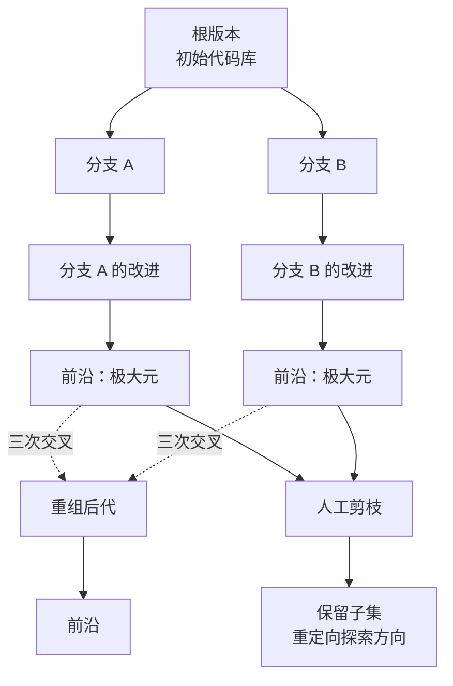

# EvoGit：基于 Git 的多智能体去中心化代码演化

## 基本信息

| 项目 | 内容 |
|---|---|
| **论文标题** | EvoGit: Decentralized Code Evolution via Git-Based Multi-Agent Collaboration |
| **arXiv** | [2506.02049](https://arxiv.org/abs/2506.02049) |
| **代码仓库** | [BillHuang2001/evogit](https://github.com/BillHuang2001/evogit) |
| **发表时间** | 2025-06 |
| **一句话总结** | 把版本历史建成「系统发育图」（phylogenetic graph，借生物演化树的形状组织代码版本），用祖先关系构造偏序，极大元构成当前前沿：不设标量适应度，多分支并发演化，从结构上避开单一谱系的局部最优 |

---

## 置信度评估

| 维度 | 评估 |
|---|---|
| **方法可信度** | 高。DAG 与偏序是成熟的数学结构，机制描述精确到数据结构定义与操作步骤 |
| **实验充分度** | 中。两个真实任务（从零建 Web 应用、自演化装箱求解器），有 Git 历史可核查，但没有与基线的量化对比表 |
| **可复现性** | 高。开源，且最终产物是 Git 仓库，演化过程可直接用 `git log` 查验 |
| **对本项目的适用性** | 高。版本存储形态与项目 `KnowledgeVersion` 按版本存整份正文的设计天然吻合 |

---

## 它解决了什么问题

代码演化类系统普遍面对一个结构性问题：如果只保留当前最优版本，改进就锁死在单一谱系上，一旦进入局部最优就无法退出。DGM 用归档保留全部版本解决了「保留」的问题，但保留了之后**怎么判断哪个版本更值得继续**，通常还是回到一个标量分数上。

EvoGit 指出的问题是：真实软件开发**没有统一的标量指标**可以给代码版本排序。质量是多维的、依赖上下文的，强行压成一个分数会丢掉关键信息。

它的做法是彻底放弃标量适应度，改用**祖先关系**这一纯结构信号：A 是 B 的祖先就当 A 早于 B，不共享祖先的两个版本**不可比较**，而这种不可比较恰恰是多分支探索留下的重组机会。

---

## 方法核心

### 四个核心组件

**① 自主智能体**：每个 agent 独立运行，通过「变异」提出局部小改动，或通过「交叉」组合不同版本，向图中新增节点。agent 之间没有消息传递，也没有共享内存。

**② 人类产品经理**：定义初始设计意图，周期性审阅图，挑选有希望的分支、剪掉无产出的分支。介入是稀疏的、高层的。

**③ 系统发育图**：以初始版本为根的有向无环图。每个节点编码代码库的**完整快照**，每条边代表一次**已验证的演化步**。图在所有版本上诱导出偏序。名字取自生物学的系统发育树，用处在于「谁从谁演化而来」成为可计算的关系，不必先给每个版本打分。与生物树的一个差别是分叉的含义：这里分叉出来的是不同 agent 各自提交的修改，共同祖先表示它们共享同一段代码历史。

**④ Git 后端**：图直接实现在 Git 之上，兼容 GitHub 等标准工具，天然支持可复现、分布式开发和细粒度追踪。

### 偏序：为什么不用标量分数

先说明这里用的是哪个概念。**偏序**（partial order）指元素之间只定义了一部分先后关系，有些对能比较，有些完全无法比较；与之相对的全序（total order）要求任意两个元素都能排出先后。质量评分属于全序，偏序是它的弱化版本。

论文对版本集合定义二元关系，当且仅当 A 是 B 的祖先（直接或经传递序列）时 A 早于 B。这诱导出偏序，满足自反性、反对称性和传递性。

偏序只覆盖了一部分版本对，**许多版本对之间根本排不出先后**。没有祖先-后代关系的两个版本就是这种情形，它们来自并发分支，是潜在的重组候选。这里的重组指把两个分支的改动合到一起产生新版本，也就是下面「三次交叉」要做的事。

这个结构编码了血缘信息，让 agent 可以在**不需要标量适应度值**的前提下推理支配关系与继承关系。

### 极大元：谁是「最好的」版本

**极大元**（maximal element）是偏序论里的概念，指不存在比它更大的元素。它跟「最大元」（maximum element）的区别在于：最大元要求能跟所有其他元素比较且都更大，极大元只要求没有元素比它更大。偏序里存在不可比较的对，所以极大元可以同时有多个。

论文不定义「最优版本」，而是定义极大元：不存在任何后继版本支配它的版本。极大元构成当前的**演化前沿**，是没有被后继版本取代的版本。

因为只有偏序，极大元可以有多个，这正好反映多条并发演化的分支。

### 四个操作

**初始化**：建立根版本。

**变异**（mutation）：agent 从当前前沿选一个版本作为起点，接收设计规格、当前文件结构和**随机选取的可编辑代码段**，提出局部小改动（改一个函数、插一个条件、重构几行）。约束是只能编辑单个文件内的具体区段，或新建文件插入代码片段，禁止跨文件的大规模重构。改动后做成对比较，依据构建状态、linter 诊断、类型检查和测试结果判断是否优于父版本。通过且无回归则作为后代节点加入图中，否则丢弃。

**三次交叉**（crossover）：选两个父节点（通常来自发散的分支），用**最低公共祖先**（LCA，lowest common ancestor，指两个节点往上追溯遇到的第一个共同祖先）作为参照基准。分别计算两个父版本相对 LCA 的改动集合，把两组改动应用到 LCA 上合成后代。改动不相交时直接合并；冲突时用**随机策略**解决冲突以促进多样性。验证后代的结构与语义正确性，且必须同时保留来自两个父版本的血缘，才允许入图。变异和交叉都借自演化算法，对应无性繁殖与有性繁殖两种产生新个体的方式。

**人工干预**：分支长期发散后版本间的结构与语义差异会变大，交叉成功率下降，agent 可能产出不兼容的版本，浪费算力并让演化轨迹碎片化。人工审阅当前图，从极大元中**选择性保留一个子集**作为继续发展的方向，丢弃其余。这个剪枝操作是自上而下的纠正信号。

### 与标准 Git 提交图的区别

论文专门讨论了这一点，两个约束是 EvoGit 独有的：

**偏序约束**：每个后代版本必须不差于其父版本，从而在版本集合上诱导偏序，保证单调不退化的演化轨迹。标准 Git 允许提交引入回归、删除功能或做颠覆性架构改动。

**局部变异约束**：变异被限制在局部编辑，通常限于单个文件或新建空模块。跨多文件的大规模重构被明确禁止。

这两个约束让 EvoGit 的图带有**演化语义**，区别于标准提交历史的无结构特性。

---

## 实验结果

- **任务一**：从零构建使用现代框架的 Web 应用
- **任务二**：构建一个能演化自身语言模型引导求解器的元级系统（求解装箱优化问题）
- 两个任务的最终产物都是功能完整、模块化的软件工件
- 论文强调可复现性：演化过程完整记录在 Git 历史中，可直接查验多 agent 如何逐步演化代码

---

## 局限与注意

- **缺少基线量化对比**。实验展示了能力，但没有与其他演化方法在同一任务上的分数对照
- **局部变异约束限制改进幅度**。单文件小步改动意味着架构级重构难以发生，论文认为微改进会累积成大结构创新，但这需要足够多的轮次
- **人工干预仍不可缺**。分支发散到一定程度必须人工剪枝，全自动运行会碎片化
- **偏序不含质量信息**。祖先关系只说「谁从谁演化而来」，不说「谁更好」。论文把「不差于父版本」的判定交给构建与测试诊断，这个判定本身的强度决定了整个机制的上限
- **交叉的随机冲突解决会产出无效后代**，需要靠验证环节过滤，有算力开销

---

## 对本项目的启发 ⭐

项目的知识版本机制里，版本有候选、已验证、低置信、被替代几种状态，被后继发布替代的版本会保留历史。这已经是一套版本留存，但版本之间的关系是**线性**的：一个新版本替代旧版本，旧版本转为被替代状态，没有表达「两个版本来自不同探索方向」的能力。

EvoGit 的偏序与极大元正好补这一段。

### 解决哪个环节的什么问题

**环节：`KnowledgeVersion` 之间的比较与选择，以及 `ROLLING_BACK` 的入口条件。**

`Knowledge.md` 明确写着「回滚状态仅为迁移兼容，当前不自动选择历史最优并回滚」。当前版本之间只有「谁替代了谁」这一个关系，缺少「哪些版本可以并列作为继续探索的起点」这个判断。结果是每次飞轮都只能在这一份文档的最新版本上继续改。

### 方案要点

**① 用版本间的父子关系构造图，取前沿作为探索起点**

版本之间的**父版本**引用本身就构成一张有向无环图，不需要新增数据结构。缺的只是「在这张图上算前沿」这一个能力：哪些版本还没有被后继取代，它们就是可以并列继续探索的起点。

**② 把「不差于父版本」当作回退判据**

EvoGit 要求每个后代不差于其父版本，这条单调性是整个机制能持续改进的前提。对应到本项目，就是判断新一轮的门禁结果相对上一轮是否出现了退化，退化即触发回退。判据本身落在已经确定的评测事实上，不引入模型自评。

**③ 局部改动的约束项目已经满足**

EvoGit 限制变异只能小步进行，不允许跨文件大重构。本项目每次飞轮只修订一份知识文档，约束方向一致，改动粒度小、范围可控。这一条属于**已经满足的前提**，不需要额外实现。

**④ 人工剪枝复用已有的人工治理交接**

多个前沿版本并存会带来一个人工决策点：保留哪些、放弃哪些。本项目已经有「达到轮次上限或预算耗尽时转人工治理」的交接机制，人工在多版本之间做取舍的场景可以挂在这套机制上。

### 提供了什么思路

**① 拒绝标量分数，用结构信息替代**

EvoGit 最值得借鉴的判断是：**真实质量是多维的，不该压成单一分数**。本项目 `Evaluation.md` 已经写「相似度、模型自评分和自然语言『通过』不能覆盖这些条件」，`GateDecision` 是一组事实，落不到一个分数上，这与 EvoGit 的立场一致。

沿着这个思路，版本选择依据应该是「版本在哪些测试项上不可替代」这类结构化事实，取综合分再取最大的做法会丢掉这些信息。

**② 「不可比较」是特性**

本项目当前只能线性推进，隐含假设是「版本之间总能排出优劣」。EvoGit 指出不可比较的版本对是重组机会。对知识文档而言，两份不同方向的修订可能各有各的覆盖优势，这种情况下并列保留比强行排序更合理。

**③ 单调不退化是个可校验的约束**

「每个后代版本必须不差于其父版本」这条约束可以直接映射为本项目的回退判据：新一轮的门禁结果相对上一轮出现了退化，就说明单调性被破坏，可以触发回退。

**④ Git 作为后端降低实现成本**

EvoGit 把图建在 Git 之上，直接获得可复现、可追溯和标准工具支持。本项目知识正文按内容哈希存储，本身已经是内容寻址（content addressing），与 Git 的对象模型接近，沿用现有存储形态就能承载版本图。

### 需要注意的

- **偏序不含质量判断**。祖先关系只说血缘。本项目里评判「不差于父版本」的依据应该是门禁的确定事实，不能退回模型自评
- **前沿版本会随轮次增长**。极大元集合如果无界增长，人工审查成本会失控。需要配合项目已有的资料保留策略，避免前沿无限膨胀
- **交叉不要现在做**。单文档约束下没有交叉对象，引入交叉会破坏该约束
- **人工剪枝需要展示界面**。从极大元里选子集需要人工能看懂视图，本项目完整的治理展示仍未完成

---

## 关联

- **对应环节**：`KnowledgeVersion` 之间的比较与选择；`ROLLING_BACK` 状态的入口条件；`workflow_router` 的 ITERATE 分支
- **对应缺口**：`Knowledge.md` 的「回滚状态仅为迁移兼容，当前不自动选择历史最优并回滚」；`Evaluation.md` 的「历史最佳回退、成本及停滞策略仍未完成」
- **相关论文**：DGM（2505.22954）：归档保留全部有效版本，与本篇的偏序前沿互补
- **相关论文**：Huxley-Gödel Machine（2510.21614）：指出「编码基准表现」与「自改进潜力」的错配，给出选择依据的修正
- **相关论文**：ChronoMem（2607.27773）：把版本控制与语义回滚做成独立层
- **本项目代码**：`src/domain/Domain.ts`（`KnowledgeStatus` 枚举与业务状态机）、`Knowledge.md`（`KnowledgeVersion` 实体与不变量）
