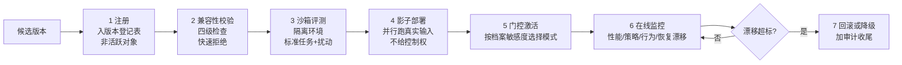

# Governed Capability Evolution：版本升级的兼容性检查与回滚

## 基本信息

| 项目 | 内容 |
|---|---|
| **论文标题** | Governed Capability Evolution: Lifecycle-Time Compatibility Checking and Rollback for AI-Component-Based Systems |
| **arXiv** | [2604.08059](https://arxiv.org/abs/2604.08059) |
| **发表时间** | 2026-04（v5 修订于 2026-05） |
| **一句话总结** | 把新版本当作受治理的部署候选，经过四级兼容性检查与七阶段升级流水线才允许替换，回滚可靠性直接作为准入条件 |

---

## 置信度评估

| 维度 | 评估 |
|---|---|
| **方法可信度** | 高。四级兼容性与七阶段流水线都有形式定义，指标定义完整（`BADR`、`FAR`、`UAR`、`RSR`、`PVR`、`SRDR`），带消融实验与阈值敏感性分析 |
| **实验充分度** | 高。6 轮升级、15 个随机种子、5 个实验组、多种部署档案对比 |
| **可复现性** | 中。有参考实现，但基于 PyBullet 操作测试平台与 ROS 2 中间件，非通用代码库场景 |
| **对本项目的适用性** | 中高。四类失效模式与七阶段流水线的形状可以对齐本项目的门禁与回滚，但该文面向具身智能体，需要做场景转换 |

---

## 它解决了什么问题

由版本化 AI 组件构成的系统越来越需要**生命周期级的治理**：当一个能力模块演化出新版本，托管系统必须决定新版本能否安全激活、在什么部署条件下运行、如何监控、何时回滚。

现有的软件部署模式（金丝雀发布、蓝绿部署、特性开关、MLOps 流水线）覆盖了这个循环的一部分，但它们是为**无状态 Web 服务**设计的，不适用于有状态、受策略约束、在真实环境驱动 AI 组件的运行时。

论文把「朴素替换」的失效模式归纳为四类：

| 失效模式 | 表现 |
|---|---|
| **接口破坏** | 规划器或调度器在过时假设下调用新版本 |
| **策略破坏** | 新版本执行了现有运行时策略覆盖不足的动作 |
| **行为回归** | 名义任务成功率在部分场景提升，但不安全继续或异常运行时轨迹增加 |
| **恢复能力退化** | 新版本失败后，系统在既有恢复假设下无法回滚、降级或安全中断 |

第四类最值得注意：**恢复能力的退化是一种独立失效模式**，不能当成「回滚没做好」这种工程细节。一个性能很高的候选版本，如果失败后系统无法恢复，就应该被拒绝准入。

---

## 方法核心

### 四个兼容性维度

论文定义了四个平行的兼容性检查维度（`κI` 接口、`κP` 策略、`κB` 行为、`κR` 恢复），每个维度有「兼容 / 有条件兼容 / 不兼容」三类结果：

| 维度 | 核心问题 | 检查内容 |
|---|---|---|
| **接口兼容** | 当前规划器、调度器、运行时能调用吗 | 签名、范式、前后置条件、依赖兼容 |
| **策略兼容** | 现有策略集足够覆盖吗 | 权限范围、策略覆盖、环境档案、授权兼容 |
| **行为兼容** | 执行行为在治理预期内吗 | 轨迹分布、重试与超时、不安全继续、监视器对齐 |
| **恢复兼容** | 候选失败后系统还能恢复吗 | 回滚、降级、安全中断、失效模式可识别性 |

恢复兼容性有一条关键判断：**它属于准入判据，在失败之前就要检查**。论文为此定义了「恢复就绪度」评分，得分低就限制激活模式或要求人工审查。

### 七阶段流水线

| 阶段 | 目的 |
|---|---|
| **1 注册** | 候选版本进入版本登记表，作为受管理的非活跃对象 |
| **2 兼容性校验** | 做四级检查，快速拒绝或路由到沙箱与影子阶段 |
| **3 沙箱评测** | 隔离环境下的标准任务与结构化扰动测试 |
| **4 影子部署** | 与活跃版本**并行跑真实输入**，比较输出但不给控制权 |
| **5 门控激活** | 按档案敏感度提升为活跃版本，模式含完全、有条件、需审批、回滚耦合 |
| **6 在线监控** | 追踪激活后的性能、策略、行为、恢复四类信号的漂移 |
| **7 回滚与审计** | 检测到不可接受漂移时恢复先前活跃版本，记录完整生命周期 |

**阶段七区分三种回退强度**：硬回滚（立即移除）、软降级（降级到沙箱或影子状态）、档案降级（限制到低风险环境）。

### 设计目标不是最大化接受率

论文明确说：目标是同时满足五项性质，提高升级接受率本身不是目的。这五项是改进性、安全性、兼容性、可恢复性、可审计性。

目标是只准入那些「提升效用的同时保持在治理包络内」的候选。这把策略约束执行的原则从**动作级控制**扩展到了**能力级部署控制**。

---

## 实验结果

**主结果（性能与安全权衡）**：朴素升级达到 72.9% 任务成功率，但到最后一轮把不安全激活率推到 60%；受治理升级保持可比的成功率（67.4%），**所有轮次的不安全激活为零**（Wilcoxon 检验 p=0.003）。

**影子部署的价值（E3）**：论文最重要的发现之一。

沙箱评测在检测策略漂移（每种子 24 次）、超时停滞（18 次）、恢复退化（6 次）上有效，但**完全检测不到重试不稳定性**。影子部署额外抓到 8 次重试不稳定和 17 次策略漂移，这些在沙箱视角下不可见。

跨所有回归类别，沙箱占检测总量的 60%，影子部署提供关键的 **40%**，这部分在没有影子阶段的情况下会在激活前被完全漏掉。

论文的结论是：**沙箱测试必要但不充分**，因为候选行为在真实输入分布、异步时序和更丰富任务上下文中会变化。

**回滚可靠性（E4）**：在四种激活后漂移下，回滚成功率整体 79.6%（±6.2%），48 次回滚尝试每种子。传感器噪声与执行器延迟的 RSR 略高（78.3% 到 81.7%），组合漂移方差最大、挑战最大。回滚后任务成功率部分恢复，不安全继续保持低位。

**治理层自身也会失效**：论文专门列了一节，包括兼容性评估不完整、评测与部署的分布差异、治理配置错误、监控盲区、回滚不可用或无效。最后一条特别指出：回滚路径可能**原则上存在但实践中失败**，原因是状态损坏、依赖不匹配、触发时机延迟或安全中断条件丧失。

---

## 局限与注意

- **仅仿真评测**。PyBullet 操作测试平台，不是真实部署
- **任务范围受限**，升级对象是单个系统，机群规模不在覆盖范围内
- **人工权威模型被简化**，真实组织中审批链更复杂
- **兼容性形式化是轻量的**，没有完全通用的能力类型系统；行为签名只是行为兼容的代理指标
- **样本量有限**，多重比较问题未完全解决
- **计算开销**：多了沙箱与影子两个阶段，成本显著上升
- **面向具身智能体**。传感器噪声、执行器延迟这类漂移类型在代码知识场景不适用，需要替换成对应的漂移类型

---

## 对本项目的启发 ⭐

这篇的价值不在机制新颖，而在**把版本治理做成了可验收的工程流水线**。本项目当前有门禁、有停止路径、有回滚状态，但缺少「版本从候选到活跃」的完整治理链条，尤其是**激活后的监控**这一段。

### 解决哪个环节的什么问题

**环节：从候选版本产生到成为活跃版本的完整路径，以及 `ROLLING_BACK` 之后的持续校验。**

本项目的 `KnowledgeStatus` 里，`CANDIDATE` 是未发布版本，`VERIFIED` 必须关联有效 Gate 与唯一发布回执。从候选到已验证这一步有 `evaluation` 门禁，但这条路径是**单次判定**：通过就发布，不通过就迭代或停止。缺的是「发布之后还会不会出问题」以及「出问题怎么回退」的完整处理。

### 具体怎么落地

**① 把回滚可靠性提升为准入条件**

这是本篇最值得移植的一条判断。当前 `Evaluation.md` 把回滚列为未实现的目标要求，摆在**事后补救**的位置，也就是迭代多轮失败后才考虑回退。

论文的建议是反过来：**在准入时就检查候选版本是否可恢复**。对应到本项目，可以在 `candidate_knowledge` 或 `evaluation` 阶段增加一项检查：这个候选版本如果出问题，能否回退到上一个 `VERIFIED` 版本，回退路径是否完整。

具体判据可以复用已有的确定事实：存在最近一个 `VERIFIED` 版本（可作回退目标）、该版本的正文 `ArtifactRef` 完整性有效、该版本关联的发布回执未被撤销。

**② 四类失效模式可以映射到本项目的确定事实**

| 论文的失效模式 | 本项目对应事实 |
|---|---|
| 接口破坏 | 知识文档引用的接口、命令、路径与实际源码不符 |
| 策略破坏 | 角色 `readablePaths` 越权，或材料槽位被扩大 |
| 行为回归 | `criticalFailures > 0`、`stability` 跌破阈值 |
| 恢复退化 | 无可用回退目标，或回退后会引入未验证知识 |

最后一类的映射对本项目特别有意义：`IO-19` 规定达标后立即清理中间候选文档，**只保留最终版本与被替换的上一版**。如果某个时点连上一版也清理了，恢复能力就退化了。这是一个可以程序化检查的条件。

**③ 「沙箱必要但不充分」对应本项目的参考校验边界**

论文发现沙箱评测漏掉 40% 的回归（重试不稳定性完全检测不到），必须靠影子部署在真实输入上并行观察才能发现。

本项目有一条对应的已承认缺口：`Evaluation.md` 写着「当前参考校验不证明测试断言充分或原实现业务正确」。参考校验相当于论文的沙箱评测，它证明测试在参考源码上通过，不证明测试能抓住错误实现。论文的结论支持这个判断：**隔离环境下的评测必然漏掉一部分问题**。

差别在于论文给出了补法（影子部署），而本项目当前没有对应阶段。可以考虑的方向是：让新版本知识在**不发布的状态下**先参与一轮真实任务，与实际使用的版本对比输出，观察差异后再决定是否发布。

**④ 三种回退强度**

论文区分硬回滚、软降级、档案降级。本项目目前只有 `ROLLING_BACK` 一个状态，对应硬回滚。可以考虑的补充是**软降级**：把可疑版本转为 `LOW_CONFIDENCE`，先不直接回退。

本项目的 `LOW_CONFIDENCE` 定义是「保留停止证据」，语义上接近软降级，不需要新增状态。

**⑤ 审计闭环**

论文的阶段七包含审计收尾，记录完整生命周期用于调试、策略重设计和后续演化。本项目 `IO-19` 已有对应设计：需要人工治理时后台暂存解决问题的相关版本和完整证据。

### 提供了什么思路

**① 把「能不能恢复」当作版本的固有属性**

这是本篇最核心的观念转换。恢复能力过去被当作运维问题，论文把它变成**候选版本的准入属性**：一个无法安全回退的版本，即使性能更好也不该激活。

**② 治理阶段之间是状态机，可以逐一验收**

论文把流水线形式化为治理状态机，每个阶段有明确的状态语义与迁移规则。这比一串独立的检查更有约束力，也更容易验收。

**③ 监控不因激活而结束**

「即使好候选也可能在激活后失败，生命周期治理必须持续到激活边界之后」。这条对本项目意味着：知识文档发布为 `VERIFIED` 之后，如果源码演进导致知识失配，应该有机制发现并降级或回退。当前项目在 `KnowledgeStatus` 里缺少「已发布但已失配」这个状态，需要靠外部检查发现。

**④ 治理本身会有失效模式**

论文专列一节讲治理层的失效，其中「评测与部署的分布差异」和「回滚不可用或无效」两条与本项目直接相关。实现回滚机制时要同时设计**回滚机制本身的验收**，不能只验收回滚功能存在。

### 需要注意的

- **别照搬七阶段**。项目的单文档飞轮约束（`IO-18`）和已有的门禁判定已经覆盖了注册、校验、沙箱评测的一部分，新增的应该是**影子部署**和**在线监控**这两段本项目确实没有的
- **沙箱与影子两阶段成本高**。本项目已有 `IterationBudget` 做轮数预算，还缺成本预算。增加阶段会加重这个问题，需要与成本预算一起设计
- **场景转换要谨慎**。传感器噪声、执行器延迟这类漂移在本项目对应的是源码演进、依赖变更、测试集版本变化
- **人工权威模型是简化的**，本项目的人工治理涉及审查清单与决策记录，比论文的审批绑复杂
- **不要因为「回滚看起来简单」就跳过验收**。论文明确警告回滚路径可能原则存在而实践失败

---

## 关联

- **对应环节**：`candidate_knowledge` 的准入判断；`evaluation` 的门禁；`ROLLING_BACK` 的触发与执行；`IO-19` 的资料保留
- **对应缺口**：`Evaluation.md` 的「历史最佳回退、成本及停滞策略仍未完成」；`Knowledge.md` 的「自动资料清理和完整治理展示仍未完成」
- **相关论文**：Governed Evolution of Agent Runtimes（2605.27328）：同一研究脉络，强调有界可观测的运行时演化
- **相关论文**：ChronoMem（2607.27773）：回滚的执行侧实现
- **相关论文**：EvoGit（2506.02049）：版本关系的结构表达
- **本项目代码**：`src/domain/Domain.ts`（状态机与 `KnowledgeStatus`）、`Evaluation.md`（Gate 判定与停止路径）、`Knowledge.md`（`IO-19` 保留策略）
