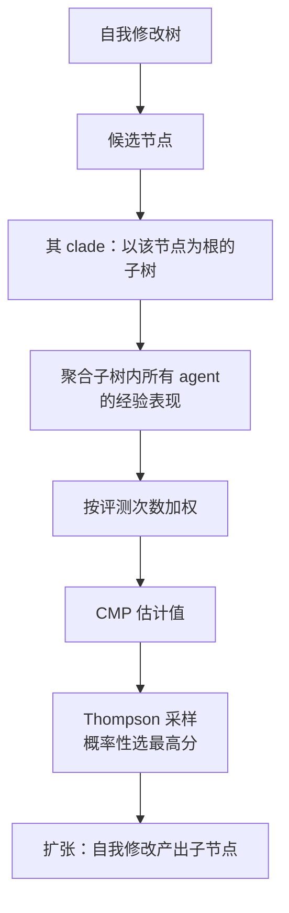

# Huxley-Gödel Machine：用后代表现估计自改进潜力

## 基本信息

| 项目 | 内容 |
|---|---|
| **论文标题** | Huxley-Gödel Machine: Human-Level Coding Agent Development by an Approximation of the Optimal Self-Improving Machine |
| **arXiv** | [2510.21614](https://arxiv.org/abs/2510.21614) |
| **发表时间** | 2025-10（v3 修订 2025-10-29） |
| **一句话总结** | 指出「基准表现」与「自改进潜力」存在错配，提出按后代整支（clade）聚合表现来估计潜力，选择依据的相关性从 DGM 的 0.285 提到 0.778 |

---

## 置信度评估

| 维度 | 评估 |
|---|---|
| **方法可信度** | 高。给出与 Gödel Machine 的理论联系（定理 1），估计器有形式定义 |
| **实验充分度** | 高。有错配现象的量化证据（相关系数表）、与 SICA 和 DGM 的对照、完整 SWE-bench Verified 优化、跨数据集与跨模型迁移 |
| **可复现性** | 高。代码公开，评测在标准基准上 |
| **对本项目的适用性** | 中高。核心洞察（选父代不该只看当前表现）可直接借用，但具体估计器依赖有大量评测样本的场景 |

---

## 它解决了什么问题

DGM 这类系统通过让编码 agent 修改自身代码库来成长，维护一棵自我修改的树。**扩张策略偏爱在软件工程基准上表现更好的节点**，假设基准表现高就意味着后续自我修改更有希望。

论文指出这个假设过于贪心：它只评估一次修改的**即时效用**，忽略了它对未来自我修改的下游影响。论文把这个落差命名为**元生产力-表现错配**：

> 短期任务表现与长期自改进能力之间的分歧。

论文用实验证明了错配真实存在。做法是先算出每个节点的经验元生产力（该节点子树内除自身外的最大任务表现均值），再看各方法的选择判据与它的相关性：

| 方法 | SWE-Verified-60 加权相关性 | Polyglot 加权相关性 |
|---|---|---|
| SICA | 0.444 | 0.274 |
| DGM | 0.285 | 0.383 |
| **HGM** | **0.778** | **0.626** |

SICA 与 DGM 的相关性都很弱（0.274 到 0.444），说明它们的选择判据与真正的自改进潜力对齐度差。这就是错配的实证。

**一个适度的祖先可能价值很高**，只要它的后代持续进步；反过来**停滞的谱系应该被降权**，哪怕它自己的分数不低。

---

## 方法核心

### 全局元生产力与局部变体

**全局元生产力**衡量自改进对整个树的最终影响。形式上它对应强化学习里的 Q 值函数：状态是 agent 归档，动作是选择哪个 agent 去扩张。一个节点的全局元生产力衡量的是「从这个节点出发、期望最终得到的 agent 表现如何」。

它捕捉的是**自改进本身的长期潜力**，包括那些改善自改进能力的修改。一个算法可能早期专注提升自改进能力而暂时不顾基准表现，之后再转向直接能力，这是 Gödel Machine 捕捉到的主要元学习行为。

但全局元生产力范围太宽，实际难以操作化，因为一个 agent 的自我修改原则上可以通过引入新信息改变其父代的期望效用。

**局部变体：clade 元生产力（CMP）**

论文把范围收窄到以某个 agent 为根的子树，称为它的 **clade**（支系）。CMP 就是在这个子树内衡量的元生产力。

论文证明了它与 Gödel Machine 的关键联系：在某个假设下，**拥有真实 CMP 的预言机足以实现 Gödel Machine**。这让 CMP 成为一个有理论依据的引导信号，而不只是一个启发式。

### 估计器

论文用子树内 agent 经验表现的**加权平均**来估计 CMP，给效用更高的 agent 更高权重。

形式上，给定归档、每个 agent 通过的测试数和失败的测试数，估计值等于该 clade 内各 agent 的经验均值以各自**评测次数为权重**的加权和（权重设计使高表现 agent 获得类似软最大值的选择效果）。

聚合整支而非单节点的好处有两条：

- 更贴合自改进的目标。适度的祖先若有持续进步的后代，仍可能价值很高
- **统计上更稳健**。跨 clade 聚合证据比单节点结果用到了更多样本信息，这在评测昂贵、基准只被部分观测时特别重要

### 选择：Thompson 采样

算出 CMP 估计后，HGM 用 Thompson 采样概率性地近似选择得分最高的 agent，而不是确定性取最大。

### 算法循环

每一轮在「扩张」和「评测」之间选择。扩张时对每个节点采样决定是否扩张，选出节点后做自我修改产出子节点。评测时对还有剩余任务的 agent 采样，给选中的 agent 分配一个基准任务并更新计数（同时更新其祖先的计数）。

论文还记录了实现中的两个偏差来源：搜索初期扩张动作占比过密，会让后续评测选择偏离标准做法；异步化会让评测结果少的 agent 更容易被选中，因为简单任务通常先结束，导致评测数少的 agent 经验均值偏高。论文观察到很多 agent 在前十个评测任务上表现成功，随着评测数增长准确率快速下降，超过 50 次评测后这个偏差基本消失。

---

## 实验结果

- **错配的量化证据**：如上表，HGM 的估计器与经验元生产力的相关性大幅超过 SICA 与 DGM
- **自改进能力**：在 SWE-bench Verified 与 Polyglot 上超过此前的自改进编码 agent 开发方法，**同时用更少的 CPU 小时**
- **迁移性**：能迁移到其他编码数据集和大语言模型
- **对标人类**：用 GPT-5-mini 在 SWE-bench Verified 上优化出的 agent，在 SWE-bench Lite 上用 GPT-5 评测，达到人类水平，**匹配了人类工程化编码 agent 的最好官方结果**

---

## 局限与注意

- **估计器需要足够多的评测样本**。权重是评测次数，样本少时估计不稳；论文明确提到 50 次评测以内存在明显偏差
- **依赖有可重复评测的基准**。CMP 的原料是每个 agent 在任务上的通过/失败计数，没有稳定评测就没有这个信号
- **计算预算仍是上限**。算法在预算耗尽时停止，预算大小直接影响能探索的树规模
- **理论保证依赖假设**。CMP 与 Gödel Machine 的联系建立在论文的假设 1 上
- **异步执行引入偏差**，需要额外处理（论文用初期并行扩张五次来缓解）
- **场景是自我修改的编码 agent**，被测对象是 agent 自身的代码，不是知识文档

---

## 对本项目的启发 ⭐

DGM 篇已经指出「归档保留非最优版本有意义」。HGM 补的是**下一个问题：从归档里到底该选哪个版本继续**。

DGM 的做法是从归档采样，但采样依据是什么，论文没有给出强判据。HGM 指出按当前表现选是错的，并把「后代表现」作为替代依据。这个修正对本项目的回滚决策有直接价值。

### 解决哪个环节的什么问题

**环节：回滚目标版本的选择依据，以及「保留历史最佳」如何定义「最佳」。**

`Evaluation.md` 记录「保留历史最佳、关键回归回滚及停滞转 LOW_CONFIDENCE 同样已有目标要求，当前尚未实现」。其中「历史最佳」如果按当前表现定义，就落在 HGM 指出的错配里：一份当前分数高但后续无法继续改进的知识文档，未必比一份当前分数一般但修订空间大的文档更值得保留。

### 具体怎么落地

**① 「最佳版本」的判据可以从单点改为谱系聚合**

本项目 `KnowledgeVersion` 保存了**父版本**字段，版本之间的关系是一棵树。按 HGM 的思路，判断一个版本是否值得作为回滚目标或继续探索的起点，不应只看它自己的 `EvaluationReport`，还要看**从它衍生出的后续版本的表现**。

具体做法是：对一个候选版本，取它在版本树里的整个子树，聚合子树内各版本的门禁事实（通过测试数、`criticalFailures`、`stability`），按各版本的评测次数加权。

**② 加权方式可以复用现有的评测计数**

HGM 的权重是评测次数。本项目的 `EvaluationReport` 已经包含测试计数与 `criticalFailures`，这些就是现成的原料。不需要新增数据采集。

**③ 「停滞谱系降权」正好对应停滞策略的缺口**

`Evaluation.md` 把「停滞策略」列为未实现。HGM 给出了一条具体判据：**某个版本的子代长期没有改进，该版本在后续选择中应被降权**。

这比单纯看「连续几轮分数没提升」更有结构信息：停滞是从谱系角度判断的，不是从单条时间线判断的。

**④ 用概率选择替代确定性取最大**

HGM 用 Thompson 采样而不是确定性选最高分，保留了探索性。本项目 `workflow_router` 的决策当前是确定性的（PASS、ITERATE、FAILED、STOPPED），回滚目标的选择如果要引入概率，需要先明确这与已有确定性判定的关系。

一个稳妥的落地方式是：**先做确定性选择（选 CMP 最高的版本），把概率采样作为后续消融的对比项**。HGM 的论文本身也报告了不引用采样的变体。

### 提供了什么思路

**① 选择依据与目标要分离**

HGM 最本质的贡献是区分了两件事：**当前表现**和**改进潜力**。DGM 用前者当后者的代理，论文证明这两者相关性很弱。

这个区分对本项目有直接含义。`EvaluationReport` 衡量的是「这一版知识文档对不对」，它**不是**「这一版知识文档还有多少改进空间」的可靠代理。两个问题需要两套判据。

**② 用结构信息替代分数**

HGM 的判据完全基于树的拓扑结构（谁是谁的 clade）加聚合统计，不需要引入新的评分维度。这与 EvoGit 用偏序替代标量适应度是同一思路的两个应用。

对本项目的意义是：**回滚目标的选择可以完全建立在已有的门禁事实和版本关系上**，不需要引入模型自评分这类不可靠信号（`Evaluation.md` 已明确排除模型自评分）。

**③ 「用更少 CPU 小时达到更好结果」的启示**

HGM 强调它超过前作的同时用了**更少**的 CPU 小时。原因是选择判据更准，避免了把预算浪费在没希望的谱系上。

本项目缺成本预算（`Evaluation.md` 列为未实现）。HGM 说明：**选择判据的质量本身就是一种预算效率手段**，不只是加一个计数器限制总量。

**④ 统计偏差需要主动处理**

论文记录了异步执行导致的偏差（评测数少的 agent 均值偏高）以及缓解方式（初期并行扩张、超过 50 次评测后偏差消失）。

本项目如果按评测次数加权，需要注意初期版本评测不足导致的偏差，以及「简单测试先跑完」带来的均值偏高问题。测试集固定的设计在这里是有利的（`oracle_validation` 通过后按源码内容身份固定），因为各版本面对的是同一套测试。

### 需要注意的

- **别把 CMP 直接搬过来**。它假设大量 agent 在大量任务上的评测，本项目单文档飞轮每轮只产出少量版本，样本量小得多。估计器的方差会更大
- **理论保证依赖假设**，不能当作无条件成立的性质
- **树会随轮次增长**，聚合计算的成本需要控制。本项目已有 `IterationBudget` 限制轮数，但版本树的所有权计算是额外的
- **概率选择与确定性门禁的关系需要明确**。本项目的 `GateDecision` 是确定性事实，选择机制如果引入随机性，需要说清两者边界
- **场景差异**。HGM 优化的是 agent 自身代码，本项目改的是知识文档；「后代表现更好」在代码场景有明确基准，在知识场景需要定义什么算更好

---

## 关联

- **对应环节**：回滚目标版本的选择依据；「保留历史最佳」的定义；停滞策略的判据
- **对应缺口**：`Evaluation.md` 的「历史最佳回退、成本及停滞策略仍未完成」
- **相关论文**：DGM（2505.22954）：归档采样选父代，本篇修正其选择依据
- **相关论文**：EvoGit（2506.02049）：用偏序与极大元定义前沿，与本篇的 clade 聚合互补
- **相关论文**：GEPA（2507.19457）：另一条父代选择路线，按逐测试项覆盖度加权
- **本项目代码**：`src/domain/Domain.ts`（`KnowledgeVersion` 与状态机）、`Evaluation.md`（`EvaluationReport` 字段与未实现目标）
