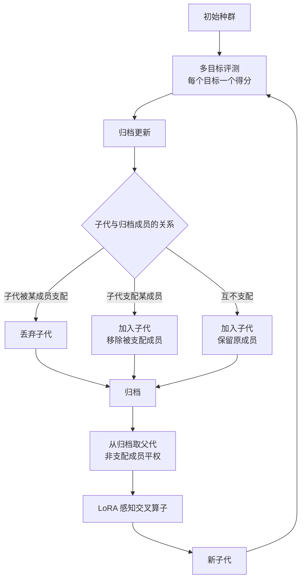

# EvoPref: Multi-Objective Evolutionary Optimization Discovers Diverse LLM Alignments Beyond Gradient Descent

## 基本信息

| 项 | 内容 |
|---|---|
| 链接 | https://arxiv.org/abs/2605.09777 |
| 代码 | 未明确提供 |
| 作者 | 未明确标注机构 |
| 发布时间 | 2026-05-10 |
| 一句话总结 | 用多目标演化替代梯度式偏好优化，通过 Pareto 归档保留多个互不支配的对齐方向，解决梯度方法的行为坍缩 |

## 置信度评估

| 维度 | 评估 |
|---|---|
| 发表场所 | 预印本，含统计检验、参数敏感度分析、归档组成分析 |
| 引用影响 | 新近工作，2026-05 发布，暂无引用数据 |
| 代码可用 | 未明确提供 |
| 来源机构 | 未明确标注 |
| 综合置信度 | 中高。消融与统计分析完整，归档组成有专门分析；但无代码，机构不明 |
| 需谨慎点 | 优化对象是 LoRA 权重，与知识文档的形态差距很大；「偏好」这个概念在项目里对应什么需要自己映射 |

## 它解决了什么问题

梯度式的偏好优化方法会**偏好坍缩**：收敛到窄的行为模式，忽视偏好多样性。「对齐」本身是多目标的（有用、无害、诚实往往互相拉扯），而单目标优化会压平这些差异。

论文要从多目标的角度同时得到多个方向上的高质量解，而不是选一个加权总分最高的。

## 方法核心

用 Pareto 支配关系组织归档，用专门的交叉算子产生后代。关键点在于**归档的更新规则本身就是选择规则**。

### 关键设计一：归档更新就是选择规则

支配的定义是：A 支配 B，当且仅当 A 在所有目标上都不差于 B，且至少在一个目标上更好。互不支配的版本**全部进归档**，被支配的才删除。

这意味着归档里的成员是平权的，都可能在下一轮被选为父代。不需要人为设定「哪个目标更重要」。

### 关键设计二：交叉算子感知参数结构

普通的权重交叉会破坏 LoRA 的低秩结构。论文设计了 LoRA 感知的交叉算子，让重组操作在结构上有意义。这一步的启示是：**重组操作要与产物的表示形式匹配**，直接借用通用算子往往无效。

### 关键设计三：归档机制与适应度评测协议分开

归档负责保留什么，评测协议负责怎么衡量。两者解耦，意味着可以换评测方式而不改归档逻辑。

## 实验结果

- **多样性是主要贡献**。论文明确写这一条，对齐质量的收益是次要的
- 梯度方法（DPO 类）出现偏好坍缩，收敛到窄的行为模式
- **归档组成分析**显示归档确实覆盖了不同的行为区域，而不是聚集在一个角落
- 有统计检验与参数敏感度分析支撑
- 消融实验验证了各组件的贡献

## 局限与注意

- **优化对象是模型权重**，不是文本知识产物。交叉算子的设计完全围绕 LoRA 结构，这部分不可迁移
- 每个目标需要有**连续的、可分数量**的评测信号。知识文档的质量维度是否可这样测量，是项目要自己解决的问题
- 「Pareto 前沿」在目标数少（两三个）时可能只有很少几个成员，甚至只有一个。此时支配关系的区分能力有限
- 论文**没有讨论从归档里按当前目标挑一个**的机制。归档保留了多样解，但「这轮该取哪个」不在论文范围内
- 评测成本：每个子代都要在所有目标上评测一次。目标数增加会线性抬高成本

## 对我们项目的启发 ⭐

### 解决哪个环节的什么问题

直接对应提问里的 v4/v5 例子。项目的核心诉求是「不希望依赖单一标量总分」，因为知识质量是多维的，不同版本可能本来就不可比较。EvoPref 提供了处理这种不可比性的标准框架：用支配关系而不是分数排序。

对应到项目环节，这是 `candidate_knowledge` 阶段的候选判定与 `workflow_router` 的父代决策，也回应了项目自认的「历史版本评分与可比性细节仍需细化」。

### 方案要点

把「哪个版本更好」这个问题换成「哪个版本支配哪个」。两版所有维度都不差且至少一维更好，才叫支配；只要有一维互有胜负，就是不可比较，两个都保留。

落选的定义随之改变：不是「分数低」，而是「被支配」。一个版本可能总分不高，但它在某一维上的表现没有任何其他版本能替代，那它就不该被删。

配上当前修订目标的选择规则：先用 correction 里写明的「不能破坏」项做硬约束过滤，再在剩下的候选里按目标维排序。这样「缺完整性但接地性必须保住」这种要求可以表达成约束加排序，不需要加权总分。

### 提供了什么思路

「归档更新规则即选择规则」这个视角值得借用。项目不需要额外维护一套「哪些版本值得留」的策略，只需要定义支配关系：不被支配就保留。规则少一条，出错的地方也少一处。

论文把「多目标」当成防止坍缩的手段而不是精确刻画偏好的工具，这个立场也适合项目。知识质量维度不可能测得很准，但支配关系对这种测量误差比较鲁棒：只有在一个版本明显全面劣于另一个时才会判支配。

### 需要注意的

支配关系在维度多的时候**区分力会下降**。如果给知识版本列出七八个质量维度，很可能出现「所有版本都互不支配」的情况，等于没有过滤。维度数量要控制，或者引入带容差的支配（允许微小反向差异）。

更关键的是：**支配关系解决的是「保留谁」，不解决「这轮从谁开始」**。归档里可能有好几个不可比较的版本，当前目标说不清该取哪个时，还需要另外一层机制（见 README 里的 Option D）。

论文的每个目标都有连续可比较的取值。项目当前只有 `qualityScore` 一个数字加若干二元事实，「完整性」这类维度目前没有可靠的度量方式。**这是数据层的前置工作，比算法选择更关键**。没有可比较的维度，Pareto 支配无从计算。

## 关联

- 对应环节：`candidate_knowledge` 候选判定、`workflow_router` 父代决策
- 对应缺口：「不希望依赖单一标量总分」「历史版本评分与可比性细节仍需细化」
- 相关论文：MO-CAPO `2605.18869`（同样用 Pareto 归档，把成本单列为目标）、Multi-Objective QD `2202.03057`（目标空间与行为空间同时分区）、Diverse Prompts `2504.14367`（另一条防坍缩路线，按行为特征分格）、Monte Carlo Elites `2104.08781`（归档内怎么挑一个）
- 本项目代码路径与验收命令：
  - `docs/specs/schemas/KnowledgeLineage.schema.json`：`qualityOutcome` 与 `qualityScore` 字段，当前是单值加二元结论
  - `docs/specs/domainFunction/evaluation/Evaluation.md`：一个 0 到 100 的分数加若干二元判据，多目标维度的来源
  - `docs/specs/schemas/Correction.schema.json`：`criterion` / `risk` 字段，硬约束与目标维的输入
