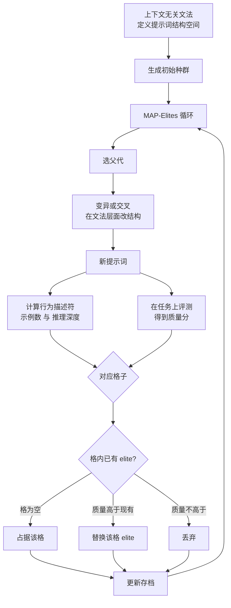

# Diverse Prompts: Illuminating the Prompt Space of Large Language Models with MAP-Elites

## 基本信息

| 项 | 内容 |
|---|---|
| 链接 | https://arxiv.org/abs/2504.14367 |
| 代码 | 基于 MAP-Elites 与上下文无关文法，未明确提供仓库 |
| 作者 | 未明确标注机构 |
| 发布时间 | 2025-04-19 |
| 一句话总结 | 用上下文无关文法编码提示词结构，用 MAP-Elites 在行为网格里保留每格最优，形成既高质量又结构多样的提示词存档 |

## 置信度评估

| 维度 | 评估 |
|---|---|
| 发表场所 | 预印本，评测覆盖 7 个 BigBench Lite 任务与多个模型 |
| 引用影响 | 质量多样性用于文本产物的早期代表工作之一 |
| 代码可用 | 未明确提供 |
| 来源机构 | 未明确标注 |
| 综合置信度 | 中高。方法清晰、实验覆盖多个任务与模型；但机构与评审状态不明 |
| 需谨慎点 | 行为描述符（示例数、推理深度）是为提示词设计的，迁移到知识文档需要重新设计描述符 |

## 它解决了什么问题

提示词工程里，提示词的结构与任务表现之间的关系缺少系统研究。已有的自动提示优化方法大多只优化性能，忽视多样性，容易收敛到单一模式。

论文要的是**同时**获得高性能与结构多样的提示词，并且把「提示词空间里哪些区域对应什么能力」画出来。

## 方法核心

两个部件：用上下文无关文法描述提示词的结构空间，用 MAP-Elites 在这个空间里做质量与多样性并重的搜索。

### 关键设计一：行为描述符定义网格

网格的维度不是任务指标，而是**产物的结构特征**。这篇用的是「示例数量」（zero-shot / few-shot）和「推理深度」。每个可能的组合对应一个格子，每格保存该格内质量最高的提示词。

这一步是整个方法的核心设计决策：描述符决定了「什么算作不同」，也就决定了存档会保留哪些差异。选得不好，网格要么太细导致大部分格空着，要么太粗导致多样性丢失。

### 关键设计二：质量与多样性是两个独立的轴

质量在**格内**比较，多样性由**跨格保留**来保证。两者不冲突：不需要在质量与多样性之间做权衡取舍，而是「每格取最好的」这一条规则同时满足两个目标。

这也是它区别于单目标优化的地方：单目标搜索会收敛到一个最优解，MAP-Elites 输出的是一个覆盖多个区域的解的集合。

### 关键设计三：变异在结构层进行

因为提示词用文法编码，变异与交叉操作改的是结构（加示例、加推理步骤），而不是文本片段。这让「产生结构不同的候选」成为可操作的，而不是碰运气。

## 实验结果

- 在 7 个 BigBench Lite 任务、多个模型上评测
- 结果显示质量与多样性之间存在**关键相互作用**，论文强调这是提示词设计里被忽视的一环
- 输出的存档能揭示结构变化如何影响模型表现，给「某个任务该用什么结构的提示词」提供依据
- 论文报告了表型分析，把存储的存档映射到提示词的结构特征上

## 局限与注意

- 论文的**行为描述符是为提示词设计的**（示例数、推理深度）。这套描述符不能直接用于知识文档，需要重新设计，而描述符设计是最难迁移的部分
- 网格粒度与候选数量的匹配问题论文没有系统讨论。格数过多会让大部分格空置，退化成随机挑选
- 评测任务是分类式的 BigBench Lite，**质量可以用准确率这种单值指标衡量**。知识文档的质量是多维的，格内比较会立刻遇到「怎么定哪个更好」的问题
- 输出是「一组好提示词」，论文**没有讨论从存档里继续演化**该选哪一格。沿用本目录已有的判断：这是候选集问题的解，不是父代选择问题的解

## 对我们项目的启发 ⭐

### 解决哪个环节的什么问题

对应 `candidate_knowledge` 的候选保留策略，以及 `workflow_router` 里「多个不可比版本怎么同时留住」这一问题。项目的版本管理目标里明确写了「避免陷入局部最优」，MAP-Elites 给出的正是防坍缩的标准做法：不是选一个最好的，而是按能力区域各留一个。

同时也回答了提问里那个设想的可行性：**「版本 A 擅长 completeness、版本 B 擅长 grounding、版本 C 擅长 simplicity，全部保留」在机制上是成立的**，前提是先定义出能区分它们的行为描述符。

### 方案要点

给每个知识版本算一个结构特征，按特征分区，每个区只留最好的一个。这样归档里自然保留了「擅长不同方面」的版本，不会因为某一版总分暂时领先就把其他方向的分支删掉。

选择父代时按当前修订目标决定取哪个区。目标是补完整性，就取完整性主导那一区；目标是精简，就取简洁主导那一区。归档不动，只是取用的格子变了。

描述符的候选维度可以从项目已有的质量事实里挑：以哪个维度主导、完整性的档位、接地性的档位、篇幅档位。关键要求是描述符要**稳定**（同一版本重复计算得到同样的格）且**有区分力**（不同版本的格不同）。粗粒度优先，两三个维度、每维两三档起步。

### 提供了什么思路

「质量在格内比较、多样性靠跨格保留」这个分工值得借用。它意味着归档的多样性不需要通过牺牲质量来换取，两者由不同机制负责。项目目前把多个质量维度压进一个 `qualityScore`，是同一层里解决两个问题，效果会互相干扰。

分区还有第二个用途：**版本关系的可视化**。把版本图叠在能力网格上，能直观看出哪些能力区域已经有版本覆盖、哪些是空白。空白区域就是未来值得主动探索的方向。「只保留最终版本会陷入局部最优」这个担忧，在网格视图下变成可检查的覆盖度问题。

### 需要注意的

`2608.08008` 那篇给出了一个对这一路线的直接警告：在其实验规模上，**质量多样性归档作为修复数据源并不比随机或穷举更好**，收益主要在可审计性而非选择质量。所以不要把「上了 QD 归档」当成选择问题已解决的标志。

网格与版本图是**两套视图**，必须能互相对照。网格视图丢失了「谁是谁的后代」这一信息，而父代选择的合法性依赖版本关系（不能选一个已被替代的版本当父代）。实现时需要同时维护两者。

描述符数量与版本数量要匹配。项目每个模块的版本数可能只有几个，此时网格应该粗糙到接近「每个方向一格」，而不是追求细粒度。

论文没有解决「目标怎么映射到格子」。目标是「缺边界条件」，格子是「完整性主导」，这个映射需要项目自己设计，可能是规则，也可能是模型判断。

## 关联

- 对应环节：`candidate_knowledge` 候选保留、`workflow_router` 父代选择
- 对应缺口：「避免只保存最终版本导致局部最优」的机制化落地；多版本物理组织
- 相关论文：QD for LLM Safety `2606.00801`（语义行为空间的另一种分格方式）、Multi-Objective QD `2202.03057`（行为空间与目标空间同时分区的做法）、QD Stress Tests for PRMs `2608.08008`（归档覆盖能证明什么、不能证明什么）、QD through AI Feedback `2310.13032`（用模型反馈同时充当质量与多样性信号）、Monte Carlo Elites `2104.08781`（格内选父代的机制）
- 本项目代码路径与验收命令：
  - `docs/specs/domainFunction/knowledge/Knowledge.md`：版本状态与 `SUPERSEDED` 语义，网格视图需与其对照
  - `docs/specs/schemas/KnowledgeLineage.schema.json`：版本节点与 `PARENT_OF` 边，网格视图的叠加对象
  - `docs/specs/domainFunction/evaluation/Evaluation.md`：质量事实来源
