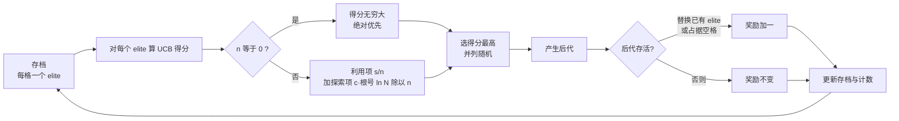

# Monte Carlo Elites: Quality-Diversity Selection as a Multi-Armed Bandit Problem

## 基本信息

| 项 | 内容 |
|---|---|
| 链接 | https://arxiv.org/abs/2104.08781 |
| 代码 | 基于原始 MAP-Elites 实现，只替换选择策略 |
| 作者 | 未标注机构（GECCO 方向的工作） |
| 发布时间 | 2021-04-18 |
| 一句话总结 | 把质量多样性存档的父代选择改写为多臂老虎机问题，用 UCB 得分替代均匀随机抽取，奖励取后代存活率而非适应度 |

## 置信度评估

| 维度 | 评估 |
|---|---|
| 发表场所 | 预印本，实验规模完整（三个测试平台，含 60 个迷宫变体） |
| 引用影响 | 质量多样性社区内被引用，思路上承接 MAP-Elites 与 UCB 两条线 |
| 代码可用 | 基于公开 MAP-Elites 实现，只改选择策略，可复现性好 |
| 来源机构 | 未明确标注 |
| 综合置信度 | 高。方法简单、实验充分、结论有明确的适用边界说明 |
| 需谨慎点 | 年份是 2021，早于本轮调研的时间偏好；归档粒度（个体级与网格级）的选择判据论文自己没给出 |

## 它解决了什么问题

MAP-Elites 在一个行为描述符网格里每格保留一个最优个体，形成存档。原始版本从存档里**均匀随机**抽父代，这带来一个明显浪费：刚发现的新区域和已经探索过很多次的区域被同等对待，探索与利用之间没有调控手段。

论文指出这是质量多样性搜索的核心张力：既要探索搜索空间，又要利用高适应度区域。原始 MAP-Elites 用随机选择回避了这个张力，代价是收敛慢、覆盖率上不去。

## 方法核心

论文把父代选择看成多臂老虎机：每个个体（或每个网格）是一条臂，选它当父代就是拉一次，奖励是它的后代是否存活。



### 关键设计一：奖励是存活率，不是适应度

```text
score(i) = s_i / n_i  +  c * sqrt( ln(N) / n_i )

n_i = 个体 i 被选为父代的次数
s_i = 个体 i 的后代存活次数
N   = 全存档总选择次数
c   = 1 / 根号2     （奖励值域在 0 到 1 时的理论最优）
```

「存活」的定义是后代**替换了某个已有 elite，或占据了某个空格**。这是一个**相对于存档**的判据：后代比现状更好，或者开辟了新区域。它不需要一个跨个体可比的绝对质量分。

这个设计选择值得注意：论文从头到尾没有要求「个体 A 得 82 分、个体 B 得 81 分」这样的标量适应度。奖励是一个 0 到 1 的相对比例。

### 关键设计二：未访问者优先

`n_i == 0` 时按 UCB 的常见解释把得分设为无穷大。效果是算法被强制访问每个个体至少一次。这不是边界情况的补丁，而是机制的一部分：它保证了覆盖，也让算法在样本很少的时候自动偏向探索。

### 关键设计三：个体级与网格级两种粒度

同一套公式可以有两种记法：

- **个体级**：`n_i` 是这个人被选的次数。假设是「某些个体有产出高质量或高多样性后代的潜力」。
- **网格级**：把同格里所有占用过该格的选择合并统计。假设是「搜索空间的某个区域本身值得利用」。

网格级还会带来一个额外保证：每格至少被选一次。个体级则不保证已占格里的新个体被选中。

## 实验结果

三个测试平台：6 维 Rastrigin、12 自由度机械臂行为库、迷宫生成（含 60 个变体）。

- 论文提出的**所有**选择方法都优于原始 MAP-Elites 的均匀随机选择
- **网格级选择的覆盖率普遍更好**。原因是新填充的格获得绝对优先权，形成「选新格 → 产出新格」的正反馈
- **个体级选择在欺骗性地形上更好**。Rastrigin 是多峰欺骗地形，个体级策略能回到之前探索过的区域，带来突破
- **贪心的纯适应度选择早期最强，但会收敛到局部最优**。在 10⁵ 到 10⁶ 次评测之后被所有其他方法反超
- 综合探索与利用的 UCB 得分取得最好的平衡，QD 分数最高
- 选择熵的观察：覆盖率到达 100% 后，纯利用策略开始聚焦特定区域，熵值下降。两种粒度的下降趋势不同，个体级的新个体有绝对优先权，网格级没有区分

## 局限与注意

- **个体级与网格级哪个更好取决于问题地形**，论文没有给出选择判据。这是未解点，不是可跳过的细节
- 论文的测试平台都是连续控制或程序化内容生成，**没有文本或知识产物的场景**
- UCB 的统计优势需要候选数量足够多才能体现。只有两三个候选时，探索项的作用有限
- 论文只用 UCB 替换了选择策略，变异与交叉算子保持原样。这限制了结论的适用范围：如果算子本身很弱，选得再好也难有产出
- 2021 年的工作，**不在本轮调研偏好的 2025 年后区间**。收录原因是它直接回答了父代选择机制，且后续工作没有出现更好的替代

## 对我们项目的启发 ⭐

### 解决哪个环节的什么问题

对应 `workflow_router` 的父代决策环节。项目自认「保留历史最佳和关键回归回滚已有目标要求，评分可比性与回退实现细节仍需落实」，其中「历史最佳怎么定义」这一半正是这篇回答的。它也给 `review` 的停滞判定提供了一个替代判据：不再问「连续几轮没提升」，而是看某个谱系的产出率是否长期为零。

### 方案要点

把父代选择从「挑当前质量最高的」改成「按产出率探索」。每个版本记录两个计数：被选为父代的次数，以及它的后继版本中通过门禁的次数。两者的比值是产出率，再加上一个随选择次数衰减的探索项。没有被选过的版本优先试一次。

奖励用产出率而非质量分，这一条直接绕开了项目当前最卡的约束。项目没有大量评测样本来算可靠的质量分，但门禁通过与否是二元的、已经在记录的信号。按谱系把它聚合成产出率，不需要新的测量。

另一个可借的点是粒度选择。可以按版本个体统计，也可以按能力区域（例如「完整性主导的版本」这一片）统计。前者的含义是某个具体版本有潜力，后者是某片区域值得深挖。两者对应项目里不同的判断需求。

### 提供了什么思路

「未访问优先」这个机制对项目有一个具体价值：在分支数量有限时，它天然倾向于先把每个分支都试一遍，而不是过早押注。这正好回答「应该选 v4 还是 v5」这个问题的另一面：如果本轮没有明确目标，两个都试是合理策略，不是摇摆。

探索与利用的衰减关系也值得注意。一个版本被反复选择却一直产不出通过门禁的后继，它的得分会随选择次数下降。这等于用统计信号自动降权停滞谱系，不需要人工设定「连续几轮算停滞」。

### 需要注意的

归档粒度与质量多样性归档的关系需要理清。这篇是在已有的能力网格上做选择，它**不解决**「怎么划分能力格」这件事。如果项目要同时用能力分格（见 README 的 Option C），这一层要另外设计。

论文的负面发现也要记住：贪心的适应度选择早期表现最好。这意味着如果项目改成按产出率选择，**短期内可能看起来不如按质量分选择**，收益要在多轮之后才显现。评估这个改动不能只看头几轮。

## 关联

- 对应环节：`workflow_router` 父代决策、`review` 停滞判定
- 对应缺口：「历史最佳怎么定义」与「评分可比性」两处，项目文档自认未落实
- 相关论文：EvoGit `2506.02049`（候选集怎么算，与本篇互补）、Huxley-Gödel Machine `2510.21614`（按谱系聚合的思路相近，但需要大量后代数据）、Robust Checkpoint Selection `2605.18852`（稀疏信号下的另一条路）、Diverse Prompts `2504.14367`（能力分格那块怎么做）
- 本项目代码路径与验收命令：
  - `docs/specs/schemas/KnowledgeLineage.schema.json`：`PARENT_OF` 边提供被选次数所需的谱系结构，`gateDecisionId` 提供门禁历史
  - `docs/specs/domainFunction/knowledge/Knowledge.md`：版本状态与 `SUPERSEDED` 语义
  - `docs/specs/domainFunction/evaluation/Evaluation.md`：门禁判据，判定「后继是否通过」
