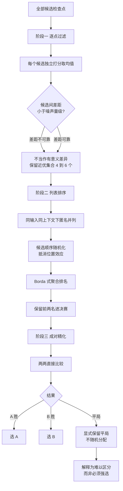

# Robust Checkpoint Selection for Multimodal LLMs via Agentic Evaluation and Stability-Aware Ranking

## 基本信息

| 项 | 内容 |
|---|---|
| 链接 | https://arxiv.org/abs/2605.18852 |
| 代码 | 未提供 |
| 作者 | 未明确标注机构 |
| 发布时间 | 2026-05-13 |
| 一句话总结 | 把晚期检查点选择形式化为评测不确定性下的决策问题，用逐点过滤、列表排序、成对精化的三级递进分辨率，并显式保留平局而不强行判胜负 |

## 置信度评估

| 维度 | 评估 |
|---|---|
| 发表场所 | 预印本，含公开模型复现附录（Qwen2.5-VL-7B，11 个检查点） |
| 引用影响 | 新近工作，2026-05 发布，暂无引用数据 |
| 代码可用 | 未提供代码，但有独立复现附录与参数敏感度分析 |
| 来源机构 | 未明确标注 |
| 综合置信度 | 中高。方法论证完整、有重采样稳定性度量、附录做了公开复现；但机构与评审状态不明 |
| 需谨慎点 | 场景是多模态大模型检查点选择，输出是选一个模型权重；版本图、可继续演化这些概念在其中不存在 |

## 它解决了什么问题

选晚期检查点的时候，候选之间表现非常接近，而下游评测信号本身有噪声。论文指出三个噪声源：有限的评测样本、基于模型的评判者、多模态证据本身的歧义。后果是**观察到的微小差异可能与评测波动同量级**，把这种差异当成决策依据是不稳的。

论文还指出一个更麻烦的现象：**验证损失的走势可能识别不出下游评测偏好的检查点**。也就是说，训练侧的指标和评测侧的偏好会背离。

## 方法核心

核心是三级**递进的分辨率**：先用便宜的粗筛，只在真正需要区分时提高比较精度，最后的二选一允许平局。



### 关键设计一：逐点打分只用于筛选

阶段一的平均分被明确限定为**候选筛选**，不是最终决定。论文的原话是「我们保留一个小的近优候选集用于比较性评测，而不把均值上的微小差异解释为决定性的」。实测通常保留 4 到 6 个候选。

这一步值得单独记下来：它是把「打分量级不可靠」这件事**写进流程**，而不是期待实现者自己注意。

### 关键设计二：列表排序提高分辨率

把保留的候选在**同一输入、同一评测上下文**下匿名并列，让评判者一起排名。相比独立打分，列表比较在绝对分数紧密聚集时提供更高的分辨率。

聚合用 Borda 式计分：

```text
对第 s 个评测样本，候选 i 的排名为 r 下标 i,s（rank 1 最好）
得分 = 候选数 减去 排名
跨评测集累加
```

候选顺序随机化，抵消位置效应。

### 关键设计三：平局是证据，不是失败

阶段三的成对比较有三种结果：A 胜、B 胜、平局。论文明确写「平局被显式保留，而不随机分配给任一方」，并且「高平局率因此被解释为两个决赛候选在目标评测分布上难以区分的证据，而不是需要强行选出一个赢家的证据」。

这个立场对本项目直接相关：在只有少量结构化信号时，「分不出高下」是一个合法结论，应该被传递下去，而不是让系统随便选一个继续。

### 关键设计四：重采样度量排序稳定性

单一评测集得到的排序可能对样本组成敏感。论文重复在**重采样的评测集**上跑整个排序流程，用排序翻转率度量稳定性。

## 实验结果

- **多模态数据的可评测性是关键变量**：对 OCR 密集输入做质量感知筛选，把**排序翻转率从 32.5% 降到 11.2%**，多次运行一致性从 **0.61 提到 0.84**
- 在两个独立的多模态设置中都观察到**验证损失走势与下游检查点偏好背离**
- 公开的 Qwen2.5-VL-7B 复现（11 个检查点）显示：逐点分数紧密聚集，最终成对比较经常被平局主导
- **重复评测最常选出中间检查点，而不是最后一个**

最后一条与本项目「只保存最终版本会陷入局部最优」的判断是同一个观察，来自完全不同的领域。

## 局限与注意

- **场景不可直接迁移**。它选的是训练检查点，是一个**一次性决策**：选完就固定，没有「从它继续演化」这一步，也没有版本图
- 三阶段流程的**成本高于单阶段**。论文在检查点选择场景里可接受，因为检查点数量有限；如果本项目的候选集每轮都在变，重复跑三级流程的开销需要评估
- 阶段一仍然是打分取平均。本项目更适合用硬约束过滤替代这一步，因为项目有明确的二元判据
- 论文没有提供代码，复现依赖附录描述
- 「近优集合保留 4 到 6 个」是基于其实测规模的取值，**换到版本数很少的场景需要重新考虑**。本项目如果只有两个分支，这个参数没有意义

## 对我们项目的启发 ⭐

### 解决哪个环节的什么问题

对应 `workflow_router` 的父代决策，以及 `review` 里「评分可比性」这个项目自认待落实的点。这篇提供的正是可比性缺失时该怎么办的完整立场：不假装有可比性，而是把不确定性显式量化并在流程里保留。

它同时对项目的 `ITERATE` 分支有参考价值。当前门禁在「无阻塞」时输出 PASS，在有阻塞时输出 ITERATE 或 STOPPED。如果多版本之间分不出高下，这个信息现在没有地方承载。

### 方案要点

把「比较」分成几层，各层用不同的分辨率，而不是一层打分定胜负。

第一层用硬约束过滤，不用打分。项目已有可靠的二元判据：关键失败、稳定性跌破阈值、检查或评审阻塞。这些本该是过滤器而不是分数项。

第二层在当前修订目标下排序候选。同一目标的候选才在一起比，跨目标不比较。

第三层只在必须二选一时做直接比较，并且**允许结论是「分不出」**。分不出时的处理可以是用覆盖度补齐（选当前更欠缺的那一维），也可以是两个都试一轮。关键是不要让系统在信号不足时表现出虚假的确定性。

另外，把排序稳定性做成一个可测量量。做法是在重采样的评测条件下重跑排序，看结论翻转的比例。这个数字可以直接用来判断某个历史版本是否值得信任，「历史最佳」这个标签的可信度就不再是主观的。

### 提供了什么思路

「验证损失与下游偏好背离」这个发现给项目一个具体的警告。如果项目打算用某个内部指标（例如相似度、模型自评）来代表知识质量，这篇给出了反例：训练侧指标好不代表下游评测会选它。

更值得注意的是**重复评测最常选出中间检查点**。这暗示在版本序列里，最优版本往往不在端点。项目的版本图是 DAG，比线性序列更复杂，这个结论只会更强：最值得继续演化的起点很可能在历史中间某个被分叉出去的分支上。

### 需要注意的

多阶段流程与项目预算的关系。`IterationBudget` 约束轮次，如果在每一轮里都做三级比较，评测成本会上升。可行的做法是分级触发：只在候选数超过一个、且它们的硬约束结果相同时才启动高分辨率比较。

「保留 4 到 6 个近优候选」不能照搬。项目的版本图每个模块可能只有两三个分支，此时应当直接进第三层成对比较，跳过前两层。

论文的评测对象是多模态模型输出，**质量维度是隐含在评判者的评分标准里的**。项目需要显式的维度划分（完整性、接地性、简洁性），这一步论文没有帮上。

## 关联

- 对应环节：`workflow_router` 父代决策、`review` 停滞判定与可比性、`evaluation` 的不确定性表达
- 对应缺口：「历史版本评分与可比性细节仍需细化」
- 相关论文：Monte Carlo Elites `2104.08781`（同为父代选择，但走探索与利用的路线，与本篇的「保守」路线互补）、QD Stress Tests for PRMs `2608.08008`（归档覆盖能证明什么、不能证明什么）、Safe to Resume `2608.29381`（回滚后状态是否有效）
- 本项目代码路径与验收命令：
  - `docs/specs/domainFunction/evaluation/Evaluation.md`：门禁判据可作为第一层硬约束过滤
  - `docs/specs/schemas/KnowledgeLineage.schema.json`：`qualityOutcome` 与 `qualityScore` 字段，当前是单值加二元结论
  - `docs/specs/schemas/Correction.schema.json`：`criterion` 字段，第二层目标排序的输入
